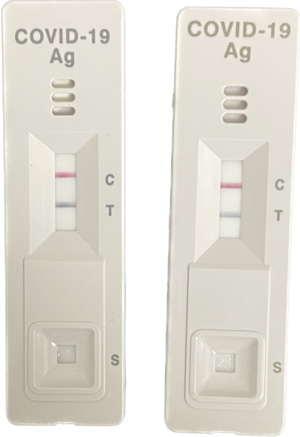
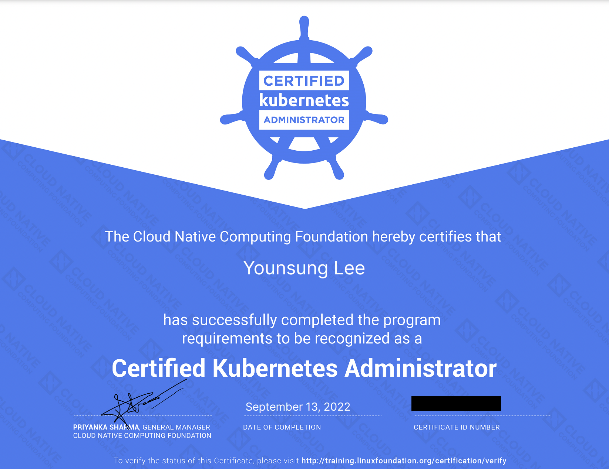
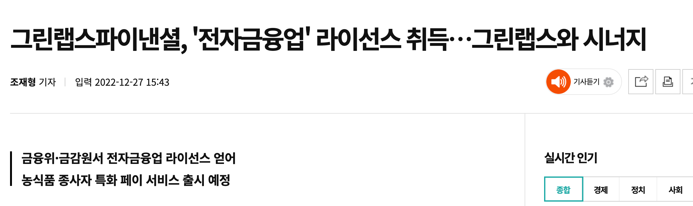


<!-- cover -->



*경험치 2배 이벤트를 받은 것처럼.*



8년 다닌 첫 직장을 떠났다.



- 일하는 사람만 일하는 문화
- 성과를 내도 인정받지 못함
- SI 특성상 수동적인 업무
- 레거시로 가득한 인프라
- 원하는 기술 스택과 너무 동떨어진 현실



온프레미스 시스템 엔지니어 → 클라우드 엔지니어.
공공 도메인 → OTT 도메인.

프로덕션 AWS도, 스크럼도, 테라폼도 — 다 처음이었다.




3월 16일, 확진. 일주일 내내 고열과 몸살. 잔기침은 두 달.



6개월 만에 다시 회사를 나왔다.



어느날 타운홀에서 CEO가 희망퇴직을 발표했다.

수백 개의 슬랙 채널이 그날부로 멈췄다. 깃허브 커밋도 함께 멈췄다.

발표 한 번에 모든 사기가 사라졌다.



- 스타트업의 불확실성은 시리즈 단계와 무관하게 *항상* 존재한다
- 문화는 포스터가 아니라 경영진의 행동으로 만들어진다
- OTT 시장은 침체되고 있었다 — 내겐 마지막 OTT 도메인이 되었다



면접 보고, 남는 시간엔 AWS와 쿠버네티스 공부.

기억에 남는 두 가지:
- IAM Role 분리조차 안 된 회사
- *면접자의 나이를 묻는* 회사



원티드 리크루터로부터 그린랩스파이낸셜 제안.

*"핀테크 경험도 없고 AWS 경력도 6개월뿐이다."*
의사결정권자에게 그대로 전달했더니 — 오히려 좋게 봐주셨다.



빈 공터에 집을 짓기 시작했다.




8월 말부터 각잡고 공부, 9월 13일 합격.
*매년 자격증 하나*는 올해도 지켰다.



입사 다음날부터 업무. AWS 콘솔엔 VPC만 있었다.

GitHub Enterprise, Direct Connect, 컨테이너 이미지, ECS 배포 — 차근차근 쌓았다.

다음에 들어올 동료들을 위해 노션에도 차곡차곡.



- 컴플라이언스와 보안이 빡세다
- 그래서 개발환경도 빡세다
- 그럼에도 도메인의 안정성과 시장의 파이는 매력적

*앞으로도 핀테크에 남을 거냐고 물으면 — Yes.*



초기 스타트업의 업무 범위는 넓다. 번아웃 신호가 보였다.

9월 1일부터 주 3회. 컨디셔닝과 자기방어, 두 마리 토끼.

*화이트 2그랄, 주린이.*



한 해의 결과가 모두 12월에 도착했다.




12월 26일, 금감원 심사 통과.

*당근페이, 네이버파이낸셜처럼* 페이 서비스를 할 수 있게 되었다는 뜻.



임백준 님 [칼럼](https://zdnet.co.kr/view/?no=20170616090644)의 부제.

힘든 시기에 떠올리면 부정이 긍정으로 바뀌는 마법 같은 문장.

*기록은 기억을 이긴다*도 같은 결.



11월 건강검진에서 TSH 9.66. 정상치의 두 배.

12월 30일 자가항체 양성 — 갑상선기능저하증 판정.

신지록신 매일 복용. 매년 두 번 점검.



스타트업의 냉혹한 현실. 건강의 중요성.

짧은 시간에 많이 자랐다.



*건강관리 소홀히 하지 마시고.*

