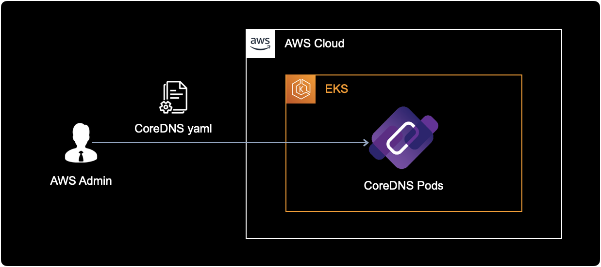
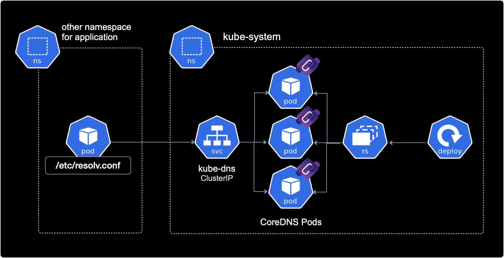
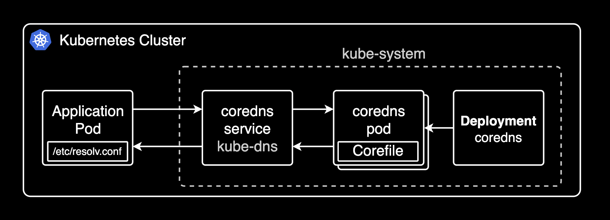
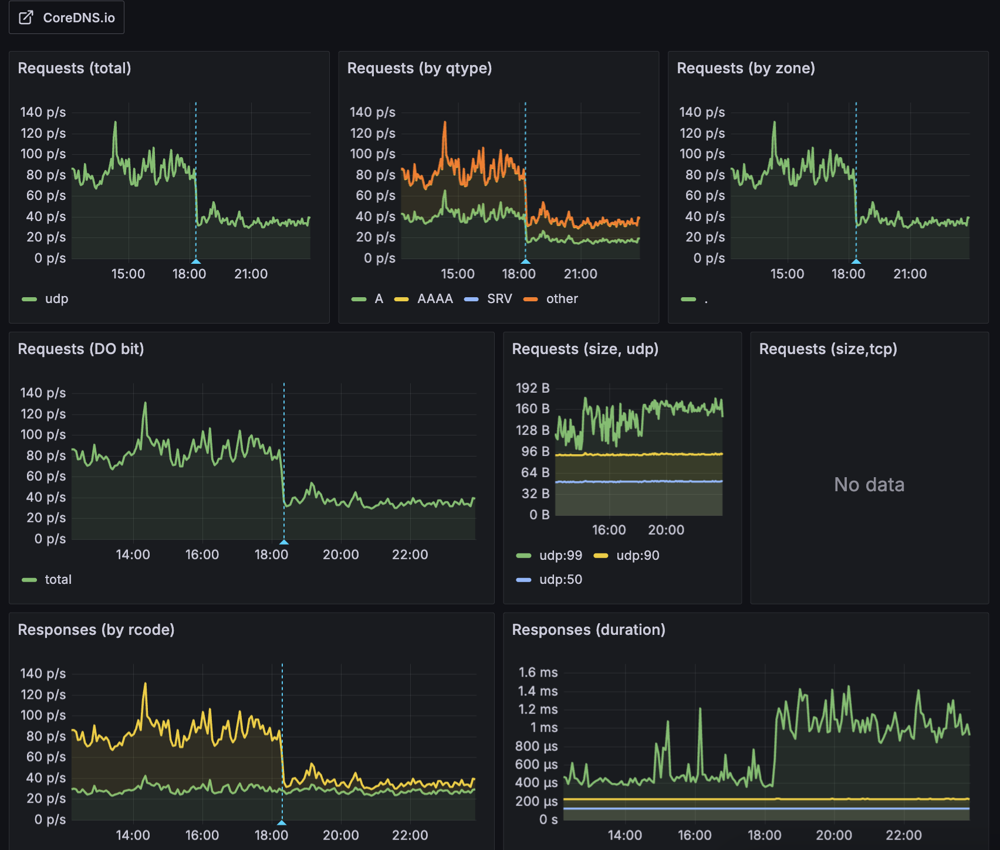
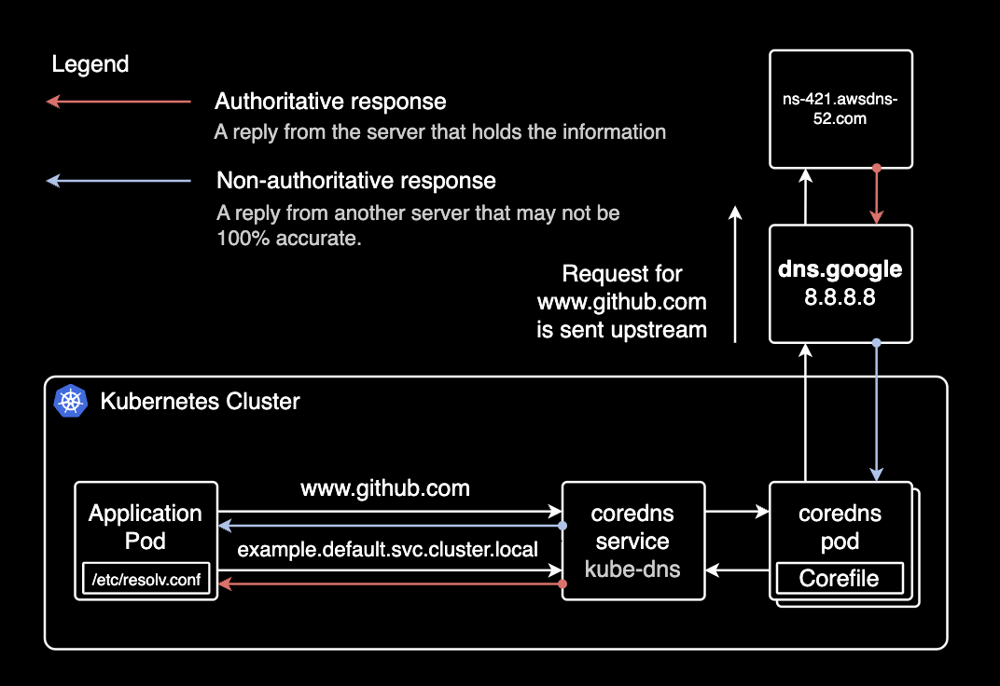

## Overview

Reduce unnecessary CoreDNS requests from application pods by adding `ndots` configuration to Deployments or Pods.

If using ArgoCD, the same CoreDNS `ndots` setting can be applied to Rollout custom resources.

## Background

### CoreDNS

[CoreDNS](https://coredns.io/) resolves DNS names within a Kubernetes cluster. It provides DNS services for all Kubernetes resources including Services and Pods. CoreDNS is managed by the [CNCF](https://www.cncf.io/) (Cloud Native Computing Foundation).

Pods in the cluster query CoreDNS to discover other Services and Pods.

### kube-dns vs CoreDNS

kube-dns was the DNS addon before CoreDNS. CoreDNS offers better flexibility, extensibility, and supports various backend data sources and plugins.

Kubernetes [officially recommends](https://kubernetes.io/docs/tasks/administer-cluster/dns-custom-nameservers/) CoreDNS over kube-dns. CoreDNS has been the default DNS addon since Kubernetes 1.13.

### CoreDNS Address Format

When using CoreDNS, Services and Pods are automatically assigned DNS A records.

#### Service A Record

```bash
SERVICE-NAME.NAMESPACE.svc.cluster.local
```

```bash
server-mysql.mysql.svc.cluster.local
------------ -----
    |          |
    |          +---> Namespace
    +--------------> Service Name
```

```bash
server-redis.redis.svc.cluster.local
------------ -----
    |          |
    |          +---> Namespace
    +--------------> Service Name
```

#### Pod A Record

```bash
POD-IP-ADDRESS.NAMESPACE.pod.cluster.local
```

Example: A Pod with IP `172.12.3.4` in the default namespace:

```bash
172-12-3-4.default.pod.cluster.local
---------- -------
    |         |
    |         +---> Namespace
    +-------------> Pod IP address
```

## Environment

### EKS Cluster

EKS v1.21 with EC2 Managed Nodes.

```bash
$ kubectl get node | awk '{print $5}'
VERSION
v1.21.5-eks-9017834
v1.21.5-eks-9017834
...
```

### CoreDNS

CoreDNS deployed as a Deployment manifest on the EKS cluster.



All CoreDNS resources are in the `kube-system` namespace. Pods in other namespaces access CoreDNS through its `ClusterIP` Service.



CoreDNS communicates with other pods via cluster-internal networking, hence the `ClusterIP` Service type.

CoreDNS provides DNS services through its pods:

```bash
$ kubectl get deploy,pod \
    -n kube-system \
    -l k8s-app=kube-dns
```

```bash
NAME                      READY   UP-TO-DATE   AVAILABLE   AGE
deployment.apps/coredns   18/18   18           18          15d

NAME                           READY   STATUS    RESTARTS   AGE
pod/coredns-86dfdb55fc-687dx   1/1     Running   0          15d
pod/coredns-86dfdb55fc-695t7   1/1     Running   0          15d
pod/coredns-86dfdb55fc-7x9mn   1/1     Running   0          15d
pod/coredns-86dfdb55fc-bqxw8   1/1     Running   0          15d
pod/coredns-86dfdb55fc-cq5rd   1/1     Running   0          15d
pod/coredns-86dfdb55fc-dhfch   1/1     Running   0          15d
pod/coredns-86dfdb55fc-f2v8z   1/1     Running   0          15d
pod/coredns-86dfdb55fc-gr46t   1/1     Running   0          15d
pod/coredns-86dfdb55fc-l562c   1/1     Running   0          15d
pod/coredns-86dfdb55fc-m6qm4   1/1     Running   0          15d
pod/coredns-86dfdb55fc-rscmz   1/1     Running   0          15d
pod/coredns-86dfdb55fc-t2tt5   1/1     Running   0          15d
pod/coredns-86dfdb55fc-td8pw   1/1     Running   0          15d
pod/coredns-86dfdb55fc-tn5gv   1/1     Running   0          15d
pod/coredns-86dfdb55fc-w7n86   1/1     Running   0          15d
pod/coredns-86dfdb55fc-zjqpv   1/1     Running   0          15d
pod/coredns-86dfdb55fc-zk68t   1/1     Running   0          15d
pod/coredns-86dfdb55fc-zmjmb   1/1     Running   0          15d
```

18 CoreDNS pods distributed across multiple worker nodes for high availability (HA).

CoreDNS has a `ClusterIP` Service to receive requests from other namespaces:



```bash
kubectl get service -n kube-system kube-dns -o wide
```

```bash
NAME       TYPE        CLUSTER-IP    EXTERNAL-IP   PORT(S)                  AGE    SELECTOR
kube-dns   ClusterIP   172.20.0.10   <none>        53/UDP,53/TCP,9153/TCP   626d   k8s-app=kube-dns
```

CoreDNS receives requests on TCP/UDP port 53. TCP port 9153 is for metrics collection.

## ndots Configuration

### 1. Modify Spec

Adding `ndots` to an ArgoCD Rollout resource:

```bash
kubectl edit rollout -n default hello-greeter
```

```yaml
apiVersion: argoproj.io/v1alpha1
kind: Rollout
metadata:
  ...
spec:
  template:
    spec:
      containers:
        ...
      dnsConfig:       # ndots configuration
        options:       # ndots configuration
        - name: ndots  # ndots configuration
          value: "1"   # ndots configuration
```

`ndots` defines the minimum number of dots in a domain name before it's treated as an FQDN. Changing from the default `5` to `1` reduces unnecessary DNS queries.

### 2. Apply Configuration

After adding `ndots`, apply via `kubectl apply` or push to the source repo (if using ArgoCD).

Changes made via `kubectl edit` take effect immediately.

### 3. Verify ndots

Check `spec.template.spec.dnsConfig` on the Deployment or Rollout:

```bash
kubectl get deploy -n default hello-greeter
```

```yaml
spec:
  template:
    spec:
      containers:
        # ...
      dnsConfig:
        options:
        - name: ndots
          value: "1"
```

Verify inside the pod's `/etc/resolv.conf`:

```bash
kubectl exec -it <POD_NAME> -n default -- cat /etc/resolv.conf
```

```bash
search default.svc.cluster.local svc.cluster.local cluster.local ap-northeast-2.compute.internal
nameserver 172.20.0.10
options ndots:1
```

- **nameserver**: Points to the CoreDNS Service IP (172.20.0.10). All cluster pods use CoreDNS as their DNS server by default.
- **resolv.conf generation**: [kubelet](https://kubernetes.io/docs/concepts/overview/components/#kubelet) registers the CoreDNS `ClusterIP` as `nameserver` in `/etc/resolv.conf` when starting pods.
- **options**: Confirms `ndots:1` (default is 5).

## Results

For most workloads, setting ndots to `2` instead of the default `5` is sufficient. This is also recommended in the [Amazon EKS Best Practices](https://docs.aws.amazon.com/eks/latest/best-practices/scale-cluster-services.html).

On a cluster with 7 nodes and ~130 pods, changing ArgoCD's ndots from 5 to 2 **reduced total DNS query volume by 56%**.



Most external domains (e.g., api.google.com, collector.newrelic.com) contain 2+ dots and are treated as FQDNs with ndots=2, skipping unnecessary internal search domain queries. This improves external DNS request performance and reduces CoreDNS CPU load and I/O timeout issues caused by unnecessary DNS failures.

The following diagram shows how CoreDNS routes queries internally or externally depending on the domain:



## References

**AWS:**

- [Amazon EKS Best Practices Guide](https://docs.aws.amazon.com/eks/latest/best-practices/scale-cluster-services.html): CoreDNS configuration best practices

**Articles:**

- [How to change ndots option default value of dns in Kubernetes](https://stackoverflow.com/questions/70264378/how-to-change-ndots-option-default-value-of-dns-in-kubernetes)
- [Pod's DNS Config](https://kubernetes.io/docs/concepts/services-networking/dns-pod-service/#pod-dns-config): Kubernetes official docs
- [Kubernetes pods /etc/resolv.conf ndots:5 option and why it may negatively affect your application performances](https://pracucci.com/kubernetes-dns-resolution-ndots-options-and-why-it-may-affect-application-performances.html)

**Datadog:**

- [Key metrics for CoreDNS monitoring](https://www.datadoghq.com/blog/coredns-metrics/)
