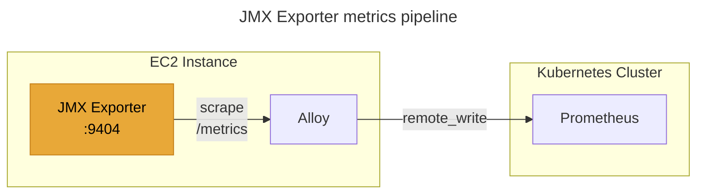

## Overview

[JMX Exporter](https://github.com/prometheus/jmx_exporter) exposes JMX mBeans as Prometheus metrics. This guide covers installing JMX Exporter 1.3.0 on Amazon Linux 2023 using GitHub Releases.

## Background

A standalone EC2 instance running a Java process occasionally hung and went down without any observable signal. Since Prometheus Node Exporter only supports the pull model and cannot push metrics via [Remote Write](https://prometheus.io/docs/specs/remote_write_spec_2_0/), Grafana Alloy was used instead as a Node Exporter with Remote Write capability, sending system-level metrics to Prometheus. However, there was no way to monitor the JVM state itself, making it difficult to detect and diagnose issues before they caused downtime. JMX Exporter was introduced to expose JVM metrics on the same instance, allowing Alloy to scrape and forward them alongside the existing node metrics.



JMX Exporter collects detailed metrics from the Java process and exposes them on port 9404. Alloy scrapes those metrics and forwards them to Prometheus via Remote Write.

## Environment

| Item | Value |
|------|-------|
| OS | Amazon Linux 2023 |
| Architecture | x86_64 (amd64) |
| JMX Exporter | 1.3.0 |
| Alloy | v1.14.0 |
| Java | 11+ |

## Installation

### Download

Download the JMX Exporter JAR from [GitHub Release](https://github.com/prometheus/jmx_exporter/releases/tag/1.3.0).

```bash
sudo mkdir -p /opt/jmx_exporter
```

```bash
JMX_EXPORTER_VERSION="1.3.0"
curl -fsSL -o /opt/jmx_exporter/jmx_prometheus_javaagent-${JMX_EXPORTER_VERSION}.jar \
  https://github.com/prometheus/jmx_exporter/releases/download/${JMX_EXPORTER_VERSION}/jmx_prometheus_javaagent-${JMX_EXPORTER_VERSION}.jar
```

### Checksum verification

Verify the downloaded JAR integrity against the checksum on the GitHub Release page.

```bash
sha256sum /opt/jmx_exporter/jmx_prometheus_javaagent-${JMX_EXPORTER_VERSION}.jar
```

### Configuration

Create the JMX Exporter config file.

```bash
sudo tee /opt/jmx_exporter/config.yaml > /dev/null <<'EOF'
---
rules:
  - pattern: ".*"
EOF
```

This collects all mBeans. Verify the config:

```bash
cat /opt/jmx_exporter/config.yaml
```

```yaml
rules:
  - pattern: ".*"
```

For production, filter only required metrics to control cardinality.

### Java agent configuration

Attach JMX Exporter to a Java application via the `-javaagent` option. Default port is `9404`.

```bash
-javaagent:<JAR_PATH>=<PORT>:<CONFIG_PATH>
```

#### Tomcat

For Tomcat, add `CATALINA_OPTS` in `setenv.sh`.

```bash
# $CATALINA_BASE/bin/setenv.sh
export CATALINA_OPTS="$CATALINA_OPTS -javaagent:/opt/jmx_exporter/jmx_prometheus_javaagent-1.3.0.jar=9404:/opt/jmx_exporter/config.yaml"
```

Tomcat automatically sources `bin/setenv.sh` on startup. Restart Tomcat to apply:

```bash
$CATALINA_BASE/bin/shutdown.sh
$CATALINA_BASE/bin/startup.sh
```

Verify the `-javaagent` option is present in the Java process:

```bash
ps -ef | grep jmx_prometheus
```

#### Standalone JAR

Add the `-javaagent` option directly to the `java` command.

```bash
java \
  -javaagent:/opt/jmx_exporter/jmx_prometheus_javaagent-1.3.0.jar=9404:/opt/jmx_exporter/config.yaml \
  -jar your-application.jar
```

#### Systemd service

Add the `-javaagent` option to `ExecStart` in the service file.

```bash
# /etc/systemd/system/your-app.service
[Unit]
Description=Your Java Application
After=network.target

[Service]
Type=simple
User=app
ExecStart=/usr/bin/java \
  -javaagent:/opt/jmx_exporter/jmx_prometheus_javaagent-1.3.0.jar=9404:/opt/jmx_exporter/config.yaml \
  -jar /opt/app/your-application.jar
Restart=on-failure

[Install]
WantedBy=multi-user.target
```

Reload and restart:

```bash
sudo systemctl daemon-reload
sudo systemctl restart your-app
```

## Verification

Check that JMX Exporter exposes metrics correctly.

```bash
curl -s http://localhost:9404/metrics | head -20
```

Expected output:

```text
# HELP jvm_memory_bytes_used Used bytes of a given JVM memory area.
# TYPE jvm_memory_bytes_used gauge
jvm_memory_bytes_used{area="heap"} 5.0331472E7
jvm_memory_bytes_used{area="nonheap"} 3.8462704E7
```

## Alloy scrape configuration

If [Grafana Alloy](https://grafana.com/docs/alloy/latest/) is installed on the same server, add a prometheus.scrape block for JMX Exporter to config.alloy. The default configuration file path is /etc/alloy/config.alloy.

```hcl
prometheus.exporter.unix "node" {}

prometheus.scrape "node" {
  targets         = prometheus.exporter.unix.node.targets
  forward_to      = [prometheus.remote_write.default.receiver]
  scrape_interval = "15s"
}

// Tomcat process metrics
prometheus.scrape "tomcat_jmx" {
  targets = [{
    __address__ = "localhost:9404",
  }]
  forward_to      = [prometheus.remote_write.default.receiver]
  scrape_interval = "15s"
}

prometheus.remote_write "default" {
  endpoint {
    url = "https://prometheus.example.com/api/v1/write"
  }
  external_labels = {
    instance      = constants.hostname,
    environment   = "dev",
    app           = "aml",
    instance_name = constants.hostname,
  }
}
```

The `tomcat_jmx` scrape block collects metrics from `localhost:9404` and forwards them to a remote Prometheus via `prometheus.remote_write`. Restart Alloy to apply:

```bash
sudo systemctl restart alloy
```

## Troubleshooting

### Port conflict

If port `9404` is already in use, specify a different port.

```bash
ss -tlnp | grep 9404
```
