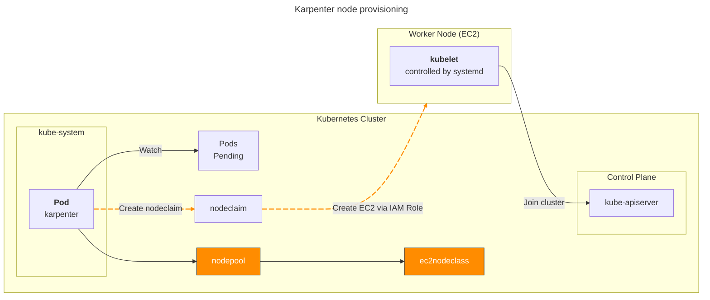
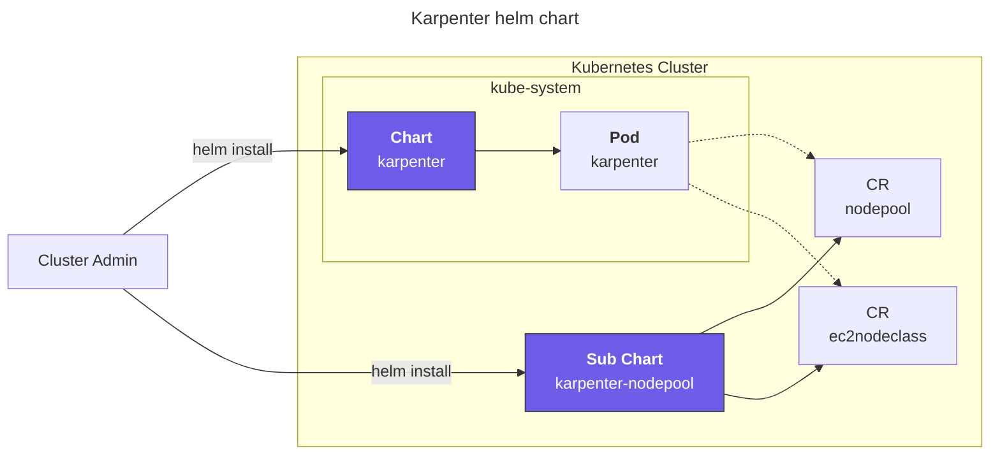
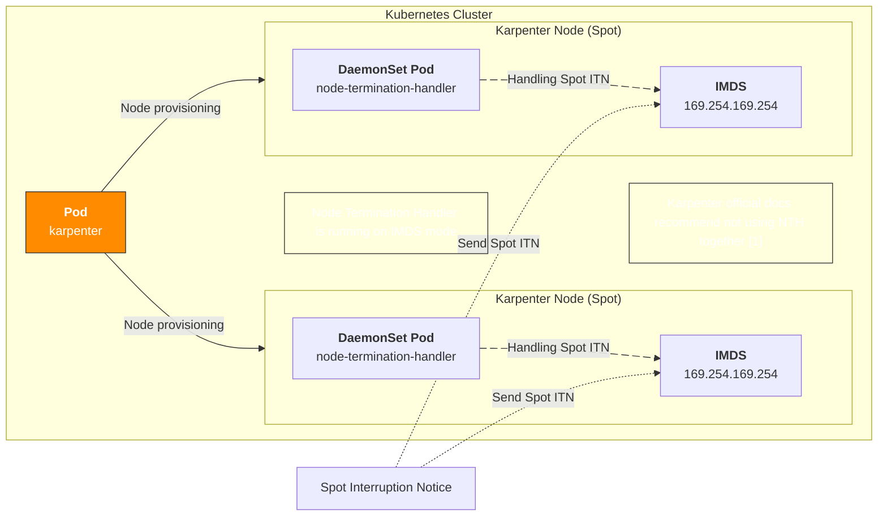
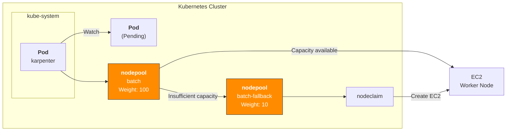
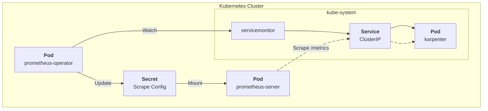
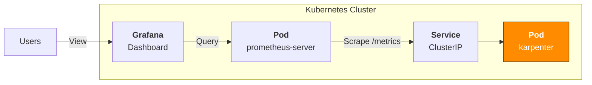
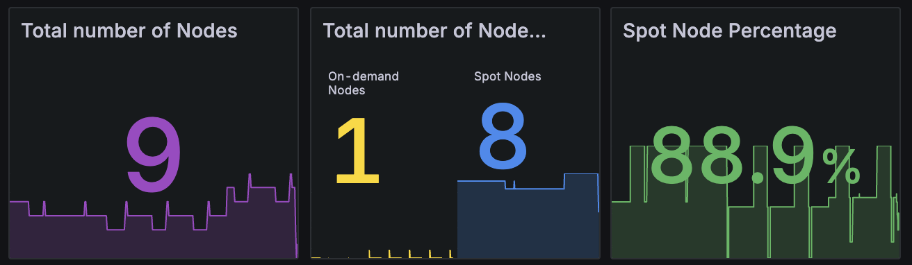

## Overview

The most effective way to reduce compute costs is proper right-sizing combined with Spot instances.

Karpenter's [Fallback](https://karpenter.sh/docs/concepts/scheduling/#fallback) feature enables uninterrupted Spot instance usage by automatically falling back to On-Demand when Spot capacity is unavailable.

## Environment

- EKS 1.32
- **Karpenter** 1.8.1 (official helm chart)
- **[Node Termination Handler](https://github.com/aws/aws-node-termination-handler)** 1.25.2 (official helm chart)
  - NTH runs in IMDS (Instance Metadata Service) mode, deployed as a DaemonSet

## Configuration Guide

### Create Spot Service-Linked Role

Spot instances require the `AWSServiceRoleForEC2Spot` [Service-Linked Role](https://docs.aws.amazon.com/IAM/latest/UserGuide/using-service-linked-roles.html) in the AWS account. Without it, Karpenter cannot create Spot instances and only provisions On-Demand nodes.

This role handles price monitoring, capacity management, and instance interruption processing for Spot instances.

Without the Service-Linked Role, Karpenter logs show:

```json
{
  "level": "ERROR",
  "message": "failed launching nodeclaim",
  "error": "creating instance, insufficient capacity, with fleet error(s), AuthFailure.ServiceLinkedRoleCreationNotPermitted: The provided credentials do not have permission to create the service-linked role for EC2 Spot Instances."
}
```

Create the role via AWS CLI (one-time per account):

```bash
aws iam create-service-linked-role --aws-service-name spot.amazonaws.com
```

> The AWS Console auto-creates this role on first Spot request, but API-based requests (like Karpenter) require manual creation.

### Node Provisioning

Karpenter triggers node provisioning when Pending pods exist:



### Karpenter Helm Chart Structure

Install Karpenter using the [official Helm chart](https://github.com/aws/karpenter-provider-aws/tree/main/charts). Since v0.32.0, charts are distributed via OCI registry.

Download the karpenter chart:

```bash
# List versions
crane ls public.ecr.aws/karpenter/karpenter

# Pull chart from OCI registry
helm pull oci://public.ecr.aws/karpenter/karpenter --version 1.8.1 --untar
```



The [karpenter-nodepool chart](https://github.com/younsl/blog/tree/main/content/charts/karpenter-nodepool) containing Karpenter custom resources is a custom chart, not officially provided.

Managing Karpenter via Helm charts enables templated Kubernetes resources with environment-specific values (dev/stage/prod), atomic deployments with version-based rollback, and dependency management across NodePool, EC2NodeClass, and RBAC configurations. Combined with GitOps workflows, infrastructure changes become trackable and reviewable as code.

### Spot Interruption Handling

Two approaches for Karpenter to safely handle Spot Interruption Notices:

1. Karpenter + Node Termination Handler
2. EventBridge Rules + SQS + Karpenter

Karpenter's [FAQ](https://karpenter.sh/docs/faq/#interruption-handling) recommends the SQS approach, but the NTH approach offers better operational simplicity.

Karpenter handles node provisioning while NTH detects Spot interruption signals and manages pod eviction:



1: https://karpenter.sh/docs/faq/#interruption-handling

### Spot Nodepool Fallback

Use [Fallback](https://karpenter.sh/docs/concepts/scheduling/#fallback) with [weight-based](https://karpenter.sh/docs/concepts/scheduling/#weighted-nodepools) NodePool selection for Spot/On-Demand.

#### NodePool Weight Configuration

Set `spec.weight` on the NodePool resource:

```yaml
apiVersion: karpenter.sh/v1
kind: NodePool
metadata:
  name: batch
spec:
  template:
    spec:
      requirements:
      - key: karpenter.sh/capacity-type
        operator: In
        values:
        - spot
  weight: 100 # Set 10 for fallback on-demand nodepool
```

Karpenter selects the highest-weight NodePool among matching candidates. If allocation fails on the higher-weight NodePool, it falls back to a lower-weight one.

Pods must specify nodeAffinity for both the primary (Spot) and fallback NodePools:

```yaml
apiVersion: v1
kind: Pod
metadata:
  name: my-pod
  namespace: default
  labels:
    app: my-app
spec:
  affinity:
    nodeAffinity:
      requiredDuringSchedulingIgnoredDuringExecution:
        nodeSelectorTerms:
          - matchExpressions:
            - key: karpenter.sh/nodepool
              operator: In
              values:
              - batch           # Primary (spot) nodepool
              - batch-fallback  # Fallback (on-demand) nodepool
```

Karpenter nodes are automatically labeled with `karpenter.sh/nodepool` at creation time. This label enables pod assignment to specific NodePools and their fallbacks.

System architecture:



When node provisioning starts, Karpenter selects the highest-weight Spot NodePool first. If Spot capacity is insufficient, the fallback NodePool is selected.

Architecture inspired by Sendbird's session 'Amazon EKS Cloud Optimization and Generative AI Strategy' at AWS Summit Seoul 2025.

### Metrics Collection

Karpenter provides NodePool and cluster-level metrics.

When using [prometheus-operator](https://github.com/prometheus-operator/prometheus-operator), create a ServiceMonitor to collect NodePool-level metrics:

```yaml
# charts/karpenter/values_your.yaml
serviceMonitor:
  # -- Specifies whether a ServiceMonitor should be created.
  enabled: true
```

Metrics collection flow:



Prometheus Server scrapes metrics from Karpenter's `/metrics` endpoint via the Service.

### Grafana Dashboard

Integrate Grafana dashboards with Prometheus metrics for real-time Karpenter monitoring.



Grafana dashboard [ID 20398](https://grafana.com/grafana/dashboards/20398-karpenter/) provides NodePool status, Spot ratio, and node-level resource utilization.


## TLDR

Running Karpenter 1.8.1 + NTH with Spot fallback for 5 months resulted in zero Spot interruption impact. Maintained a stable 80-85% Spot node ratio across the cluster.



The graph shows Karpenter's Capacity Type node ratio from Grafana. Spot instances maintain a stable 80-85% share, with the remaining 15-20% as fallback On-Demand instances.

Querying Spot nodes via kubectl:

```bash
kubectl get node -l karpenter.sh/capacity-type=spot
```

```bash
NAME                                               STATUS   ROLES    AGE   VERSION
ip-xx-xxx-xx-xxx.ap-northeast-2.compute.internal   Ready    <none>   8d    v1.32.9-eks-113cf36
ip-xx-xxx-xx-xx.ap-northeast-2.compute.internal    Ready    <none>   23h   v1.32.9-eks-113cf36
ip-xx-xxx-xx-xx.ap-northeast-2.compute.internal    Ready    <none>   13h   v1.32.9-eks-113cf36
ip-xx-xxx-xx-xxx.ap-northeast-2.compute.internal   Ready    <none>   10d   v1.32.9-eks-113cf36
ip-xx-xxx-xx-xxx.ap-northeast-2.compute.internal   Ready    <none>   65m   v1.32.9-eks-113cf36
ip-xx-xxx-xx-xx.ap-northeast-2.compute.internal    Ready    <none>   29m   v1.32.9-eks-113cf36
ip-xx-xxx-xx-xxx.ap-northeast-2.compute.internal   Ready    <none>   13d   v1.32.9-eks-113cf36
```

Spot + Fallback NodePool saved $120/month per EC2, totaling $3,600/month in savings.

## References

- [Using Amazon EC2 Spot Instances with Karpenter at AWS Blog](https://aws.amazon.com/ko/blogs/containers/using-amazon-ec2-spot-instances-with-karpenter/)
