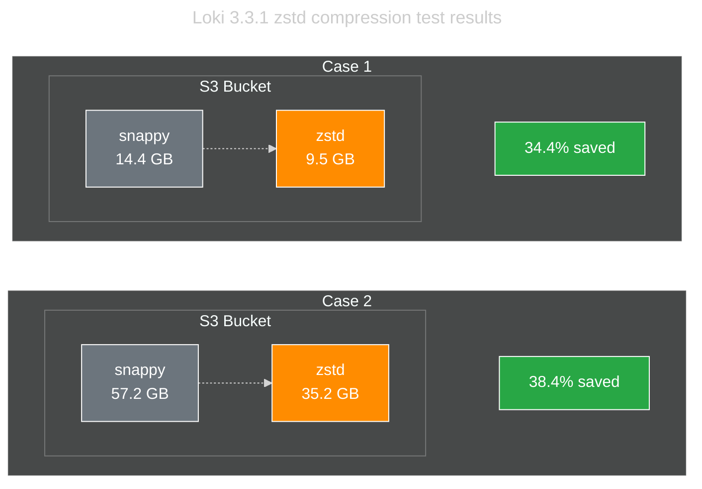
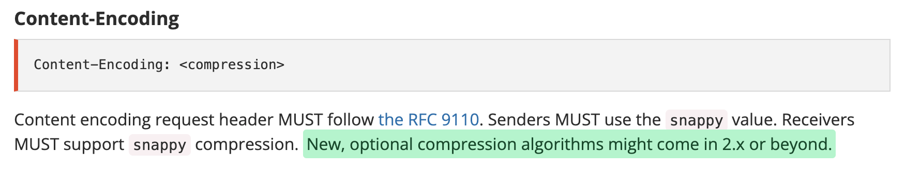
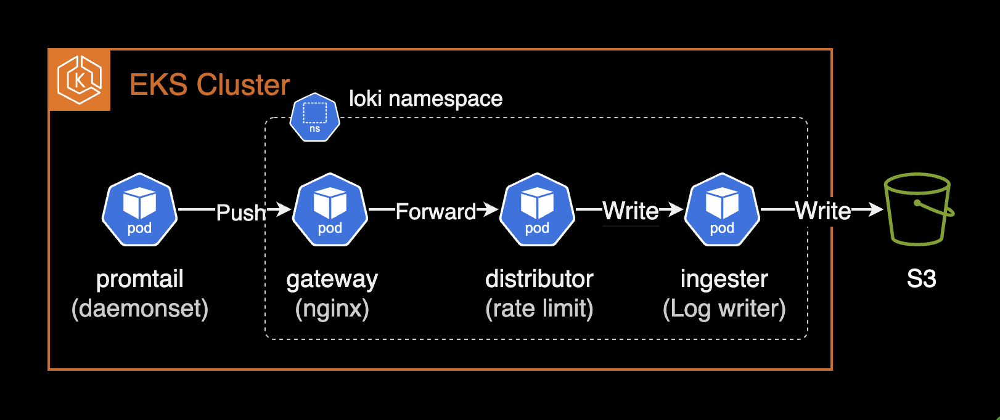

## Overview

Tuning and best practices for Loki 3.0.0+.

## Environment

- **Cluster**: EKS 1.30
- **Loki**: 3.3.1 (helm chart)

## Notes

### loki-distributed is Deprecated

The `loki-distributed` chart is no longer updated beyond 2.9.x. Use the [official `loki` chart](https://github.com/grafana/loki/tree/main/production/helm/loki) maintained by Grafana Labs instead. Chart recommendations are available [here](https://github.com/grafana/helm-charts/tree/main/charts/loki). Distributed mode support release notes are available [here](https://github.com/grafana/loki/releases/tag/v3.0.0).

From the [Loki 3.0.0 release notes](https://github.com/grafana/loki/releases/tag/v3.0.0):

> Helm charts: A major upgrade to the Loki helm chart introduces support for Distributed mode (microservices), includes memcached by default, and includes several updates to configurations to improve Loki operations.

For distributed mode in Loki 3.0.0+, set `deploymentMode` to `Distributed` (default is `SimpleScalable`):

```yaml
# charts/loki/values.yaml (loki +3.0.0)
deploymentMode: Distributed
```

See [#3086 issue](https://github.com/grafana/helm-charts/issues/3086) for details on the `loki-distributed` deprecation.

## Configuration Guide

### Distributed Mode (loki)

Before Loki 3.0.0, the `loki-distributed` chart was required for distributed deployment. Since 3.0.0, the `loki` chart natively supports distributed mode. See [grafana/helm-charts #3086](https://github.com/grafana/helm-charts/issues/3086).

Set `deploymentMode` to `Distributed` for microservice mode. Distributed mode is recommended for stable, scalable operations.

```yaml
# charts/loki/values.yaml (loki v3.3.1)
deploymentMode: Distributed
```

For higher query performance, run Loki in Simple Scalable or Distributed (microservices) mode.

Distributed mode enables flexible scaling — e.g., scaling only `ingester` pods when write load is high.

### Object Storage Configuration (loki)

> Reference: [Configure storage](https://grafana.com/docs/loki/latest/setup/install/helm/configure-storage/)

Available storage types depend on the deployment mode:

| Deployment Mode | Storage Type |
|--|--|
| SingleBinary | Filesystem |
| SimpleScalable | Object storage (AWS S3, GCS, etc.) |
| Distributed | Object storage (AWS S3, GCS, etc.) |

Create an IAM Policy granting Loki access to the S3 bucket per the [Storage docs](https://grafana.com/docs/loki/latest/configure/storage/#aws-deployment-s3-single-store):

```json
{
    "Version": "2012-10-17",
    "Statement": [
        {
            "Sid": "LokiStorage",
            "Effect": "Allow",
            "Principal": {
                "AWS": [
                    "arn:aws:iam::<ACCOUNT_ID>"
                ]
            },
            "Action": [
                "s3:ListBucket",
                "s3:PutObject",
                "s3:GetObject",
                "s3:DeleteObject"
            ],
            "Resource": [
                "arn:aws:s3:::<BUCKET_NAME>",
                "arn:aws:s3:::<BUCKET_NAME>/*"
            ]
        }
    ]
}
```

Grant the Loki service account S3 bucket access via IRSA:

```yaml
# charts/loki/values.yaml (loki v3.3.1)
serviceAccount:
  create: true
  name: null
  imagePullSecrets: []
  annotations:
    eks.amazonaws.com/role-arn: arn:aws:iam::<ACCOUNT_ID>:role/<ROLE_NAME>
  labels: {}
  automountServiceAccountToken: true
```

When `serviceAccount.name` is null, the chart creates a service account named after the chart:

```bash
$ kubectl get serviceaccount -n loki
NAME   SECRETS   AGE
loki   0         2d19h
```

Configure the S3 bucket and region:

```yaml
# charts/loki/values.yaml (loki v3.3.1)
loki:
  storage:
    bucketNames:
      chunks: <BUCKET_NAME>
      ruler: <BUCKET_NAME>
      admin: <BUCKET_NAME>
    type: s3
    s3:
      s3: null
      endpoint: null
      region: ap-northeast-2
      secretAccessKey: null
      accessKeyId: null
      signatureVersion: null
      s3ForcePathStyle: false
      insecure: false
      http_config: {}
      backoff_config: {}
      disable_dualstack: false
```

### Log Retention (compactor)

> Reference: [Log retention](https://grafana.com/docs/loki/latest/operations/storage/retention/)

Log retention in Loki is handled by the `compactor` or `table-manager` component.

#### table-manager (deprecated)

table-manager is deprecated and will be removed from Loki. Use compactor unless forced to use legacy index types.

Legacy index types (Loki v3.3.x):

- Cassandra (Deprecated)
- BigTable (Deprecated)
- DynamoDB (Deprecated)
- BoltDB (Deprecated)

Only use table-manager if your Loki instance uses one of these legacy index types.

#### compactor

By default, the compactor is disabled in Loki 3.3.1 chart, meaning logs are retained forever:

```yaml
# charts/loki/values.yaml (loki v3.3.1)
compactor:
  replicas: 0
```

Enable the compactor (must be a singleton — exactly 1 replica):

```yaml
# charts/loki/values.yaml (loki v3.3.1)
compactor:
  replicas: 1
```

Add compactor configuration with retention settings:

```yaml
# charts/loki/values.yaml (loki v3.3.1)
loki:
  limits_config:
    retention_period: 7d

  compactor:
    working_directory: /var/loki/compactor
    compaction_interval: 10m
    retention_enabled: true
    retention_delete_delay: 2h
    retention_delete_worker_count: 150
    delete_request_store: s3
```

Set `retention_enabled` to `true`. Without it, the compactor only performs table compaction at `compaction_interval`.

Retention requires `index.period` of 24 hours. Both single-store TSDB and single-store BoltDB require 24h index periods.

```yaml
# charts/loki/values.yaml (loki v3.3.1)
loki:
  schemaConfig:
    configs:
    - from: "2024-08-01"
      store: tsdb
      object_store: s3
      schema: v13
      index:
        prefix: loki_index_
        period: 24h
```

> Important: Log retention only works when `index.period` is `24h`.

Verify the compactor config after upgrade:

```bash
kubectl exec -it loki-compactor-0 -n loki \
  -- cat /etc/loki/config/config.yaml
```

```yaml
compactor:
  compaction_interval: 10m
  delete_request_store: s3
  retention_delete_delay: 2h
  retention_delete_worker_count: 150
  retention_enabled: true
  working_directory: /var/loki/compactor

limits_config:
  # ... omitted for brevity ...
  retention_period: 7d
```

### Chunk Encoding (ingester)

`chunk_encoding` determines the compression algorithm for stored chunks. Loki 3.3.x supports:

- none
- gzip (default)
- lz4-64k
- **snappy** (recommended)
- lz4-256k
- lz4-1M
- lz4
- flate
- zstd

Default is `gzip`:

```yaml
# The algorithm to use for compressing chunk. (none, gzip, lz4-64k, snappy,
# lz4-256k, lz4-1M, lz4, flate, zstd)
# CLI flag: -ingester.chunk-encoding
[chunk_encoding: <string> | default = "gzip"]
```

While `gzip` has better compression ratio, `snappy` offers faster decompression and thus faster queries. `snappy` is recommended.

Set `chunk_encoding` to `snappy`:

```yaml
# charts/loki/values.yaml (loki v3.3.1)
loki:
  ingester:
    chunk_encoding: snappy
```

Verify after deployment:

```bash
kubectl exec -it loki-ingester-0 -n loki \
  -- cat /etc/loki/config/config.yaml
```

```yaml
ingester:
  autoforget_unhealthy: true
  chunk_encoding: snappy
```

### zstd Compression (ingester)

Prometheus and Loki use Google's Snappy compression by default. Loki's zstd support was added via [PR #3064](https://github.com/grafana/loki/pull/3064).

**zstd** is a compression algorithm by Facebook (Meta) offering excellent compression ratio with fast compress/decompress speed. Compared to `snappy`, zstd achieves **30-40% additional storage savings**.

Production test results on Loki 3.3.1:



- **Case 1**: 14.4GB → 9.5GB (34.4% saved)
- **Case 2**: 57.2GB → 35.2GB (38.4% saved)

Larger datasets show more pronounced zstd savings.

Set `chunk_encoding` to `zstd` to significantly reduce storage costs:

```yaml
# charts/loki/values.yaml (loki v3.3.1)
loki:
  ingester:
    chunk_encoding: zstd
```

Combining zstd compression with an appropriate retention policy maximizes cost savings.

#### Prometheus Remote Write 2.0 and zstd

[Prometheus Remote Write 2.0](https://prometheus.io/docs/specs/prw/remote_write_spec_2_0/#definitions) currently only supports Snappy compression. However, zstd support is actively discussed in the community.



See GitHub issue [#13866](https://github.com/prometheus/prometheus/issues/13866) for the discussion on zstd support in Prometheus.

### Ring Issues (ingester)

When `ingester` pods fail to reach Ready state with the error `found an existing instance(s) with a problem in the ring`, check the ingester logs:

```bash
kubectl logs -f -l app.kubernetes.io/component=ingester -n loki
```

```bash
ingester level=warn ts=2024-12-11T04:40:53.584292755Z caller=lifecycler.go:295 component=ingester msg="found an existing instance(s) with a problem in the ring, this instance cannot become ready until this problem is resolved. The /ring http endpoint on the distributor (or single binary) provides visibility into the ring." ring=ingester err="instance 10.xxx.xx.xx:9095 past heartbeat timeout"
```

Enable `autoforget_unhealthy` to automatically remove unhealthy ingesters from the ring:

```yaml
# Forget about ingesters having heartbeat timestamps older than
# `ring.kvstore.heartbeat_timeout`. This is equivalent to clicking on the
# `/ring` `forget` button in the UI: the ingester is removed from the ring.
# CLI flag: -ingester.autoforget-unhealthy
[autoforget_unhealthy: <boolean> | default = false]
```

```yaml
# charts/loki/values.yaml (loki v3.3.1)
loki:
  ingester:
    autoforget_unhealthy: true
```

After applying, verify the ingester auto-forgets unhealthy instances:

```bash
ingester level=info ts=2024-12-11T04:53:52.685367155Z caller=ingester.go:454 component=ingester msg="autoforget is enabled and will remove unhealthy instances from the ring after 1m0s with no heartbeat"
ingester level=info ts=2024-12-11T04:53:52.685380651Z caller=loki.go:542 msg="Loki started" startup_time=85.227413ms
```

### Essential Settings (ingester)

> Reference: [The essential config settings you should use so you won't drop logs in Loki](https://grafana.com/blog/2021/02/16/the-essential-config-settings-you-should-use-so-you-wont-drop-logs-in-loki/)

Critical ingester settings for uptime and high availability:

#### `heartbeat_timeout` (ingester)

`heartbeat_timeout` determines how long before an unresponsive ingester is skipped for reads/writes. If set too short, brief network delays can cause log collection to stop. If too long, a faulty ingester keeps receiving traffic.

Recommended: `10m` — provides enough recovery time for ring abnormalities (e.g., Consul restart).

```yaml
# charts/loki/values.yaml (loki v3.3.1)
loki:
  ingester:
    lifecycler:
      ring:
        heartbeat_timeout: 10m
```

Default is `1m`:

```yaml
# The heartbeat timeout after which ingesters are skipped for reads/writes.
# 0 = never (timeout disabled).
# CLI flag: -ring.heartbeat-timeout
[heartbeat_timeout: <duration> | default = 1m]
```

#### `replication_factor` (ingester)

Default `replication_factor` of `3` is recommended. Already the default, but can be explicitly declared:

```yaml
# charts/loki/values.yaml (loki v3.3.1)
loki:
  ingester:
    lifecycler:
      ring:
        replication_factor: 3
```

### Rate Limit (distributor)

> Reference: [Rate-Limit Errors](https://grafana.com/docs/loki/latest/operations/request-validation-rate-limits/#rate-limit-errors)

When a tenant exceeds the configured ingestion rate limit, Loki returns `rate_limited` errors. The `distributor` component enforces per-tenant ingestion rate limits.



Increase rate limits in `limits_config` globally or per-tenant via runtime overrides. Key settings: `ingestion_rate_mb` and `ingestion_burst_size_mb`.

Ensure the cluster has sufficient resources to handle higher limits.

Promtail error when rate-limited:

```bash
server returned HTTP status 429 Too Many Requests (429): Maximum active stream limit exceeded, reduce the number of active streams (reduce labels or reduce label values), or contact your Loki administrator to see if the limit can be increased
```

Default rate limit settings:

```yaml
# charts/loki/values.yaml
loki:
  limits_config:
    ingestion_rate_mb: 4
    ingestion_burst_size_mb: 6
```

Default values may cause intermittent `429 Too Many Requests` errors. Recommended: increase to 20MB rate / 30MB burst:

```yaml
# charts/loki/values.yaml
loki:
  limits_config:
    ingestion_rate_mb: 20
    ingestion_burst_size_mb: 30
```

After changes, monitor the `gateway` pod for healthy push requests:

```bash
kubectl logs -n loki -l app.kubernetes.io/component=gateway -f \
  | grep '/loki/api/v1/push'
```

```bash
10.xx.xxx.xxx - - [14/Dec/2024:03:35:13 +0000]  204 "POST /loki/api/v1/push HTTP/1.1" 0 "-" "promtail/2.9.8" "10.xx.xxx.xxx"
10.xx.xxx.xxx - - [14/Dec/2024:03:35:23 +0000]  204 "POST /loki/api/v1/push HTTP/1.1" 0 "-" "promtail/2.9.8" "10.xx.xxx.xxx"
```

For more details on rate limiting:

- [Distributor](https://grafana.com/docs/loki/latest/get-started/components/#distributor)
- [Rate-Limit Errors](https://grafana.com/docs/loki/latest/operations/request-validation-rate-limits/#rate-limit-errors)

## References

**Loki official best practices:**

- [Configuration best practices](https://grafana.com/docs/loki/latest/configure/bp-configure/)
- [The essential config settings you should use so you won't drop logs in Loki](https://grafana.com/blog/2021/02/16/the-essential-config-settings-you-should-use-so-you-wont-drop-logs-in-loki/)

**Loki:**

- [Configuration parameters guide](https://grafana.com/docs/loki/latest/configure/#grafana-loki-configuration-parameters)
- [Recommendation for loki helm chart](https://github.com/grafana/loki/tree/main/production/helm/loki)
- [Rate-Limit Errors](https://grafana.com/docs/loki/latest/operations/request-validation-rate-limits/#rate-limit-errors)
