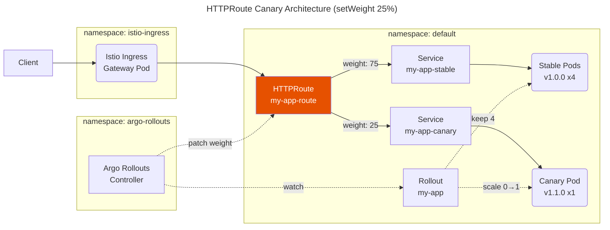

## Background

### Why Gateway API

The Kubernetes Ingress API has been [frozen](https://kubernetes.io/blog/2021/04/22/evolving-kubernetes-networking-with-the-gateway-api/) and will not receive new features. [Gateway API](https://github.com/kubernetes-sigs/gateway-api) is its successor, providing richer routing capabilities such as weighted backendRefs, header-based matching, and cross-namespace references. Istio officially supports Gateway API as a [first-class traffic management interface](https://istio.io/latest/docs/tasks/traffic-management/ingress/gateway-api/).

## Overview

Argo Rollouts supports weight-based canary deployments through the [Gateway API](https://gateway-api.sigs.k8s.io/) plugin. The key advantage is that it works with **Istio Ingress Gateway alone** — no Envoy sidecar injection or Ambient Mesh required.

The plugin patches the HTTPRoute backendRefs weight at each canary step, and the Istio Ingress Gateway distributes L7 traffic based on those weights. This applies to **North-South traffic only** (traffic entering through the gateway).

## Environment

- EKS v1.34
- **Argo Rollouts** v1.9.0 (Helm chart 2.40.9)
- **Gateway API Plugin** [argoproj-labs/gatewayAPI](https://github.com/argoproj-labs/rollouts-plugin-trafficrouter-gatewayapi/releases/tag/v0.12.0) v0.12.0
- **Istio** with Gateway API CRD v1.2.1
- Only Istio Ingress Gateway programmed via Gateway API exists; no Envoy sidecar injection or Ambient Mesh on application pods

## How It Works



The NLB (Network Load Balancer) in front of the Istio Ingress Gateway is omitted from the diagram for simplicity.

Unlike basic canary where traffic ratio equals pod count ratio (e.g., 1 canary out of 4 pods = 25%), HTTPRoute canary decouples traffic weight from pod count. All stable pods remain running at full count while canary pods are added on top (surge), and the Istio Ingress Gateway splits traffic precisely based on HTTPRoute weights regardless of how many pods exist.

| Aspect | Basic Canary | HTTPRoute Canary |
|--------|-------------|-----------------|
| Traffic control | Pod count ratio (round-robin via kube-proxy) | HTTPRoute weight (1% granularity, enforced by Envoy in the Ingress Gateway) |
| Stable pods during canary | Scaled down to make room for canary | **Kept at full count** (no disruption to stable capacity) |
| Total pods | Fixed at replicas count (e.g., 4) | Surge beyond replicas (e.g., 4 stable + 1 canary = 5) |
| Sidecar required | No | **No** (Istio Ingress Gateway handles L7 routing) |

## Configuration

### 1. Register the Gateway API Plugin

The Gateway API traffic router is not built into Argo Rollouts — it is an external plugin that the controller downloads at startup. The plugin binary URL must be registered in the argo-rollouts-config ConfigMap via the Helm chart values. Without this registration, the Rollout controller cannot find the plugin and will repeatedly fail with "plugin argoproj-labs/gatewayAPI not configured in configmap", leaving the ReplicaSet at 0 replicas.

> providerRBAC.providers.gatewayAPI: true grants the controller ClusterRole permission to get/list/watch/update HTTPRoute, GRPCRoute, TCPRoute, TLSRoute, and UDPRoute resources. This RBAC is already included in the Helm chart, but the plugin binary registration below is still separately required.

```yaml
# charts/argo-rollouts/values.yaml
argo-rollouts:
  controller:
    trafficRouterPlugins:
      - name: "argoproj-labs/gatewayAPI"
        location: "https://github.com/argoproj-labs/rollouts-plugin-trafficrouter-gatewayapi/releases/download/v0.12.0/gatewayapi-plugin-linux-amd64"

    providerRBAC:
      providers:
        gatewayAPI: true
```

### 2. Create Services

Two separate Service resources are required — one for stable traffic and one for canary traffic. **These must be pre-configured in the application's Helm chart before canary deployment is enabled.** During a canary rollout, the Argo Rollouts controller patches the rollouts-pod-template-hash label in each Service's selector to ensure my-app-stable only routes to pods from the stable ReplicaSet and my-app-canary only routes to pods from the canary ReplicaSet. This selector patching is what isolates traffic between the two versions at the Kubernetes Service level.

```yaml
apiVersion: v1
kind: Service
metadata:
  name: my-app-stable
spec:
  selector:
    app: my-app
  ports:
    - port: 80
      targetPort: 8080
---
apiVersion: v1
kind: Service
metadata:
  name: my-app-canary
spec:
  selector:
    app: my-app
  ports:
    - port: 80
      targetPort: 8080
```

### 3. Create HTTPRoute

The HTTPRoute binds to the Istio Ingress Gateway via parentRefs (which tells Istio's control plane to program this route into the gateway's Envoy configuration) and lists both services in backendRefs. The initial weights are set to 100/0, meaning all traffic goes to the stable service. During canary, the Argo Rollouts controller will patch these weight values directly.

```yaml
apiVersion: gateway.networking.k8s.io/v1
kind: HTTPRoute
metadata:
  name: my-app-route
spec:
  parentRefs:
    # Name of the Gateway resource in istio-ingress namespace
    - name: my-gateway
      namespace: istio-ingress
  hostnames:
    - "api.example.com"
  rules:
    - matches:
        - path:
            type: PathPrefix
            value: /my-app
      backendRefs:
        # Stable service — gets 100% initially
        - name: my-app-stable
          port: 80
          weight: 100
        # Canary service — gets 0% initially
        - name: my-app-canary
          port: 80
          weight: 0
```

### 4. Create Rollout

The Rollout resource replaces the standard Deployment and adds the canary strategy configuration. It references both services and the HTTPRoute through the trafficRouting.plugins field. The steps array defines the canary progression — each setWeight step triggers the controller to patch the HTTPRoute weights, and pause steps either wait for manual promotion or a duration.

> Note: The field path is trafficRouting.plugins.argoproj-labs/gatewayAPI (plugin-based), not trafficRouting.gatewayAPI (which doesn't exist in the Rollout CRD schema). Using the wrong field path will cause a strict decoding error on apply.

```yaml
apiVersion: argoproj.io/v1alpha1
kind: Rollout
metadata:
  name: my-app
spec:
  replicas: 4
  selector:
    matchLabels:
      app: my-app
  template:
    metadata:
      labels:
        app: my-app
    spec:
      containers:
        - name: app
          image: my-registry.example.com/my-app:v1.0.0
          ports:
            - containerPort: 8080
  strategy:
    canary:
      stableService: my-app-stable
      canaryService: my-app-canary
      trafficRouting:
        plugins:
          argoproj-labs/gatewayAPI:
            # Must match the HTTPRoute name above
            httpRoute: my-app-route
            # Namespace where the HTTPRoute lives
            namespace: default
      steps:
        # 5% to canary, 95% to stable
        - setWeight: 5
        # Wait for manual promotion (kubectl argo rollouts promote)
        - pause: {}
        - setWeight: 25
        # Auto-proceed after 30 seconds
        - pause: {duration: 30s}
        - setWeight: 50
        - pause: {duration: 30s}
        - setWeight: 75
        # After this, automatically promotes to 100%
        - pause: {duration: 30s}
```

A step with **pause: {}** (no duration) waits indefinitely until a manual promote is issued via `kubectl argo rollouts promote`. In contrast, **pause: {duration: 30s}** automatically proceeds to the next step after the specified time. This allows the first canary step to require human approval while subsequent steps progress automatically.

## Weight Patching Behavior

During canary progression, the Argo Rollouts controller patches the HTTPRoute's **spec.rules[].backendRefs[].weight** field via the Gateway API plugin. The plugin reads the current HTTPRoute from the cluster, updates the weight values for the two backendRefs matching the stable and canary service names, then writes the updated HTTPRoute back. The Istio control plane (istiod) detects the HTTPRoute change and pushes updated Envoy configuration to the Ingress Gateway pod, which immediately starts routing traffic according to the new weights.

Before canary starts, all traffic goes to the stable service:

```yaml
# HTTPRoute initial state
spec:
  rules:
    - backendRefs:
        - name: my-app-stable
          port: 80
          weight: 100
        - name: my-app-canary
          port: 80
          weight: 0
```

When the canary reaches setWeight: 25, the Argo Rollouts controller pod patches both weight values in-place via the Gateway API plugin:

```yaml
# HTTPRoute after controller patches (setWeight: 25)
spec:
  rules:
    - backendRefs:
        - name: my-app-stable
          port: 80
          # patched from 100 to 75
          weight: 75
        - name: my-app-canary
          port: 80
          # patched from 0 to 25
          weight: 25
```

The TrafficWeightUpdated event is emitted at each step, providing an audit trail in Kubernetes events:

| Step | stable weight | canary weight | Action |
|------|:---:|:---:|--------|
| Initial | 100 | 0 | Stable state |
| setWeight: 5 | 95 | 5 | Controller patches HTTPRoute |
| setWeight: 25 | 75 | 25 | Auto patch |
| setWeight: 50 | 50 | 50 | Auto patch |
| setWeight: 75 | 25 | 75 | Auto patch |
| Promote (100%) | 100 | 0 | Switched to new stable, weights restored |

Verified via Kubernetes events:

```bash
# TrafficWeightUpdated events during canary
TrafficWeightUpdated    → Traffic weight updated from 0 to 25
TrafficWeightUpdated    → Traffic weight updated from 25 to 50
TrafficWeightUpdated    → Traffic weight updated from 50 to 75
```

## ArgoCD Integration

If the HTTPRoute is managed by ArgoCD, the weight changes will cause an OutOfSync status because the live state (e.g., 75/25) differs from the desired state in Git (100/0). If auto-sync with self-heal is enabled, ArgoCD will revert the weights back to 100/0, breaking the canary mid-rollout.

The Gateway API plugin automatically adds a label to the HTTPRoute during canary progression to help with this:

```yaml
metadata:
  labels:
    # Added by plugin during canary, removed when canary completes
    rollouts.argoproj.io/gatewayapi-canary: in-progress
```

This label is automatically removed when the canary completes and weights are restored to 100/0. Using this label as a condition, you can configure ArgoCD to [ignore differences](https://argo-cd.readthedocs.io/en/stable/user-guide/diffing/) **only while a canary is in progress** — once the rollout finishes, normal diff detection resumes:

```yaml
# ArgoCD Helm values (argocd-cm)
configs:
  cm:
    resource.customizations.ignoreDifferences.gateway.networking.k8s.io_HTTPRoute: |
      jqPathExpressions:
        - select(.metadata.labels["rollouts.argoproj.io/gatewayapi-canary"] == "in-progress") | .spec.rules
```

## Limitations

**North-South only**: HTTPRoute weight splitting only applies to external traffic entering through the Istio Ingress Gateway. Cluster-internal pod-to-pod (East-West) traffic bypasses the gateway entirely and uses kube-proxy round-robin to reach Service endpoints — the HTTPRoute weights have no effect on this path.

However, the Argo Rollouts controller patches Service selectors so that:
- my-app-stable → selects only stable pods (via rollouts-pod-template-hash)
- my-app-canary → selects only canary pods

This means internal callers using my-app-stable will always hit stable pods, even without weight-based routing. Canary traffic is only exposed through the gateway for external callers.

If you need percentage-based weight control for East-West traffic as well, you'll need Istio sidecar injection or Ambient Mesh to place an Envoy proxy in the data path between pods.

**Deployment migration**: Existing Deployment resources must be converted to Rollout first. The Rollout CRD has a nearly identical spec.template to Deployment, but the strategy field uses Argo Rollouts' canary/blueGreen strategies instead of Kubernetes' native RollingUpdate. Argo Rollouts canary strategy does not work with Deployments.
