## Overview

This post covers:

- How Node Termination Handler (NTH) works and its key features.
- Installing and operating NTH using a Helm chart.

Written for SREs and DevOps Engineers managing Kubernetes clusters on AWS.

## Background

### Considerations for EKS Spot Worker Nodes

Spot instances reduce costs and improve scalability on EKS, but they can be terminated at any time.

When using Spot instances as EKS worker nodes, you must handle Spot Instance Interruption Notifications (ITN). AWS EC2 sends an [interruption notification event](https://docs.aws.amazon.com/AWSEC2/latest/UserGuide/spot-instance-termination-notices.html) **2 minutes before** terminating a Spot instance.

Required actions when handling Spot ITN in EKS:

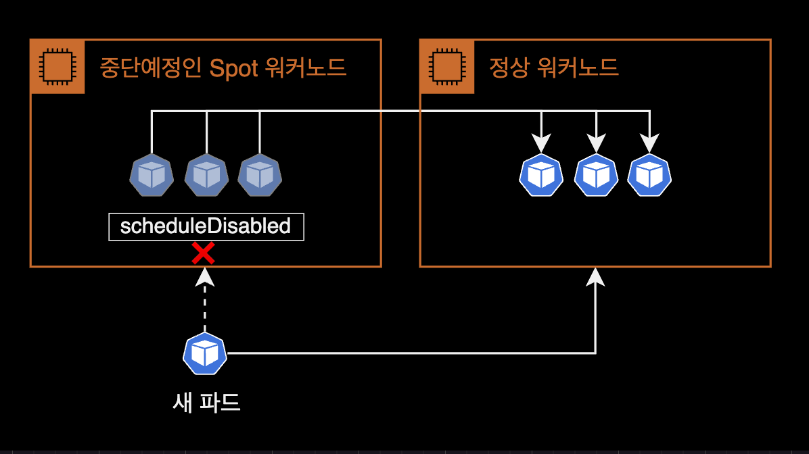

- **cordon**: Prevent new pods from being scheduled on the node about to be terminated.
- **drain**: Relocate running pods to other worker nodes.

Without handling Spot ITN, application code may not shut down properly, or new pods could accidentally be scheduled on a node about to be terminated. Manually handling every interruption event is not feasible.

This is why the Node Termination Handler controller was created.

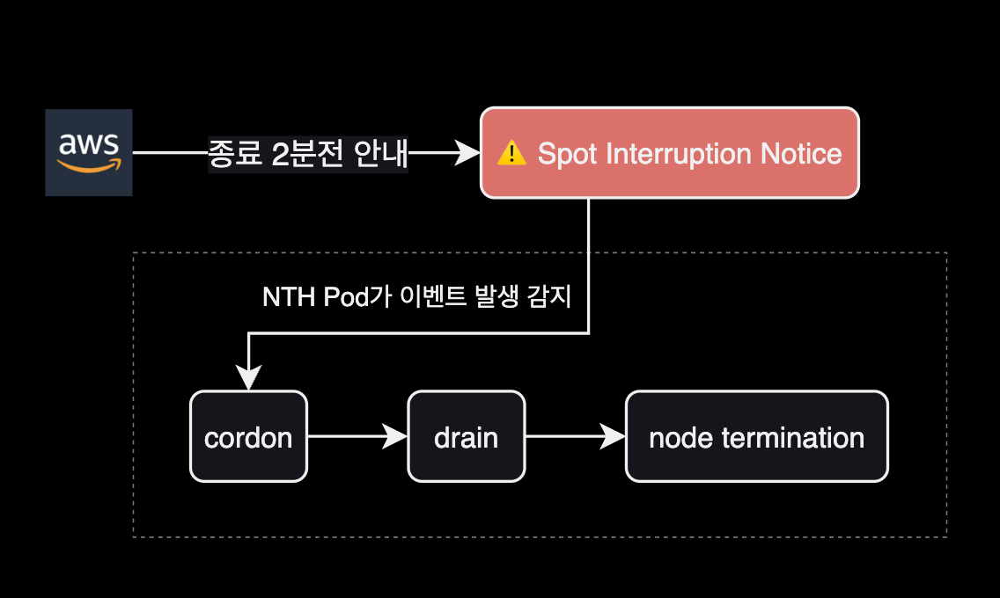

NTH detects Spot ITN events, evicts pods, and cordons the affected node. The [Kubernetes Eviction API](https://kubernetes.io/docs/concepts/scheduling-eviction/api-eviction/) respects PDB and terminationGracePeriodSeconds, ensuring graceful pod shutdown.

The following diagram shows NTH operating in IMDS mode:

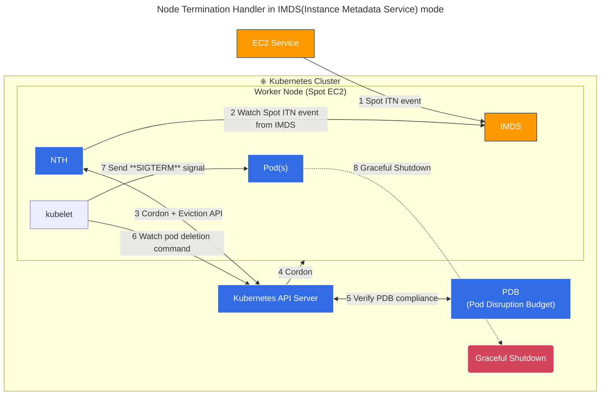

NTH lets you save costs with Spot instances while mitigating the instability risk of unexpected terminations.

### How NTH Works

aws-node-termination-handler (NTH) operates in one of two modes. Both IMDS and Queue Processor modes monitor EC2 instance events, but each supports different event types.

| Feature	| IMDS Processor | Queue Processor |
|---------|----------------|-----------------|
| Spot Instance Termination Notifications (ITN)	| ✅	| ✅ |
| Scheduled Events | ✅	| ✅ |
| Instance Rebalance Recommendation	| ✅	| ✅ |
| ASG Termination Lifecycle Hooks	| ❌	| ✅ |
| ASG Termination Lifecycle State Change | ✅ | ❌ |
| AZ Rebalance Recommendation	| ❌	| ✅ |
| Instance State Change Events | ❌ | ✅ |
| Issue Lifecycle Heartbeats | ❌ | ✅ |

For broader event coverage, Queue Processor mode is recommended. It requires additional SQS and EventBridge infrastructure, making setup more complex than IMDS mode.

### NTH Installation Modes

IMDS and Queue Processor modes differ in pod deployment method and configuration.

#### IMDS (Instance Metadata Service) Mode

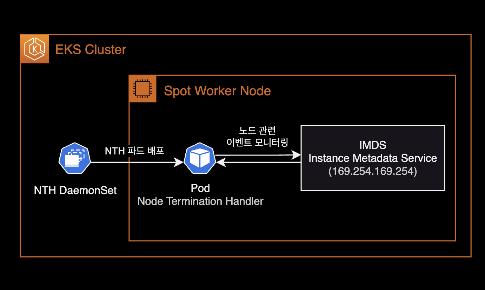

- NTH pods are deployed as a DaemonSet.
- NTH communicates with IMDS inside EC2 to monitor [instance metadata](https://docs.aws.amazon.com/AWSEC2/latest/UserGuide/instancedata-data-categories.html) endpoints like `spot/` and `events/`.
- Simpler setup than Queue Processor mode — just deploy the Helm chart.
  - No IAM Role ([IRSA](https://docs.aws.amazon.com/eks/latest/userguide/iam-roles-for-service-accounts.html)) attachment needed for NTH pods.

#### Queue Processor Mode

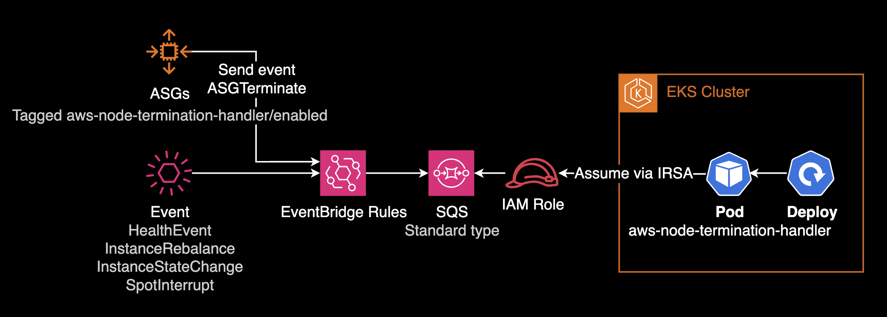

- NTH pods are deployed as a Deployment.
- Requires additional infrastructure: IAM Role (IRSA), EventBridge Rule, SQS queue for event detection and processing.
- More complex setup compared to IMDS mode.
- [terraform-aws-eks-blueprints-addons](https://github.com/aws-ia/terraform-aws-eks-blueprints-addons) can provision EventBridge Rules, SQS, IAM Role, and ASG configuration (Tagging, Lifecycle Hook) in one go.

## Environment

### Local

- helm v3.12.0
- kubectl v1.27.2

### Kubernetes

- EKS v1.25
- Node Termination Handler v1.19.0 (chart v0.21.0)

## Installation

Goal: Install NTH in IMDS mode using a Helm chart.

### Download the Chart

Clone the [AWS NTH official repository](https://github.com/aws/aws-node-termination-handler):

```bash
$ git clone https://github.com/aws/aws-node-termination-handler.git
```

The repository includes a [Helm chart](https://github.com/aws/aws-node-termination-handler/tree/main/config/helm/aws-node-termination-handler).

Navigate to the chart directory:

```bash
$ cd aws-node-termination-handler/config/helm/aws-node-termination-handler
```

Chart directory structure:

```bash
$ tree .
.
├── Chart.yaml
├── README.md
├── example-values-imds-linux.yaml
├── example-values-imds-windows.yaml
├── example-values-queue.yaml
├── templates
│   ├── NOTES.txt
│   ├── _helpers.tpl
│   ├── clusterrole.yaml
│   ├── clusterrolebinding.yaml
│   ├── daemonset.linux.yaml
│   ├── daemonset.windows.yaml
│   ├── deployment.yaml
│   ├── pdb.yaml
│   ├── podmonitor.yaml
│   ├── psp.yaml
│   ├── service.yaml
│   ├── serviceaccount.yaml
│   └── servicemonitor.yaml
└── values.yaml

2 directories, 19 files
```

### Chart Configuration

Three key settings to modify in `values.yaml`:

1. **Target node selection**: Use nodeSelector or nodeAffinity to deploy NTH only to specific node groups.
2. **Resource limits**: Set resource requests and limits for NTH DaemonSet pods.
3. **webhookURL**: Slack incoming webhook URL for NTH event notifications.

#### daemonsetNodeSelector

Deploy NTH pods only to Spot instance nodes:

```yaml
# values.yaml
daemonsetNodeSelector:
  eks.amazonaws.com/capacityType: SPOT
```

Without this constraint, NTH pods deploy to all nodes including On-Demand, wasting resources.

#### nodeAffinity

For more complex node selection, use [nodeAffinity](https://kubernetes.io/docs/concepts/scheduling-eviction/assign-pod-node/#node-affinity) instead of [nodeSelector](https://kubernetes.io/docs/concepts/scheduling-eviction/assign-pod-node/#nodeselector).

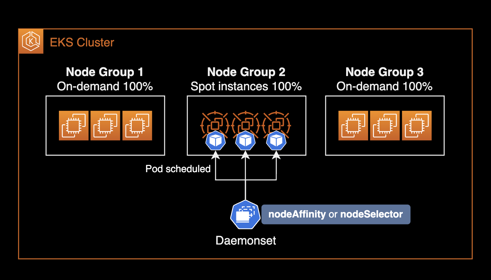

Example targeting specific node groups:

```yaml
# values.yaml
daemonsetAffinity:
  nodeAffinity:
    requiredDuringSchedulingIgnoredDuringExecution:
      nodeSelectorTerms:
        - matchExpressions:
            - key: "eks.amazonaws.com/compute-type"
              operator: NotIn
              values:
                - fargate
            - key: node.kubernetes.io/name
              operator: In
              values:
              - hpc-spot
              - data-batch-spot
```

Multiple `matchExpressions` conditions are ANDed. The above deploys NTH pods only to nodes that:

1. Are not Fargate type (On-Demand or Spot)
2. Belong to `hpc-spot` or `data-batch-spot` node groups

#### Pod Resource Limits

The [official NTH Helm chart](https://github.com/aws/aws-node-termination-handler/blob/main/config/helm/aws-node-termination-handler/templates/daemonset.linux.yaml#L177-L179) has no default resource limits. DaemonSet pods typically need minimal resources:

```yaml
# values.yaml
resources:
  requests:
    cpu: 10m
    memory: 40Mi
  limits:
    cpu: 100m
    memory: 100Mi
```

#### PSP Configuration

PSP (Pod Security Policy) is removed since Kubernetes v1.25. Set `rbac.pspEnabled` to `false` for EKS v1.25+:

```diff
# aws-node-termination-handle/values_ENV.yaml
...
  rbac:
    create: true
+     pspEnabled: true
-     pspEnabled: false
```

When `rbac.pspEnabled` is `false`, the following resources are not created (controlled by the [psp.yaml](https://github.com/aws/aws-node-termination-handler/blob/main/config/helm/aws-node-termination-handler/templates/psp.yaml#L1) template):

- PSP Role
- PSP RoleBinding
- PSP

NTH pod's PSP resource relationship:

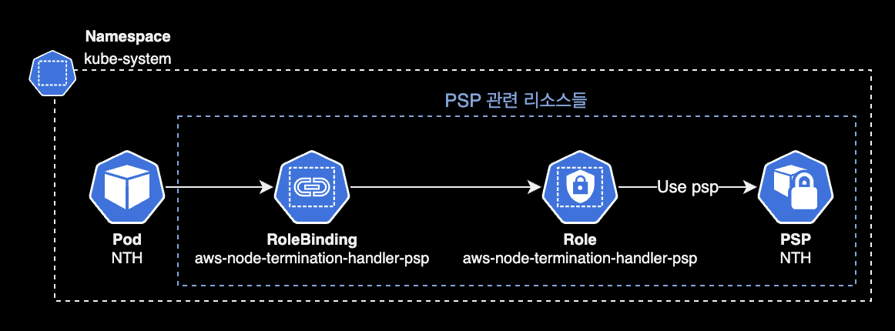

#### webhookURL (Optional)

Set a Slack incoming webhook URL for cordon & drain notifications:

```yaml
# values.yaml
webhookURL: "${SLACK_WEBHOOK_URL}"
```

Leave empty if Slack notifications are not needed:

```yaml
# values.yaml
webhookURL: ""
```

#### webhookTemplate (Optional)

Customize the Slack notification message template via `webhookTemplate`. Use YAML [Folded Scalar](https://yaml.org/spec/1.2-old/spec.html#style/block/folded) (`>`) for readability:

```yaml
# values.yaml
webhookTemplate: >
  {
    "text": ":rotating_light: *EC2 Spot instance is about to be interrupted.* :rotating_light:\n
    *_Account:_* `{{ .AccountId }}`\n
    *_Instance ID:_* `{{ .InstanceID }}`\n
    *_Node Name:_* `{{ .NodeName }}`\n
    *_Instance Type:_* `{{ .InstanceType }}`\n
    *_Start Time:_* `{{ .StartTime }}`\n
    *_Description:_* {{ .Description }}\n
    *_Affected Pod(s):_* `{{ .Pods }}`"
  }
```

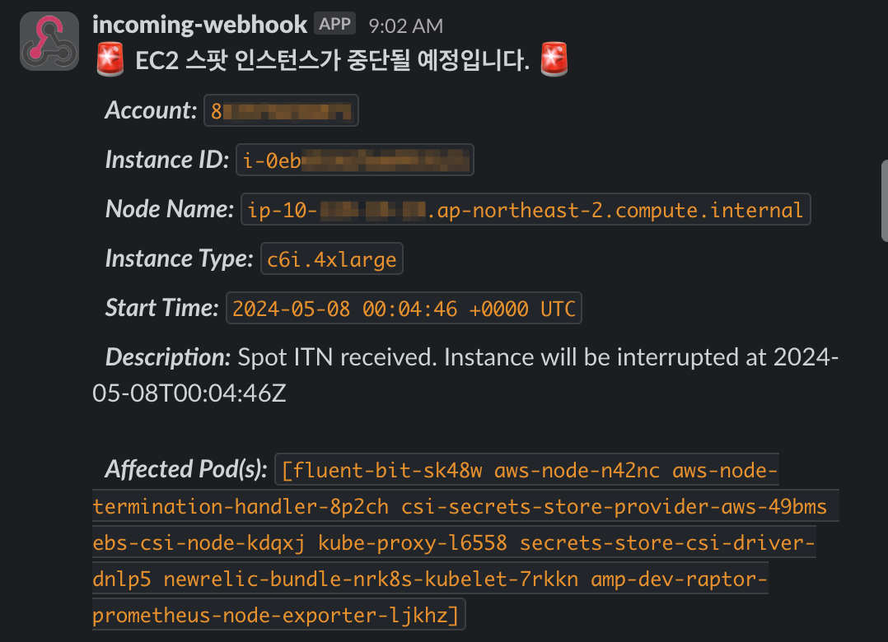

Alternatively, store the Slack template in a separate ConfigMap (or Secret) resource.

Default webhookTemplate (when left unset):

```yaml
# values.yaml
webhookTemplate: "\{\"Content\":\"[NTH][Instance Interruption] InstanceId: \{\{ \.InstanceID \}\} - InstanceType: \{\{ \.InstanceType \}\} - Kind: \{\{ \.Kind \}\} - Start Time: \{\{ \.StartTime \}\}\"\}"
```

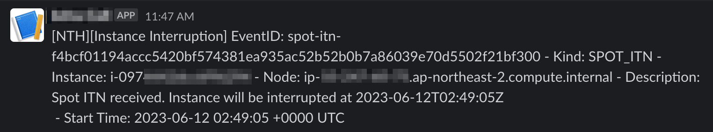

See the [End to End test code](https://github.com/aws/aws-node-termination-handler/blob/b6477836cc81f6c2e82ca9840adf170472bbd0fc/test/e2e/webhook-test#L30) on NTH GitHub for more details.

NTH pods must be able to reach the Slack API via NAT Gateway:

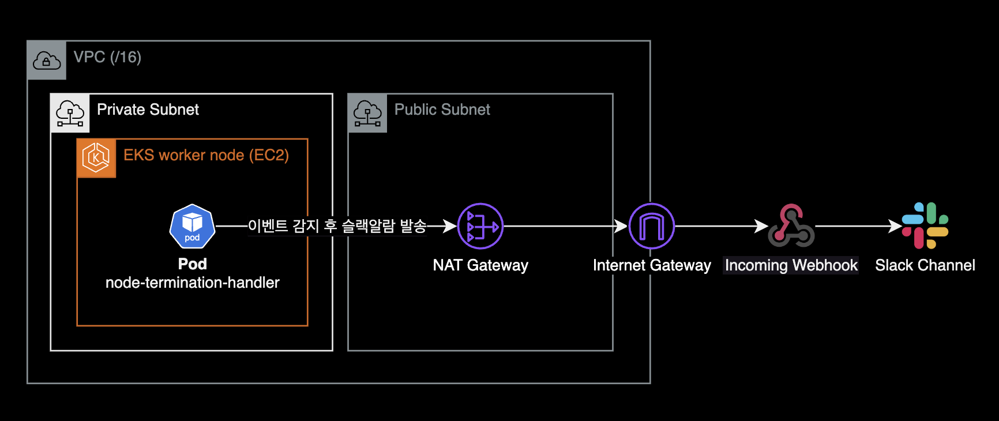

### Install NTH with Helm

Install NTH in IMDS mode to `kube-system` namespace:

```bash
CHART_VERSION=0.21.0
helm upgrade \
  --install \
  --namespace kube-system \
  aws-node-termination-handler ./aws-node-termination-handler \
  --version $CHART_VERSION \
  --wait
```

NTH installs in IMDS mode by default.

To use Queue Processor mode, set `enableSqsTerminationDraining` to `true`:

```yaml
# values.yaml
enableSqsTerminationDraining: true
```

Queue Processor mode also requires SQS queue and IAM permission setup. This post only covers IMDS mode. See the [NTH official docs](https://github.com/aws/aws-node-termination-handler?tab=readme-ov-file#infrastructure-setup) for details.

```bash
Release "aws-node-termination-handler" has been upgraded. Happy Helming!
NAME: aws-node-termination-handler
LAST DEPLOYED: Sun Jun 11 17:40:56 2023
NAMESPACE: kube-system
STATUS: deployed
REVISION: 5
TEST SUITE: None
NOTES:
***********************************************************************
* AWS Node Termination Handler                                        *
***********************************************************************
  Chart version: 0.21.0
  App version:   1.19.0
  Image tag:     public.ecr.aws/aws-ec2/aws-node-termination-handler:v1.19.0
  Mode :         IMDS
***********************************************************************
```

Confirms NTH v1.19.0 (chart v0.21.0) installed in IMDS mode.

To reinstall an existing NTH deployment, use `--recreate-pods` and `--force`:

```bash
$ helm upgrade \
    --install \
    --namespace kube-system \
    aws-node-termination-handler ./aws-node-termination-handler \
    --version $CHART_VERSION \
    --recreate-pods \
    --force
```

```bash
Flag --recreate-pods has been deprecated, functionality will no longer be updated. Consult the documentation for other methods to recreate pods
```

The deprecation warning for `--recreate-pods` can be safely ignored — the reinstall proceeds normally.

Verify the release:

```bash
$ helm list -n kube-system
```

```bash
NAME                           NAMESPACE     REVISION   UPDATED                                STATUS     CHART                                 APP VERSION
aws-node-termination-handler   kube-system   5          2023-06-11 17:40:56.273914 +0900 KST   deployed   aws-node-termination-handler-0.21.0   1.19.0
```

Check applied values:

```bash
$ helm get values aws-node-termination-handler -n kube-system
```

Verify that the three settings (node selection, resource limits, Slack webhook URL) are properly applied.

### NTH Pod Status

Check the DaemonSet:

```bash
$ kubectl get daemonset -n kube-system aws-node-termination-handler
```

```bash
NAME                           DESIRED   CURRENT   READY   UP-TO-DATE   AVAILABLE   NODE SELECTOR                                                AGE
aws-node-termination-handler   2         2         2       2            2           eks.amazonaws.com/capacityType=SPOT,kubernetes.io/os=linux   3h56m
```

Two things to verify:

- NODE SELECTOR is correctly configured on the DaemonSet.
- NTH pods are deployed only to Spot instance nodes.

Since IMDS mode is primarily for handling Spot ITN events, deploying NTH to On-Demand nodes wastes resources unless there are specific events to handle.

When Spot worker nodes scale out via Kubernetes Autoscaler (or Karpenter), the DaemonSet automatically adjusts:

```bash
NAME                           DESIRED   CURRENT   READY   UP-TO-DATE   AVAILABLE   NODE SELECTOR                                                AGE
aws-node-termination-handler   2         2         2       2            2           eks.amazonaws.com/capacityType=SPOT,kubernetes.io/os=linux   3h56m
```

After one more Spot instance joins (3 worker nodes total):

```bash
NAME                           DESIRED   CURRENT   READY   UP-TO-DATE   AVAILABLE   NODE SELECTOR                                                AGE
aws-node-termination-handler   3         3         3       3            3           eks.amazonaws.com/capacityType=SPOT,kubernetes.io/os=linux   3h57m
```

In IMDS mode, NTH pods are managed by a DaemonSet, so they automatically scale with Spot worker nodes.

### Graceful Pod Shutdown

Graceful shutdown in Kubernetes ensures applications terminate safely. This is achieved by combining tGPS (terminationGracePeriodSeconds) and preStop hooks.

#### Related Pod Specs

1. **`spec.terminationGracePeriodSeconds`**: Time to wait between receiving a termination signal and actual termination. Default is `30` seconds.
2. **`preStop` hook**: Executes a command or HTTP request after receiving the termination signal but before the shutdown process begins. Useful for session saving, log backup, etc.

#### Scenarios That Trigger Termination

- **Pod scaling**: Scale-down terminates excess pod instances.
- **Deployment updates**: New container image or config changes trigger pod replacement.
- **Resource pressure**: Scheduler may evict pods to other nodes when resources are scarce.
- **Manual deletion**: User deletes pods via CLI or API.
- **Node maintenance**: Node enters maintenance mode or requires restart.

#### Graceful Shutdown Configuration Example

```yaml
---
apiVersion: v1
kind: Pod
metadata:
  name: example-pod
spec:
  # [1] Set pod termination grace period to 60 seconds
  terminationGracePeriodSeconds: 60
  containers:
  - name: example-container
    image: nginx
    lifecycle:
      preStop:
        exec:
          # [2] Wait 55 seconds before shutdown
          command: ["sh", "-c", "sleep 55"]
```

With `terminationGracePeriodSeconds: 60`, the preStop hook runs `sleep 55` after receiving the termination signal. During this time, the pod can complete data processing, release DB connections, and clean up resources.

Pod lifecycle timeline with terminationGracePeriodSeconds and preStop:

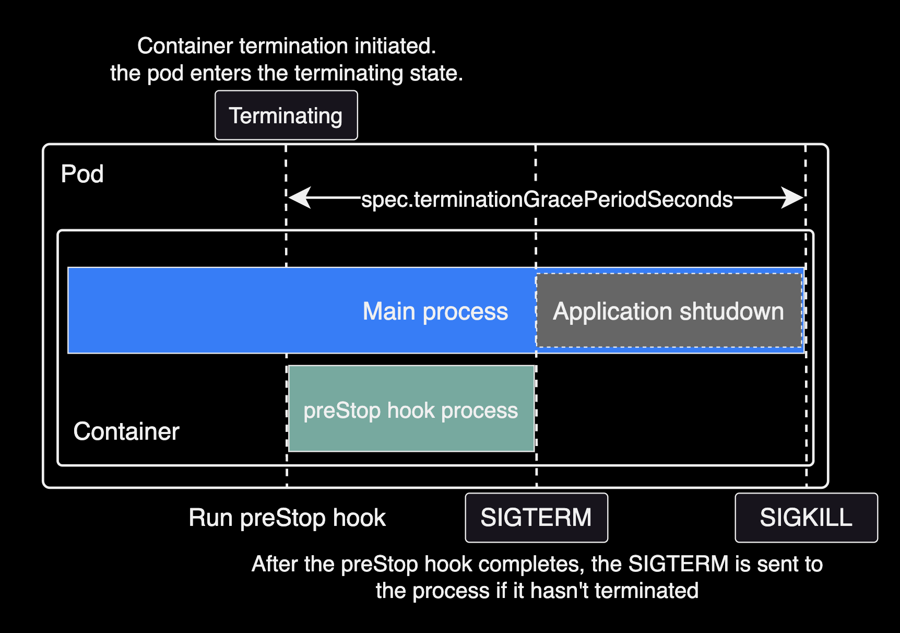

> For graceful shutdown to work correctly, the sum of preStop duration and application shutdown time must be less than `spec.terminationGracePeriodSeconds`.

```bash
terminationGracePeriodSeconds > preStop duration + application shutdown time
```

For Spring Framework applications, these settings affect application shutdown time:

- `spring.cloud.gateway.httpclient.pool.max-life-time`: Maximum lifetime for connection pool channels. Default is `NULL` (no limit). Setting this reduces the number of connections to clean up during shutdown. See the [Spring Cloud Gateway docs](https://docs.spring.io/spring-cloud-gateway/reference/appendix.html).
- `spring.lifecycle.timeout-per-shutdown-phase`: Per-phase shutdown timeout. Reducing this shortens each shutdown phase.

Example of incorrect configuration (preStop duration + application shutdown time exceeds terminationGracePeriodSeconds):

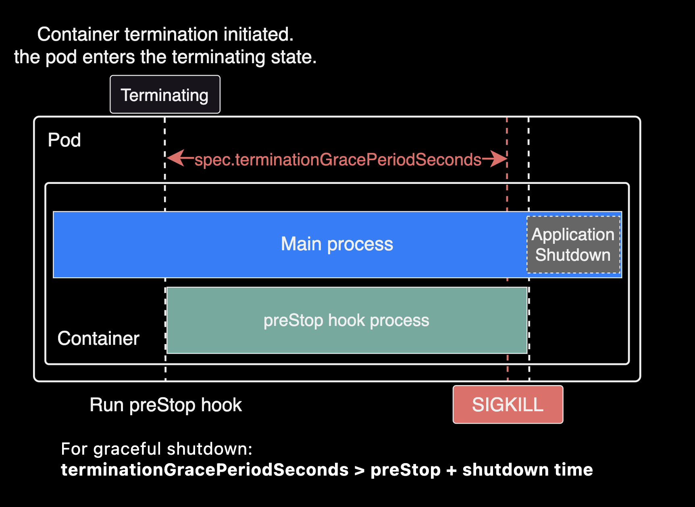

## Advanced Configuration

### NTH Metrics

NTH provides Prometheus metrics on port 9092 at `/metrics`:

```bash
# aws-node-termination-handler/values.yaml
enablePrometheusServer: true
prometheusServerPort: 9092
```

Available metrics:

- **actions_total**: Total action count
- **actions_node_total**: Per-node action count (deprecated: use `actions_total` instead)
- **events_error_total**: Error count during event processing

Metrics collection differs depending on NTH mode (IMDS vs Queue).

> `serviceMonitor` and `podMonitor` are custom resources provided by [Prometheus Operator](https://github.com/prometheus-operator/prometheus-operator). See the [API reference](https://prometheus-operator.dev/docs/api-reference/api/).

In Queue mode, metrics can be collected via:

- serviceMonitor custom resource with Prometheus Operator.
- Static `scrape_configs` entry targeting the NTH service.

Example `scrape_configs` for Prometheus Helm chart:

```yaml
# charts/prometheus/values.yaml
extraScrapeConfigs: |
  - job_name: 'aws-node-termination-handler'
    static_configs:
      - targets:
          - 'aws-node-termination-handler.kube-system.svc.cluster.local:9092'
```

In IMDS mode, no `ClusterIP` service is created, so use `podMonitor` to scrape metrics directly from pods:

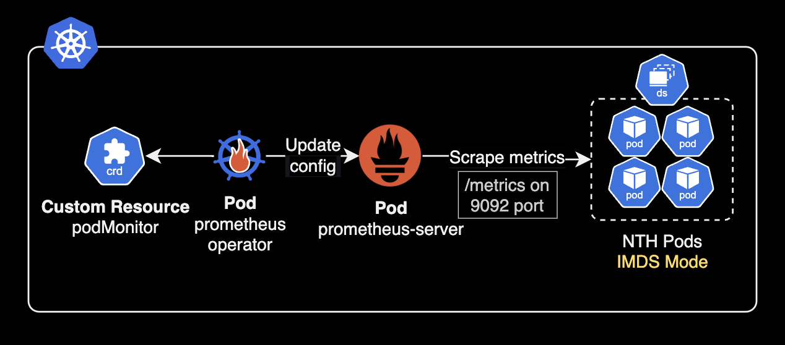

Without Prometheus Operator, add annotations to all NTH pods for auto-discovery:

```yaml
# charts/aws-node-termination-handler/values.yaml
podAnnotations:
  prometheus.io/scrape: "true"
  prometheus.io/port: "9092"
  prometheus.io/path: "/metrics"

enablePrometheusServer: true
prometheusServerPort: 9092
```

## Testing

To test NTH, a Spot interruption event (Spot ITN) must occur on a cluster using Spot instances.

Use AWS Fault Injection Service to trigger Spot instance interruptions and observe NTH behavior:

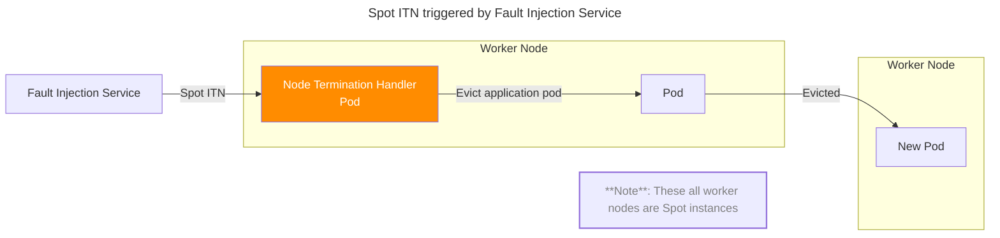

NTH ignores DaemonSet-managed pods and performs cordon + drain on the target node for non-DaemonSet pods:

- **cordon**: Marks the node as unschedulable.
- **drain**: Evicts pods to other nodes. Pods receive SIGTERM for graceful shutdown, followed by SIGKILL after the grace period.

NTH pod logs after a Spot Interruption Notification:

```bash
2025/05/16 08:29:28 ??? WARNING: ignoring DaemonSet-managed Pods: calico-system/calico-node-hhhj4, calico-system/csi-node-driver-zg5vt, kube-system/aws-node-44nls, kube-system/aws-node-termination-handler-b57xt, kube-system/ebs-csi-node-qcp7n, kube-system/eks-pod-identity-agent-xpkpm, kube-system/kube-proxy-hwp8q, kube-system/secrets-store-csi-driver-provider-aws-4c98d, kube-system/secrets-store-csi-driver-wdj4p
2025/05/16 08:29:28 ??? evicting pod pfops/argocd-repo-server-97d8976d9-fkwxd
2025/05/16 08:29:28 ??? evicting pod kube-system/ebs-csi-controller-59fb89d9c-52rvk
2025/05/16 08:29:28 ??? evicting pod kube-system/ebs-csi-controller-59fb89d9c-jdhq7
2025/05/16 08:29:28 ??? evicting pod kyverno/kyverno-background-controller-5579d9bdbc-4mgn8
2025/05/16 08:29:28 ??? evicting pod netbox/netbox-redis-master-0
2025/05/16 08:29:28 ??? evicting pod netbox/netbox-redis-replicas-1
2025/05/16 08:29:28 ??? evicting pod netbox/netbox-redis-replicas-2
2025/05/16 08:29:28 ??? evicting pod kube-system/aws-load-balancer-controller-85679cfcc6-jh488
2025/05/16 08:29:28 ??? evicting pod kube-system/aws-load-balancer-controller-85679cfcc6-9q2gc
2025/05/16 08:29:28 ??? evicting pod kube-system/coredns-8f66cf8b8-5cwld
2025/05/16 08:29:28 ??? evicting pod kube-system/coredns-8f66cf8b8-wvrjn
2025/05/16 08:29:29 ??? error when evicting pods/"coredns-8f66cf8b8-wvrjn" -n "kube-system" (will retry after 5s): Cannot evict pod as it would violate the pod's disruption budget.
2025/05/16 08:29:29 ??? error when evicting pods/"ebs-csi-controller-59fb89d9c-52rvk" -n "kube-system" (will retry after 5s): Cannot evict pod as it would violate the pod's disruption budget.
2025/05/16 08:29:34 ??? evicting pod kube-system/coredns-8f66cf8b8-wvrjn
2025/05/16 08:29:34 ??? evicting pod kube-system/ebs-csi-controller-59fb89d9c-52rvk
2025/05/16 08:29:34 ??? error when evicting pods/"ebs-csi-controller-59fb89d9c-52rvk" -n "kube-system" (will retry after 5s): Cannot evict pod as it would violate the pod's disruption budget.
2025/05/16 08:29:39 ??? evicting pod kube-system/ebs-csi-controller-59fb89d9c-52rvk
2025/05/16 08:29:39 ??? error when evicting pods/"ebs-csi-controller-59fb89d9c-52rvk" -n "kube-system" (will retry after 5s): Cannot evict pod as it would violate the pod's disruption budget.
2025/05/16 08:29:44 ??? evicting pod kube-system/ebs-csi-controller-59fb89d9c-52rvk
2025/05/16 08:29:44 ??? error when evicting pods/"ebs-csi-controller-59fb89d9c-52rvk" -n "kube-system" (will retry after 5s): Cannot evict pod as it would violate the pod's disruption budget.
2025/05/16 08:29:49 ??? evicting pod kube-system/ebs-csi-controller-59fb89d9c-52rvk
2025/05/16 08:30:05 INF Node successfully cordoned and drained node_name=ip-10-xxx-x-xx.ap-northeast-2.compute.internal reason="Spot ITN received. Instance will be interrupted at 2025-05-16T08:31:24Z \n"
```

## Summary

- NTH (Node Termination Handler) is a DaemonSet node controller for Kubernetes. It automatically handles EC2 instance events like Spot interruptions and scheduled maintenance.
- NTH operates in two modes: IMDS and Queue.
- Queue mode provides broader event coverage than IMDS mode.
- IMDS mode detects events via [EC2 Instance Metadata Service](https://docs.aws.amazon.com/AWSEC2/latest/UserGuide/ec2-instance-metadata.html). Queue mode uses Amazon EventBridge for wider event coverage:

  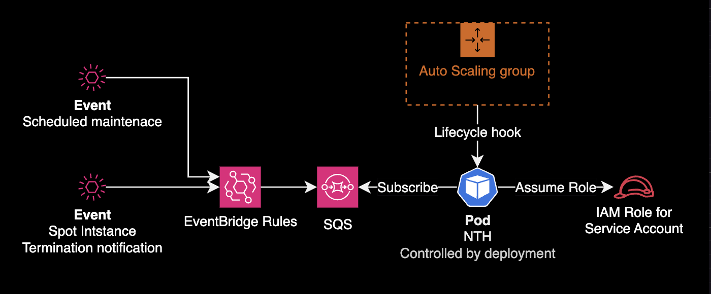

- Configure `preStop` and `spec.terminationGracePeriodSeconds` on pods to ensure graceful shutdown during NTH-triggered drains.
- NTH is essential for Spot instance environments, enabling cost efficiency while maintaining cluster stability.
- NTH detects node termination events and performs cordon + drain to safely relocate pods before node shutdown, minimizing data loss and maintaining service continuity.

## References

Articles:

- [Karpenter and Spot for cost-effective node provisioning](https://tech.scatterlab.co.kr/spot-karpenter/) by ScatterLab
- [Reduce Kubernetes Infrastructure cost with EC2 Spot Instances — Part 2](https://medium.com/upday-devs/reduce-kubernetes-infrastructure-cost-with-ec2-spot-instances-part-2-6e311ef56b84): Running non-production at 100% Spot

Node Termination Handler:

- [NTH installation guide](https://github.com/aws/aws-node-termination-handler#installation-and-configuration): Official GitHub README
- [NTH Helm chart](https://github.com/aws/aws-node-termination-handler/tree/main/config/helm/aws-node-termination-handler): Official chart, also available on [ArtifactHUB](https://artifacthub.io/packages/helm/aws/aws-node-termination-handler)

AWS EC2 Docs:

- [Spot Instance Advisor](https://aws.amazon.com/ko/ec2/spot/instance-advisor/): Check Spot interruption frequency by region and instance type
- [Instance metadata and user data](https://docs.aws.amazon.com/AWSEC2/latest/UserGuide/ec2-instance-metadata.html): AWS EC2 official docs
