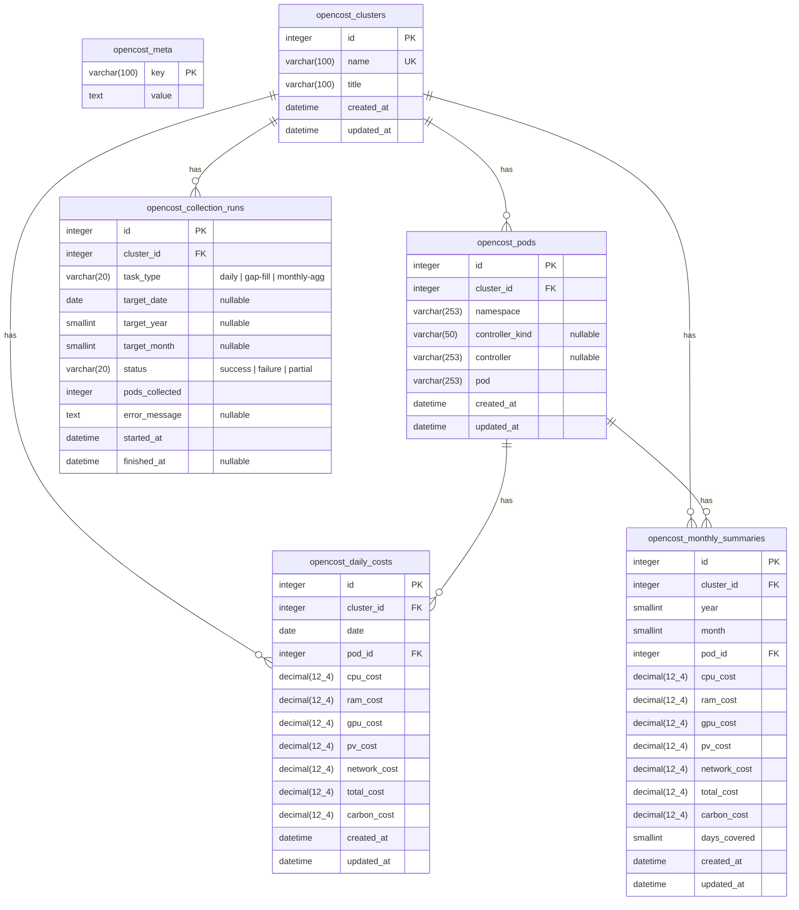

---
plugins:
  - opencost
  - opencost-backend
---

# OpenCost ERD

Schema version: **2**

## ER Diagram

## Tables

### opencost_meta

Schema version tracking. Single row with `key = 'schema_version'`.

### opencost_clusters

Registered OpenCost clusters.

| Constraint | Columns |
|------------|---------|
| PK | `id` |
| UNIQUE | `name` |

### opencost_pods

Pod dimension table (3NF normalized). Stores pod identity and mutable controller metadata.

| Constraint | Columns |
|------------|---------|
| PK | `id` |
| UNIQUE | `(cluster_id, namespace, pod)` |
| FK | `cluster_id` → `opencost_clusters.id` |
| INDEX | `cluster_id` |

`controller_kind` and `controller` are updated on upsert when they change; `updated_at` tracks the last change.

### opencost_daily_costs

Per-pod daily cost snapshot. One row per (cluster, date, pod).

| Constraint | Columns |
|------------|---------|
| PK | `id` |
| UNIQUE | `(cluster_id, date, pod_id)` |
| FK | `cluster_id` → `opencost_clusters.id` |
| FK | `pod_id` → `opencost_pods.id` |
| INDEX | `(cluster_id, date)` |

On upsert (re-collection or gap-fill), `created_at` is preserved and only `updated_at` is refreshed.

### opencost_monthly_summaries

Aggregated monthly cost per pod. Produced by the monthly-aggregator scheduled task.

| Constraint | Columns |
|------------|---------|
| PK | `id` |
| UNIQUE | `(cluster_id, year, month, pod_id)` |
| FK | `cluster_id` → `opencost_clusters.id` |
| FK | `pod_id` → `opencost_pods.id` |
| INDEX | `(cluster_id, year, month)` |

### opencost_collection_runs

Snapshot execution history for observability.

| Constraint | Columns |
|------------|---------|
| PK | `id` |
| FK | `cluster_id` → `opencost_clusters.id` |
| INDEX | `cluster_id` |
| INDEX | `(task_type, status)` |

| task_type | target fields used |
|-----------|--------------------|
| `daily` | `target_date` |
| `gap-fill` | `target_date` |
| `monthly-agg` | `target_year`, `target_month` |

Lifecycle: row inserted with `status = 'partial'` at start, updated to `success` or `failure` on completion.

## Design Decisions

**3NF normalization**: Pod metadata (`namespace`, `controller_kind`, `controller`) lives only in `opencost_pods`. Fact tables (`daily_costs`, `monthly_summaries`) reference via `pod_id` FK, eliminating daily/monthly duplication.

**Namespace in unique constraint**: `opencost_pods.UNIQUE(cluster_id, namespace, pod)` prevents same-name pods in different namespaces from colliding — a bug in the V1 schema where namespace was absent from the unique key.

**Timestamp semantics**: `created_at` records first insertion; `updated_at` records last upsert. V1's `collected_at` was overwritten on every upsert, losing the original collection timestamp.
