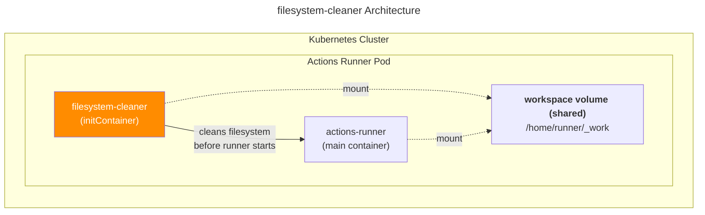

# filesystem-cleaner

[](https://github.com/younsl/o/pkgs/container/filesystem-cleaner)
[](./Cargo.toml)

A lightweight Rust-based container image for automatic filesystem cleanup in Kubernetes environments. Designed as a sidecar container or init container, it monitors disk usage and intelligently removes files to prevent storage exhaustion. Particularly useful for GitHub Actions self-hosted runners, CI/CD pipelines, and any workloads that generate temporary files requiring periodic cleanup.

**Note**: This tool was previously implemented in Go and has been migrated to Rust for better performance, memory safety, and modern tooling.

## Architecture

> **Want to understand the internals?** See [Architecture Guide](docs/architecture.md) for component design and Unix philosophy implementation.



The filesystem-cleaner runs as an init container before the GitHub Actions runner starts. Both containers share the same workspace volume, allowing the cleaner to remove build artifacts and cache data to prevent disk space issues.

## Features

- **Automatic disk usage monitoring** - Triggers cleanup when usage exceeds threshold
- **Two operation modes**:
  - `once` - Single cleanup run (for initContainers)
  - `interval` - Periodic cleanup (for sidecar containers)
- **Configurable cleanup patterns** - Include/exclude file patterns
- **Dry-run mode** - Preview what would be deleted
- **Non-root execution** - Runs as unprivileged user

## Installation

filesystem-cleaner supports multiple deployment methods: standalone binary execution, container image, and Kubernetes sidecar/init container patterns. **The Kubernetes sidecar/init container pattern is the recommended approach and was the original design purpose** - specifically created to periodically free up caching disk space in build Actions Runner pods.

### Binary

```bash
make build
make install
```

### Docker

```bash
make docker-build
```

## Usage

### Command Line

```bash
filesystem-cleaner \
  --target-paths /home/runner/_work \
  --usage-threshold-percent 80 \
  --cleanup-mode interval \
  --check-interval-minutes 10 \
  --dry-run
```

### Kubernetes

**Important Requirements:**

- **Volume Mounting**: The filesystem-cleaner container must mount the same volume as the target pod (e.g., actions-runner) to access and clean the files. Ensure both containers share the same volume mount path.
- **Security Context**: Set `runAsUser: 1001` and `runAsGroup: 1001` to match the GitHub Actions runner user. This ensures the cleaner has proper permissions to delete files created by the runner without requiring elevated privileges.

#### Sidecar (Interval Mode)

```yaml
apiVersion: v1
kind: Pod
spec:
  containers:
  - name: actions-runner
    image: actions/runner:latest
    volumeMounts:
    - name: workspace
      mountPath: /home/runner/_work
  - name: filesystem-cleaner
    image: ghcr.io/younsl/filesystem-cleaner:0.1.0
    args:
    - "--target-paths=/home/runner/_work"
    - "--usage-threshold-percent=80"
    - "--cleanup-mode=interval"
    - "--check-interval-minutes=10"
    securityContext:
      runAsUser: 1001  # Same as runner user
      runAsGroup: 1001
      runAsNonRoot: true
    volumeMounts:
    - name: workspace
      mountPath: /home/runner/_work
  volumes:
  - name: workspace
    emptyDir: {}
```

### Kubernetes

#### Init Container (Once Mode)

```yaml
apiVersion: v1
kind: Pod
spec:
  initContainers:
  - name: filesystem-cleaner
    image: ghcr.io/younsl/filesystem-cleaner:0.1.0
    args:
    - "--target-paths=/home/runner/_work"
    - "--usage-threshold-percent=70"
    - "--cleanup-mode=once"
    - "--include-patterns=*"
    - "--exclude-patterns=**/.git/**,*.log"
    securityContext:
      runAsUser: 1001  # Same as runner user
      runAsGroup: 1001
      runAsNonRoot: true
    volumeMounts:
    - name: workspace
      mountPath: /home/runner/_work
  containers:
  - name: actions-runner
    image: actions/runner:latest
    volumeMounts:
    - name: workspace
      mountPath: /home/runner/_work
  volumes:
  - name: workspace
    emptyDir: {}
```

**Common Mistake**: Simple directory names like `groovy-dsl` only match root-level paths. Use `**/groovy-dsl/**` to exclude nested directories.

```yaml
# ❌ Wrong - only matches root level
- "--exclude-patterns=groovy-dsl,kotlin-dsl"

# ✅ Correct - matches at any depth
- "--exclude-patterns=**/groovy-dsl/**,**/kotlin-dsl/**"
```

## Configuration

Configure filesystem-cleaner using command-line flags or environment variables:

| Flag | Environment Variable | Default | Description |
|------|---------------------|---------|-------------|
| `--target-paths` | `TARGET_PATHS` | `/home/runner/_work` | Paths to monitor and clean (comma-separated) |
| `--usage-threshold-percent` | `USAGE_THRESHOLD_PERCENT` | `80` | Disk usage percentage to trigger cleanup (0-100) |
| `--cleanup-mode` | `CLEANUP_MODE` | `interval` | Cleanup mode: `once` or `interval` |
| `--check-interval-minutes` | `CHECK_INTERVAL_MINUTES` | `10` | Check interval in minutes (only used when `--cleanup-mode=interval`) |
| `--include-patterns` | `INCLUDE_PATTERNS` | `*` | Glob patterns to include (e.g., `*.tmp`, `**/cache/**`) |
| `--exclude-patterns` | `EXCLUDE_PATTERNS` | `**/.git/**,**/node_modules/**,*.log` | Glob patterns to exclude (e.g., `**/.git/**`, `**/node_modules/**`) |
| `--dry-run` | `DRY_RUN` | `false` | Preview mode without deletion |
| `--log-level` | `LOG_LEVEL` | `info` | Log level: `trace`, `debug`, `info`, `warn`, `error` |

> 📖 **Glob patterns** are applied only to files within `--target-paths`. For detailed pattern syntax and examples, see [Glob Pattern Guide](docs/glob-patterns.md).

## Building

```bash
# Local build
make build

# Multi-platform build
make build-all

# Docker image
make docker-build

# Push to ECR
make docker-push
```

## Development

```bash
# Run with debug logging
make dev

# Run tests
make test

# Format and lint
make fmt lint

# Check without building
make check
```

## Migration from Go to Rust

This project was migrated from Go to Rust to leverage:

- **Better performance**: Rust's zero-cost abstractions and efficient compilation
- **Memory safety**: Rust's ownership system eliminates entire classes of bugs
- **Modern tooling**: Cargo provides excellent dependency management and build tooling
- **Smaller binaries**: Optimized release builds with LTO and strip

The Rust implementation maintains full compatibility with the original Go version's command-line interface and Kubernetes deployment patterns.
