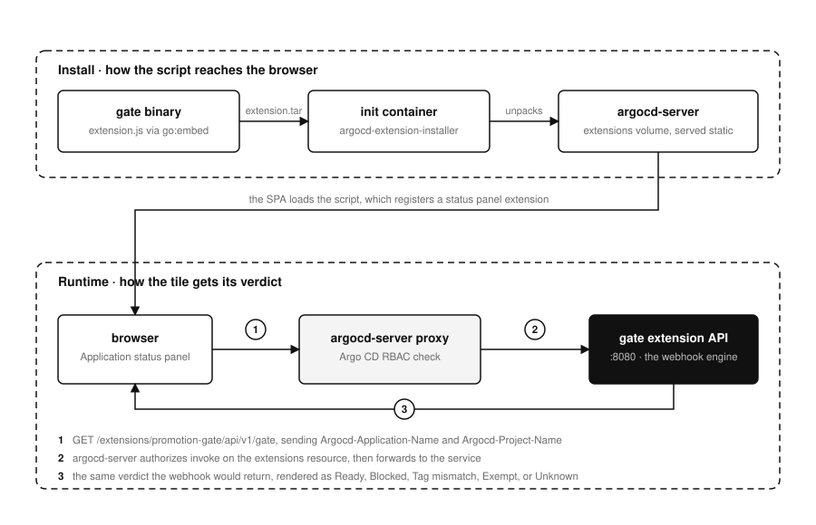

# UI extension

## Overview

What the panel shows, why it is JavaScript rather than Go, and the four pieces of argocd-server configuration it needs. The wiring is the bulk of it.

For Argo CD operators adding the panel to an existing install.

The panel is optional. The gate enforces with or without it. What the panel adds is seeing the verdict on the Application page instead of discovering it in an error toast after pressing Sync.



## What it renders

A tile in the Application status panel:

| Verdict | Tile |
| --- | --- |
| Every check passed | `Ready`, green |
| Upstream not `Synced` or not `Healthy` | `Blocked`, red, naming the upstream app and its status |
| Tag mismatch, `mode: enforce` | `Tag mismatch`, red, with a per-repository desired against upstream table |
| Tag mismatch, `mode: warn` | `Tag mismatch (warn)`, amber, same table |
| No upstream counterpart | `No upstream`, muted |
| Skip annotation present | `Exempt`, muted |
| A lookup failed | `Unknown`, amber, with the reason |
| Environment is not gated | nothing at all |

Ungated environments render no tile on purpose. A permanent "not gated" badge on the majority of Applications is noise.

## Why the script is a script

Argo CD's extension contract is browser side only. argocd-server serves static files from its extensions directory, the SPA loads them, and each script registers a React component through `window.extensionsAPI`. There is no server side plugin ABI, so no amount of Go can render into that page. The only real choice is how the JavaScript is produced, not whether it exists.

This one is hand written against the `window.React` that Argo CD already exposes, so there is no build step, no bundler, and no 5 MB bundle. It lives at `internal/uiextension/extension.js` and is compiled into the gate binary with `go:embed`.

Embedding it is the reason the panel cannot go stale. The usual pattern publishes the frontend as a separate release artifact, which means a cluster can run an old script against a newer API. Here the script and the API it calls are the same build by construction.

## How it gets the verdict

The extension does not re-implement the rules. It calls `/extensions/<name>/api/v1/gate`, which argocd-server proxies to this service, and renders whatever comes back. The webhook answers from the same engine, so the panel and the denial cannot drift apart.

One detail is easy to get backwards. argocd-server does not add the application headers on the way through: it requires the caller to send `Argocd-Application-Name` as `<namespace>:<name>`, uses it to authorize the request against Argo CD RBAC, and answers `Invalid headers` in plain text when it is missing. The extension therefore sends it, along with `Argocd-Project-Name`, from the application it is rendering. A caller that omits them gets a 400 rather than a verdict.

## Wiring it into argocd-server

Three pieces: enable proxy extensions, register the backend, and get the script onto argocd-server's disk.

### 1. Enable proxy extensions

```yaml
# argo-cd chart values
server:
  env:
    - name: ARGOCD_SERVER_ENABLE_PROXY_EXTENSION
      value: "true"
```

### 2. Register the backend

```yaml
configs:
  cm:
    extension.config: |
      extensions:
        - name: promotion-gate
          backend:
            services:
              - url: http://argocd-promotion-gate.argocd.svc.cluster.local:8080
```

The `name` here is the path segment, so `promotion-gate` makes argocd-server proxy `/extensions/promotion-gate/*`. It has to match `uiExtension.name` in this chart, which is what gets substituted into the script.

### 3. Deliver the script

The gate serves the script as a tarball in the layout `argocd-extension-installer` expects, so the standard installer image does the work and nothing new has to be introduced into argocd-server's pod:

```yaml
server:
  initContainers:
    - name: promotion-gate-extension
      image: quay.io/argoprojlabs/argocd-extension-installer:v1.0.1
      env:
        - name: EXTENSION_URL
          value: http://argocd-promotion-gate.argocd.svc.cluster.local:8080/api/v1/extension.tar
      volumeMounts:
        - name: extensions
          mountPath: /tmp/extensions/
```

If argocd-server already runs an installer init container for another extension, add this one alongside it. Both unpack into separate directories under the shared `extensions` volume and do not conflict.

One ordering caveat: the init container fetches from the gate, so argocd-server cannot finish starting until the gate is serving. That is acceptable in one direction only, and it is the harmless one, because the gate does not depend on argocd-server to start.

**Alternative without the network dependency.** The gate binary can write the file itself, which suits clusters that would rather not have argocd-server reach out during startup:

```yaml
server:
  initContainers:
    - name: promotion-gate-extension
      image: ghcr.io/younsl/argocd-promotion-gate:0.1.0
      args:
        - install-extension
        - --dest=/tmp/extensions
        - --extension-name=promotion-gate
      volumeMounts:
        - name: extensions
          mountPath: /tmp/extensions/
```

The trade is that argocd-server's pod now pulls the gate image. Pick whichever fits how the cluster handles image access.

### 4. Grant the UI access to the extension

Argo CD gates proxy extensions through its own RBAC. Users need `invoke` on the `extensions` resource:

```yaml
configs:
  rbac:
    policy.csv: |
      p, role:readonly, extensions, invoke, promotion-gate, allow
```

Adjust the role to whichever one your users actually hold. Without it the panel renders `Unavailable` with a permission error, which is the intended behaviour, because a misconfigured extension should be visible rather than silently blank.

## Verifying

```bash
# what the gate would serve
kubectl -n argocd port-forward svc/argocd-promotion-gate 8080
curl -s localhost:8080/api/v1/extension.js | head -20
curl -s localhost:8080/api/v1/extension.tar | tar -t

# what argocd-server actually loaded
kubectl -n argocd exec deploy/argocd-server -c server -- \
  find /tmp/extensions -name '*.js'
```

Reaching the endpoint by hand needs both the session cookie and the headers:

```bash
TOKEN=$(curl -s localhost:8080/api/v1/session -H 'Content-Type: application/json' \
  -d '{"username":"admin","password":"..."}' | jq -r .token)

curl -s localhost:8080/extensions/promotion-gate/api/v1/gate \
  --cookie "argocd.token=${TOKEN}" \
  -H 'Argocd-Application-Name: argocd:prod-payment-api' \
  -H 'Argocd-Project-Name: prod' | jq
```

Then open any gated Application. If the tile says `Unavailable` the message names the cause: a 400 about headers means the request reached the proxy without them, a 404 means the proxy registration is missing, a 403 means Argo CD RBAC, and a connection error means the service name or port is wrong.

## Editing the script

Edit `internal/uiextension/extension.js` and rebuild the binary. `__EXTENSION_NAME__` in that file is substituted at serve time from `--extension-name`, so the path is never hardcoded twice. Tests in `internal/uiextension` assert that the placeholder is gone and that `window.extensionsAPI.registerStatusPanelExtension` is still referenced, which is the whole contract with Argo CD and otherwise fails silently.
