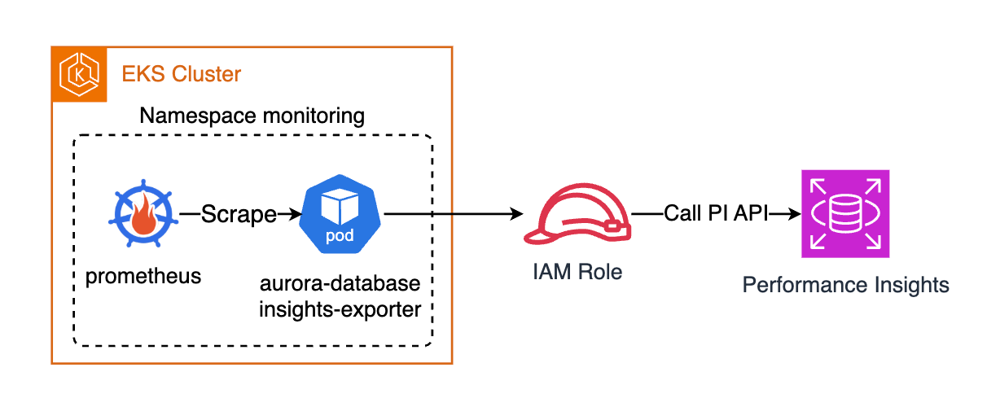

# aurora-database-insights-exporter

[](https://github.com/younsl/o/pkgs/container/aurora-database-insights-exporter)
[](https://github.com/younsl/o/pkgs/container/charts%2Faurora-database-insights-exporter)
[](https://www.rust-lang.org/)
[](https://github.com/younsl/o/blob/main/LICENSE)

Prometheus exporter for AWS Aurora MySQL/PostgreSQL [Database Insights](https://docs.aws.amazon.com/AmazonRDS/latest/AuroraUserGuide/USER_PerfInsights.html) (Performance Insights) metrics.

## Overview

Focused on **DB Load analysis**: which wait events cause bottlenecks, which SQL statements consume the most active sessions, and how load distributes across users, hosts, and databases. Unlike generic PI exporters that collect all available OS/DB counters, this exporter is purpose-built for diagnosing Aurora performance issues through DB Load breakdown.



## Features

- **Auto-discovery**: Discovers Aurora instances via `rds:DescribeDBInstances`
- **DB Load breakdown**: Wait events, Top SQL, per-user, per-host
- **Exported tags**: AWS tags as Prometheus labels (YACE-style `exported_tags`)
- **Background collection**: Cached metrics, no API calls during scrape
- **Cycle reset**: Dynamic labels reset every collection cycle to prevent cardinality explosion
- **Leader election**: Kubernetes Lease-based, seamless by default
- **K8s native**: Helm chart with ServiceMonitor, IRSA/EKS Pod Identity support

## Documentation

- [Configuration](docs/configuration.md) — Config file, CLI flags, IAM permissions
- [Metrics](docs/metrics.md) — Metric list, label structure, cardinality estimate
- [Helm](docs/helm.md) — Chart installation and OCI registry usage
- [Comparison](docs/comparison.md) — Differences from mysqld_exporter

## Development

```bash
make build     # Debug build
make test      # Run tests
make lint      # Clippy
make coverage  # llvm-cov report
make release   # Release build
```

## Related

- [awslabs/prometheus-cloudwatch-database-insights-exporter](https://github.com/awslabs/prometheus-cloudwatch-database-insights-exporter) — AWS official exporter (Go, all PI metrics)
- [qonto/prometheus-rds-exporter](https://github.com/qonto/prometheus-rds-exporter) — RDS CloudWatch metrics exporter
