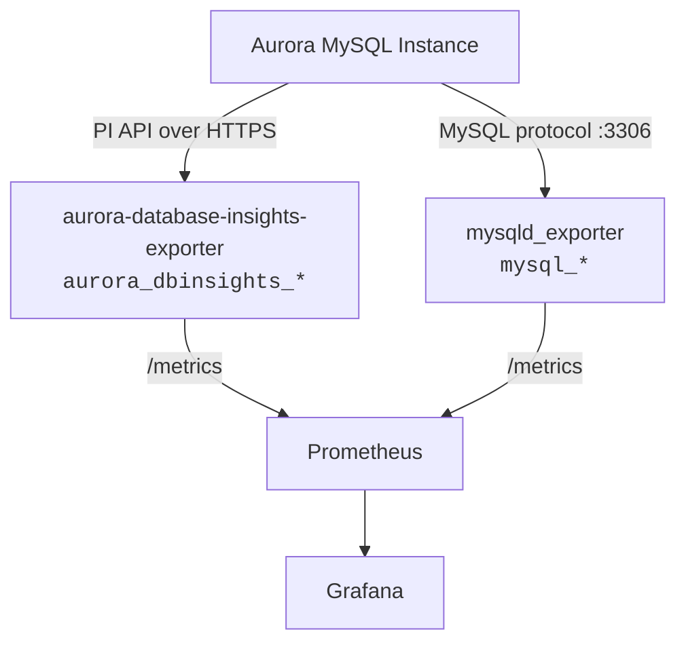

# Comparison with mysqld_exporter

aurora-database-insights-exporter and [mysqld_exporter](https://github.com/prometheus/mysqld_exporter) are complementary tools with no metric overlap. They collect data from fundamentally different sources.

## Data source

| | aurora-database-insights-exporter | mysqld_exporter |
|---|---|---|
| Data source | AWS Performance Insights API (HTTPS) | MySQL server (SQL queries via port 3306) |
| Protocol | AWS SDK over HTTPS | MySQL protocol |
| Authentication | IAM (IRSA / EKS Pod Identity) | MySQL user/password |
| Perspective | "What is causing load and who is waiting" | "What is the internal state of MySQL" |

## Metric coverage

| Metric area | aurora-database-insights-exporter | mysqld_exporter |
|-------------|---|---|
| DB Load (AAS) | O | — |
| Wait events (CPU, IO, Lock) | O | — |
| Top SQL by load | O | — |
| Load by client host | O | — |
| Load by database user | O | — |
| Load by database schema | O | — |
| Connections | — | O (`mysql_global_status_threads_connected`) |
| QPS / Queries | — | O (`mysql_global_status_queries`) |
| InnoDB buffer pool | — | O (`mysql_global_status_innodb_buffer_pool_*`) |
| Replication lag | — | O (`mysql_slave_status_seconds_behind_master`) |
| Table locks | — | O (`mysql_global_status_table_locks_*`) |
| Slow queries | — | O (`mysql_global_status_slow_queries`) |
| Process list | — | O (`mysql_info_schema_processlist_*`) |

## When to use which

| Scenario | Recommended tool |
|----------|-----------------|
| DB Load spike — identify which SQL or wait event | aurora-database-insights-exporter |
| Connection pool exhaustion | mysqld_exporter |
| InnoDB buffer pool hit ratio degradation | mysqld_exporter |
| Replication lag monitoring | mysqld_exporter |
| Identify which app server is generating load | aurora-database-insights-exporter |
| Identify which database schema is under pressure | aurora-database-insights-exporter |
| Query-level performance trend (Top SQL over time) | aurora-database-insights-exporter |

## Architecture

Both exporters can run side by side in the same Kubernetes cluster. They scrape independently and expose separate metric namespaces (`aurora_dbinsights_*` vs `mysql_*`).

## Conclusion

Two exporters answer different questions. Use both together for full observability.

- **aurora-database-insights-exporter** answers "why is the database slow" by breaking down DB Load into wait events, top SQL, users, hosts, and schemas.
- **mysqld_exporter** answers "what is the database doing" by exposing internal counters like connections, QPS, buffer pool, and replication lag.

Neither replaces the other. aurora-database-insights-exporter identifies the cause of slowness through the AWS Performance Insights API. mysqld_exporter tracks the operational state by querying MySQL directly. Together they provide complete Aurora MySQL observability.
