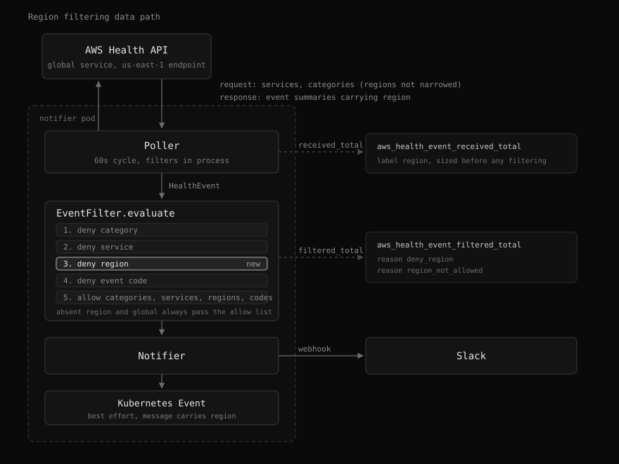

# Region filtering

Status: proposed. Target: 0.3.0.

## Summary

Add `allowRegions` / `denyRegions` to the event filter so an operator can drop
AWS Health events whose `region` is outside the regions the account actually
runs in. Today the filter matches on category, service, and
`SERVICE/EVENT_TYPE_CODE` only, so an event that concerns a region we do not
use can be silenced only by denying its event type code in every region, or its
service outright.

The concrete case that motivated this: `AWS_DIRECTCONNECT_OPERATIONAL_ISSUE`
for the Equinix FR5, Frankfurt location fired repeatedly in `eu-central-1`.
The account has no workload there, but the only way to stop the alarm was
`denyEventCodes: [DIRECTCONNECT/AWS_DIRECTCONNECT_OPERATIONAL_ISSUE]`, which
also silences the same event in `ap-northeast-2`, where a Direct Connect
outage is a real incident.

## Goals

- Drop events by region with the same allow/deny semantics the other filter
  lists already use: empty allow means allow everything, deny wins over allow.
- Push the allow list to the AWS Health API as a server-side filter, the way
  services and categories are already pushed, so events from unused regions are
  never fetched.
- Never lose an event because its region is unknown. An event with no region
  must not be dropped by an allow list.
- Keep global-scope events (`region: global`) reachable without forcing every
  operator to remember to list `global`.
- Validate configured regions at startup, consistent with how unknown service
  codes and event type codes abort startup today.

## Non-goals

- Filtering by affected entity region or by resource ARN. The filter stays at
  event granularity, matching `DescribeEvents`.
- Per-region routing, such as sending `eu-central-1` events to a different
  Slack channel. This design only drops.
- Deriving the allowed regions automatically from what the account uses. The
  operator declares them.

## Background

### Current filter

`src/filter.rs` holds six lists and nothing else:

```
allow_categories  deny_categories
allow_services    deny_services
allow_event_codes deny_event_codes
```

`EventFilter::evaluate` reads exactly three fields off the event:
`detail.event_type_category`, `detail.service`, `detail.event_type_code`.
Order is deny-category, deny-service, deny-event-code, then the three allow
checks. The outcome is a `FilterDecision`, whose `reason()` string becomes the
`reason` label on `aws_health_event_filtered_total`.

### Region is already carried, just never consulted

`HealthEvent.region` exists (`src/health.rs:6`) and is populated from the API
response (`src/aws/health.rs:215-217`). Its only consumers are presentational
or observational:

- `src/slack/formatter.rs:47` renders it as the Slack `Region` field.
- `src/k8s/event.rs:70-71` appends `" in {region}"` to the Kubernetes Event
  message.
- `src/observability/metrics.rs:118` uses it as the `region` label on
  `aws_health_event_received_total`.

`minimal_event` in `src/poller.rs:309` already copies `region` from the
summary, so the reminder path (`src/poller.rs:273`) can filter on region
without an extra `DescribeEventDetails` call.

Adding region filtering is therefore a change to the filter and its wiring, not
to the event model.

### Server-side filtering is available

`aws_sdk_health::types::EventFilter` carries a `regions` field, and its builder
exposes an append-style `regions(impl Into<String>)` setter, the same shape as
the `services` setter already used in `list_events` and `list_upcoming`. The
current code passes only services and categories, so region narrowing is a
matter of one more loop over the configured list.

Server-side narrowing is an allow-list-only mechanism. The API has no "exclude
these regions" input, so a deny list must be evaluated in process, exactly as
`denyServices` is today.

## Architecture



The allow list is applied twice. `DescribeEvents` carries it as a server-side
narrowing, so events from unused regions are never fetched, and
`EventFilter.evaluate` applies it again in process, where the deny list also
lives because the API has no exclusion input. The in-process check is the
enforcement point; the server-side one only saves work.

## Semantics

### Matching

Region strings are matched case-insensitively after trimming, the same
normalization `normalize()` applies to services and categories. AWS emits
lowercase region codes (`ap-northeast-2`, `eu-central-1`), so this only guards
against operator typing.

### Evaluation order

Region checks sit between the service checks and the event-code checks, so that
a more specific `SERVICE/EVENT_TYPE_CODE` deny still reads as the most targeted
rule:

```
deny_category -> deny_service -> deny_region -> deny_event_code
  -> allow_categories -> allow_services -> allow_regions -> allow_event_codes
```

Two new `FilterDecision` variants and their `reason()` strings:

| Variant | reason | Meaning |
|---------|--------|---------|
| `DenyRegion` | `deny_region` | Event region appears in `deny_regions`. |
| `NotInAllowedRegions` | `region_not_allowed` | `allow_regions` is non-empty and the event region is not in it. |

Both become new values of the `reason` label on
`aws_health_event_filtered_total` and must be added to the label-values list in
`docs/metrics.md`.

### Missing region

`HealthEvent.region` is `Option<String>`, and the field can also arrive as an
empty string. An event with no region is **allowed** by both lists:

- The deny path already behaves this way for event codes. `matches()` returns
  false on an empty code, which is what
  `missing_event_code_passes_deny_list` asserts. Region matching mirrors it.
- The allow path is the one that needs an explicit rule. `contains_ci` returns
  false for an empty needle, so a naive `!allow_regions.is_empty() &&
  !contains_ci(...)` would silently drop every region-less event the moment an
  operator sets an allow list. The check must therefore be skipped when the
  region is absent or empty.

The failure mode being avoided is losing a real event because AWS omitted a
field, which is worse than delivering one extra notification.

### Global events

AWS Health reports global-scope events with the region `global`. Under a strict
allow list such as `[ap-northeast-2]`, those would all disappear, which is a
silent and hard-to-notice loss for services like IAM, Route 53, CloudFront, and
Health itself.

`global` is therefore treated as always allowed: it is appended to the
effective allow list rather than required from the operator. It stays deniable,
so an operator who genuinely wants global events gone can list `global` in
`denyRegions`.

Both the in-process allow list and the server-side `regions` narrowing must
include `global`, otherwise `DescribeEvents` would never return the events the
in-process rule intends to keep.

## Configuration

### Environment

Two new variables on `RunArgs` in `src/config.rs`, following the existing
pattern exactly:

```rust
/// Comma-separated AWS region codes to allow (case-insensitive).
/// Empty = allow all. `global` is always allowed.
#[arg(long, env = "ALLOW_REGIONS", value_delimiter = ',', num_args = 0..)]
pub allow_regions: Vec<String>,

/// Comma-separated AWS region codes to deny (wins over allow).
#[arg(long, env = "DENY_REGIONS", value_delimiter = ',', num_args = 0..)]
pub deny_regions: Vec<String>,
```

### Chart

`filter.allowRegions` and `filter.denyRegions` in `values.yaml`, rendered into
the existing `<fullname>-filter` ConfigMap by
`templates/configmap.yaml`, which already gates every key behind `with` so an
empty list emits nothing:

```yaml
{{- with .Values.filter.allowRegions }}
ALLOW_REGIONS: {{ join "," . | quote }}
{{- end }}
{{- with .Values.filter.denyRegions }}
DENY_REGIONS: {{ join "," . | quote }}
{{- end }}
```

The deployment's checksum annotation over that ConfigMap already rolls the pods
when the filter changes, so no extra wiring is needed.

The motivating case then becomes:

```yaml
filter:
  allowRegions:
    - ap-northeast-2
  denyEventCodes:
    - EC2/AWS_EC2_OPERATIONAL_ISSUE
    - VPN/AWS_VPN_REDUNDANCY_LOSS
    - ES/AWS_ES_SERVICE_SOFTWARE_UPDATE_AVAILABLE
```

`DIRECTCONNECT/AWS_DIRECTCONNECT_OPERATIONAL_ISSUE` leaves the deny list. A
Frankfurt outage is dropped on region; a Seoul outage still pages.

## Server-side narrowing

`list_events` and `list_upcoming` in `src/aws/health.rs` gain a `regions`
parameter alongside `services` and `categories`, populated from
`PollerCfg`, and pass it through:

```rust
for r in regions.iter().filter(|r| !r.is_empty()) {
    builder = builder.regions(r.clone());
}
```

`PollerCfg` gains a `regions: Vec<String>` field, set to the allow list plus
`global` when the allow list is non-empty, and left empty otherwise. The
existing `services` and `categories` fields are populated the same way from
their allow lists, so this follows the established convention.

Narrowing server-side is an optimization, not the enforcement point. The
in-process check stays authoritative, which keeps the deny list meaningful and
keeps behaviour identical if a future call site forgets to pass the regions
through.

## Startup validation

`validate_filters` and `ValidationReport` in `src/filter.rs` gain
`allow_regions` / `deny_regions` entries, and `all_invalid()` reports them as
`allow_regions '<value>'` and `deny_regions '<value>'`.

Regions cannot be validated the way services and event codes are.
`DescribeEventTypes`, which backs `lookup_service_codes` and
`lookup_event_type_codes`, returns no region catalog. Two options:

1. **Shape validation.** Accept anything matching the AWS region-code shape
   (`^[a-z]{2}(-[a-z]+)+-\d$`) plus the literal `global`. Catches typos such as
   `ap-northeast2` and `eu_central_1`, accepts regions that do not exist yet
   without a release.
2. **Static list.** Ship the known region codes as a constant. Catches
   `ap-northeast-9`, but goes stale on every new region launch and turns a
   correct configuration into a crash loop.

Option 1 is chosen. A wrong-but-well-formed region is an over-filter the
operator can see in `aws_health_event_filtered_total{reason="region_not_allowed"}`,
whereas a stale static list is a startup failure with no workaround short of a
new image.

Validation failure keeps the current behaviour: log the invalid values and
abort startup from `validate_against_catalog` in `src/server.rs`.

## Observability

- Two new `reason` values on `aws_health_event_filtered_total`, documented in
  `docs/metrics.md`.
- The startup `"filter validation result"` log line gains the region lists,
  matching the existing per-list valid/invalid count pairs.
- No new metric. `aws_health_event_received_total` already carries a `region`
  label, so the events a new allow list would drop can be measured before the
  list is turned on:

```promql
sum by (region) (increase(aws_health_event_received_total[7d]))
```

Running that query first is the recommended way to pick an allow list, rather
than reasoning about which regions the account "should" be using.

## Testing

Unit tests in `src/filter.rs`, mirroring the existing event-code cases:

- Empty region lists allow everything, including an event with no region.
- `denyRegions` drops a matching region, keeps the others.
- `allowRegions` drops a non-listed region, keeps a listed one.
- Deny wins over allow for the same region.
- Region matching is case-insensitive.
- An event with `region: None` and an event with `region: Some("")` both pass a
  non-empty allow list.
- `global` passes a non-empty allow list that omits it, and is dropped when it
  appears in the deny list.
- Region and event-code rules compose: the same event code is delivered in one
  region and dropped in another.

In `src/poller.rs`, extend the reminder-path test alongside
`minimal_event_carries_event_code_for_filtering` to assert the summary's region
reaches the filter, so reminders cannot bypass a region rule.

Validation tests in `src/filter.rs` alongside `validate_flags_unknown_event_code`:
well-formed regions pass, malformed ones are reported per list, `global` is
accepted.

## Migration

Additive and backward compatible. Both lists default to empty, which is
allow-all, so an existing deployment behaves identically until an operator sets
one. Removing an event code from `denyEventCodes` in favour of a region rule is
a separate, deliberate change on the deployment side.

## Open questions

- Should `global` be silently appended to the allow list, or should an operator
  who omits it get a startup warning that global events will still arrive? A
  warning is more honest but adds noise to every deployment that never thinks
  about global events.
- Is an `allowRegions` entry that never matches anything over a long window
  worth surfacing, for example as a startup log line listing regions with no
  events seen? It would catch a region code that is well formed but wrong,
  which is exactly what shape validation cannot catch.
