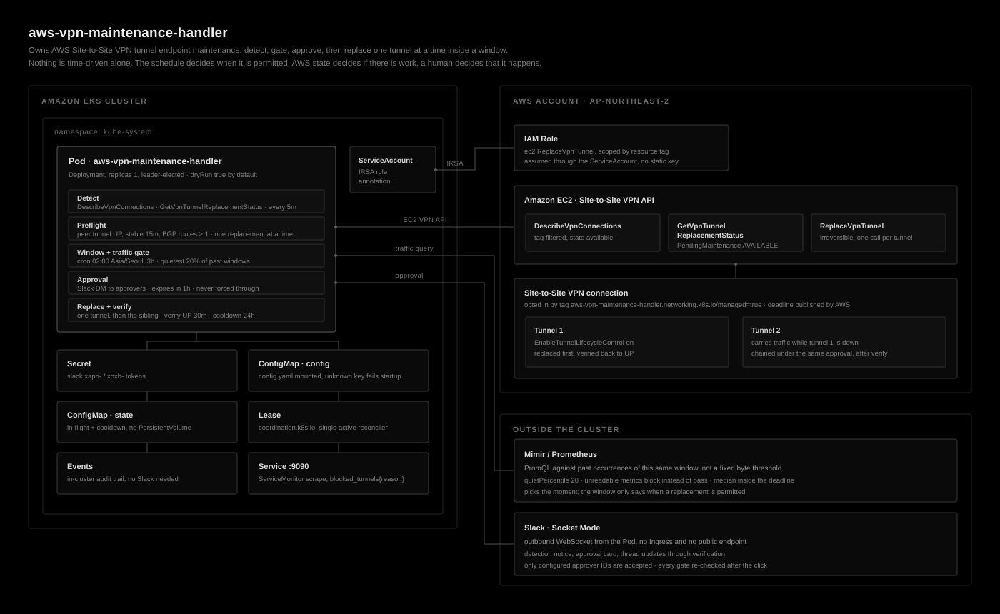

# aws-vpn-maintenance-handler

Takes ownership of AWS Site-to-Site VPN tunnel endpoint maintenance.

AWS queues endpoint replacements for each tunnel and, past a published deadline, applies
them itself at a time of its choosing. This controller applies them earlier: inside a
maintenance window, at a measured quiet moment of it, one tunnel at a time, after a Slack
approval, and only while the connection's other tunnel is verifiably carrying traffic. It then watches the tunnel
back to health and narrates every step into the approval thread.

`ReplaceVpnTunnel` cannot be undone, so the design is mostly about what has to be true
before it is called.

## Architecture



One Pod, leader-elected, holding its whole state in a ConfigMap. It reaches AWS through
IRSA, reads traffic from a Prometheus-compatible store, and talks to Slack over an
outbound WebSocket, so nothing has to reach into the cluster.

## How it decides

The schedule decides when a replacement is *permitted*. AWS state decides whether there
is anything to do. A human decides whether it happens.

| Gate | Rule |
| --- | --- |
| Lifecycle control | `EnableTunnelLifecycleControl` is on. Without it there is no API to replace the tunnel early |
| Pending maintenance | AWS reports `PendingMaintenance = AVAILABLE`. This is the trigger, not the clock |
| Connection | state is `available` and it has exactly two tunnels |
| Peer tunnel | UP, stable for `peerMinStableFor`, carrying `peerMinAcceptedRoutes` routes |
| Cooldown | no tunnel of this connection replaced within `perConnectionCooldown`, unless it is the sibling chained under the same approval |
| Serialization | no other replacement running, anywhere |
| Window | inside the cron window with enough left to verify in |
| Traffic | the metric store puts this moment inside the quietest `quietPercentile` of what the connection carries during this window |
| Approval | a configured approver clicked Approve in Slack |
| Re-check | every gate above still passes, re-measured immediately before the AWS call |

Two of these carry most of the weight. The peer route count exists because a tunnel that
is UP with no BGP routes still blackholes traffic, so IKE status alone proves nothing.
The cooldown exists because replacing both tunnels of one connection in quick succession
is the most direct way to turn routine maintenance into an outage.

Full walkthrough with the failure paths: [docs/process.md](./docs/process.md).

## Traffic-aware timing

Set the window; the moment inside it is measured. The controller asks Prometheus or Mimir
where the present moment sits in the traffic this connection carries during past
occurrences of that same window, and proposes the replacement once it is inside the
quietest `quietPercentile` of it.

```yaml
trafficGate:
  enabled: true
  endpoint: https://mimir.example.com/prometheus
  quietPercentile: 20
```

That is the only threshold, and it is a percentile rather than a byte figure or a ratio
because a percentile needs nothing known about the connection in advance. A busy VPN and
an idle one both have a quietest fifth of their own history, so no baseline has to be
measured by hand, and a connection whose traffic grows tenfold does not turn the gate
into a permanent block.

Restricting the comparison to window instants is what makes it answer the right question.
A midday moment compared against a distribution that includes every night is being judged
against sleeping hours, and no percentile of that mixture is reached during business
hours. For the same reason "now" is the peak of the last 15 minutes rather than the latest
sample: a transfer that started three minutes ago is traffic the replacement would
interrupt. Nothing scraped in those 15 minutes counts as a silent exporter, not an idle
tunnel.

No PromQL required: it probes for a known VPN traffic metric, in both directions where the
exporter publishes them, and picks the convention that has data. Which metric is correct
depends on the exporter a cluster runs, and a query written by hand silently stops
matching when the exporter is swapped.

While the gate holds, the verdict names the clock time the window is habitually calmest
at, so waiting has an expected end rather than being open-ended. Inside
`safety.escalateBefore` the target relaxes to the median: holding out for the quietest
fifth stops being the safer choice when the alternative is AWS picking the moment.

Details, the profile list, and the metrics to watch: [docs/metrics.md](./docs/metrics.md).

## Approval over Socket Mode

Approvals arrive on an outbound WebSocket the Pod opens to Slack. No Ingress, no load
balancer, no publicly reachable endpoint. The card states both tunnels, the peer's route
count and stability, the measured traffic, the AWS deadline, and what happens if nobody
responds. Approve carries a confirmation dialog, since the call is irreversible and the
button sits in a phone notification.

Not answering is a valid outcome: the request expires, the tunnel is left alone, and it
is proposed again in a later window. As the AWS deadline approaches the card is reposted
with raised severity, but the controller never forces a replacement through, because
forcing one outside the window would defeat the point of owning the schedule.

A card is also withdrawn early if its preconditions lapse while it waits, most often the
window running out of room to start and verify a replacement. A live button is one that
would still work; approving a card whose conditions have already changed would only abort
in the re-check, which reads as a button that did nothing.

Every message, cards and thread replies alike, begins with its level and the VPN
connection it concerns: `[WARN] VPN connection prod-dc (vpn-0123456789abcdef0). ...`. Levels are
`ACTION`, `INFO`, `SUCCESS`, `WARN`, `ERROR`, and `CRITICAL`. Both survive a
notification preview and a screenshot, neither of which carries a colour or an icon
reliably, and a reply read on its own still says which VPN it is about. See
[docs/process.md](./docs/process.md#message-levels).

Once an approval is given, every reply also ends with a progress footer on its own line,
counted over the whole approved run rather than one tunnel:

```
Progress: 3/8 (38%)
```

See [docs/slack-messages.md](./docs/slack-messages.md#progress-footer).

Every message the controller can send, with worked examples per scenario:
[docs/slack-messages.md](./docs/slack-messages.md).

## One approval per connection

Approving covers the VPN connection, not one of its tunnels. If both tunnels have
maintenance queued, one approval replaces them in sequence, and the whole run reports
into the same thread.

The card states that order before anyone clicks, each step is announced in the thread as
`Step 2 of 2`, and every reply carries the run-wide progress footer, so the first tunnel
finishing reads as `4/8 (50%)` and not as a completed run.

The run closes with one line for the whole approval, timed from the click:

```
*Run complete.* All 2 tunnel(s) of this connection are done. The whole run took 27m 30s.
```

That total is the only one that includes the wait between tunnels, which is usually the
larger part of a chain: 27m 30s is typically 8m of replacement and 19m of waiting for the
freshly replaced tunnel to become a peer worth failing over to. A chain that stopped
short says so instead, with what it left behind.

Never two at once: the next tunnel waits until the one just replaced is UP, carrying
routes, and stable for `peerMinStableFor`, since that is the tunnel traffic rides while
its sibling is down. Every preflight rule is re-applied at each step, so a closing window
or a peer that does not come back stops the chain and leaves the rest for later rather
than pressing on.

The traffic gate is the exception. It decides whether a connection is touched at all, not
whether a connection already half-replaced is finished, so a run in progress continues
through a busy moment and says so in the thread. The peer check is what keeps the step
non-disruptive, and it still has to pass.

Set `safety.chainSiblingTunnel: false` to go back to one tunnel per approval, a day apart.

## Restarts without a PersistentVolume

Everything that must survive a restart lives in a ConfigMap: the in-flight replacement,
the per-connection cooldown, and which maintenance the approvers have already been told
about. A controller that restarts mid-replacement resumes verification rather than
issuing a second call, an outstanding approval is adopted with its original Slack thread,
so the approver is not left with two cards where only one works, and a rollout does not
re-announce maintenance that was announced before it.

One replacement at a time holds across passes, replicas, and restarts, enforced by an
in-process flag, the leader Lease, and that ConfigMap. A rollout crosses all three.

## Prerequisites

1. **Tunnel endpoint lifecycle control** on every tunnel to be managed:

   ```bash
   aws ec2 modify-vpn-tunnel-options \
     --vpn-connection-id vpn-0123456789abcdef0 \
     --vpn-tunnel-outside-ip-address 203.0.113.10 \
     --enable-tunnel-lifecycle-control
   ```

2. **IRSA role** on the ServiceAccount:

   Split into three statements so the one mutating action is visible on its own. A
   single merged statement hides the fact that exactly one of these can take a tunnel
   down.

   ```json
   {
     "Version": "2012-10-17",
     "Statement": [
       {
         "Sid": "DiscoverManagedVpnConnections",
         "Effect": "Allow",
         "Action": "ec2:DescribeVpnConnections",
         "Resource": "*"
       },
       {
         "Sid": "ReadTunnelMaintenanceStatus",
         "Effect": "Allow",
         "Action": "ec2:GetVpnTunnelReplacementStatus",
         "Resource": "*"
       },
       {
         "Sid": "ReplaceTunnelEndpointOnMaintenance",
         "Effect": "Allow",
         "Action": "ec2:ReplaceVpnTunnel",
         "Resource": "*"
       },
       {
         "Sid": "NameGatewaysOnTheApprovalCard",
         "Effect": "Allow",
         "Action": [
           "ec2:DescribeTransitGateways",
           "ec2:DescribeVpnGateways",
           "ec2:DescribeCustomerGateways"
         ],
         "Resource": "*"
       }
     ]
   }
   ```

   | Sid | Why it is needed | Mutating |
   | --- | --- | --- |
   | `DiscoverManagedVpnConnections` | Finds tag-matched connections and reads `VgwTelemetry`, which is where the peer's UP status and route count come from | no |
   | `ReadTunnelMaintenanceStatus` | Reads `PendingMaintenance` and the AWS auto-apply deadline. This is the trigger for everything | no |
   | `ReplaceTunnelEndpointOnMaintenance` | The single irreversible call. Also covers the `DryRun` variant, so a dry-run deployment needs it too | **yes** |
   | `NameGatewaysOnTheApprovalCard` | Optional. Reads the gateways' Name tags so the card says `prod-tgw (tgw-0abc...)` instead of an ID alone | no |

   The last statement is the only optional one. `DescribeVpnConnections` returns the
   gateway IDs but not their tags, so without it the card still identifies every
   gateway, by ID. The names are read once per gateway per process and cached, so
   renaming a gateway shows up after the next restart.

   `Resource: "*"` on the two read statements is not laziness: EC2 `Describe*` actions
   do not support resource-level permissions.

   The mutating statement can be narrowed to the connections carrying the opt-in tag,
   which makes IAM enforce the same scope the controller already applies:

   ```json
   {
     "Sid": "ReplaceTunnelEndpointOnMaintenance",
     "Effect": "Allow",
     "Action": "ec2:ReplaceVpnTunnel",
     "Resource": "arn:aws:ec2:ap-northeast-2:123456789012:vpn-connection/*",
     "Condition": {
       "StringEquals": {
         "aws:ResourceTag/aws-vpn-maintenance-handler.networking.k8s.io/managed": "true"
       }
     }
   }
   ```

   Verify this against your account before relying on it, and keep `config.dryRun`
   enabled while you do: a dry run surfaces a missing permission as an explicit AWS
   rejection on the approval card instead of a failure discovered mid-replacement.

3. **Slack app** with Socket Mode enabled and two tokens.

   | Token | Scope | Needed for |
   | --- | --- | --- |
   | App-level (`xapp-`) | `connections:write` | The outbound Socket Mode WebSocket that carries button clicks |
   | Bot (`xoxb-`) | `chat:write` | Posting the approval card, thread replies, and the card rewrite |
   | Bot (`xoxb-`) | `im:write` | Opening the DM channel with each approver |
   | Bot (`xoxb-`) | `users:read` | Optional. Printing approver names at startup instead of bare user IDs |

   `users:read` is the only optional one. Without it the controller starts normally and
   logs the configured IDs unresolved, since a name is a label and the user ID is what
   authorizes a click. Grant it if you want the approver list to be reviewable by
   people rather than by opaque IDs.

4. **The opt-in tag** on every VPN connection the controller may touch. Untagged
   connections are never eligible, so creating a VPN cannot accidentally enroll it.

## Install

```bash
helm install aws-vpn-maintenance-handler \
  oci://ghcr.io/younsl/charts/aws-vpn-maintenance-handler \
  -n kube-system -f values.yaml
```

Minimum values:

```yaml
config:
  region: ap-northeast-2
  approval:
    slackUserIDs:
      - U0123456789
serviceAccount:
  annotations:
    eks.amazonaws.com/role-arn: arn:aws:iam::123456789012:role/aws-vpn-maintenance-handler
slack:
  existingSecret: aws-vpn-maintenance-handler-slack
```

`config.dryRun` defaults to **true**: approvals validate `ReplaceVpnTunnel` through the
AWS `DryRun` flag and nothing is replaced. Review a real approval card and its preflight
output in your environment before turning it off.

## Startup checks

The Pod refuses to become Ready unless it can actually do the job. A missing IAM
permission or an unreachable metric endpoint does not crash a running controller: it
turns every pass into a logged error or a permanently blocked candidate while the Pod
reports healthy, and AWS applies the maintenance itself at its own time. Checking at
startup turns that into a `CrashLoopBackOff`, which someone notices.

| Check | Call | On failure |
| --- | --- | --- |
| Credentials resolve | `sts:GetCallerIdentity` | Refuses to start. Neither IRSA nor EKS Pod Identity is providing credentials |
| Connections readable | `ec2:DescribeVpnConnections` | Refuses to start |
| Maintenance readable | `ec2:GetVpnTunnelReplacementStatus` on the first managed connection | Refuses to start |
| Slack bot token | `auth.test` | Refuses to start |
| Approver DMs | `conversations.open` | Refuses to start when no approver is reachable |
| Approver names | `users.info`, needs `users:read` | Warns and logs the bare user IDs |
| Gateway names | `ec2:Describe{TransitGateways,VpnGateways,CustomerGateways}` | Warns once and shows gateway IDs on the card |
| Metric endpoint | `vector(1)` against the query API | Refuses to start when `trafficGate.onError` is `block` |
| Traffic metric | profile detection plus the real query for the first managed connection | Same |

Two deliberate exceptions. Zero connections matching the tag filters is a warning, not
a failure: an account with nothing enrolled yet is legitimate, and the controller
re-discovers every pass. A traffic gate that cannot be verified while
`trafficGate.onError` is `allow` is also a warning, because that setting is already the
statement that an unavailable metric source must not stop maintenance.

`ec2:ReplaceVpnTunnel` is not probed. There is no way to test it that does not either
change something or depend on maintenance being queued at that moment, which is what
`config.dryRun` is for.

The logged identity is worth reading once after install: it is what distinguishes IRSA
from Pod Identity from a node role picked up by accident.

```
AWS access verified identity=arn:aws:sts::123456789012:assumed-role/aws-vpn-maintenance-handler/... managed_connections=3
Slack ready bot_user=vpn-maintenance dm_channels=2 approvers="younsl (U0123456789), oncall-network (U0987654321)"
```

The approver line needs `users:read`. Without that scope it degrades to
`approvers="U0123456789, U0987654321"`, which still starts but cannot be checked
against people.

## Logging

Every line the Pod writes is `slog`, on stdout, JSON by default and `text` when
`logFormat` says so. That includes the parts that would otherwise use their own
format: client-go goes through `klog.SetSlogLogger`, slack-go through a bridge into
the same logger, and a startup failure before the config is read uses the default
logger rather than a bare stderr write. One format means one log query.

```json
{"time":"2026-07-27T02:14:09.113Z","level":"WARN","msg":"replacement alert","vpn_connection":"prod-dc (vpn-0123456789abcdef0)","level":"WARN","message":"*Not replacing.* ..."}
```

The `validate` and `status` subcommands are the exception. They print tables to stdout
for a human running `kubectl exec`, and are not part of the Pod's log stream.

## Operating

Read-only view of what the controller would act on, without waiting for a window:

```bash
kubectl -n kube-system exec deploy/aws-vpn-maintenance-handler -- \
  /app/aws-vpn-maintenance-handler status
```

Validate a config change before it reaches a cluster:

```bash
make validate CONFIG=config.example.yaml
```

Persisted maintenance and approval state:

```bash
kubectl -n kube-system get configmap aws-vpn-maintenance-handler-state -o yaml
```

In-cluster audit trail of past replacements:

```bash
kubectl -n kube-system get events --field-selector reportingComponent=aws-vpn-maintenance-handler
```

## Development

```bash
make            # fmt, vet, test, build
make coverage   # fails below 70% line coverage
make docs       # regenerate the chart README via helm-docs
```

The chart README is generated by helm-docs and will be overwritten; edit
`charts/aws-vpn-maintenance-handler/values.yaml` instead.
