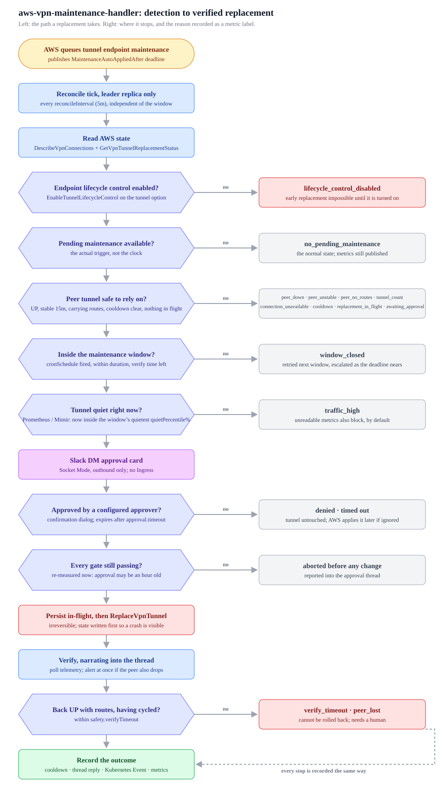

# Replacement process

End to end, from the moment AWS queues tunnel endpoint maintenance to a verified
replacement. Nothing here is time-driven on its own: the schedule decides when a
replacement is *permitted*, AWS state decides whether there is anything to do, and a
human decides whether it happens.



## 0. Prerequisite: endpoint lifecycle control

`ReplaceVpnTunnel` only works on a tunnel with `EnableTunnelLifecycleControl` set.
Without it, AWS applies endpoint maintenance on its own schedule and there is no API
to trigger it early, so the tunnel is permanently ineligible.

```bash
aws ec2 modify-vpn-tunnel-options \
  --vpn-connection-id vpn-0123456789abcdef0 \
  --vpn-tunnel-outside-ip-address 203.0.113.10 \
  --enable-tunnel-lifecycle-control
```

The controller checks this first and reports it as `lifecycle_control_disabled` rather
than as "nothing to do", because AWS never advertises pending maintenance for such a
tunnel and the two states are otherwise indistinguishable.

Watch `aws_vpn_maintenance_handler_tunnel_lifecycle_control == 0` to find tunnels that were
never brought under control.

## 1. Detection

Every `reconcileInterval` (default 5m), on the leader replica only:

1. `DescribeVpnConnections` with the configured tag filters and `state=available`.
   Connections are opted in by tag, so a newly created VPN is never automatically in
   scope.
2. For each tunnel, `GetVpnTunnelReplacementStatus`. This is the authoritative source:
   a missed or filtered AWS Health notification cannot hide queued work.
3. Telemetry and maintenance state are published as metrics whether or not anything is
   actionable.

`PendingMaintenance = AVAILABLE` is the trigger. `MaintenanceAutoAppliedAfter` is the
deadline after which AWS applies the maintenance itself, at a time of its choosing.
Owning the maintenance means acting before that.

### The detection notice

Detection is where the approvers first hear about the work, not the window. The first
time a connection is seen with maintenance queued and is not being replaced, a notice
goes out as a DM to `approval.slackUserIDs`, listing every queued tunnel with its
deadline and the reason nothing is happening yet. It has no buttons; see
[slack-messages.md](./slack-messages.md#0-detection-notice) for the message.

One notice per connection, not per tunnel, because the approval that follows covers the
connection too. Two notices answered by one card would read as a message having been lost.

Sent once per maintenance cycle. The record is the `notices` map in the state ConfigMap,
keyed by the request IDs the notice covered, so restarts and leader handovers do not
re-announce it. A request ID contains the deadline, so work AWS queues later is a new key
and a new notice, as is a tunnel joining the queue after the first notice. Entries are
dropped once the pass no longer sees their maintenance queued.

It is not sent for a connection whose approval card is outstanding, one being replaced, or
one deferred only because another replacement is running. In all three the approvers are
already looking at that connection.

## 2. Preflight

A tunnel becomes a candidate only if every rule passes. Each rejection is recorded with
a stable reason, exposed as `aws_vpn_maintenance_handler_blocked_tunnels{reason}`.

| Reason | Rule |
| --- | --- |
| `lifecycle_control_disabled` | `EnableTunnelLifecycleControl` is on |
| `no_pending_maintenance` | AWS reports `PendingMaintenance = AVAILABLE` |
| `connection_unavailable` | connection state is `available` |
| `tunnel_count` | the connection reports exactly two tunnels |
| `peer_down` | the other tunnel is UP |
| `peer_unstable` | the other tunnel has held UP for `safety.peerMinStableFor` |
| `peer_no_routes` | the other tunnel accepts `safety.peerMinAcceptedRoutes` routes, skipped on static-routes-only connections |
| `cooldown` | no tunnel of this connection was replaced within `safety.perConnectionCooldown`, unless this is the sibling being chained under the same approval |
| `replacement_in_flight` | no other replacement is running |
| `awaiting_approval` | no approval for this tunnel is already outstanding |
| `window_closed` | inside the cron window with at least `minRemaining` left |
| `traffic_high` | the metric store says the tunnel is quiet enough |

Two of these deserve emphasis. `peer_no_routes` exists because a tunnel that is UP with
no BGP routes still blackholes traffic, so IKE status alone is not proof of a working
path. `cooldown` is what stops both tunnels of one connection being replaced back to
back, which is the most direct way to turn routine maintenance into an outage.

## 3. Window

The window is a cron schedule plus a duration: each firing of `cronSchedule` opens it
for `duration`. Cron alone only names instants.

```yaml
maintenanceWindow:
  timezone: Asia/Seoul
  cronSchedule: "0 2 * * 2,3,4"
  duration: "3h"
```

`minRemaining` refuses to *start* a replacement that could not finish verifying before
the window closes. It defaults to `safety.verifyTimeout`, which is the only value that
makes that guarantee, so it is normally left unset. A replacement already running is never aborted for the window: the
AWS call cannot be undone, so abandoning verification would only mean nobody is
watching.

## 4. Traffic gate

The window says when maintenance is permitted. It cannot know which moment inside it is
the safe one, so the gate asks Prometheus or Mimir where the present moment sits in the
traffic this connection normally carries *during that same window*.

```yaml
trafficGate:
  enabled: true
  endpoint: https://mimir.example.com/prometheus
  headers:
    X-Scope-OrgID: anonymous
  quietPercentile: 20
  onError: block
```

One number, and it is a percentile rather than a byte figure or a ratio. A busy VPN and
an idle one both have a quietest fifth of their own history, so nothing has to be
measured by hand first, and a connection whose traffic grows tenfold does not silently
turn the gate into a permanent block.

Restricting the distribution to window instants is what makes the percentile answer the
right question. A midday moment compared against a distribution that includes every
night is being judged against sleeping hours, and no percentile of that mixture is
reached while the office is awake.

The moment being judged is the highest value of the last 15 minutes, not the latest
sample: a transfer that started three minutes ago is traffic the replacement would
interrupt. Nothing scraped in those 15 minutes is treated as a broken exporter rather
than an idle tunnel, because a silent exporter otherwise reads as perfectly quiet.

No PromQL. On first use the controller probes for a known VPN traffic metric and picks
the exporter convention that has data, in both directions where the exporter publishes
them. Which query is correct depends on the exporter a cluster runs, not on anything an
operator should have to restate. See [metrics.md](./metrics.md) for the profile list and
the generated query.

While the gate holds, the verdict names the clock time this window is habitually
calmest at, taken as the median per five-minute slot, so waiting has an expected end
rather than being open-ended. Once the AWS auto-apply deadline is nearer than
`safety.escalateBefore`, the target relaxes to the median: holding out for the quietest
fifth stops being the safer choice when the alternative is AWS picking the moment.

`onError: block` is the default. An unreadable metric source, including no matching
metric and a window with too little history to hold a percentile, is not evidence that
the tunnel is quiet.

Candidates are evaluated in deadline order and the first one the gate clears is taken.
Being quiet is a permission, not a ranking: the tunnel AWS is closest to replacing on
its own still gets the window first.

## 5. Approval

The candidate is direct-messaged to every `approval.slackUserIDs` entry as a Block Kit
card carrying Approve and Deny buttons. The card states the connection, both tunnels,
the peer's route count and stability, the traffic gate verdict, the AWS deadline, and
what happens if nobody responds.

The card also states the replacement order, because approving covers the connection
rather than one tunnel. A one-tunnel approval says so explicitly, so the peer being
untouched is stated rather than inferred.

```
Replacement order
1. `203.0.113.10` starts now. Traffic rides `203.0.113.20` while it is down.
2. `203.0.113.20` starts only once `203.0.113.10` is back UP, carrying routes, and has held steady for 5m0s.
Never two at once. Any step that would be unsafe stops the rest and leaves them for a later window.
```

Each step is announced in the thread as `*Step 2 of 2.*` so a reply read on its own
places itself in that order.

Clicks arrive over Socket Mode, an outbound WebSocket the Pod opens to Slack. No
Ingress, load balancer, or public endpoint is involved. Approve carries a confirmation
dialog, because the underlying call is irreversible and the button sits in a phone
notification where a mis-tap is easy.

A click is only honored when it comes from a configured approver and names a request
that is genuinely outstanding, so a forwarded card cannot authorize anything.

Not answering is a valid outcome: the request expires after `approval.timeout`, the
tunnel is left alone, and it is proposed again in a later window. As the AWS deadline
approaches within `safety.escalateBefore`, the card is posted with raised severity. The
controller never forces a replacement through, because forcing one outside the window
would defeat the point of owning the schedule.

A card can also stop being answerable before anyone answers it. Every 30 seconds the
preflight rules are re-applied to the outstanding request, and the card is withdrawn once
no click could still succeed:

| What the re-check finds | What happens |
| --- | --- |
| The connection, its telemetry, the state, or the metric source could not be read | Nothing. That is the controller's failure, not a changed condition, so an outage does not consume an approval nobody was given the chance to answer |
| A block that cannot clear, such as the window having no room left to start, the cooldown now applying, or AWS having withdrawn or applied the maintenance itself | The card is withdrawn immediately |
| A block that can clear, such as the peer being DOWN or traffic no longer being quiet | The card is withdrawn only once clearing it could no longer be followed by a verified replacement, which is `safety.peerMinStableFor` plus `safety.verifyTimeout` for a peer and `safety.verifyTimeout` for traffic |

Traffic is only measured once the time left is down to `safety.verifyTimeout`. Before
that the answer cannot change the outcome, and the gate costs a range query per re-check.

The window is usually what runs out first. The traffic gate holds a proposal back until
the connection is quiet, so cards often go up late in the window, and
`maintenanceWindow.minRemaining` stops a replacement starting near the close. Without the
re-check the card would outlive that limit and every click after it would abort in the
post-approval re-check, which reads to the approver as a button that did nothing.

The interval is not configurable. Too coarse and a stale card outlives its conditions by
that much, too fine and it only adds AWS reads without changing any outcome, and neither
depends on the deployment.

### Message levels

Every message this controller sends to Slack starts with its level and the VPN
connection it is about, cards included:

```
[INFO] VPN connection prod-dc (vpn-0123456789abcdef0). Calling `ReplaceVpnTunnel` on tunnel `203.0.113.10`.
```

Both are text in the message body rather than an icon or a colour, so they survive a
phone notification preview, a forwarded screenshot, and a thread read months later. The
Name tag comes first because it is what an approver recognizes; the connection ID is
kept beside it because names are not unique. A connection with no Name tag renders as
its ID alone.

| Level | Means | Examples |
| --- | --- | --- |
| `ACTION` | waiting on a human decision | the approval card |
| `INFO` | expected step, nothing needed | calling `ReplaceVpnTunnel`, poll progress, heartbeat |
| `SUCCESS` | ended as intended | tunnel back UP, dry run accepted, peer recovered |
| `WARN` | nothing was changed, or the change is fine but worth reading | expired, denied, held back by the re-check or the traffic gate, replaced but the peer flapped |
| `ERROR` | needs a human, a path still exists | AWS rejected the call, replaced and still unhealthy |
| `CRITICAL` | no healthy tunnel, or a deadline close enough that silence is a decision | peer dropped mid-replacement, escalated card |

Both are applied where the message is sent, not by each caller: `slackx.Client.Reply`
takes a `slackx.Notice` and renders the prefix itself, the card builders derive theirs
from the proposal and the outcome, and the executor reports through one method per level
against a reporter that already knows its connection. An unlevelled or unattributed
message is therefore not expressible rather than merely discouraged.

A resolved card is rewritten at its *outcome's* level, so a card found later never still
reads as a pending `ACTION`.

Every reply sent after an approval is given also carries a progress footer on its own
line, for the same reason the level and the connection are on every message: a thread is
read one message at a time. The denominator is the whole approved run, so a two-tunnel
connection is one run of eight phases and finishing the first tunnel reads as
`Progress: 4/8 (50%)`. See [Progress footer](./slack-messages.md#progress-footer).

A run of more than one tunnel closes with one further line stating what the approval
achieved and how long the whole thing took, measured from the approver's click. It is the
only figure that includes the wait between tunnels, which is usually the largest part of
a chain and appears in none of the per-tunnel durations. The start is persisted with the
in-flight record, so a run that outlives a rollout still reports the connection's real
length. See [Closing report of the whole
run](./slack-messages.md#closing-report-of-the-whole-run).

Every message, rendered as it arrives in Slack and grouped by scenario:
[slack-messages.md](./slack-messages.md).

## 5b. Scope: one approval, one connection

An approval covers the **VPN connection**, not a single tunnel. If both tunnels have
maintenance queued, approving once replaces them one at a time, back to back, without a
second card.

Never two at once. Between the two steps the controller waits until the tunnel it just
replaced is UP, carrying routes, and has held steady for `safety.peerMinStableFor`,
because that tunnel is what carries traffic while its sibling is down. The wait is
enforced by measuring the tunnel, not by a timer, and it is the same peer check a fresh
proposal has to pass. Every preflight rule is re-applied at each step too, so a window
that closes or a peer that does not recover stops the chain and leaves the rest for a
later window.

The traffic gate does not stop a chain in progress. It gates whether a connection is
touched at all, and once the first tunnel is replaced, stopping would cost a second
window, a second approval, and a second failover for the same maintenance. Traffic is
still measured at each step: the reading feeds the same metrics, and an elevated one is
posted in the thread as a warning so the run's decision to continue is on the record.
The gate still applies in full to the first tunnel, where nothing has been touched yet.

`safety.chainSiblingTunnel` (default true) is what allows the sibling to skip the
per-connection cooldown. The cooldown still applies to:

- a repeat attempt on the same tunnel
- any connection whose last replacement did not end healthy
- everything, when chaining is disabled

With the default 3h window, a 30m verification timeout, and 5m of required stability,
both tunnels of a connection finish inside one window.

A restart mid-chain resumes it: the in-flight record carries the remaining tunnels, so
the next leader finishes the connection instead of leaving it half-done waiting on an
approval that was already given.

## 6. Execution

1. Every preflight rule is re-evaluated against fresh telemetry, and the traffic gate
   re-measured. An approval can arrive an hour after the card was posted, and what
   matters is the state of the connection now.
2. The in-flight record is written to the state ConfigMap **before** the AWS call. A
   crash between the two then leaves evidence that a replacement may have started, and
   the recovery path verifies instead of issuing a second one.
3. `ReplaceVpnTunnel` with `ApplyPendingMaintenance`. With `dryRun` the AWS `DryRun`
   flag is sent instead, which validates arguments and IAM permissions and changes
   nothing.

## 7. Verification

Telemetry is polled every `safety.verifyPollInterval` until `safety.verifyTimeout`.

A tunnel counts as recovered when it is UP, carries enough routes, and has demonstrably
cycled since the replacement began. That last condition matters: without it, the first
poll could read the pre-replacement UP state and report success before the tunnel had
even dropped.

Each state change is posted as a reply in the approval thread, with a heartbeat every
`approval.progressHeartbeat` so silence never has to be interpreted. If the peer tunnel
drops at any point the thread is alerted immediately, because that is the one failure
mode that leaves the connection with no path at all.

Only an answer from AWS counts as a rejection. A timeout, a cancelled context, a
connection failure, or a server-fault response leaves the outcome unknown, because the
request may have been accepted and only the reply lost. Those continue into
verification as if the replacement had started: reporting "nothing was replaced" there
is how a real replacement ends up with nobody watching it, including nobody watching
the peer. A dry run is the exception, since it changes nothing whatever the transport
did.

Outcomes: `succeeded`, `dry_run`, `request_failed` (nothing was replaced),
`verify_timeout` (replaced and still unhealthy, needs a human), `peer_lost`, `aborted`
(shutdown mid-verification, resumed by the next leader).

## 8. Recording

The outcome closes the loop in four places, all under a detached context so a shutdown
cannot swallow it:

- the state ConfigMap: in-flight cleared and the connection's cooldown started, in one
  write, so a crash cannot leave neither
- the Slack thread: a closing reply, and the original card rewritten without its buttons
- a Kubernetes Event on the controller's own Pod, readable without Slack or CloudTrail
- metrics: `aws_vpn_maintenance_handler_replacement_total{outcome}` and the duration histogram

## Restart behavior

No PersistentVolume is involved. Everything that must survive a restart lives in the
state ConfigMap.

The record also covers the gap between two tunnels of one approved run. Nothing is in
flight at AWS there, but the run is not over, so the record sits in the `waiting` phase
naming the tunnel that comes next and how many are already done. Without it a rollout
in that gap would silently drop the tunnel the approver was told would also be
replaced, and the step numbering would restart.

| Interrupted at | On restart |
| --- | --- |
| Awaiting approval | The recorded request is adopted with its remaining timeout and its original thread, so the card the approver is already looking at stays live instead of being duplicated |
| Between persist and AWS call | Treated as possibly replaced: verification resumes, no second call is issued. The record is still in the `requested` phase, so a tunnel that never moves is reported as possibly never started rather than as stuck |
| Verifying | Verification resumes and keeps reporting into the same thread |
| Between two tunnels of one approval | The run picks up at the next tunnel, keeping its step numbers, without verifying a tunnel nobody touched |
| Approval expired while down | The record is dropped and the tunnel proposed again in a later window |

A click that arrives while the Pod is down may be lost, since Slack's envelope retries
eventually give up. The card stays clickable until it is resolved, so clicking again
works.

## Serialization

One replacement at a time, across passes, replicas, and restarts, enforced at three
levels: an in-process busy flag, the Lease held by the leader replica, and the in-flight
record in the ConfigMap. Any one of them alone leaves a gap; a rollout, for instance,
crosses all three.
