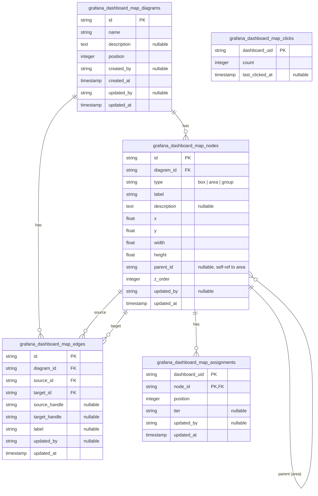

---
plugins:
  - grafana-dashboard-map
  - grafana-dashboard-map-backend
---

# Grafana Dashboard Map ERD

## Overview

This document describes the relational schema backing the **grafana-dashboard-map** Backstage plugin — the canvas where Grafana dashboards are pinned onto a hand-drawn system architecture so on-callers can jump from "where is this in our stack?" to the right dashboard in one click.

**Purpose**

- Serve as the canonical reference for the plugin's persisted data model (tables, keys, relationships, cascade rules).
- Explain *why* the schema looks the way it does (design decisions) so future changes don't re-litigate solved problems (e.g., the composite assignment PK migration).
- Document the boundary between schema-enforced rules and application-enforced rules (no declarative FKs).

**Audience**

- **Plugin maintainers** modifying `grafana-dashboard-map-backend` — adding columns, writing migrations, changing cascade behavior.
- **Backstage operators** debugging stuck migrations or inspecting the SQLite/PostgreSQL store directly.
- **Reviewers** of PRs touching the data layer who need to understand invariants before approving.

Readers are assumed to be comfortable with SQL, ER notation, and the Backstage plugin model. Frontend rendering details (React Flow, node visuals) are out of scope.

## ER Diagram

## Tables

### grafana_dashboard_map_diagrams

Top-level diagram container. Each diagram owns its own set of nodes, edges, and assignments. A `default` diagram is seeded automatically on first startup.

| Constraint | Columns |
|------------|---------|
| PK | `id` |
| ORDER | `position ASC, created_at ASC` |

### grafana_dashboard_map_nodes

Architecture canvas nodes. Three semantics share one table via the `type` column.

| `type` | Role |
|--------|------|
| `box` | Leaf host (e.g., service, system) — can hold dashboard assignments |
| `area` | Visual container that may have child nodes via `parent_id` |
| `group` | Leaf grouping (renders as a collapsible group) — can hold dashboard assignments |

| Constraint | Columns |
|------------|---------|
| PK | `id` |
| FK (logical) | `diagram_id` → `grafana_dashboard_map_diagrams.id` |
| FK (logical, self) | `parent_id` → `grafana_dashboard_map_nodes.id` (must be `type = area`) |
| INDEX | `diagram_id` |

Parent rule (enforced in router validation): a node's `parent_id` must reference an existing `area` node within the same diagram, and parent chains must be acyclic.

### grafana_dashboard_map_edges

Directed connections between nodes inside a diagram.

| Constraint | Columns |
|------------|---------|
| PK | `id` |
| FK (logical) | `diagram_id` → `grafana_dashboard_map_diagrams.id` |
| FK (logical) | `source_id` → `grafana_dashboard_map_nodes.id` |
| FK (logical) | `target_id` → `grafana_dashboard_map_nodes.id` |
| INDEX | `diagram_id` |

`source_handle` / `target_handle` capture the React Flow connection point on each side (e.g., `top`, `bottom`).

### grafana_dashboard_map_assignments

Many-to-many link between Grafana dashboards (by `dashboard_uid`) and dashboard-host nodes (`box` or `group`). The composite PK lets the same dashboard appear on multiple nodes — even across different diagrams.

| Constraint | Columns |
|------------|---------|
| PK | `(dashboard_uid, node_id)` |
| FK (logical) | `node_id` → `grafana_dashboard_map_nodes.id` |
| INDEX | `node_id` |

`tier` is an optional classification (e.g., `gold`, `silver`, `bronze`) rendered as a badge on the leaf. `position` orders dashboards within a single node.

### grafana_dashboard_map_clicks

Global per-dashboard click counter. Not scoped per diagram — clicks roll up across all diagrams the same dashboard appears in.

| Constraint | Columns |
|------------|---------|
| PK | `dashboard_uid` |

## Design Decisions

**Single-table node polymorphism**: `box`, `area`, and `group` share `grafana_dashboard_map_nodes` because they have identical geometric and lifecycle properties. Type-specific behavior (parenting, dashboard assignability) is enforced at the API layer rather than via separate tables.

**Composite assignment PK**: The original schema used `dashboard_uid` alone as the PK, which prevented the same dashboard from being placed on more than one node. The migration probes the legacy PK at startup, drops the table, and rebuilds with `(dashboard_uid, node_id)` while preserving rows.

**No declarative foreign keys**: Knex schema definitions omit `references()`; integrity is maintained by the store's transactional cascade in `deleteDiagram()` and `replaceArchitecture()`. This keeps SQLite/PostgreSQL portability simple at the cost of relying on application-level invariants.

**Diagram-scoped cascades**: Deleting a diagram removes its nodes, then assignments tied to those nodes, then edges — all in one transaction. Replacing an architecture follows the same order to avoid orphan rows.

**Click counts are global**: Click metrics live outside the diagram scope so dashboard popularity reflects total user interest, regardless of how many diagrams expose the dashboard.
