---
plugins:
  - opensearch-account
  - opensearch-account-backend
---

# OpenSearch Account ERD

Normalized schema living in this plugin's dedicated database. Tables are created on startup by `AccountRequestStore.ensureSchema()` (no migration files; `hasTable` guard per table).

## ER Diagram

```mermaid
erDiagram
    osa_requests {
        string id PK
        string action "create | delete | modify"
        string username
        string requester
        text reason "nullable, required for create"
        text password_hash "nullable, bcrypt, create only"
        string reviewer "nullable"
        text reviewer_note "nullable"
        string status "pending | executed | rejected | failed"
        text error_message "nullable"
        timestamp created_at
        timestamp updated_at
    }

    osa_request_roles {
        integer id PK
        string request_id FK
        string role_kind "backend | security"
        string role_name
    }

    osa_request_attributes {
        integer id PK
        string request_id FK
        string attr_key
        text attr_value
    }

    osa_audit_events {
        string id PK
        string request_id FK
        string event_type "submitted | approved | rejected | executed | failed"
        string actor
        text note "nullable"
        timestamp created_at
    }

    osa_requests ||--o{ osa_request_roles : "has"
    osa_requests ||--o{ osa_request_attributes : "has"
    osa_requests ||--o{ osa_audit_events : "has"
```

## Tables

### osa_requests

One row per account request. The aggregate root; child tables reference it by `request_id`.

| Constraint | Columns |
|------------|---------|
| PK | `id` (UUID) |

- `action`: `create`, `delete`, or `modify`.
- `status`: `pending`, `executed`, `rejected`, or `failed`.
- `reason`: requester justification, required for create.
- `password_hash`: bcrypt hash for create requests, held only until execution. Never plaintext.
- `reviewer` / `reviewer_note`: admin who approved or rejected, plus their note.
- `error_message`: populated when execution against OpenSearch fails.

### osa_request_roles

Roles attached to a request, split by kind. The frontend reassembles these into `backendRoles[]` and `securityRoles[]`.

| Constraint | Columns |
|------------|---------|
| PK | `id` (auto-increment) |
| INDEX | `request_id` |

- `role_kind`: `backend` or `security`.

### osa_request_attributes

Arbitrary key/value attributes for a create request. Reassembled into `attributes: Record<string, string>`.

| Constraint | Columns |
|------------|---------|
| PK | `id` (auto-increment) |
| INDEX | `request_id` |

### osa_audit_events

Immutable, insert-only audit trail. Every request gets a `submitted` event on creation, then approval, rejection, execution, or failure events as the workflow proceeds. Read ordered by `created_at` ascending.

| Constraint | Columns |
|------------|---------|
| PK | `id` (UUID) |
| INDEX | `request_id` |

- `event_type`: `submitted`, `approved`, `rejected`, `executed`, or `failed`.
- `actor`: user entity ref that performed the action.

## Design notes

- Relationships are application-enforced via `request_id`. There are no DB-level foreign keys; child tables carry an index on `request_id` only.
- Writes are transactional: `addRequest` inserts the request, its roles, attributes, and the `submitted` event in a single transaction; `updateStatus` updates the row and appends an event atomically.
- Timestamps are ISO 8601 strings.
- Roles and attributes are normalized out of `osa_requests` so a request can hold a variable number of each without array columns.
