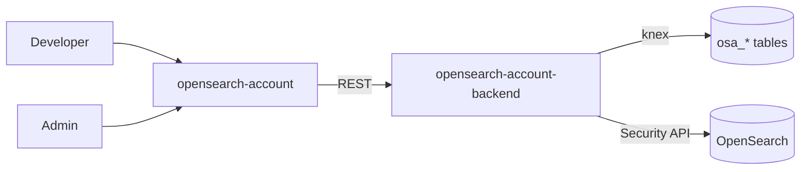
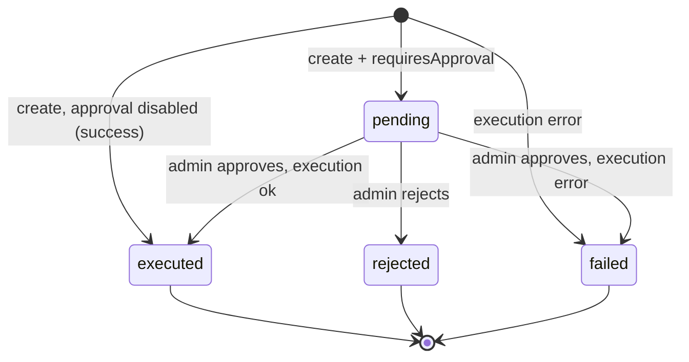

---
plugins:
  - opensearch-account
  - opensearch-account-backend
---

# OpenSearch Account

Self-service plugin for managing OpenSearch Security internal users from Backstage, with an optional admin approval workflow, role-based access control, and a full audit trail.

## Why this exists

OpenSearch Security internal-user management normally requires direct access to the Security API or Dashboards, which is restricted to a few administrators. This plugin lets developers request accounts through Backstage while admins keep control via approval and an immutable audit log. Every action is recorded with the actor, event type, and a note.

## Features

- Self-service create requests: username, password, backend roles, security roles, and attributes
- Admin-only modify (roles/attributes, optional password reset) and delete actions
- Optional approval workflow toggled by `requiresApproval`
- Role-based access control via the `permission.admins` config
- Complete audit trail (submitted, approved, rejected, executed, failed)
- Master account guardrail preventing deletion of the configured admin user
- Passwords bcrypt-hashed in the browser, never stored or transmitted in plaintext

## Architecture

Standard frontend/backend pair. The backend wraps the OpenSearch Security REST API and persists requests in a dedicated database.



| Package | Path | Role |
|---------|------|------|
| `opensearch-account` | `plugins/opensearch-account` | React UI: Accounts, Create, Approvals pages |
| `opensearch-account-backend` | `plugins/opensearch-account-backend` | REST router, request store, OpenSearch Security client |

## Pages

| Page | Route | Access | Purpose |
|------|-------|--------|---------|
| Accounts | `/opensearch-account` | Admin | List existing internal users; modify or delete |
| Create | `/opensearch-account/create` | All users | Request a new internal user |
| Approvals | `/opensearch-account/approvals` | All users | View requests (own / all) and approve or reject |

Non-admins are redirected from Accounts to Create.

## API endpoints

All routes are prefixed with `/api/opensearch-account/`.

| Method | Path | Access | Purpose |
|--------|------|--------|---------|
| GET | `/health` | Public | Health check |
| GET | `/config` | Public | Plugin config (configured, requiresApproval, masterUsername) |
| GET | `/user-role` | User | Current user's role (isAdmin, admins) |
| GET | `/accounts` | Admin | List internal users |
| GET | `/roles` | User | List security roles |
| GET | `/backend-roles` | User | List known backend roles |
| POST | `/requests` | User | Create / modify / delete request |
| GET | `/requests` | User | List requests (admins: all, users: own) |
| GET | `/requests/:id` | User | Get one request (requester or admin) |
| POST | `/requests/:id/approve` | Admin | Approve a pending request and execute it |
| POST | `/requests/:id/reject` | Admin | Reject a pending request |

## Approval workflow

`status` values: `pending`, `executed`, `rejected`, `failed`. Terminal states are `executed`, `rejected`, and `failed`.



- Create with approval: request stored as `pending`, then an admin approves (executes against OpenSearch) or rejects.
- Create without approval: executes immediately and records `executed` or `failed`.
- Modify and delete are admin-only and execute immediately; they are still recorded for audit.

The bcrypt password hash is held in `osa_requests.password_hash` only until execution and is never returned to the UI. A modify with password reset generates a random password and returns it to the admin once.

## Configuration

```yaml
# app-config.yaml
opensearchAccount:
  endpoint: ${OPENSEARCH_ENDPOINT}            # https://opensearch.example.com:9200
  username: ${OPENSEARCH_ADMIN_USERNAME}      # Security API admin
  password: ${OPENSEARCH_ADMIN_PASSWORD}      # secret
  requiresApproval: true                      # default true
  tls:
    rejectUnauthorized: true                  # set false for self-signed clusters

permission:
  admins:
    - user:default/alice                      # admin entity refs
```

| Key | Default | Description |
|-----|---------|-------------|
| `endpoint` | none | OpenSearch base URL exposing the Security API |
| `username` | none | Admin user for the Security API (protected master account) |
| `password` | none | Admin password (secret) |
| `requiresApproval` | `true` | When false, authorized requests execute immediately |
| `tls.rejectUnauthorized` | `true` | Reject self-signed/invalid certs |

## Related

- [ERD](./erd.md) - database schema for requests, roles, attributes, and audit events
