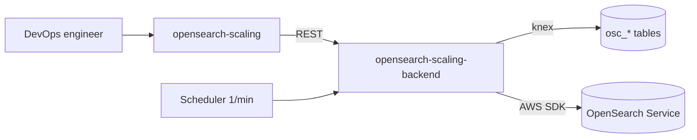
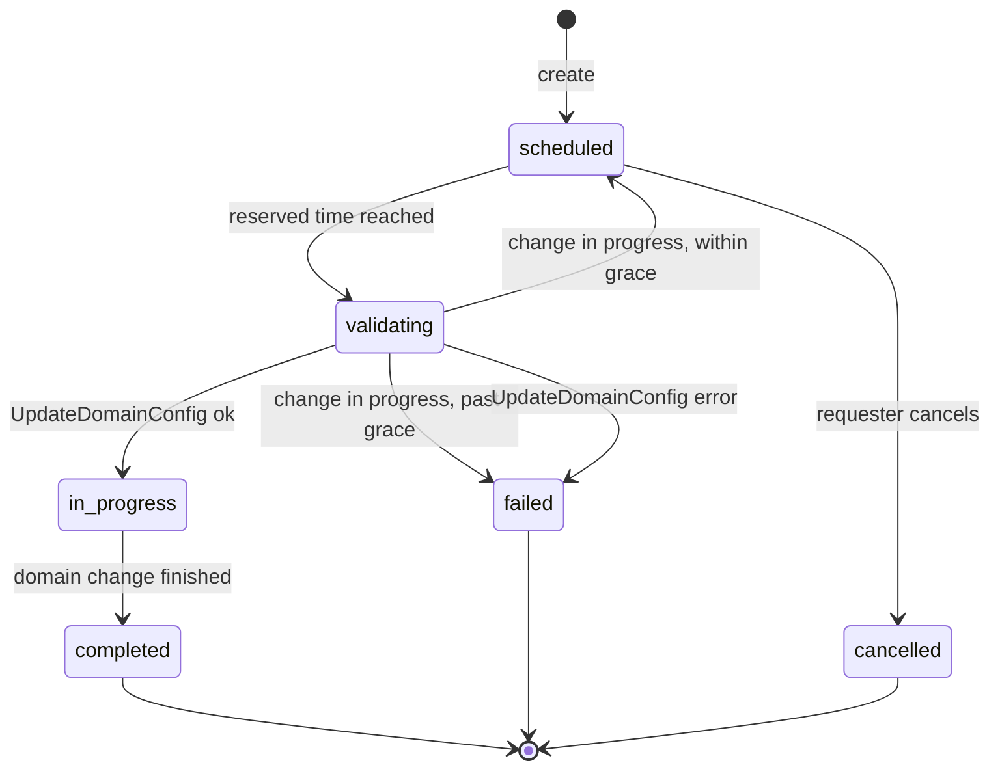

---
plugins:
  - opensearch-scaling
  - opensearch-scaling-backend
---

# OpenSearch Scaling

Self-service plugin for DevOps engineers to reserve Amazon OpenSearch Service domain scaling (data-node instance type, data-node count, and per-node EBS volume) for execution at a chosen future time.

## Why this exists

Scaling an OpenSearch Service domain triggers a blue/green deployment, so it is usually run inside a maintenance window. Doing this by hand means an engineer waits for that time and runs the change in the AWS console or CLI. AWS also rejects a new change while another change or version upgrade is in progress, so unchecked work can fail. This plugin lets engineers reserve the change in Backstage; a backend scheduler applies it at the reserved time and re-validates that no change is in progress first.

## Features

- Reserve a scaling change with a future execution time, picked in a flexible IANA timezone (stored internally as an absolute UTC instant)
- Pre-validation at request time and at execution time that blocks the change when a config change or version upgrade is already in progress
- Data-node instance types fetched from the AWS API for the selected domain's engine version, not hardcoded
- Live before/after preview showing how each spec changes, including the delta and percent
- Direct self-service execution by any authenticated user, with no approval step
- Full audit trail (submitted, executed, failed, cancelled, completed)
- All UI built with Backstage UI (BUI)

## Architecture

Standard frontend/backend pair. The backend wraps the AWS OpenSearch Service control-plane API and persists reservations in a dedicated database.



| Package | Path | Role |
|---------|------|------|
| `opensearch-scaling` | `plugins/opensearch-scaling` | React UI: reservation list and create pages |
| `opensearch-scaling-backend` | `plugins/opensearch-scaling-backend` | REST router, reservation store, OpenSearch Service client, scheduler |

## Pages

| Page | Route | Purpose |
|------|-------|---------|
| Reservations | `/opensearch-scaling` | Table of the user's reservations with status, requester, times, and cancel |
| Create | `/opensearch-scaling/create` | Reserve a new scaling change with live pre-check and before/after preview |

The sidebar entry is labelled **Capacity**.

## API endpoints

All routes are prefixed with `/api/opensearch-scaling/`.

| Method | Path | Access | Purpose |
|--------|------|--------|---------|
| GET | `/health` | Public | Health check |
| GET | `/config` | User | Plugin config (instance types fallback, timezones, default timezone) |
| GET | `/domains` | User | List domains with engine version |
| GET | `/domains/:name` | User | Current config, in-progress flag, and valid instance types |
| GET | `/requests` | User | The caller's reservations |
| POST | `/requests` | User | Create a reservation (validated for in-progress change) |
| POST | `/requests/:id/cancel` | User | Cancel a still-scheduled reservation (owner only) |

## Execution model

A reservation is stored with an absolute UTC instant. A scheduler runs every minute, picks reservations whose time has arrived, re-validates that no change is in progress, and calls `UpdateDomainConfig`. If a change is still in progress it retries within a grace window (`executionGraceHours`, default 2), then fails.

`status` values: `scheduled`, `validating`, `in_progress`, `completed`, `failed`, `cancelled`.



## Configuration

```yaml
# app-config.yaml
app:
  plugins:
    opensearchScaling: true

opensearchScaling:
  region: ap-northeast-2
  # assumeRoleArn: arn:aws:iam::123456789012:role/backstage-opensearch-scaling
  defaultTimezone: Asia/Seoul
  timezones:
    - Asia/Seoul
    - UTC
    - America/New_York
  instanceTypes:            # fallback only; types are normally fetched from AWS
    - r6g.large.search
    - r6g.xlarge.search
  executionGraceHours: 2
```

| Key | Default | Description |
|-----|---------|-------------|
| `region` | `us-east-1` | AWS region of the OpenSearch Service domains |
| `assumeRoleArn` | none | IAM role to assume for API calls; omit to use IRSA or instance profile |
| `defaultTimezone` | `Asia/Seoul` | Timezone preselected in the form |
| `timezones` | `[Asia/Seoul, UTC]` | Selectable IANA timezones |
| `instanceTypes` | built-in list | Fallback instance types when the AWS list is unavailable |
| `executionGraceHours` | `2` | Hours after the reserved time to keep retrying while a change is in progress |

## AWS Permissions Required

The backend credentials (IRSA, instance profile, or the assumed role) need these Amazon OpenSearch Service actions. The `es:` prefix applies to OpenSearch as well.

| Action | API call | Used for |
|--------|----------|----------|
| `es:ListDomainNames` | ListDomainNames | List domains |
| `es:DescribeDomains` | DescribeDomains | Resolve engine version per domain for the selector |
| `es:DescribeDomain` | DescribeDomain | Current config and in-progress flags |
| `es:DescribeDomainConfig` | DescribeDomainConfig | Current instance type, count, and EBS size |
| `es:DescribeDomainChangeProgress` | DescribeDomainChangeProgress | Pre-validate an in-progress change |
| `es:ListInstanceTypeDetails` | ListInstanceTypeDetails | Valid data-node types for the engine version |
| `es:UpdateDomainConfig` | UpdateDomainConfig | Apply the scaling change at the reserved time |

Example IAM policy:

```json
{
  "Version": "2012-10-17",
  "Statement": [
    {
      "Sid": "OpenSearchScalingList",
      "Effect": "Allow",
      "Action": [
        "es:ListDomainNames",
        "es:ListInstanceTypeDetails"
      ],
      "Resource": "*"
    },
    {
      "Sid": "OpenSearchScalingDomain",
      "Effect": "Allow",
      "Action": [
        "es:DescribeDomain",
        "es:DescribeDomains",
        "es:DescribeDomainConfig",
        "es:DescribeDomainChangeProgress",
        "es:UpdateDomainConfig"
      ],
      "Resource": "arn:aws:es:ap-northeast-2:123456789012:domain/*"
    }
  ]
}
```

Scope the `domain/*` resource to specific domains to limit the blast radius. `ListDomainNames` and `ListInstanceTypeDetails` are list operations and generally need `Resource: "*"`.

### Cross-account or role delegation

When `opensearchScaling.assumeRoleArn` is set, the backend principal additionally needs `sts:AssumeRole` for that role, the target role's trust policy must allow the backend principal, and the `es:*` actions above are granted on the assumed role rather than the backend principal.

### Backstage access

No RBAC or admin gate is enforced. Any authenticated user can reserve and cancel (DevOps self-service). Only `/health` is unauthenticated; all other endpoints require a signed-in user.
