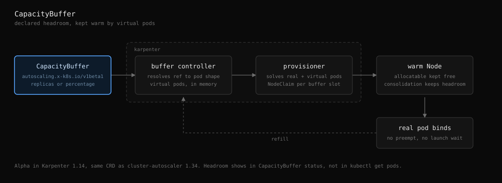

# Overprovisioning

Overprovisioning keeps spare capacity in your cluster to reduce pod startup time. It works by running dummy pods that reserve resources. When real workloads need resources, the dummy pods are removed and replaced instantly.

## How It Works

1. **Dummy pods run** on your cluster with low priority
2. **Real workloads arrive** and need resources
3. **Dummy pods get evicted** to make room
4. **New dummy pods start** on new nodes to maintain spare capacity

## Configuration

### Basic Setup

```yaml
nodePool:
  default:
    overprovisioning:
      enabled: true
      nodes: 2
      resources:
        requests:
          cpu: 100m
          memory: 128Mi
        limits:
          cpu: 100m
          memory: 128Mi
```

### Advanced Configuration

```yaml
nodePool:
  default:
    overprovisioning:
      enabled: true
      nodes: 3
      
      # Resource requirements for dummy pods
      resources:
        requests:
          cpu: 200m
          memory: 256Mi
        limits:
          cpu: 200m
          memory: 256Mi
      
      # Spread dummy pods across different nodes
      topologySpreadConstraints:
      - maxSkew: 1
        topologyKey: kubernetes.io/hostname
        whenUnsatisfiable: DoNotSchedule
        labelSelector:
          matchLabels:
            app.kubernetes.io/component: overprovisioning
      
      # Allow dummy pods on tainted nodes
      tolerations:
      - key: node.kubernetes.io/unschedulable
        operator: Exists
        effect: NoSchedule
      
      # Add custom labels and annotations
      podLabels:
        team: platform
        purpose: overprovisioning
      
      podAnnotations:
        description: "Dummy pod for spare capacity"
```

## Key Features

### Low Priority
Dummy pods use priority class `-1000`, so they're evicted first when resources are needed.

### Node Distribution
Uses `topologySpreadConstraints` to spread dummy pods across different nodes:
- `maxSkew: 1` - allows maximum 1 pod difference between nodes
- `whenUnsatisfiable: DoNotSchedule` - ensures quality distribution

### Flexible Resources
Supports standard Kubernetes resource format with separate requests and limits.

## When to Use

- **Fast response times** are critical
- **Burst traffic** patterns
- **Batch jobs** with strict timing requirements
- **Cost vs performance** trade-off favors performance

## Cost Considerations

⚠️ **Important**: Overprovisioning increases infrastructure costs by keeping spare nodes running.

- **Additional compute costs** for dummy pods and their nodes
- **Idle resource expenses** during low traffic periods  
- **Cost scales** with the number of spare nodes configured
- **Consider carefully** if the performance benefit justifies the extra cost

Use overprovisioning when the cost of slow pod startup exceeds the cost of spare capacity.

## Monitoring

Check dummy pods are running:
```bash
kubectl get pods -l app.kubernetes.io/component=overprovisioning
```

View pod distribution across nodes:
```bash
kubectl get pods -l app.kubernetes.io/component=overprovisioning -o wide
```

## CapacityBuffer (Karpenter 1.14.0+)

Karpenter 1.14.0 added an alternative to balloon pods called CapacityBuffer. Instead of running real low priority pods, Karpenter injects **virtual pods** into its own scheduling simulation. The virtual pods never exist in etcd, so there is no preemption, no scheduler churn, and no `kubectl get pods` entry.



Flow: a `CapacityBuffer` object declares headroom, the buffer controller resolves it to a pod shape and a replica count, the provisioner solves real plus virtual pods together and launches NodeClaims, and the resulting nodes keep allocatable free. When a real pod lands on that headroom the buffer refills on the next provisioning cycle.

### Status

Alpha and disabled by default. Enable the feature gate on the Karpenter controller, not in this chart:

```yaml
# karpenter chart values.yaml
settings:
  featureGates:
    capacityBuffer: true
```

The CRD `capacitybuffers.autoscaling.x-k8s.io` ships with the `karpenter` and `karpenter-crd` charts at 1.14.0 and serves `v1beta1` only. Upstream docs prose still says `v1alpha1`, which is stale. The same CRD is shared with cluster-autoscaler, so buffer definitions are portable between the two autoscalers.

### Example

```yaml
apiVersion: v1
kind: PodTemplate
metadata:
  name: web-buffer-template
  namespace: default
template:
  spec:
    containers:
    - name: placeholder
      image: public.ecr.aws/eks-distro/kubernetes/pause:3.2
      resources:
        requests:
          cpu: "2"
          memory: 4Gi
    nodeSelector:
      karpenter.sh/capacity-type: on-demand
---
apiVersion: autoscaling.x-k8s.io/v1beta1
kind: CapacityBuffer
metadata:
  name: web-app-buffer
  namespace: default
spec:
  provisioningStrategy: buffer.x-k8s.io/active-capacity
  podTemplateRef:
    name: web-buffer-template
  replicas: 5
  limits:
    cpu: "20"
    memory: 40Gi
```

Use `scalableRef` with `percentage` instead of `podTemplateRef` to size the buffer as a fraction of an existing Deployment, StatefulSet, or ReplicaSet:

```yaml
spec:
  scalableRef:
    apiGroup: apps
    kind: Deployment
    name: api-service
  percentage: 20
```

### Sizing rules

Final chunk count is `min(max(replicas, percentage), limits)`. With no `replicas` and no `percentage`, `limits` alone decides how many chunks fit.

| Configuration | Chunks |
| --- | --- |
| `replicas: 5` | 5 |
| `percentage: 20` on a 10 replica Deployment | 2 |
| `replicas: 5` + `percentage: 80` on a 10 replica Deployment | 8 |
| `replicas: 10` + `limits.cpu: 3` at 1 CPU per pod | 3 |
| `limits.cpu: 5` only, at 1 CPU per pod | 5 |

### Balloon pods vs CapacityBuffer

| | Balloon pods (this chart) | CapacityBuffer |
| --- | --- | --- |
| Mechanism | Real pods at priority `-1000` | Virtual pods in the scheduling simulation |
| Karpenter version | Any | 1.14.0+, alpha gate |
| Handover to real pod | Preemption and eviction | Immediate bind, no preempt |
| Visibility | `kubectl get pods` | `kubectl get cb` status conditions |
| Sizing unit | Node count via `nodes` | Pod shape via `replicas`, `percentage`, or `limits` |
| Follows workload scale | No | Yes, with `scalableRef` and `percentage` |
| etcd and scheduler cost | One pod object per slot | None |

This chart templates balloon pods only and does not render `CapacityBuffer` objects. Apply them separately while the feature is alpha.

### Operational notes

- Empty consolidation is blocked on nodes holding buffer capacity, reported as `Node has buffer pods`. Underutilized consolidation, drift, and expiry still run, and replacement nodes must fit the virtual pods, so headroom survives.
- The buffer controller reconciles every 30 seconds, so `scalableRef` replica changes take up to 30s to appear in status.
- PVC-backed and ephemeral volumes are stripped from virtual pods because no real PVC exists for topology resolution.
- Buffer virtual pods count against NodePool `limits`. An exhausted NodePool limit leaves the buffer unfulfilled with `Provisioning=False`.
- Headroom does not appear in `kubectl get pods`. Read `status.replicas` and the `ReadyForProvisioning` and `Provisioning` conditions instead.

### Reference

| Keyword | Karpenter docs |
| --- | --- |
| CapacityBuffer, virtual pods, headroom | [Concepts / CapacityBuffers](https://karpenter.sh/docs/concepts/capacitybuffers/) |
| `capacityBuffer` feature gate, `FEATURE_GATES` | [Reference / Settings](https://karpenter.sh/docs/reference/settings/#feature-gates) |
| Consolidation, drift, expiry, `Node has buffer pods` | [Concepts / Disruption](https://karpenter.sh/docs/concepts/disruption/) |
| NodePool `limits`, `Provisioning=False` | [Concepts / NodePools](https://karpenter.sh/docs/concepts/nodepools/) |
| Pod shape, `nodeSelector`, tolerations, topology spread | [Concepts / Scheduling](https://karpenter.sh/docs/concepts/scheduling/) |
| Pod priority, preemption, priority class `-1000` | [Kubernetes / Pod Priority and Preemption](https://kubernetes.io/docs/concepts/scheduling-eviction/pod-priority-preemption/) |
| Shared CRD with cluster-autoscaler | [kubernetes/autoscaler CapacityBuffer API](https://github.com/kubernetes/autoscaler/tree/master/cluster-autoscaler/apis/capacitybuffer) |
| Karpenter 1.14.0 release, design rationale | [v1.14.0 release notes](https://github.com/kubernetes-sigs/karpenter/releases/tag/v1.14.0), [design doc](https://github.com/kubernetes-sigs/karpenter/blob/main/designs/capacity-buffers.md) |

## Troubleshooting

### Dummy pods not spreading
- Check `topologySpreadConstraints` configuration
- Verify node labels match topology key
- Ensure cluster has multiple nodes

### Pods stuck in Pending
- Review resource requests vs node capacity
- Check tolerations match node taints
- Verify `whenUnsatisfiable: DoNotSchedule` setting

### CapacityBuffer has no effect
- Confirm `settings.featureGates.capacityBuffer: true` on the Karpenter controller and that the pod restarted
- Check `kubectl get cb -A` for `ReadyForProvisioning=False`, which means the `podTemplateRef` or `scalableRef` was not resolved
- `Provisioning=False` with a resolved template points at NodePool `limits` or a pod shape no instance type satisfies
