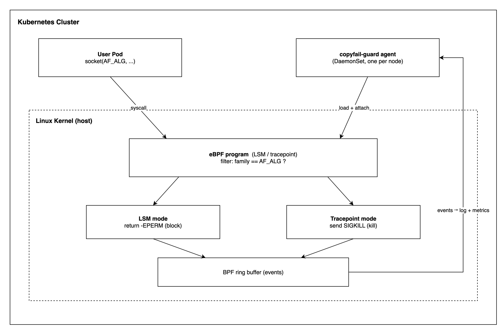

# copyfail-guard

[](https://www.rust-lang.org/)
[](https://github.com/younsl/o/pkgs/container/copyfail-guard)
[](https://github.com/younsl/o/pkgs/container/charts%2Fcopyfail-guard)
[](https://github.com/younsl/o/blob/main/LICENSE)

Kubernetes DaemonSet that blocks `AF_ALG` socket creation to mitigate **CVE-2026-31431 (Copy.Fail)** via [eBPF](https://github.com/ebpf-io/ebpf.io), written in Rust 1.95.0 + cargo-zigbuild on a `scratch` base image.

This re-implementation uses [aya](https://aya-rs.dev) so the userspace agent ships as a single static musl binary.

## What is Copy.Fail

[CVE-2026-31431](https://nvd.nist.gov/vuln/detail/CVE-2026-31431) (a.k.a. [Copy.Fail](https://copy.fail/)) lets any authorized user mutate the cached copy of any readable file via `AF_ALG` crypto sockets (provided by the `algif_*` kernel modules). The vulnerability enables local privilege escalation, container escapes, and sandbox bypass. Disabling the `algif_*` modules does **not** mitigate the issue when those modules are built into the kernel — this is the case on most distribution kernels and EKS-optimized AMIs.

<details>
<summary>References & AWS patch status</summary>

- [CVE-2026-31431 (NVD)](https://nvd.nist.gov/vuln/detail/CVE-2026-31431)
- [copy.fail disclosure site](https://copy.fail/)
- [ALAS — CVE-2026-31431](https://explore.alas.aws.amazon.com/CVE-2026-31431.html)
- [Upstream eBPF reference impl in C](https://github.com/iwanhae/copyfail-ebpf-k8s)
- [Linux `algif_*` userspace crypto interface](https://www.kernel.org/doc/html/latest/crypto/userspace-if.html)

**Amazon Linux patch status (ALAS)**: [Amazon Linux Security Center — CVE-2026-31431](https://explore.alas.aws.amazon.com/CVE-2026-31431.html) lists every affected package across **AL2** (`kernel`, `kernel-5.4`, `kernel-5.10`, `kernel-5.15`) and **AL2023** (`kernel`, `kernel6.12`, `kernel6.18`) as **Pending Fix** — no ALAS advisory ID has been issued yet. AWS's recommended workaround is to blacklist the `algif_aead` module, which only addresses the publicly demonstrated exploit path; this DaemonSet blocks `AF_ALG` socket creation entirely and therefore covers the broader `algif_*` family.

**EKS-optimized AMI patch status**: tracked in [[EKS] [request]: Roadmap for AMI patches addressing CVE-2026-31431 (Copy.Fail / AF_ALG) #2808](https://github.com/aws/containers-roadmap/issues/2808) — a roadmap request for AL2023 / AL2 / Bottlerocket kernel patches. Until AWS ships a fixed kernel, every EKS node is exposed at the host kernel level regardless of pod-level hardening (PSA, seccomp, AppArmor); this DaemonSet is intended as the stop-gap referenced in that issue.

</details>

## How it works

| Mode | Hook | Action | Requires |
|------|------|--------|----------|
| `lsm` (preferred, auto-selected) | `lsm/socket_create` | Returns `-EPERM` for any non-kernel `AF_ALG` socket | BPF LSM enabled (`/sys/kernel/security/lsm` contains `bpf`) |
| `tracepoint` (fallback) | `tracepoint/syscalls/sys_enter_socket` | Sends `SIGKILL` to the offending task | Any kernel with tracepoints + BTF |

The agent auto-detects BPF LSM availability by reading `/sys/kernel/security/lsm`. Events are streamed through a BPF ring buffer and exposed as structured JSON logs and Prometheus metrics.

Behavior verified end-to-end on a managed Kubernetes dev cluster:

- Auto-detect picks `lsm` mode on every node when `bpf` appears in `/sys/kernel/security/lsm`; eBPF program load + attach completes in well under 1 second per node.
- A `socket(AF_ALG, SOCK_SEQPACKET, 0)` call from inside any container — including UID 0 — fails with `EPERM`. The block is enforced at the host kernel hook, so namespace boundaries do not matter.
- The intercept is logged exactly once on the node where the offending process ran, with the offender's `pid`, `comm`, and the resolved `target_pod_uid` + `container_id` parsed from the cgroup-v2 path under `/proc/<pid>/cgroup`.

## Architecture



The agent on each node loads a small eBPF program into the host kernel and attaches it at the socket-creation hook. Every `socket()` call — from any pod, any namespace, any UID — traverses that hook. When the address family is `AF_ALG`, the call is denied: **LSM mode** returns `-EPERM` so `socket()` fails before `algif_*` is ever reached; **tracepoint mode** (fallback for kernels without BPF LSM) sends `SIGKILL` to the offending task. Each decision is published to a BPF ring buffer that the userspace agent drains into structured logs and Prometheus counters. The kernel hook is the single choke point — there is no userspace fast path and no per-pod configuration.

```
copyfail-guard/
├── Cargo.toml                # Single crate, two [[bin]]s gated by target_arch
├── build.rs
├── src/
│   ├── main.rs               # Userspace bin entrypoint (stable Rust 1.95.0)
│   ├── ebpf.rs               # eBPF bin entrypoint (no_std, no_main, nightly)
│   ├── abi.rs                # Shared #[repr(C)] Event + constants
│   ├── loader.rs             # eBPF object loader, BPF LSM detection
│   ├── events.rs             # Ring buffer event consumer
│   ├── metrics.rs            # Prometheus /metrics endpoint
│   └── health.rs             # /healthz, /readyz endpoints
└── charts/copyfail-guard/    # Helm chart with helm-docs annotations
```

A single Cargo package produces two binaries:
- `copyfail-guard` — userspace agent, built for `*-unknown-linux-musl` with `cargo-zigbuild`.
- `copyfail-guard-ebpf` — kernel programs, built for `bpfel-unknown-none` with nightly + `-Z build-std=core` (gated by `required-features = ["build-ebpf"]`).

Dependencies are split via `[target.'cfg(target_arch = "bpf")'.dependencies]`, so `aya-ebpf` is pulled only for the BPF target and `aya`, `tokio`, etc. only for the host target. The eBPF object is built first and embedded into the userspace binary via `include_bytes!(env!("COPYFAIL_GUARD_EBPF_OBJ"))`. The final container image is `scratch` + a single musl-linked binary.

## Build

```bash
make ebpf            # Build eBPF object (nightly + bpfel-unknown-none)
make release         # Build optimized userspace binary (embeds eBPF object)
make build-all       # Cross-compile musl binaries for amd64 and arm64
make docker-build    # Build the runtime container
```

## Deploy

```bash
helm install copyfail-guard oci://ghcr.io/younsl/charts/copyfail-guard \
  --namespace kube-system
```

See [`charts/copyfail-guard/README.md`](./charts/copyfail-guard/README.md) (auto-generated by `helm-docs` from `values.yaml`) for the full value reference.

## Verify

From any pod scheduled on a node where the DaemonSet is running:

```bash
python3 -c "import socket; socket.socket(38, socket.SOCK_SEQPACKET, 0)"
# LSM mode    → PermissionError: [Errno 1] Operation not permitted
# tracepoint  → process is terminated by SIGKILL
```

A matching line should appear in the agent log on that same node within milliseconds.

## Observability

| Metric | Type | Labels | Meaning |
|--------|------|--------|---------|
| `copyfail_guard_events_total` | counter | `action=blocked\|killed` | Intercepted `AF_ALG` socket attempts |
| `copyfail_guard_mode` | gauge | – | Active mode (`1=lsm`, `2=tracepoint`) |

Each intercept is also emitted as a structured log line, with the offender attributed back to a Kubernetes Pod via cgroup-v2 parsing:

```json
{
  "level": "INFO",
  "message": "AF_ALG socket creation intercepted",
  "action": "blocked",
  "node": "<host-node-name>",
  "agent_pod": "<copyfail-guard-pod>",
  "pid": 12345,
  "tgid": 12345,
  "uid": 0,
  "gid": 0,
  "comm": "python3",
  "target_pod_uid": "<offender-pod-uid>",
  "container_id": "<offender-container-id>"
}
```

## Permissions

The agent needs `CAP_SYS_ADMIN` (loading eBPF programs), `CAP_BPF` and `CAP_PERFMON` (kernel ≥ 5.8 split capabilities), `CAP_SYS_RESOURCE` (memlock), and `hostPID: true` (so `bpf_send_signal` reaches the right task and `comm` is consistent across namespaces). The chart defaults to `privileged: true` since most distros still gate eBPF behind it; switch to capability-only mode by overriding `securityContext` in `values.yaml`.

## References

- [CVE-2026-31431 details](https://github.com/iwanhae/copyfail-ebpf-k8s) — upstream eBPF reference implementation in C
- [Linux kernel `algif_*` modules](https://www.kernel.org/doc/html/latest/crypto/userspace-if.html)
- [aya — Rust eBPF library](https://aya-rs.dev)
- [Amazon Linux Security Center — CVE-2026-31431](https://explore.alas.aws.amazon.com/CVE-2026-31431.html) — ALAS tracking for AL2 / AL2023 kernel packages (currently Pending Fix)
- [[EKS] [request]: Roadmap for AMI patches addressing CVE-2026-31431 (Copy.Fail / AF_ALG) #2808](https://github.com/aws/containers-roadmap/issues/2808) — EKS AMI patch roadmap request
