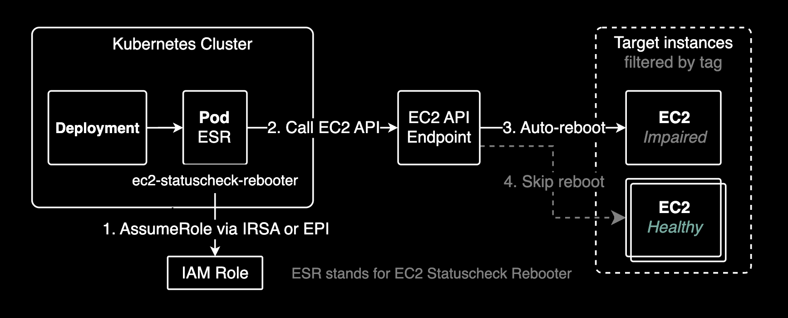

# ec2-statuscheck-rebooter

[](https://github.com/younsl/o/pkgs/container/ec2-statuscheck-rebooter)
[](https://www.rust-lang.org/)
[](https://github.com/younsl/o/blob/main/LICENSE)

Automated reboot for standalone EC2 instances with status check failures.

## Overview

ec2-statuscheck-rebooter is a Kubernetes-based operational tool that monitors **standalone EC2 instances outside the cluster** and automatically reboots them when [status checks](https://docs.aws.amazon.com/AWSEC2/latest/UserGuide/monitoring-system-instance-status-check.html) fail repeatedly. This tool is designed to manage external EC2 infrastructure (e.g., legacy applications, databases, bastion hosts) that are **not part of the Kubernetes cluster**.

Built with Rust 1.91 for minimal resource usage and maximum reliability.

### What are EC2 Status Checks?

AWS performs automated checks on every running EC2 instance to identify hardware and software issues:

- **[System Status Checks](https://docs.aws.amazon.com/AWSEC2/latest/UserGuide/monitoring-system-instance-status-check.html#types-of-instance-status-checks)**: Monitor AWS infrastructure (host hardware, network, power)
- **[Instance Status Checks](https://docs.aws.amazon.com/AWSEC2/latest/UserGuide/monitoring-system-instance-status-check.html#types-of-instance-status-checks)**: Monitor guest OS and application (kernel issues, exhausted memory, incorrect network configuration)

When these checks fail and return **impaired** status, this tool automatically reboots the instance after reaching the configured failure threshold.

## Features

- **Automatic Monitoring**: Periodically checks EC2 instance status
- **Smart Rebooting**: Reboots instances only after reaching failure threshold
- **Tag Filtering**: Monitor specific instances using AWS tags (comma-separated)
- **Dry Run Mode**: Test without performing actual reboots
- **AWS Authentication**: Supports both IRSA and EKS Pod Identity for native AWS authentication
- **Structured Logging**: JSON and pretty log formats for CloudWatch/Loki integration
- **Health Check Endpoints**: HTTP endpoints for Kubernetes liveness and readiness probes
- **Lightweight**: Built with Rust for minimal memory footprint and fast startup

## Use Cases

This tool is specifically designed for monitoring **external EC2 instances** that are not part of your Kubernetes cluster:

- **Legacy Applications**: Non-containerized applications running on EC2
- **Database Servers**: RDS-incompatible databases on EC2
- **Bastion Hosts**: Jump servers for secure access
- **Windows Servers**: Windows-based applications
- **Third-party Software**: Licensed software requiring EC2 deployment
- **Hybrid Infrastructure**: Bridge between traditional and cloud-native workloads

**Important**: This tool does NOT manage Kubernetes worker nodes. For EKS node health, use AWS Node Termination Handler or Karpenter. If you need Kubernetes node automatic reboots (e.g., after kernel updates), consider using [kured (Kubernetes Reboot Daemon)](https://github.com/kubereboot/kured) which safely drains and reboots nodes when `/var/run/reboot-required` is present.

## Architecture



The tool runs as a Kubernetes Deployment and monitors external EC2 instances using the following workflow:

1. Starts HTTP health check server on port 8080
2. Tests EC2 API connectivity on startup
3. Periodically queries EC2 DescribeInstanceStatus API
4. Tracks failure counts for instances with impaired status checks
5. Reboots instances when failure count exceeds threshold
6. Resets failure count after successful reboot

### Health Check Endpoints

The application exposes HTTP endpoints for Kubernetes health monitoring:

- **`/healthz`** (Liveness Probe): Returns 200 if the process is running
- **`/readyz`** (Readiness Probe): Returns 200 if EC2 API is connected and initialization is complete
- **Port**: 8080

These endpoints are automatically configured in the Helm chart with sensible defaults.

## Installation

### Prerequisites

- Kubernetes cluster (EKS recommended)
- AWS IAM role with EC2 permissions
  - Supports [IRSA (IAM Roles for Service Accounts)](https://docs.aws.amazon.com/eks/latest/userguide/iam-roles-for-service-accounts.html)
  - Supports [EKS Pod Identity](https://docs.aws.amazon.com/eks/latest/userguide/pod-identities.html)
- Helm 3.x

### Required IAM Permissions

The following IAM permissions are required for the application to function:

| Permission | Purpose | API Calls | AWS Documentation |
|------------|---------|-----------|-------------------|
| [`ec2:DescribeInstanceStatus`](https://docs.aws.amazon.com/AWSEC2/latest/APIReference/API_DescribeInstanceStatus.html) | Monitor instance health status | `src/ec2.rs:94-97` | [Monitoring status checks](https://docs.aws.amazon.com/AWSEC2/latest/UserGuide/monitoring-system-instance-status-check.html) |
| [`ec2:DescribeInstances`](https://docs.aws.amazon.com/AWSEC2/latest/APIReference/API_DescribeInstances.html) | Fetch instance tags (Name tag) | `src/ec2.rs:196-202` | [Describe instances](https://docs.aws.amazon.com/cli/latest/reference/ec2/describe-instances.html) |
| [`ec2:RebootInstances`](https://docs.aws.amazon.com/AWSEC2/latest/APIReference/API_RebootInstances.html) | Reboot failed instances | `src/ec2.rs:236-241` | [Reboot instances](https://docs.aws.amazon.com/AWSEC2/latest/UserGuide/ec2-instance-reboot.html) |

**IAM Policy Document:**

```json
{
  "Version": "2012-10-17",
  "Statement": [
    {
      "Sid": "EC2StatusCheckRebooterPermissions",
      "Effect": "Allow",
      "Action": [
        "ec2:DescribeInstanceStatus",
        "ec2:DescribeInstances",
        "ec2:RebootInstances"
      ],
      "Resource": "*"
    }
  ]
}
```

**Option 1: EKS Pod Identity (Recommended for EKS 1.24+)**

[EKS Pod Identity](https://docs.aws.amazon.com/eks/latest/userguide/pod-identities.html) is the newer, simpler authentication method.

**Prerequisites - Verify EKS Pod Identity Agent:**

Before using EKS Pod Identity, confirm the eks-pod-identity-agent is installed in your cluster:

```bash
# Check if eks-pod-identity-agent DaemonSet exists
kubectl get daemonset eks-pod-identity-agent -n kube-system
```

**Setup Steps:**

1. Create IAM role with EC2 permissions with trust relationship for EKS pod identity
2. Create pod identity association

```bash
aws eks create-pod-identity-association \
  --cluster-name my-cluster \
  --namespace monitoring \
  --service-account ec2-statuscheck-rebooter \
  --role-arn arn:aws:iam::ACCOUNT_ID:role/EC2RebooterRole
```

3. Install helm chart:

```bash
helm install ec2-statuscheck-rebooter ./charts/ec2-statuscheck-rebooter \
  --namespace monitoring \
  --create-namespace
```

**Note**: With EKS Pod Identity, no ServiceAccount role-arn` annotation is required. The pod identity association handles authentication automatically.

**Option 2: IRSA (IAM Roles for Service Accounts)**

For clusters with OIDC provider configured, create an IAM role with trust relationship:

```json
{
  "Version": "2012-10-17",
  "Statement": [
    {
      "Effect": "Allow",
      "Principal": {
        "Federated": "arn:aws:iam::ACCOUNT_ID:oidc-provider/oidc.eks.REGION.amazonaws.com/id/OIDC_ID"
      },
      "Action": "sts:AssumeRoleWithWebIdentity",
      "Condition": {
        "StringEquals": {
          "oidc.eks.REGION.amazonaws.com/id/OIDC_ID:sub": "system:serviceaccount:monitoring:ec2-statuscheck-rebooter",
          "oidc.eks.REGION.amazonaws.com/id/OIDC_ID:aud": "sts.amazonaws.com"
        }
      }
    }
  ]
}
```

Install with IRSA annotation:

```bash
helm install ec2-statuscheck-rebooter ./charts/ec2-statuscheck-rebooter \
  --namespace monitoring \
  --create-namespace \
  --set serviceAccount.annotations."eks\.amazonaws\.com/role-arn"=arn:aws:iam::ACCOUNT_ID:role/ROLE_NAME
```

**Option 3: Worker Node Instance Profile**

Attach the IAM policy to the EKS worker node IAM role. Note that this grants permissions to all pods on the node.

### Quick Start

```bash
# Option A: With EKS Pod Identity (recommended)
# 1. Create pod identity association first (see Option 1 above)
# 2. Install chart
helm install ec2-statuscheck-rebooter ./charts/ec2-statuscheck-rebooter \
  --namespace monitoring \
  --create-namespace

# Option B: With IRSA
helm install ec2-statuscheck-rebooter ./charts/ec2-statuscheck-rebooter \
  --namespace monitoring \
  --create-namespace \
  --set serviceAccount.annotations."eks\.amazonaws\.com/role-arn"=arn:aws:iam::ACCOUNT_ID:role/ROLE_NAME
```

## Configuration

### Helm Values

| Parameter | Environment Variable | Description | Default |
|-----------|----------------------|-------------|---------|
| `rebooter.checkIntervalSeconds` | CHECK_INTERVAL_SECONDS | Check interval in seconds | `300` |
| `rebooter.failureThreshold` | FAILURE_THRESHOLD | Failure count before reboot | `2` |
| `rebooter.region` | AWS_REGION | AWS region (empty = auto-detect) | `""` |
| `rebooter.tagFilters` | TAG_FILTERS | Comma-separated EC2 tag filters (Key=Value) | `[]` |
| `rebooter.dryRun` | DRY_RUN | Dry run mode (no actual reboot) | `false` |
| `rebooter.logFormat` | LOG_FORMAT | Log format: json or pretty | `"json"` |
| `rebooter.logLevel` | LOG_LEVEL | Log level: trace, debug, info, warn, error | `"info"` |
| `livenessProbe.initialDelaySeconds` | N/A | Initial delay before liveness probe | `10` |
| `livenessProbe.periodSeconds` | N/A | Liveness probe check interval | `30` |
| `readinessProbe.initialDelaySeconds` | N/A | Initial delay before readiness probe | `5` |
| `readinessProbe.periodSeconds` | N/A | Readiness probe check interval | `10` |
| `serviceAccount.annotations` | N/A | ServiceAccount annotations (IRSA) | `{}` |
| `resources.limits.cpu` | N/A | CPU limit | `200m` |
| `resources.limits.memory` | N/A | Memory limit | `128Mi` |

### Example: Monitor External Production Database Servers

Monitor standalone database servers outside the Kubernetes cluster:

```bash
helm install ec2-statuscheck-rebooter ./charts/ec2-statuscheck-rebooter \
  --namespace monitoring \
  --set serviceAccount.annotations."eks\.amazonaws\.com/role-arn"=arn:aws:iam::123456789012:role/EC2RebooterRole \
  --set rebooter.tagFilters="{Environment=production,Role=database,AutoReboot=true}" \
  --set rebooter.checkIntervalSeconds=180 \
  --set rebooter.failureThreshold=3
```

### Example: Dry Run Mode

```bash
helm install ec2-statuscheck-rebooter ./charts/ec2-statuscheck-rebooter \
  --namespace monitoring \
  --set serviceAccount.annotations."eks\.amazonaws\.com/role-arn"=arn:aws:iam::123456789012:role/EC2RebooterRole \
  --set rebooter.dryRun=true \
  --set rebooter.logFormat=pretty
```

## Development

### Build Commands

```bash
# Build debug binary
make build

# Build release binary
make release

# Run with dry-run mode
make run

# Run with debug logging
make dev

# Run tests
make test

# Format and lint
make fmt
make lint

# Build Docker image
make docker-build

# Push to registry
make docker-push
```

### Local Testing

```bash
# Set AWS credentials
export AWS_REGION=us-east-1
export AWS_ACCESS_KEY_ID=...
export AWS_SECRET_ACCESS_KEY=...

# Run with pretty logs
LOG_FORMAT=pretty cargo run -- \
  --check-interval-seconds 60 \
  --failure-threshold 2 \
  --dry-run
```

## Troubleshooting

### Common Issues

**No instances being monitored:**
- Check tag filters are correct
- Verify instances are in "running" state
- Ensure IAM permissions are properly configured
- Confirm instances are **outside** the Kubernetes cluster (this tool is for external EC2s only)

**Permission denied errors:**
- Verify IRSA annotation is correct
- Check IAM role has required EC2 permissions
- Ensure trust relationship allows EKS service account

**Instances not being rebooted:**
- Check if dry run mode is enabled
- Verify failure threshold is reached
- Review logs for any errors

**Monitoring Kubernetes worker nodes by mistake:**
- This tool is NOT for EKS worker nodes
- Use AWS Node Termination Handler or Karpenter for node management
- Apply tag filters to exclude worker nodes (e.g., avoid `kubernetes.io/cluster/*` tags)

## Technical Details

- **Language**: Rust 1.91+ (Edition 2024)
- **Runtime**: Tokio async runtime
- **AWS SDK**: aws-sdk-ec2 1.78+
- **Container Size**: ~30MB (minimal Debian base)
- **Memory Usage**: ~20-50MB typical
- **CPU Usage**: ~1-5% typical

## License

See repository root for license information.

## Contributing

Contributions are welcome! Please see the repository root for contribution guidelines.

## Maintainer

- **younsl** - [GitHub](https://github.com/younsl)
