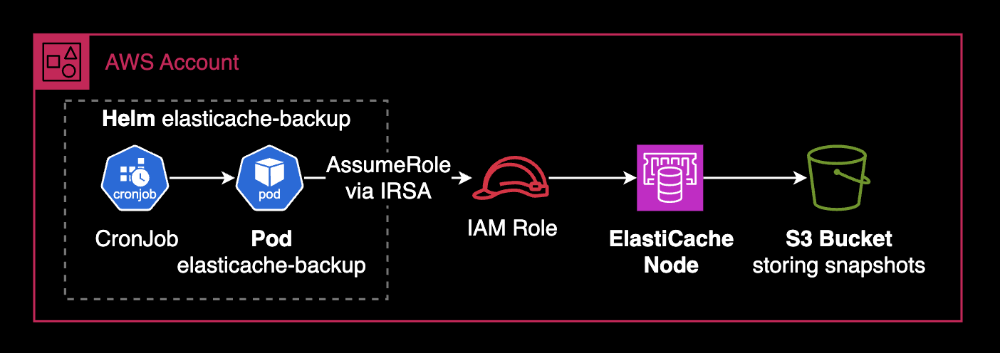

# elasticache-backup

[](https://github.com/younsl/o/pkgs/container/elasticache-backup)
[](https://www.rust-lang.org/)
[](https://github.com/younsl/o/blob/main/LICENSE)

ElastiCache snapshot backup to S3 automation - Rust-based container application.

## Overview

This tool automates the process of creating ElastiCache snapshots and exporting them to S3 buckets. It's designed to run as a Kubernetes CronJob for scheduled backups.

## Background

AWS ElastiCache supports manual snapshot creation and one-time S3 exports, but lacks native cron-based scheduling for recurring backups. While automatic snapshots can be retained for up to 35 days, there's no built-in way to regularly export them to S3 or manage retention policies across both ElastiCache snapshots and S3 backups. Additionally, source snapshots remain in ElastiCache after S3 export, requiring manual cleanup to avoid storage costs. This tool addresses these limitations by providing automated scheduling, S3 export, and snapshot cleanup in a single Kubernetes CronJob.

## Quick Start

```bash
# 1. Install via Helm
helm install elasticache-backup ./box/kubernetes/elasticache-backup/charts/elasticache-backup \
  --set image.registry=ghcr.io/younsl \
  --set image.tag=0.1.0 \
  --set elasticache.cacheClusterId=your-cluster-id \
  --set s3.bucketName=your-bucket-name \
  --set serviceAccount.annotations."eks\.amazonaws\.com/role-arn"=arn:aws:iam::ACCOUNT:role/ROLE_NAME

# 2. Verify CronJob is created
kubectl get cronjob elasticache-backup

# 3. Manually trigger a backup (optional)
kubectl create job --from=cronjob/elasticache-backup manual-backup-$(date +%s)

# 4. Check logs
kubectl logs -l app.kubernetes.io/name=elasticache-backup --tail=50
```

## Features

- Creates ElastiCache snapshots from read replica nodes
- Exports snapshots to S3 buckets
- **Automatic S3 retention management** - Keeps only the N most recent snapshots
- Automatic cleanup of source snapshots
- Configurable timeouts and retry intervals
- Structured JSON logging for CloudWatch/Loki integration
- IRSA support for AWS authentication
- Multi-architecture container images
- Helm chart for easy deployment

## Architecture



The architecture shows the complete backup workflow:
1. **CronJob** schedules and triggers the backup pod
2. **Pod** assumes IAM role via IRSA (IAM Roles for Service Accounts)
3. **ElastiCache Node** creates and manages snapshots
4. **S3 Bucket** stores the exported snapshot data

## Project Structure

```
elasticache-backup/
├── src/
│   ├── main.rs         # Application entry point
│   ├── backup.rs       # Backup workflow orchestration
│   ├── cli.rs          # CLI argument parsing
│   ├── error.rs        # Custom error types
│   ├── export.rs       # S3 export functionality
│   ├── retention.rs    # S3 retention management
│   ├── snapshot.rs     # Snapshot creation and management
│   └── types.rs        # Shared data types
├── charts/             # Helm chart
│   └── elasticache-backup/
│       ├── Chart.yaml
│       ├── values.yaml
│       └── templates/
├── Dockerfile          # Multi-stage build (Rust 1.90 + Alpine 3.22)
├── Cargo.toml          # Rust dependencies
├── Makefile            # Build automation
└── README.md           # This file
```

## Prerequisites

- AWS ElastiCache cluster (Redis)
- S3 bucket for storing snapshots
- Kubernetes cluster with IRSA enabled
- IAM role with required permissions

### Required IAM Permissions

The CronJob pod requires an IAM role with the following permissions. This policy follows the **Principle of Least Privilege**, granting only the minimum permissions required for backup operations (e.g., excludes `s3:ListAllMyBuckets` as the tool operates on a specific bucket).

```json
{
  "Version": "2012-10-17",
  "Statement": [
    {
      "Sid": "ElastiCacheSnapshotManagement",
      "Effect": "Allow",
      "Action": [
        "elasticache:CreateSnapshot",
        "elasticache:DescribeSnapshots",
        "elasticache:DeleteSnapshot",
        "elasticache:CopySnapshot"
      ],
      "Resource": [
        "arn:aws:elasticache:*:*:cluster:*",
        "arn:aws:elasticache:*:*:snapshot:*"
      ]
    },
    {
      "Sid": "S3BucketAccess",
      "Effect": "Allow",
      "Action": [
        "s3:PutObject",
        "s3:PutObjectAcl",
        "s3:DeleteObject"
      ],
      "Resource": "arn:aws:s3:::your-backup-bucket/*"
    },
    {
      "Sid": "S3BucketList",
      "Effect": "Allow",
      "Action": [
        "s3:ListBucket"
      ],
      "Resource": "arn:aws:s3:::your-backup-bucket"
    }
  ]
}
```

**Note**: Replace `your-backup-bucket` with your actual S3 bucket name. For a complete IAM policy example, see [`docs/iam-policy.json`](./docs/iam-policy.json).

#### IAM Permissions Breakdown

| AWS API Call | Required Permission | Usage |
|-------------|---------------------|-------|
| `CreateSnapshot` | `elasticache:CreateSnapshot` | Creates snapshot from ElastiCache cluster |
| `DescribeSnapshots` | `elasticache:DescribeSnapshots` | Monitors snapshot and export status |
| `CopySnapshot` | `elasticache:CopySnapshot` | Exports snapshot to S3 bucket |
| `DeleteSnapshot` | `elasticache:DeleteSnapshot` | Cleans up source snapshot after export |
| `PutObject` | `s3:PutObject` | Writes snapshot data to S3 |
| `PutObjectAcl` | `s3:PutObjectAcl` | Sets object ACL during S3 export |
| `ListBucket` | `s3:ListBucket` | Lists objects in backup bucket for retention |
| `DeleteObject` | `s3:DeleteObject` | Deletes old snapshots during retention cleanup |

## Installation

### Using Helm (Recommended)

1. Create a custom `values.yaml` or use `--set` flags:

```yaml
image:
  registry: "ghcr.io/younsl"
  repository: elasticache-backup
  tag: "0.1.0"  # or "latest"

elasticache:
  cacheClusterId: "your-redis-cluster-001"
  region: "ap-northeast-2"

s3:
  bucketName: "your-elasticache-backups"

snapshot:
  timeout: 1800
  exportTimeout: 300
  checkInterval: 30
  retentionCount: 7  # Keep only the 7 most recent snapshots (0 = unlimited)

serviceAccount:
  create: true
  annotations:
    eks.amazonaws.com/role-arn: arn:aws:iam::123456789012:role/elasticache-backup-role

cronjob:
  schedule: "10 15 * * *"  # Daily at 00:10 KST (15:10 UTC)
  timeZone: "Asia/Seoul"   # Requires Kubernetes 1.25+
```

2. Install the chart:

```bash
# From repository root
helm install elasticache-backup ./box/kubernetes/elasticache-backup/charts/elasticache-backup \
  --namespace default \
  --values values.yaml

# Or using --set flags
helm install elasticache-backup ./box/kubernetes/elasticache-backup/charts/elasticache-backup \
  --namespace default \
  --set image.registry=ghcr.io/younsl \
  --set image.tag=0.1.0 \
  --set elasticache.cacheClusterId=your-cluster-id \
  --set s3.bucketName=your-bucket-name \
  --set serviceAccount.annotations."eks\.amazonaws\.com/role-arn"=arn:aws:iam::123456789012:role/elasticache-backup-role
```

### Manual Deployment

```bash
# Build container image
make docker-build

# Push to registry
make docker-push

# Apply Kubernetes manifests
kubectl apply -f charts/elasticache-backup/templates/
```

## Usage

### Running Locally

```bash
# Build debug binary
make build

# Run with pretty logs (human-readable)
LOG_FORMAT=pretty ./target/debug/elasticache-backup \
  --cache-cluster-id "your-redis-cluster-001" \
  --s3-bucket-name "your-elasticache-backups" \
  --region "ap-northeast-2"

# Run with JSON logs (production format)
LOG_FORMAT=json ./target/debug/elasticache-backup \
  --cache-cluster-id "your-redis-cluster-001" \
  --s3-bucket-name "your-elasticache-backups"

# Run with debug logging
LOG_LEVEL=debug LOG_FORMAT=pretty ./target/debug/elasticache-backup \
  --cache-cluster-id "your-redis-cluster-001" \
  --s3-bucket-name "your-elasticache-backups"

# Or use Makefile shortcuts
make run   # Run with pretty logs
make dev   # Run with debug logs
```

### Running in Kubernetes

```bash
# Check CronJob status
kubectl get cronjob elasticache-backup

# View recent jobs
kubectl get jobs -l app.kubernetes.io/name=elasticache-backup

# View logs
kubectl logs -l app.kubernetes.io/name=elasticache-backup --tail=100

# Manually trigger backup
kubectl create job --from=cronjob/elasticache-backup manual-backup-$(date +%s)
```

### Configuration Options

You can set options using command-line flags or environment variables. Command-line flags take priority.

| Argument | Environment Variable | Default | Required | Description |
|----------|---------------------|---------|----------|-------------|
| `--cache-cluster-id` | `CACHE_CLUSTER_ID` | - | Required | ElastiCache cluster ID |
| `--s3-bucket-name` | `S3_BUCKET_NAME` | - | Required | S3 bucket for backups |
| `--region` | `AWS_REGION` | `ap-northeast-2` | Optional | AWS region |
| `--snapshot-timeout` | - | `1800` | Optional | Max wait time for snapshot creation (seconds, 30 min) |
| `--export-timeout` | - | `300` | Optional | Max wait time for S3 export (seconds, 5 min) |
| `--check-interval` | - | `30` | Optional | Status check interval (seconds) |
| `--retention-count` | `RETENTION_COUNT` | `0` | Optional | Number of snapshots to retain (0 = unlimited) |

**Additional Environment Variables:**

| Variable | Values | Default | Description |
|----------|--------|---------|-------------|
| `LOG_LEVEL` | `debug`, `info`, `warn`, `error` | `info` | Logging verbosity level |
| `LOG_FORMAT` | `json`, `pretty` | `pretty` | Log output format |
| `TZ` | IANA timezone | `Asia/Seoul` | Timezone for log timestamps |

## Development

### Build Commands

```bash
# Build debug binary
make build

# Build release binary
make release

# Run with example config
make run

# Run with debug logging
make dev

# Run tests
make test

# Format code
make fmt

# Run linter
make lint

# Clean build artifacts
make clean
```

### Docker Commands

```bash
# Build Docker image
make docker-build

# Build for all platforms (requires Docker Buildx)
docker buildx build --platform linux/amd64,linux/arm64 \
  -t ghcr.io/younsl/elasticache-backup:latest .

# For ECR push (update ECR_REGISTRY in Makefile first)
make docker-push

# Or manually tag and push to your registry
docker tag elasticache-backup:latest YOUR_REGISTRY/elasticache-backup:0.1.0
docker push YOUR_REGISTRY/elasticache-backup:0.1.0
```

## Backup Workflow

1. **Snapshot Creation**: Creates snapshot from ElastiCache read replica
2. **Snapshot Wait**: Waits for snapshot to become available (max 30 min)
3. **S3 Export**: Initiates copy to S3 bucket
4. **Export Wait**: Waits for export to complete (max 5 min)
5. **Cleanup**: Deletes source snapshot (export snapshot remains in S3)
6. **Retention**: Deletes old snapshots from S3 to maintain retention count

## Retention Management

The retention feature automatically manages S3 snapshot count by:

- Listing all snapshots with the cluster ID prefix
- Sorting by last modified date (newest first)
- Keeping only the N most recent snapshots
- Deleting older snapshots with detailed logging

**Example**: With `snapshot.retentionCount: 7`, only the 7 most recent snapshots are kept. Older snapshots are automatically deleted after each successful backup.

**Configuration**:
- Set `snapshot.retentionCount: 0` to disable retention (unlimited snapshots)
- Set `snapshot.retentionCount: N` to keep only N most recent snapshots
- Default: `7` snapshots

**Logging**: During retention cleanup, the tool logs:
- Total objects found
- Objects to keep vs delete
- Each deletion with size and timestamp
- Total deleted count and size
- Operation duration

## Monitoring

The application outputs structured JSON logs that can be ingested by:

- **CloudWatch Logs** (via Fluent Bit)
- **Loki** (via Promtail)
- **Elasticsearch** (via Filebeat)

Example log entry:

```json
{
  "timestamp": "2024-10-20T15:10:00.123Z",
  "level": "INFO",
  "target": "elasticache_backup::snapshot",
  "message": "Snapshot completed successfully after 5 checks in 150.2s"
}
```

## Troubleshooting

### Snapshot Creation Fails

- Verify ElastiCache cluster ID is correct
- Check IAM permissions for `elasticache:CreateSnapshot`
- Ensure you're using a read replica node (not primary)

### S3 Export Fails

- Verify S3 bucket name and permissions
- Check IAM permissions for `s3:PutObject`
- Ensure bucket is in the same region as ElastiCache

### Timeout Errors

- Increase `--snapshot-timeout` or `--export-timeout` values
- Check ElastiCache cluster health and size
- Review CloudWatch metrics for slow operations

## Release Workflow

Releases are automated via GitHub Actions (`.github/workflows/release-elasticache-backup.yml`):

```bash
# Create and push tag with version
git tag elasticache-backup/0.1.0
git push origin elasticache-backup/0.1.0

# GitHub Actions automatically:
# 1. Builds multi-arch Docker images (linux/amd64, linux/arm64)
# 2. Pushes to GitHub Container Registry (ghcr.io)
# 3. Creates GitHub release with installation instructions
```

Container images are published to GitHub Container Registry (GHCR):
- `ghcr.io/younsl/elasticache-backup:0.1.0` (versioned tag)
- `ghcr.io/younsl/elasticache-backup:latest` (latest tag)

## License

MIT

## Contributing

Contributions are welcome! Please ensure:

- Code is formatted with `cargo fmt`
- Linter passes with `cargo clippy`
- Tests pass with `cargo test`
- Commits follow conventional commits format

## Author

younsl
