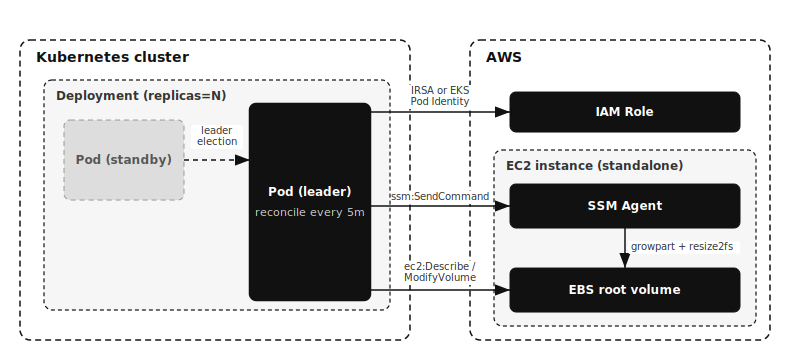

# external-ebs-autoresizer

[](https://github.com/younsl/o/pkgs/container/external-ebs-autoresizer)
[](https://github.com/younsl/o/pkgs/container/charts%2Fexternal-ebs-autoresizer)
[](https://go.dev/)
[](https://github.com/younsl/o/blob/main/LICENSE)

Automatically grows the [root filesystem][ebs-extend-fs] (ext2/3/4 or XFS) of
**standalone EC2 instances** (EC2 outside the Kubernetes cluster, not EKS nodes)
when disk usage crosses a threshold.

It runs as a long-lived Deployment inside EKS and scans instances on an interval.
By default it considers every running instance in its account and region,
excluding EKS cluster nodes (managed node groups, self-managed nodes, and
Karpenter nodes) so it only ever touches standalone EC2. Set `TAG_FILTERS` to
narrow the candidate set further. For each instance over the threshold it [grows
the root EBS volume][ebs-modify] and [extends the filesystem][ebs-extend-fs] in
place. Every step is driven and logged by the addon itself rather than delegated
to an opaque SSM runbook, so each action has clear ownership and granular logs.

[ebs-modify]: https://docs.aws.amazon.com/ebs/latest/userguide/requesting-ebs-volume-modifications.html
[ebs-modify-reqs]: https://docs.aws.amazon.com/ebs/latest/userguide/modify-volume-requirements.html
[ebs-monitor]: https://docs.aws.amazon.com/ebs/latest/userguide/monitoring-volume-modifications.html
[ebs-extend-fs]: https://docs.aws.amazon.com/ebs/latest/userguide/recognize-expanded-volume-linux.html
[ec2-modifyvolume]: https://docs.aws.amazon.com/AWSEC2/latest/APIReference/API_ModifyVolume.html
[ssm-run-command]: https://docs.aws.amazon.com/systems-manager/latest/userguide/run-command.html

## Features

- Auto-grows the root EBS volume and extends the filesystem (ext2/3/4 or XFS) in place
- Targets standalone EC2 only, excluding EKS cluster nodes by default
- Tag-based instance filtering via `TAG_FILTERS`
- Safety guards: max volume size and the AWS 6-hour modification cooldown
- Dry-run mode to preview decisions without modifying anything
- High availability via leader election when running multiple replicas
- Observability: Prometheus metrics, Kubernetes Events, Alertmanager alerts, and Grafana annotations

## Architecture

Operation mechanism. The Deployment runs one or more Pods; only the leader runs
the reconcile loop and drives EC2 and SSM, while standby Pods take over if the
leader fails. Editable source: [architecture.drawio](docs/assets/architecture.drawio).



## How it works

Each reconcile pass processes every matching instance sequentially:

1. **Measure**: run `df` on the instance via [SSM Run Command][ssm-run-command]
   (read-only) and parse the root usage percent.
2. **Decide**: skip if usage is below `USAGE_THRESHOLD_PERCENT`.
3. **Resolve**: find the root EBS volume from the instance block device mapping
   and read its current size.
4. **Guard**: skip if the volume was modified within the cooldown window ([EBS
   allows one modification per volume every 6 hours][ebs-modify-reqs]) or if the
   target size would exceed `MAX_VOLUME_SIZE_GIB`.
5. **Grow**: call [`ec2:ModifyVolume`][ec2-modifyvolume] to `ceil(current * (1 + GROW_PERCENT/100))`.
6. **Wait**: poll until the modification reaches [`optimizing`][ebs-monitor]
   (filesystem extension is safe from that point).
7. **Extend**: run [`growpart` + `resize2fs`][ebs-extend-fs] via [SSM Run
   Command][ssm-run-command].
8. **Verify**: re-measure usage and log before/after.

`DRY_RUN=true` stops after the decision and never mutates anything.

## SSM execution context

The addon uses SSM **Run Command** (`SendCommand` + `AWS-RunShellScript`), which
the SSM Agent executes as **root** by default. This differs from interactive
Session Manager (`start-session`), which runs as the unprivileged `ssm-user`.
So `growpart` and `resize2fs` run with the privileges they need without `sudo`.
The resize script still falls back to `sudo` for hardened AMIs configured to run
commands as a non-root user.

## Configuration

| Variable | Default | Description |
|----------|---------|-------------|
| `AWS_REGION` | (required) | Target region |
| `TAG_FILTERS` | (empty) | `Key=Value,Key2=Value2`, selects target instances; empty scans all instances in the account/region |
| `EXCLUDE_EKS_NODES` | `true` | Exclude EKS cluster nodes (managed node groups, self-managed, Karpenter) |
| `RECONCILE_INTERVAL` | `5m` | Loop interval (Go duration: h, m, s; e.g. `30s`, `5m`, `1h`, `1h30m`) |
| `RECONCILE_CONCURRENCY` | `10` | Max instances reconciled in parallel per pass |
| `USAGE_THRESHOLD_PERCENT` | `80` | Usage that triggers a resize |
| `GROW_PERCENT` | `10` | Growth percent per resize |
| `MAX_VOLUME_SIZE_GIB` | `1000` | Safety ceiling |
| `SSM_COMMAND_TIMEOUT` | `5m` | SSM command poll timeout |
| `SSM_POLL_INTERVAL` | `1s` | Delay between SSM command and volume modification status polls |
| `VOLUME_MODIFY_TIMEOUT` | `10m` | ModifyVolume optimizing wait timeout |
| `DRY_RUN` | `false` | Measure and decide only |
| `LEADER_ELECT` | `true` | Enable leader election for HA; requires in-cluster config |
| `LEASE_NAME` | `external-ebs-autoresizer` | Lease used as the leader-election lock |
| `POD_NAME` / `POD_NAMESPACE` / `POD_UID` | (downward API) | Identify the Pod for Kubernetes Events and leader election |
| `HEALTH_PORT` / `METRICS_PORT` | `8080` / `8081` | Probe and metrics ports |
| `LOG_LEVEL` / `LOG_FORMAT` | `info` / `json` | Logging |
| `ALERTMANAGER_ENABLED` | `false` | Enable Alertmanager alerting (requires `ALERTMANAGER_URL`) |
| `ALERTMANAGER_URL` | (empty) | Alertmanager v2 base URL (e.g. `http://alertmanager:9093`); required when enabled |
| `ALERTMANAGER_TIMEOUT` | `5s` | Timeout for each alert POST |
| `ALERTMANAGER_LABELS` | (empty) | `Key=Value,Key2=Value2` static labels merged into every alert for routing |
| `ALERTMANAGER_NOTIFY_ON` | `success` | Which resize outcomes to alert: `all`, `success`, or `failure` |

All variables have an equivalent `--flag` override.

## Kubernetes Events

Each resize attempt emits an Event on the controller's own Pod (`ResizeStarted`,
`ResizeCompleted`, `ResizeFailed`), readable via `kubectl describe pod` or
`kubectl -n <namespace> get events`. The Pod reference is built from the downward
API, so the controller only needs create/patch on Events, granted by the chart's
Role and RoleBinding.

## Alertmanager

Set `ALERTMANAGER_ENABLED=true` and `ALERTMANAGER_URL` to push alerts to an
Alertmanager v2 endpoint (`POST /api/v2/alerts`) on each resize. A completed
resize sends an `info` alert
`EBSRootVolumeAutoresizeCompleted`; a failed resize sends a `warning` alert
`EBSRootVolumeAutoresizeFailed`. Resize-start is not alerted to avoid noise.

`ALERTMANAGER_NOTIFY_ON` selects which outcomes are sent: `success` (default,
completed only), `failure` (failed only), or `all`.

Alerts are sent with only a `startsAt` timestamp, so Alertmanager auto-resolves
them after its configured `resolve_timeout`: each resize is a one-shot event, not
a long-lived firing alert. Every alert carries `instance_id`, `instance_name`,
`volume_id`, and `device` labels, plus any static labels from
`ALERTMANAGER_LABELS` (e.g. `cluster=prod`) for routing, and a `summary`
annotation. Delivery is best-effort: a failed POST is logged and never blocks or
fails a reconcile.

## Grafana annotations

Set `config.grafanaAnnotation.enabled=true` with a URL and service account token
to mark each resize on Grafana dashboards (`POST /api/annotations`). An
annotation is posted automatically when a resize **completes** (region
annotation spanning its duration) or **fails** (point annotation); a resize that
only starts is never annotated. `config.grafanaAnnotation.annotateOn` selects
which outcomes are recorded: `all` (default), `success`, or `failure`. See
[docs/grafana-annotations.md](docs/grafana-annotations.md) for tags, token setup,
and dashboard query configuration.

## High availability

The chart enables leader election automatically when `replicaCount` is above 1,
so extra replicas stand by and only the leader reconciles. This avoids concurrent
`ModifyVolume` calls against the same volume. The leader holds a
`coordination.k8s.io` Lease in its own namespace.

## IAM

Attach this policy to the addon's IAM role. The role is mapped to the addon's
ServiceAccount through an EKS Pod Identity association (see Installation).
`Describe*` actions do not support resource-level permissions and require `"*"`;
`ec2:ModifyVolume` is scoped to volumes and `ssm:SendCommand` to the managed
document and instances.

```json
{
  "Version": "2012-10-17",
  "Statement": [
    {
      "Sid": "DiscoverInstancesAndVolumes",
      "Effect": "Allow",
      "Action": [
        "ec2:DescribeInstances",
        "ec2:DescribeVolumes",
        "ec2:DescribeVolumesModifications"
      ],
      "Resource": "*"
    },
    {
      "Sid": "ModifyRootVolume",
      "Effect": "Allow",
      "Action": "ec2:ModifyVolume",
      "Resource": "arn:aws:ec2:*:123456789012:volume/*"
    },
    {
      "Sid": "RunResizeCommandsViaSSM",
      "Effect": "Allow",
      "Action": "ssm:SendCommand",
      "Resource": [
        "arn:aws:ssm:*::document/AWS-RunShellScript",
        "arn:aws:ec2:*:123456789012:instance/*"
      ]
    },
    {
      "Sid": "ReadSSMCommandResults",
      "Effect": "Allow",
      "Action": [
        "ssm:GetCommandInvocation",
        "ssm:DescribeInstanceInformation"
      ],
      "Resource": "*"
    }
  ]
}
```

Replace `123456789012` with your account ID. To restrict which instances can be
modified or commanded, narrow the `instance/*` and `volume/*` ARNs or add a
`Condition` on `aws:ResourceTag`.

Target instances must have the SSM Agent running and the
`AmazonSSMManagedInstanceCore` managed policy attached.

## Build

```bash
make build          # local binary into bin/
make test           # go test -race
make coverage       # enforce minimum line coverage (70%)
make lint           # gofmt check + go vet
make docker-build   # multi-arch image (linux/amd64, linux/arm64)
```

## Installation

### Prerequisites

Before installing, set up AWS authentication. The addon authenticates to AWS
through [EKS Pod Identity][pod-identity], so the following must already exist:

1. An IAM role with the policy from the [IAM](#iam) section attached, and a
   trust policy that allows the `pods.eks.amazonaws.com` service principal.
2. The [EKS Pod Identity Agent][pod-identity-agent] add-on installed on the
   cluster.
3. An [EKS Pod Identity association][pod-identity-assoc] that maps the role to
   the addon's ServiceAccount (`external-ebs-autoresizer` in the `kube-system`
   namespace by default). Create it after the chart is installed, or pre-create
   the ServiceAccount and reuse it.

With Pod Identity the role mapping lives in the association, so no
`eks.amazonaws.com/role-arn` annotation is needed on the ServiceAccount.

[pod-identity]: https://docs.aws.amazon.com/eks/latest/userguide/pod-identities.html
[pod-identity-agent]: https://docs.aws.amazon.com/eks/latest/userguide/pod-id-agent-setup.html
[pod-identity-assoc]: https://docs.aws.amazon.com/eks/latest/userguide/pod-id-association.html

### Install

The recommended way to install is the Helm chart published as an OCI artifact on
GHCR. Installing into the `kube-system` namespace is recommended, since this is a
cluster-level addon.

```bash
helm install external-ebs-autoresizer \
  oci://ghcr.io/younsl/charts/external-ebs-autoresizer \
  --namespace kube-system \
  --set config.region=ap-northeast-2 \
  --set config.tagFilters=Environment=production
```

List available chart versions with [crane](https://github.com/google/go-containerregistry/blob/main/cmd/crane/README.md):

```bash
crane ls ghcr.io/younsl/charts/external-ebs-autoresizer
```

To install from a local checkout instead, point Helm at the chart directory:

```bash
helm install external-ebs-autoresizer ./charts/external-ebs-autoresizer \
  --namespace kube-system \
  --set config.region=ap-northeast-2 \
  --set config.tagFilters=Environment=production
```

Observability:
- `/healthz`, `/readyz` on `:8080`
- Prometheus `/metrics` on `:8081`

See [docs/metrics.md](docs/metrics.md) for the full list of exposed metrics,
their labels, and example PromQL queries. See
[docs/alerting.md](docs/alerting.md) for how alerts are pushed to Alertmanager,
including alert types, labels, the notify-on policy, and routing examples. See
[docs/grafana-annotations.md](docs/grafana-annotations.md) for marking resize
events on Grafana dashboards.
