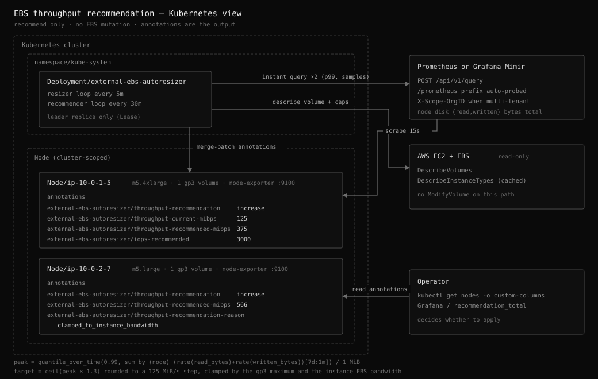

# Node EBS throughput recommendation

Status: implemented, disabled by default (`throughputRecommendation.enabled: false`).

Recommends a gp3 throughput (and the IOPS it requires) for each Kubernetes Node in
the cluster the addon runs in, and publishes the recommendation as annotations on
the Node object.

## Scope

In scope:

- Read a demand signal from a Prometheus-compatible backend (Prometheus or Mimir).
- Read the node's volume configuration and its instance type's EBS bandwidth from EC2.
- Publish a recommendation as Node annotations and Prometheus metrics.

Out of scope, deliberately:

- **Applying the recommendation.** The addon has no `ModifyVolume` on this path and
  cannot acquire one: the AWS surface the recommender depends on is a read-only
  interface. The demand signal is a statistical summary of past behavior, and
  resizing from an inference is a different decision from resizing because a
  filesystem is full, which is what the resize loop does.
- **IOPS recommendation as its own goal.** IOPS is only recommended upward, and only
  as far as the gp3 ratio forces. Small random IO never shows up in a throughput
  metric, so a downward IOPS move derived from this signal could throttle a
  workload the signal cannot see.
- **Volume types other than gp3.** gp2 derives throughput from size and io1/io2
  derive it from IOPS, so on those types a throughput recommendation is really a
  size or IOPS recommendation.
- **Nodes with more than one attached EBS volume.** See [Single volume per node](#single-volume-per-node).

This subsystem shares nothing with the resize loop but the process, the leader
election, and the AWS client. It targets in-cluster Nodes, which the resizer
excludes by default (`excludeEKSNodes: true`).

## Architecture



One pass makes four calls for the first 200 nodes: two instant queries, one
`DescribeVolumes`, one `DescribeInstanceTypes` (cached for the process lifetime, so
a steady cluster settles into three). The queries are batched at 200 node names, so
a 1000-node cluster issues ten of them, sequentially — never in parallel, so only one
query is ever in flight against the metrics backend. Per-node work is pure
computation plus, at most, one `PATCH`.

## Why node exporter and not CloudWatch

Throughput sizing needs the peak, not the mean.

| | CloudWatch `AWS/EBS` | node exporter |
| --- | --- | --- |
| Resolution | 1 min (Nitro), 5 min otherwise | scrape interval, typically 15-30s |
| Publish lag | 2-5 min | none |
| Cost | charged per `GetMetricData` metric, subject to API throttling | already scraped; reuses the existing backend |
| Measured at | the EBS service | the guest block layer, after merges |
| Throttle signal | gp3 has no per-volume throttle counter (`BurstBalance` is gp2 only) | `node_disk_io_now`, `node_disk_io_time_weighted_seconds_total` |

A workload that saturates the 125 MiB/s gp3 baseline for ten seconds averages to
roughly 30 MiB/s over a minute. At CloudWatch's best granularity the burst that
needs the throughput is invisible, and the recommendation would be drawn from a
number the volume never actually served.

What CloudWatch still has and node exporter does not: `EBSByteBalance%` on
burstable-bandwidth instance types, which tells you the *instance* is the
bottleneck rather than the volume. The instance ceiling is instead read statically
from `DescribeInstanceTypes` here, which covers the sizing decision without a
second metrics source.

## Demand signal

Two instant queries, evaluated against Prometheus or Mimir unchanged:

```promql
# peak: MiB/s per node
quantile_over_time(0.99,
  (max by (node) (sum by (node, instance) (
      rate(node_disk_read_bytes_total{node=~"<this cluster's nodes>",device=~"nvme[0-9]+n[0-9]+|xvd[a-z]+|sd[a-z]+"}[1m])
    + rate(node_disk_written_bytes_total{node=~"<this cluster's nodes>",device=~"nvme[0-9]+n[0-9]+|xvd[a-z]+|sd[a-z]+"}[1m])
  )))[7d:1m]
) / 1048576

# confidence: how many data points backed that peak
count_over_time((max by (node) (sum by (node, instance) (...)))[7d:1m])
```

The `/ 1048576` is applied inside the query so the backend answers in the final unit
and the same expression pasted into Grafana shows the same numbers the annotation
carries.

### Scoping to this cluster without a setting

The node matcher is an anchored alternation of the Node names the addon just listed
from its own API server, batched at 200 names per query. That is why there is no
`cluster` label to configure: the addon already knows which nodes are its own, so a
metrics backend shared by several clusters only ever reads the series that belong
here. Node names are DNS names, so every name is regex-escaped before it goes into
the alternation; an unescaped dot would be a wildcard matching unrelated series.
Prometheus and Mimir both compile an alternation of literals into a set lookup, so a
few hundred names cost no more than one.

The two-level aggregation is the other half. `sum by (node, instance)` totals a
node's devices within one scrape target, and `max by (node)` then collapses whatever
targets remain for that node name instead of adding them. Two cases need that:

- A shared backend where two clusters on the same subnets produce identical node
  names. A plain `sum by (node)` would add two unrelated nodes' throughput and
  overstate the peak; the max reports the busier of the two.
- A node exporter Pod that restarted, whose old and new target labels are both
  inside the staleness window for a few minutes. A plain sum would double the node's
  throughput for that period.

A collision where both the node name *and* the target label are identical is
indistinguishable without a tenancy label, and no aggregation can fix it.

### Skipping nodes too young to have history

A Node created an hour ago cannot hold 30% of a 7-day window, so querying a
multi-day range for it can only ever return `insufficient_samples`. Those nodes are
filtered out before the query is built, using the `creationTimestamp` the addon
already has from listing them.

The threshold is derived from the same fraction as the sample gate
(`0.3 × lookbackWindow`, about 2 days at the default), which is what makes it free of
accuracy loss: a node below it could not have passed the sample gate anyway. The
converse does not hold, so the sample gate still runs for every node that passes the
age gate — an old node whose node exporter was down for days has the age but not the
history.

Such a node reports `node_younger_than_window` rather than `no_metrics_for_node`.
The distinction is the point: one says wait, the other sends an operator looking for
a broken scrape. Its volume and current provisioning are still reported, because
those are known without any query.

Under Karpenter, where the node set turns over constantly, this is most of the
saving available. When every node is too young the pass issues no query at all: an
unscoped one would read every series the backend holds.

### Presence check

Scoping by name means a wrong `metricNodeNameLabel` returns no series rather than
unattributable ones, so a missing scrape and a wrong label look identical. When the
observation query comes back empty, one instant query separates them:

```promql
count(node_disk_read_bytes_total{device=~"nvme[0-9]+n[0-9]+|xvd[a-z]+|sd[a-z]+"})
```

It reads no history, carries no node matcher, and only runs when there is already
nothing to report, so it costs nothing in the normal case. A non-zero result means
the data is there but not labelled with these node names.

Notes:

- The device matcher must exclude `dm-*`, `loop*`, and `md*`: their IO is already
  counted on the underlying device, and summing both double-counts the node.
- The sample count is the confidence gate. A node that joined an hour ago has a
  nearly empty 7-day window; without the gate its short history would read as a
  genuinely quiet workload. Below 30% coverage of the window the recommendation is
  `unknown` with reason `insufficient_samples`.
- `metricNodeNameLabel` is the metric label carrying the Node name.
  kube-prometheus-stack relabels it to `node`; a plain node exporter scrape leaves
  only `instance`. Series without that label are dropped and warned about rather
  than attributed to a guess. It is named for the metric rather than the Node
  because a Kubernetes Node carries labels of its own and this is not one of them.
- A `7d:1m` subquery over every node is the most expensive query the addon issues.
  That is why the recommender runs on its own interval (default `30m`) rather than
  the 5-minute resize interval. The startup probe logs the query's latency; if it
  is uncomfortable on your backend, shorten `lookbackWindow`.

### Prometheus and Mimir compatibility

Both implement the same `/api/v1/query` contract. Two deployment differences are
handled in the client:

- **API prefix.** Prometheus serves `<base>/api/v1`; a Mimir query-frontend or
  gateway usually serves `<base>/prometheus/api/v1`. The startup preflight probes
  both and pins whichever answers, so `prometheusUrl` may include the prefix or
  omit it. A prefix is only rejected on 404/405 — a 401 or a connection failure is
  reported as itself, not misreported as a path problem.
- **Tenant.** `prometheusTenantId` is sent as `X-Scope-OrgID`, which Mimir requires
  when multi-tenancy is enabled and Prometheus ignores.

Queries are sent as `POST` with a form-encoded body, since a generated expression
is long enough to hit URL length limits in proxies in front of either backend.

## Decision

```
peak     = p99 of per-step throughput over the window          (MiB/s)
desired  = peak × 1.3                                          (30% headroom)
target   = ceil(desired / 125) × 125                           (125 MiB/s step)
ceiling  = min(1000, floor(instance EBS bandwidth in MiB/s))
target   = clamp(target, 125, ceiling)

action   = increase   if target > current
           decrease   if target ≤ current − 125
           none       otherwise
```

Four rules that are easy to get wrong and are therefore encoded, not left to the
operator:

1. **gp3 throughput needs IOPS.** gp3 allows at most 0.25 MiB/s of throughput per
   provisioned IOPS, so throughput above `IOPS/4` is rejected by EC2. At the default
   3000 IOPS the volume is capped at 750 MiB/s no matter what throughput is
   requested. Every recommendation therefore carries `iops-recommended`, raised to
   `4 × throughput` when the ratio demands it.
2. **The instance caps the volume.** `DescribeInstanceTypes` reports EBS bandwidth
   in decimal **MB/s**, while gp3 throughput is provisioned in binary **MiB/s**.
   Comparing the two directly overstates headroom by about 4.9% — enough to
   recommend a throughput the instance cannot drive. m5.large's 593.75 MB/s burst
   is 566 MiB/s.
3. **Hysteresis, not a deadband percentage.** A decrease needs the target to be a
   full 125 MiB/s step below the current value. Without it a recommendation sitting
   near a step boundary flips every pass.
4. **A missing peak is not a quiet node.** `NaN`, `Inf`, and negative peaks resolve
   to `insufficient_samples`, never to the floor.

A decrease is reported like any other recommendation. Whether to take it is not the
recommender's decision to make: the loop only annotates, so suppressing the downward
number would hide a computed result rather than avoid a risk. The risk that a quiet
window understates real demand is real, and it lands where it belongs, on the
operator reading `throughput-observation-window` and
`throughput-observation-samples` before applying anything.

`capped` is reported even when the action is `none`: a volume already at a ceiling
while demand exceeds it has nothing to recommend but is still throughput-bound, and
that has to stay visible.

## Annotation structure

Keys are `external-ebs-autoresizer/<suffix>`. The prefix is a constant, not a
setting: a single DNS label is a valid annotation key prefix, and making it
configurable would only let an upgrade orphan every annotation already written.

| Key | Example | Meaning |
| --- | --- | --- |
| `volume-id` | `vol-0a1b2c3d4e5f6a7b8` | The single attached EBS volume the numbers describe |
| `throughput-current-mibps` | `125` | Provisioned throughput |
| `throughput-observed-peak-mibps` | `287.4` | Measured peak over the window |
| `throughput-utilization-percent` | `229.9` | Peak as a percentage of provisioned. Over 100 is normal: node exporter measures bytes actually moved, and a gp3 volume bursts above its provisioned throughput. Omitted when the peak is not a number |
| `throughput-recommended-mibps` | `375` | Recommended throughput; equals current when the action is `none` |
| `iops-current` | `3000` | Provisioned IOPS |
| `iops-recommended` | `3000` | IOPS needed for the recommended throughput; never below current |
| `throughput-recommendation` | `increase` | `increase`, `decrease`, `none`, or `unknown` |
| `throughput-recommendation-reason` | `observed_peak_above_provisioned` | Why; see below |
| `throughput-observation-window` | `7d/p99` | Lookback and quantile the numbers came from |
| `throughput-observation-samples` | `10080` | Data points backing the peak |
| `throughput-observed-at` | `2026-07-31T04:12:07Z` | When the recommendation was computed (RFC 3339, UTC) |

Reasons:

| Reason | Action | Meaning |
| --- | --- | --- |
| `observed_peak_above_provisioned` | `increase` | Demand plus headroom exceeds the provisioned throughput |
| `observed_peak_far_below_provisioned` | `decrease` | Demand is at least one step below provisioned |
| `observed_peak_within_provisioned` | `none` | Current provisioning fits |
| `clamped_to_gp3_maximum` | `increase` / `none` | Demand exceeds 1000 MiB/s or the configured maximum |
| `clamped_to_instance_bandwidth` | `increase` / `none` | The instance type cannot drive what the volume could provision |
| `insufficient_samples` | `unknown` | Window holds under 30% of the data points a full one would, or the peak is not a number |
| `node_younger_than_window` | `unknown` | The Node is too young to hold enough history, so it was never queried. Normal for a new node; wait |
| `unsupported_volume_type` | `unknown` | Not gp3 |
| `multiple_attached_volumes` | `unknown` | More than one EBS volume attached |
| `no_attached_volume` | `unknown` | No attached EBS volume found |
| `no_metrics_for_node` | `unknown` | The query returned no series for this node |
| `not_an_ec2_node` | `unknown` | Not EC2-backed; **not written to the Node** |

Example:

```console
$ kubectl get node ip-10-0-1-5.ap-northeast-2.compute.internal -o jsonpath='{.metadata.annotations}' | jq
{
  "external-ebs-autoresizer/volume-id": "vol-0a1b2c3d4e5f6a7b8",
  "external-ebs-autoresizer/throughput-current-mibps": "125",
  "external-ebs-autoresizer/throughput-observed-peak-mibps": "287.4",
  "external-ebs-autoresizer/throughput-utilization-percent": "229.9",
  "external-ebs-autoresizer/throughput-recommended-mibps": "375",
  "external-ebs-autoresizer/iops-current": "3000",
  "external-ebs-autoresizer/iops-recommended": "3000",
  "external-ebs-autoresizer/throughput-recommendation": "increase",
  "external-ebs-autoresizer/throughput-recommendation-reason": "observed_peak_above_provisioned",
  "external-ebs-autoresizer/throughput-observation-window": "7d/p99",
  "external-ebs-autoresizer/throughput-observation-samples": "10080",
  "external-ebs-autoresizer/throughput-observed-at": "2026-07-31T04:12:07Z"
}
```

Listing every node that wants more throughput:

```bash
kubectl get nodes \
  -o custom-columns='NODE:.metadata.name,\
ACTION:.metadata.annotations.external-ebs-autoresizer/throughput-recommendation,\
CURRENT:.metadata.annotations.external-ebs-autoresizer/throughput-current-mibps,\
PEAK:.metadata.annotations.external-ebs-autoresizer/throughput-observed-peak-mibps,\
UTIL%:.metadata.annotations.external-ebs-autoresizer/throughput-utilization-percent,\
TARGET:.metadata.annotations.external-ebs-autoresizer/throughput-recommended-mibps,\
IOPS:.metadata.annotations.external-ebs-autoresizer/iops-recommended'
```

Applying one, once reviewed:

```bash
aws ec2 modify-volume --volume-id vol-0a1b2c3d4e5f6a7b8 --throughput 375 --iops 3000
```

## Kubernetes Events

As each Node's evaluation begins, a Normal Event is recorded against the Node:

```console
$ kubectl describe node ip-10-0-1-5.ap-northeast-2.compute.internal
...
Events:
  Type    Reason                        Age    From                       Message
  ----    ------                        ----   ----                       -------
  Normal  ThroughputMeasurementStarted  4m     external-ebs-autoresizer   Measuring EBS throughput over 7d/p99 to recommend a gp3 throughput; no volume is modified
```

The message says the window and that nothing is modified, because an Event on a Node
otherwise reads like an action was taken.

Two implementation notes:

- **Aggregation makes it affordable.** Repeating the same reason for the same Node
  does not create a new Event object: the recorder increments the count on the
  existing one. A per-node, per-pass Event is therefore one object per node, not one
  per pass per node.
- **A separate emitter.** A Node is cluster-scoped, so its Events carry no namespace
  and land in `default`, the same as the kubelet's. client-go rejects an Event whose
  namespace differs from the one its sink was built with, so the recommender cannot
  reuse the resizer's Pod-namespaced emitter. That is also why the ClusterRole grants
  `create` and `patch` on events.

Events are auxiliary: when the emitter cannot be built (running outside a cluster)
the recommender logs a warning and carries on.

### Write behavior

- **Merge patch, not update.** Concurrent writers (Karpenter, the cluster
  autoscaler, CSI drivers) keep their own annotations; no read-modify-write retry
  loop is needed.
- **No write when nothing changed.** If every value matches what is already on the
  Node and `throughput-observed-at` is younger than 24h, the pass issues no `PATCH`. Otherwise
  a steady-state cluster would rewrite every Node's annotations hourly, churning
  etcd and every Node's `resourceVersion` for no new information.
- **Stale keys are deleted.** When a Node drops to `unknown` (volume detached,
  metrics gone), the numeric keys are removed in the same patch. Leaving the last
  numbers behind would present a stale recommendation as a current one.
- **`throughput-observed-at` is refreshed at least daily** even when nothing changed, so a
  frozen timestamp means a stopped recommender rather than a settled one.
- **`dryRun: true` writes nothing** and still computes, logs, and exports
  everything. The recommender never mutates AWS, but annotating Nodes is a cluster
  write, so a dry run has to cover it.

Every node's outcome is logged, so a pass is auditable from the logs alone:

| Outcome | Level | Meaning |
| --- | --- | --- |
| `written` | INFO | The patch was applied. The line carries the values and the removed keys, so it is enough to reconstruct what landed on the Node |
| `dry_run` | INFO | What would have been written |
| `failed` | ERROR | The patch was rejected; the pass continues with the remaining Nodes |
| `unchanged` | DEBUG | Already current, no patch issued |
| `not_applicable` | DEBUG | Not an EC2-backed Node, so never annotated |

A write is at info because it is a cluster mutation. `unchanged` is at debug because
in a steady state almost every node is unchanged on every pass, and logging those at
info would bury the writes.

```json
{"level":"INFO","msg":"annotated node with EBS throughput recommendation","node":"ip-10-0-1-5","volume":"vol-0a1b2c3d","recommendation":"increase","reason":"observed_peak_above_provisioned","outcome":"written","annotations":{"external-ebs-autoresizer/throughput-recommended-mibps":"375","...":"..."},"removed":null}
{"level":"ERROR","msg":"failed to annotate node with EBS throughput recommendation","node":"ip-10-0-2-7","recommendation":"increase","reason":"observed_peak_above_provisioned","outcome":"failed","error":"patch node ip-10-0-2-7 annotations: Operation cannot be fulfilled"}
```

## Single volume per node

A node with more than one attached EBS volume reports `multiple_attached_volumes`
and is left alone.

The demand signal is per node, summed across block devices. Attributing it to one
volume requires mapping a node exporter `device` label back to a volume ID, which
on Nitro means reading `/dev/disk/by-id/nvme-Amazon_Elastic_Block_Store_vol*`,
which means a privileged DaemonSet on every node. That is a different deployment
shape than a single controller Deployment, so the ambiguous case is reported rather
than guessed at. Nodes with only a root volume — the common EKS and Karpenter
shape — are unaffected.

## Startup

Four log lines establish, in order, that the feature is on, that the backend is
reachable, what will be asked of it, and that the answer is usable. The last one is
the point: a preflight proves the backend answers, not that the configured query,
device matcher, and node label return this cluster's nodes.

```json
{"level":"INFO","msg":"EBS throughput recommendation enabled","prometheus_url":"http://mimir-gateway.monitoring","tenant_id":"","interval":"1h0m0s","lookback_window":"7d","quantile":0.99,"headroom_percent":30,"annotation_prefix":"external-ebs-autoresizer","dry_run":false}
{"level":"INFO","msg":"prometheus preflight check succeeded","endpoint":"http://mimir-gateway.monitoring/prometheus/api/v1/query","status":200,"latency":"31ms","attempt":1}
{"level":"INFO","msg":"EBS throughput recommendation queries resolved","peak_query":"quantile_over_time(0.99, (sum by (node) (rate(node_disk_read_bytes_total{device=~\"nvme[0-9]+n[0-9]+|xvd[a-z]+|sd[a-z]+\"}[1m]) + rate(node_disk_written_bytes_total{device=~\"nvme[0-9]+n[0-9]+|xvd[a-z]+|sd[a-z]+\"}[1m])))[7d:1m]) / 1048576","sample_count_query":"count_over_time((sum by (node) (...))[7d:1m])"}
{"level":"INFO","msg":"EBS throughput recommendation metrics check succeeded","nodes":12,"series":12,"latency":"1.42s","busiest_node":"ip-10-0-1-5.ap-northeast-2.compute.internal","busiest_node_peak_mibps":287.4}
```

The preflight line also reveals which API prefix was pinned, which is how you
confirm a Mimir URL resolved to `/prometheus/api/v1` rather than falling back.

The probe's `latency` is the real cost signal for `interval`: it is how long a
multi-day subquery over every node takes on this backend. A latency in the tens of
seconds is the sign to shorten `lookbackWindow`.

`busiest_node_peak_mibps` is rounded to one decimal so it can be compared against a
dashboard panel directly.

### When the probe does not come back clean

| Log | Level | Meaning |
| --- | --- | --- |
| `metrics check succeeded` | INFO | Series returned and attributed to nodes |
| `metrics check returned no usable series: the configured node label is missing from every result` | ERROR | Series came back but none carried `metricNodeNameLabel`. The one misconfiguration every connectivity check passes. The line names the fix |
| `metrics check returned no data` | WARN | The backend answered with nothing. node exporter is not scraped into this backend |
| `metrics check failed; the recommender will retry on its interval` | ERROR | The query itself failed |

None of them stop startup, and none disable the feature: a backend that is briefly
unavailable at boot is no reason to skip every later pass. The probe is bounded by
`queryTimeout` so it cannot hang startup on a backend that accepts the connection
and never answers.

The probe runs on **every replica**, before leader election, deliberately. The query
is read-only, and a standby replica that cannot read the metrics backend is worth
seeing at startup rather than at failover.

## Configuration

Eight settings. Everything else is fixed policy in `internal/throughput/defaults.go`.

```yaml
throughputRecommendation:
  enabled: false            # requires prometheusUrl when true
  prometheusUrl: ""         # Prometheus, or a Mimir query-frontend/gateway
  prometheusTenantId: ""    # X-Scope-OrgID; empty for Prometheus
  metricNodeNameLabel: node           # "instance" for a plain node exporter scrape
  lookbackWindow: 7d        # a Prometheus duration, not a Go duration
  interval: 30m             # separate from reconcileInterval
  applyOnResize: true       # piggyback an increase onto a size expansion; false = advisory-only
```

`applyOnResize` has its own design document:
[throughput-apply-on-resize.md](throughput-apply-on-resize.md).

Plus `PROMETHEUS_BEARER_TOKEN` from the environment, for a gateway that fronts the
metrics backend with token auth. It is deliberately not a config-file key: the
chart renders the config into a ConfigMap, so a file-sourced credential would be
stored in plain text. Inject it from a Secret through the chart's `extraEnv`.

Each remaining setting is here because a cluster genuinely differs on it:
`metricNodeNameLabel` because kube-prometheus-stack and a plain node exporter scrape disagree
and neither default is right for both, `lookbackWindow` because the backend's
retention bounds it, and `interval` because the query cost scales with cluster size.

### What is no longer configurable

| Was a setting | Now | Why |
| --- | --- | --- |
| `annotationPrefix` | `external-ebs-autoresizer` | The keys are this addon's published interface. Changing the prefix orphans every annotation already on every Node, which is not a per-install decision |
| `quantile` | 0.99 | 1.0 lets a single spike set the recommendation |
| `headroomPercent` | 30 | |
| `stepMiBps` | 125 | The gp3 baseline, so every recommendation is a whole number of baselines |
| `minThroughputMiBps` / `maxThroughputMiBps` | 125 / 1000 | The gp3 limits; a narrower range only produced clamped recommendations |
| `deviceRegex` | `nvme[0-9]+n[0-9]+|xvd[a-z]+|sd[a-z]+` | Covers every device naming AWS produces |
| `rateWindow` / `queryStep` | 1m | Below the scrape interval adds nothing; above it averages away the bursts this feature exists to catch |
| `queryTimeout` | 60s | |
| `nodeSelector` | every Node | Nodes that cannot carry a recommendation report why instead of being filtered out, which is what makes a misconfiguration visible |
| `byteRateQuery` | removed | If the built-in subquery is too expensive, lower `lookbackWindow` |
| `allowDecrease` | always on | The loop only annotates. Off, it discarded a computed decrease and reported `none` with `observed_peak_within_provisioned`, hiding the one number an operator would act on |
| `minSamples` | derived | See below |
| `prometheusHeaders` | removed | It was a plain-text ConfigMap field that invited a credential |
| `seriesSelector` | derived | The query is scoped to the Node names the addon lists from its own API server, so no `cluster` label has to be named. See [Scoping to this cluster without a setting](#scoping-to-this-cluster-without-a-setting) |

Parsing is strict, so a config carrying any of these keys fails at startup rather
than silently having no effect.

`minSamples` was an absolute count, and it was wrong: a 7d window at a 1m step holds
10080 points, but a 12h window holds 720, so the shipped default of 1000 made every
window shorter than ~17h permanently untrustworthy. It is now 30% coverage of
whatever window is configured, so shortening `lookbackWindow` shortens the
confidence gate with it.

`lookbackWindow` is validated against the Prometheus duration grammar rather than
parsed as a Go duration: `7d` is valid PromQL and invalid Go, `1.5h` is the reverse.
That validation is also what keeps an operator-supplied value from injecting PromQL,
as is the label-name check on `metricNodeNameLabel`.

Every rule is checked at startup even when `enabled` is false, so flipping the flag
later cannot surface a config error for the first time in production.

## Metrics

| Metric | Type | Labels |
| --- | --- | --- |
| `external_ebs_autoresizer_node_throughput_current_mibps` | gauge | `node`, `instance_id`, `volume_id` |
| `external_ebs_autoresizer_node_throughput_observed_peak_mibps` | gauge | `node`, `instance_id`, `volume_id` |
| `external_ebs_autoresizer_node_throughput_recommended_mibps` | gauge | `node`, `instance_id`, `volume_id` |
| `external_ebs_autoresizer_recommendation_total` | counter | `action`, `reason` |

The three gauges share a label set so headroom is a plain vector match, and they
are reset at the start of every pass: under Karpenter the node set turns over
constantly, and a terminated node's last reading would otherwise stay exported and
read as live.

```promql
# nodes wanting more throughput than they have
external_ebs_autoresizer_node_throughput_recommended_mibps
  > external_ebs_autoresizer_node_throughput_current_mibps

# nodes stuck at a ceiling
sum by (reason) (
  rate(external_ebs_autoresizer_recommendation_total{reason=~"clamped_to_.*"}[1h])
)
```

Errors are counted on the existing `external_ebs_autoresizer_error_total` with the
stages `node_list`, `query_peak`, `query_samples`, `describe_volumes`,
`describe_instance_types`, and `annotate`.

## Permissions

Kubernetes RBAC, in addition to what the resizer needs. Nodes are cluster-scoped,
so this is a ClusterRole rather than the namespaced Role the resize loop uses, and
the chart only creates it when the recommender is enabled:

```yaml
- apiGroups: [""]
  resources: ["nodes"]
  verbs:
    - get
    - list
    - patch
- apiGroups: [""]
  resources: ["events"]
  verbs:
    - create
    - patch
```

The events rule is cluster-scoped rather than namespaced because a Node's Events are
stored in `default`, not in the release namespace.

IAM, in addition to what the resizer needs:

```json
{
  "Sid": "ReadInstanceTypeEBSCapabilities",
  "Effect": "Allow",
  "Action": "ec2:DescribeInstanceTypes",
  "Resource": "*"
}
```

`ec2:DescribeVolumes` is already granted for the resize loop. No mutating
permission is added.

## Failure behavior

| Failure | Result |
| --- | --- |
| Every Node too young | No query is issued at all; each Node reports `node_younger_than_window` |
| Not running in-cluster | Recommender disabled at startup, logged; resize loop unaffected |
| Backend unreachable at startup | Preflight logged as failed, recommender still starts; the API prefix falls back to the unprefixed candidate |
| Query fails during a pass | Pass aborts before any annotation is written, error counted, next pass retries |
| EC2 describe fails during a pass | Same: nothing is written from partial data |
| One Node's patch fails | Logged and counted, the pass continues with the remaining Nodes |
| `metricNodeNameLabel` wrong for the cluster | The startup probe reports it as an ERROR naming the fix, and every Node reports `no_metrics_for_node` |
