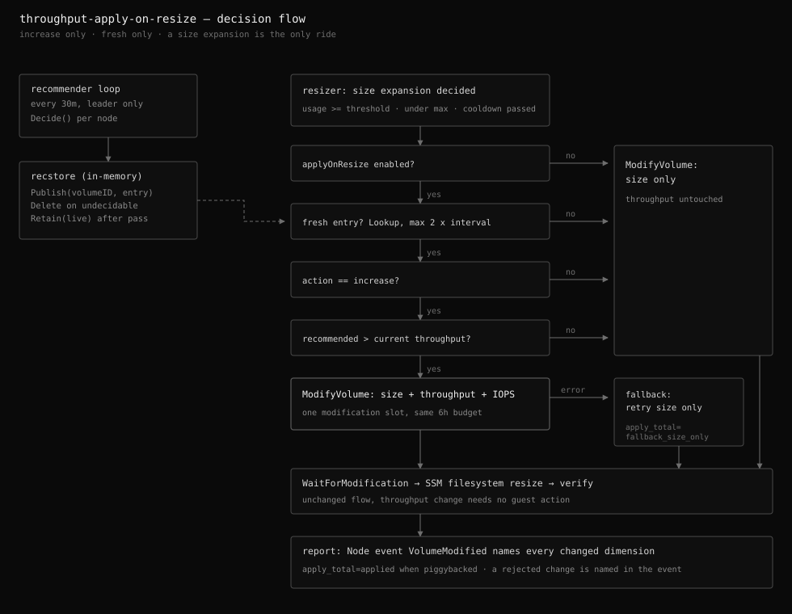

# Applying throughput recommendations on resize

Status: implemented (`throughputRecommendation.applyOnResize`, default on
whenever the recommender is enabled; an explicit `false` is the kill switch
that keeps recommendations advisory-only)

The throughput recommender computes what a gp3 volume should be provisioned at,
but only ever publishes it as Node annotations. This design lets the resize loop
apply that recommendation, without giving the recommender any write access and
without spending an extra EBS modification slot.



## The modification slot problem

EC2 allows one modification per volume per 6 hours. A `ModifyVolume` call may
change size, throughput, and IOPS together, and any combination consumes the
same single slot. The resize loop already spends a slot whenever a root
filesystem crosses its usage threshold, so a size expansion is a free ride for
a throughput change: piggybacking it costs nothing, while a throughput-only
modification would spend a slot the next urgent size expansion might need.

The corollary is that this feature is opportunistic by design. A volume whose
disk never fills keeps its recommendation as an annotation, exactly as before.
There is no throughput-only apply path, deliberately.

## Architecture: an in-process hand-off

```
recommender pass (30m)                     resizer pass (1m)
  Decide() per node                          usage >= threshold
  -> Node annotations (unchanged)            -> cooldown check (unchanged)
  -> recstore.Publish(volumeID, entry)       -> recstore.Lookup(volumeID, maxAge)
                                             -> ModifyVolume(size [+throughput +iops])
```

`internal/recstore` is a mutex-guarded map keyed by volume ID, shared between
the two loops of the same process. The recommender publishes every decided
action (`increase`, `decrease`, `none`) with the values it computed, deletes
entries for volumes that can no longer be decided, and after each successful
pass calls `Retain` with the set of volumes it saw, sweeping entries for
volumes that no longer exist. That sweep is what bounds the store under
Karpenter node churn: its size is always at most the current node count
(roughly 200 bytes per node).

The store is created whenever the recommender is enabled. Whether a
recommendation is ever applied stays gated separately by `applyOnResize`
inside the resizer, so the hand-off also serves Node event addressing (below)
when applying is off. The gate defaults to on: enabling the recommender is the
operator's opt-in, and the key exists as a kill switch so a misbehaving apply
path can be turned off without losing the recommendations themselves (the
alternatives are disabling the whole recommender, losing visibility, or
pausing the resize policy, losing expansions).

### Why not re-read the Node annotations

The annotations look like an existing hand-off channel, but they fail all
three requirements this feature has:

- **Freshness.** `throughput-observed-at` is only rewritten when a value
  changes or 24 hours pass (the skip-unchanged optimization), so it cannot
  answer "is the recommender alive right now", which is what the apply gate
  needs. The in-memory entry is re-stamped every pass for free.
- **Dependency shape.** The resizer has no Kubernetes dependency: it discovers
  via EC2 tags and measures via SSM, and must keep working outside a cluster.
  Reading annotations means a Kubernetes client plus an instance-ID-to-Node
  reverse lookup on every resize pass.
- **Interface discipline.** The annotation keys are the addon's published
  operator interface. Consuming them internally would promote their string
  formats into an internal API, where changing them breaks the addon itself.

The canonical Kubernetes-native version of this hand-off is the VPA split
(recommender writes a CRD status, updater consumes it). That shape is needed
when producer and consumer are separate processes. Here they share a binary
and a leader, and the state is a derived cache recomputed every 30 minutes,
so process memory is the right store. Losing it on restart costs at most one
size-only resize before the next recommender pass refills it.

## Apply rules

`ModifySpec` carries the change; zero-valued throughput/IOPS fields are omitted
from the EC2 request, leaving those dimensions untouched. A piggyback happens
only when all of these hold:

- `applyOnResize` is on and the hand-off store exists.
- The entry's action is `increase`, and its recommended throughput is above
  the provisioned value observed with it. A decrease is never applied: it
  would cut bandwidth at the exact moment the instance is busy enough to be
  filling its disk.
- The entry was observed within 2 recommender intervals. Older means the
  recommender has stopped; its output no longer describes the present.

The recommended IOPS is sent with the throughput because gp3 requires
`throughput <= IOPS / 4`; the recommender has already computed the minimal
IOPS raise (never a lowering) that satisfies it.

### Failure isolation

The size expansion is the urgent operation. If the combined request fails for
any reason, the resizer logs it, counts
`throughput_apply_total{result="fallback_size_only"}`, and retries size-only.
The fallback is unconditional rather than filtered by error code: the combined
request has already failed at that point, and a size-only retry carries no new
risk, while error-code filtering would only add a way to skip the retry
incorrectly.

## Node events

Every modification outcome is published as an Event on the volume's Node when
the recommender knows which Node that is (`recstore.NodeRef`, which ignores
entry age because an attachment does not go stale the way a demand estimate
does):

- `VolumeModified` (Normal): names every dimension the one modification slot
  changed, e.g. `size 100 GiB to 110 GiB, throughput 125 to 250 MiB/s, IOPS
  3000 to 4000`, plus the usage change. On a fallback it names the rejected
  throughput change explicitly, so "size grew but throughput did not" is
  visible in `kubectl describe node`.
- `VolumeModifyFailed` (Warning): names the attempted changes and the stage
  that failed (`modify`, `wait`, `resize`).

Skip outcomes (stale entry, no recommendation, wrong direction) are metrics
and debug logs, not events: they can occur every pass and would be noise. The
6-hour cooldown bounds event volume per volume. Standalone EC2 instances have
no Node object and keep the existing Pod-side `Resize*` events; nodes the
recommender cannot evaluate (multiple volumes, too young) have no store entry
and behave the same.

The Node emitter is shared with the recommender's `ThroughputMeasurementStarted`
event and needs no new RBAC: events create/patch is already granted when the
recommender is enabled, which is a precondition of this feature.

## Observability

- `external_ebs_autoresizer_throughput_apply_total{result}`: attempted
  piggybacks, `applied` or `fallback_size_only`.
- `external_ebs_autoresizer_throughput_apply_skip_total{reason}`: modifications
  that spent a slot with no piggyback, by `no_recommendation`, `stale`, or
  `not_increase`. Attempts and skips are separate metrics (mirroring
  `resize_total` / `skip_total`): an attempt sent a combined request, a skip
  never did, and one metric mixing both units of work would have a meaningless
  sum. Stale is distinguished from absent via the age-ignoring `NodeRef`: an
  entry that exists but fails the freshness bound means the recommender has
  stopped, which is the one reason worth alerting on. Both label sets are
  fixed; series counts do not grow with the fleet.
- `external_ebs_autoresizer_recommender_reconcile_total`: recommender pass
  starts, the loop's liveness signal.
- Logs: the piggyback attempt (before/after values), the fallback (with the
  EC2 error), and the dry-run variant each log at their natural level.
- The Alertmanager alert and Grafana annotation for a completed resize carry
  the piggybacked change in their description.
- The Node annotations are untouched by this feature; the next recommender
  pass reads the new provisioning from EC2 and updates them (recommendation
  flips to `none`, utilization recalculates) through the existing path.

## What this deliberately does not do

- No throughput-only modifications, and no additional annotation such as
  `throughput-applied-at`: the apply record lives in the metric, the logs, the
  alert, and the Node event. If apply history ever needs to survive restarts
  or be queried, that is the signal to move the hand-off to a CRD status, not
  to grow the annotation schema.
- No per-policy switch. The volumes in both loops' scope are already selected
  by the resize policies and the recommender's own eligibility rules; a
  per-policy apply switch would be a third overlapping selector.
