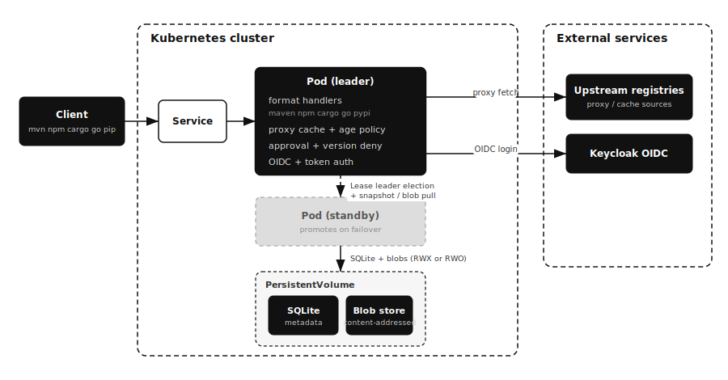

# forklift

[](https://go.dev/)
[](https://github.com/younsl/o/pkgs/container/forklift)
[](https://github.com/younsl/o/tree/main/box/kubernetes/forklift/charts/forklift)
[](https://github.com/younsl/o/blob/main/LICENSE)

Lightweight, Kubernetes-native artifact repository. A single static Go binary that hosts and proxies Maven, npm, Cargo, Go module, and PyPI artifacts, with a clean React UI, OIDC and local auth, fine-grained access tokens, per-repository caching, and a supply-chain age policy. A focused alternative to heavyweight JVM-based repository managers.

## Features

- Hosted, Proxy (cached upstream) and Group (ordered member lookup behind one URL) repositories
- Five package families: Maven (and Gradle), npm, Cargo, Go Modules, PyPI
- Keycloak OIDC login with group-to-role mapping, plus local username/password; roles and grants managed in the UI or declared in the chart (ArgoCD-style RBAC)
- Fine-grained personal access tokens (per repository pattern and action)
- Per-repository caching: TTL revalidation, LRU eviction, negative caching
- Age policy: quarantine freshly published upstream versions to mitigate supply-chain attacks
- Package approval (quarantine): require an explicit admin decision before a proxy serves a package, with a pending-request queue, audit-only mode and auto-approve patterns
- Version denies: block one exact package version (poisoned release, IOC) while the package stays approved, revoking cached copies immediately
- Vulnerability policy: scan requested versions against OSV and block, warn, or audit by severity threshold, with periodic re-scanning so newly disclosed advisories surface (direct dependency coordinate match)
- Per-repository audit log: every download, upload, delete and config change with user, status and client IP
- React UI and OpenAPI 3.1 docs, both served by the binary
- Active/standby HA via Kubernetes Lease leader election, on a shared RWX volume or with PV-based replication (per-pod RWO volumes, no RWX storage required)
- CGO-free scratch image, low memory footprint, Prometheus metrics

## Architecture

forklift runs as one process serving everything on port 8080 (metrics on 8081):



- A content-addressed blob store on a PersistentVolume holds artifact bytes (deduplicated by SHA-256).
- Embedded SQLite holds metadata: repositories, the artifact index, users, roles, and tokens.
- Package-format handlers translate each ecosystem's native protocol into blob store and metadata operations.
- For HA, a Kubernetes Lease elects a single leader; only the leader serves traffic and writes to SQLite, which keeps a single writer. The standby takes over on failover. Two storage layouts are supported:
  - Shared volume (default): both pods mount one ReadWriteMany volume; only the leader is Ready, so the Service routes to it.
  - PV-based replication (`replication.enabled=true`): each pod owns a ReadWriteOnce volume; the standby pulls the leader's SQLite snapshot and blobs every interval over token-authenticated internal endpoints and promotes that copy when it wins the election. Traffic follows the `forklift.io/role=leader` pod label. Replication is asynchronous, so writes within one interval can be lost on failover.

```
shared RWX volume mode:
client (mvn/npm/cargo/go/pip)  ->  Service  ->  leader pod
                                              |- format handler (maven/npm/cargo/go/pypi)
                                              |- proxy cache + age policy
                                              |- SQLite metadata      (RWX PV)
                                              '- content-addressed blobs (RWX PV)

PV-based replication mode (StatefulSet):
client  ->  Service (role=leader)  ->  leader pod   [SQLite + blobs on own RWO PV]
                                            ^
                                            | pull snapshot + blobs every interval
                                       standby pod  [own RWO PV, promotes on failover]
```

## Installation

```bash
helm install forklift oci://ghcr.io/younsl/charts/forklift \
  --namespace forklift --create-namespace \
  --set persistence.storageClass=efs-sc \
  --set auth.bootstrap.adminPassword=change-me
```

For HA (default `replicaCount: 2`), the volume must be ReadWriteMany (EFS, NFS, CephFS). Set `replicaCount: 1` for a single instance with ReadWriteOnce storage.

Without RWX storage (EBS-only clusters), enable PV-based replication instead; the chart then renders a StatefulSet with one ReadWriteOnce PVC per pod:

```bash
helm install forklift oci://ghcr.io/younsl/charts/forklift \
  --namespace forklift --create-namespace \
  --set replication.enabled=true \
  --set persistence.storageClass=gp3 \
  --set auth.bootstrap.adminPassword=change-me
```

List chart versions with [crane](https://github.com/google/go-containerregistry/blob/main/cmd/crane/README.md):

```bash
crane ls ghcr.io/younsl/charts/forklift
```

## Configuration

All settings are environment variables (the Helm chart maps values to them).

| Variable | Default | Description |
|----------|---------|-------------|
| `FORKLIFT_DATA_DIR` | `/data` | Root of the SQLite DB and blob store (PV mount) |
| `FORKLIFT_HTTP_ADDR` | `:8080` | API, UI and package endpoints |
| `FORKLIFT_METRICS_ADDR` | `:8081` | Prometheus metrics |
| `FORKLIFT_EXTERNAL_URL` | (request-derived) | Base URL for URLs synthesised in package metadata; set behind a reverse proxy instead of relying on `X-Forwarded-*` |
| `FORKLIFT_LOG_LEVEL` / `FORKLIFT_LOG_FORMAT` | `info` / `json` | Logging |
| `FORKLIFT_HA_ENABLED` | `false` | Enable Lease leader election |
| `FORKLIFT_REPLICATION_ENABLED` | `false` | Enable PV-based replication (requires HA) |
| `FORKLIFT_REPLICATION_TOKEN` | (none) | Shared token for internal replication endpoints |
| `FORKLIFT_REPLICATION_PEER_SERVICE` | (none) | Headless Service domain for peer pod DNS |
| `FORKLIFT_REPLICATION_INTERVAL` | `30s` | Standby pull cadence (data-loss window on failover) |
| `FORKLIFT_SESSION_SECRET` | (generated) | Signs session cookies; share across replicas |
| `FORKLIFT_ANONYMOUS_READ` | `false` | Allow unauthenticated pulls |
| `FORKLIFT_SEED_DEFAULT_REPOS` | `true` | Seed default proxy + hosted repos on first run |
| `FORKLIFT_BOOTSTRAP_ADMIN_USER` / `_PASSWORD` | `admin` / (none) | Seed first admin on empty install |
| `FORKLIFT_OIDC_ENABLED` | `false` | Enable Keycloak OIDC login |
| `FORKLIFT_OIDC_ISSUER_URL` / `_CLIENT_ID` / `_CLIENT_SECRET` / `_REDIRECT_URL` | | OIDC settings |
| `FORKLIFT_OIDC_GROUPS_CLAIM` | `groups` | Claim mapped to roles |
| `FORKLIFT_RBAC_POLICY_FILE` | (none) | Path to a declarative policy.csv; enables declarative RBAC |
| `FORKLIFT_RBAC_DEFAULT_ROLE` | (none) | Role granted to every authenticated user (ArgoCD `policy.default`) |
| `FORKLIFT_RBAC_ACCOUNTS_DIR` | (none) | Directory of local-account password files (Secret mount) |
| `FORKLIFT_AUDIT_ENABLED` | `true` | Record per-repository audit events |
| `FORKLIFT_AUDIT_RETENTION` | `2160h` (90d) | Prune audit entries older than this; `0` keeps forever |

Per-repository options (caching and age policy) are set through the UI or the REST API, not env vars.

## Access control

Authorization is role-based. A role bundles permissions, each granting a set of actions (`read`, `write`, `delete`, `approve`, `admin`) on repositories matching a glob pattern. Roles reach principals two ways: assigned directly to a user, or mapped from a Keycloak group claim. A user with no matching grant has no access unless a default role is configured.

Roles, grants and group mappings can be managed interactively in the UI/API, or declared once in the Helm chart and reconciled on startup (ArgoCD-style). The two coexist: declarative entries are authoritative and read-only in the UI; interactively-created entries are left untouched.

### Declarative RBAC (chart)

`auth.rbac.policy` is an ArgoCD-style policy reconciled on every startup. It is authoritative for the roles, grants and group mappings it defines (managed rows): removing an entry removes it from the database on the next restart, while UI-created rows survive.

```csv
# p, <role>, repo, <action>, <repo-glob>, allow   (action: read|write|delete|approve|admin, or '*' = admin)
# g, <subject>, <role>                              (subject: group:<keycloak-group> | user:<name> | bare = user)
p, readonly, repo, read, *, allow
p, developer, repo, read, team-a-*, allow
p, developer, repo, write, team-a-*, allow
g, group:/platform-admins, admins
g, user:alice, developer
```

- `auth.rbac.policyDefault` (default `readonly`) is the role granted to every authenticated user, even with no explicit grant. Set it empty for deny-all.
- `auth.rbac.accounts` provisions local (password) accounts; each password is generated into the chart Secret (key `local-user-<name>-password`) and preserved across upgrades. Grant them roles with `g, user:<name>, <role>` lines. Existing accounts (including the bootstrap admin) are never overwritten.
- Out of the box the chart ships a `readonly` role (read on all repositories), an `admins` role (full access), and `policyDefault: readonly`, so every signed-in user can pull and access is granted from there.

## Usage

Create a proxy repository (admin):

```bash
curl -u admin:change-me -X POST http://forklift/api/v1/repositories \
  -H 'Content-Type: application/json' \
  -d '{"name":"maven-central","format":"maven","type":"proxy",
       "upstream_url":"https://repo1.maven.org/maven2",
       "config":{"age_policy":{"enabled":true,"min_age":"3d","action":"block"}}}'
```

Point clients at the repository (use a personal access token as the password):

- Maven: mirror `http://forklift/maven/maven-central/` in `settings.xml`
- npm: `registry=http://forklift/npm/<repo>/` and `_authToken` in `.npmrc`
- Cargo: sparse registry `sparse+http://forklift/cargo/<repo>/` in `.cargo/config.toml`
- Go: `GOPROXY=http://forklift/go/<repo>` with a `.netrc` entry
- pip: `index-url = http://forklift/pypi/<repo>/simple/` in `pip.conf`; twine uploads POST to `http://forklift/pypi/<repo>`

Group repositories combine hosted and proxy repositories behind one read-only URL with first-hit-wins member lookup, like the Nexus `maven-public` pattern. The default seed creates one per format (`maven-public`, `npm-public`, ...), so a single mirror entry such as `http://forklift/maven/maven-public/` serves both internal and upstream artifacts. Uploads still target a member repository directly.

### Package approval (quarantine)

Proxy repositories can require an explicit decision before any package is served, modeled after Nexus Firewall's quarantine:

```bash
curl -u admin:change-me -X PUT http://forklift/api/v1/repositories/<id> \
  -H 'Content-Type: application/json' \
  -d '{"upstream_url":"https://registry.npmjs.org",
       "config":{"approval":{"enabled":true,"mode":"enforce","auto_approve":["@company/*"]}}}'
```

- Requests for unapproved packages return 403 (`package pending approval: <pkg>`) and enqueue a pending request; the package never reaches upstream until approved. Approve/reject from the Approvals page in the UI or via `POST /api/v1/approvals/{id}/approve|reject`.
- The decision unit is the whole package (npm package, PyPI project, `group:artifact`, crate, Go module path). Version freshness stays with the age policy: approval admits the package, the age policy still gates versions inside it.
- Rejecting a package blocks it immediately, including content already in the cache.
- `mode: "audit"` serves traffic normally but records demand and counts what enforce would have blocked (`forklift_approval_blocked_total{mode="audit"}`), which is the recommended way to calibrate before enforcing.
- `auto_approve` glob patterns (e.g. an internal npm scope) bypass approval entirely.
- In a group, a blocked gated member is authoritative: the group returns 403 instead of falling through to the next member.
- Pending queue size is exported as `forklift_approval_pending`; decisions land in the repository audit log as `approval.request/approve/reject` events.
- Who can decide: administrators, plus any role carrying the `approve` action, scoped by repo pattern like every other permission. This lets a security team approve packages without repository management rights, e.g. `{"repo_pattern":"npm-*","actions":["read","approve"]}`. Personal access tokens can never approve: token scopes only accept read/write/delete, so a leaked CI token cannot taint approval decisions.

### Version denies

For incident response, one exact version can be cut off while the package stays trusted (a poisoned release, an IOC match):

```bash
curl -u admin:change-me -X POST http://forklift/api/v1/version-denies \
  -H 'Content-Type: application/json' \
  -d '{"repo":"npm-proxy","package":"lodash","version":"4.17.99","reason":"CVE-2026-0001"}'
```

- A deny is an explicit security decision, so it always enforces: it works on any proxy repository regardless of the approval policy, ignores audit mode, and overrides package-level approval.
- The deny runs before any cache lookup, so already-cached copies stop being served immediately. Requests for the version return 403 (`version denied: <pkg>@<ver>`); other versions keep flowing.
- The version is matched exactly as it appears in request paths (go modules keep the `v` prefix). Metadata still lists denied versions; the artifact fetch fails loudly, which for a poisoned release beats the resolver silently picking another version.
- Manage from the Version denies section on the Approvals page (or the repository's Approvals tab), or via `GET/POST /api/v1/version-denies` and `DELETE /api/v1/version-denies/{id}`. The same `approve` permission applies, scoped per repository.
- Blocks are counted in `forklift_version_deny_blocked_total{repo}`; changes and blocked attempts land in the repository audit log as `deny.create/delete/block` events.
- Deny entries are deleted with their repository, so a recreated same-name repo does not inherit them.

### Vulnerability policy (OSV)

A proxy can gate package versions by known vulnerabilities, matched against the
[OSV](https://osv.dev) database:

```bash
curl -u admin:change-me -X PUT http://forklift/api/v1/repositories/<id> \
  -H 'Content-Type: application/json' \
  -d '{"upstream_url":"https://registry.npmjs.org",
       "config":{"vuln":{"enabled":true,"threshold":"high","action":"block","ignore":["CVE-2026-0001"]}}}'
```

- Scanning runs out of the serving path: a requested coordinate (ecosystem, package, version) is looked up against OSV by a background worker and the result cached; the request-time gate consults only the stored verdict. A periodic re-scanner refreshes results so newly disclosed advisories on already-cached versions surface.
- `action`: `block` (403, refuse to serve), `warn` or `audit` (serve, record). The gate triggers when the highest non-ignored advisory severity meets `threshold` (`critical`/`high`/`medium`/`low`, default `high`). `ignore` lists accepted/false-positive advisory ids (CVE/GHSA/OSV).
- A not-yet-scanned version is served while its scan is queued, unless `block_unscanned` is set under an enforcing (`block`) posture.
- Scope (v1): direct dependency coordinate match only. Transitive dependencies, artifact integrity/provenance, and dependency-confusion are out of scope. A clean result means "no matching public OSV advisory", not a guarantee.
- Configure `FORKLIFT_OSV_URL` (default `https://api.osv.dev`; empty disables scanning), `FORKLIFT_VULN_RESCAN_INTERVAL` (default `6h`), `FORKLIFT_VULN_TTL` (default `24h`).
- Blocks are counted in `forklift_vuln_blocked_total{repo,action}` and scans in `forklift_vuln_scans_total{result}`; blocks land in the audit log as `vuln.block` events. Per-version severity shows in the repository's Artifacts tab.

API reference: `http://forklift/api-docs` (Scalar) and `http://forklift/openapi.yaml`.

## Metrics

Prometheus metrics are exposed on `FORKLIFT_METRICS_ADDR` (`:8081` by default) at `/metrics`, alongside the standard Go runtime and process collectors (`go_*`, `process_*`).

| Metric | Type | Labels | Description |
|--------|------|--------|-------------|
| `forklift_build_info` | gauge | `version`, `commit`, `go_version` | Build metadata; value is always 1 |
| `forklift_leader` | gauge | | 1 if this instance currently holds leadership, else 0 |
| `forklift_http_requests_total` | counter | `method`, `route`, `status` | HTTP requests served |
| `forklift_http_request_duration_seconds` | histogram | `method`, `route`, `status` | HTTP request latency |
| `forklift_repositories` | gauge | `format`, `type` | Configured repositories |
| `forklift_artifacts` | gauge | | Logical artifacts across all repositories |
| `forklift_blobs` | gauge | | Deduplicated content-addressed blobs |
| `forklift_storage_bytes` | gauge | | Physical bytes used by deduplicated blobs |
| `forklift_bytes_transferred_total` | counter | `direction`, `format` | Artifact bytes to/from clients (`egress` downloads, `ingress` uploads) |
| `forklift_cache_hits_total` / `forklift_cache_misses_total` | counter | `repo` | Proxy cache outcomes |
| `forklift_upstream_errors_total` | counter | `repo` | Upstream fetch failures |
| `forklift_age_policy_violations_total` | counter | `repo`, `action` | Age policy blocks and warnings |
| `forklift_approval_blocked_total` | counter | `repo`, `mode` | Package approval gate blocks |
| `forklift_approval_pending` | gauge | | Package approval requests pending |
| `forklift_version_deny_blocked_total` | counter | `repo` | Version deny gate blocks |
| `forklift_vuln_blocked_total` | counter | `repo`, `action` | Vulnerability policy blocks/warns/audits |
| `forklift_vuln_scans_total` | counter | `result` | OSV scans by result (clean/vulnerable/error) |
| `forklift_audit_events_dropped_total` | counter | | Audit events dropped (recorder queue full) |
| `forklift_replication_*` | counter/gauge | | PV-based replication progress (when `replication.enabled`) |

See [docs/metrics.md](docs/metrics.md) for per-metric meaning, labels, and example PromQL queries.

## Development

```bash
make build        # CGO-free binary into bin/
make test         # go test -race
make coverage     # enforce 73% line coverage
make web-build    # build the React UI into internal/webui/dist
make dev          # run with debug logging and a local ./.data dir
make docker-build # multi-arch scratch image
make helm-lint    # lint the chart
```

The React UI lives in `web/` (Vite + TypeScript) and is embedded into the binary via `go:embed`. A placeholder is committed so `make build` works without a frontend build; `make web-build` or the Docker build produces the real UI.
