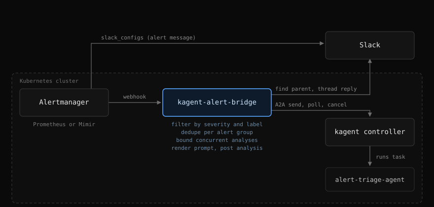

# kagent-alert-bridge

[](https://github.com/younsl/o/pkgs/container/kagent-alert-bridge)
[](https://github.com/younsl/o/pkgs/container/charts%2Fkagent-alert-bridge)
[](https://go.dev/)
[](https://github.com/younsl/o/blob/main/LICENSE)

Receives Alertmanager webhooks, posts each alert to Slack, asks a
[kagent](https://kagent.dev) agent to investigate it over A2A, and replies with
the analysis in the alert's own thread. Mentioning the bot inside a thread runs
the agent again and answers there, so a follow-up question never leaves Slack.
Built with Go 1.26 and shipped as a statically linked binary on a scratch image.

## How it works

Alertmanager keeps posting alerts through its own `slack_configs`. The bridge
receives the same notification as a webhook, investigates it, and replies in
that alert's thread.



1. Alertmanager posts the alert and, independently, POSTs the group to the
   webhook.
2. Alerts the filter rejects end there: the bridge makes no Slack call at all.
3. Otherwise the bridge submits the alert to the agent as a non-blocking A2A
   `message/send` and polls `tasks/get` until the task finishes. When the
   analysis deadline expires first, the task is cancelled with `tasks/cancel`
   so it stops consuming model tokens.
4. The bridge searches recent channel history for the alert's marker to obtain
   the parent timestamp, then replies in that thread.

An incoming webhook does not return the timestamp that `thread_ts` requires,
so the message Alertmanager posted has to be found again. The join key is the
first alert's fingerprint, rendered into the Slack template's `footer` field:
`slack_configs` has no access to `block_id`, so a visible field is the only
carrier available. The search runs after the analysis rather than before it,
which gives the notification the whole agent run to arrive and usually makes
one call enough.

If the search still fails, the analysis is posted at channel level with the
alert title instead of being discarded.

Setting `SLACK_PARENT_MODE=post` inverts the arrangement: the bridge publishes
the alert itself, the timestamp is known without any search, and Alertmanager
sends only the webhook. That mode needs `chat:write` alone, at the cost of
moving the alert formatting out of the Alertmanager templates.

Only the alert group's first analysis is paid for: a group stays deduplicated
for `DEDUPE_TTL`, which should cover the Alertmanager `repeat_interval`. A run
that fails is not suppressed, so the next resend retries it.

## Mention invocation

Setting `SLACK_APP_TOKEN` opens a Socket Mode connection and lets an engineer
talk to the agent by mentioning the bot inside a thread. Everything else about
the feature is optional, and leaving the token unset keeps the binary behaving
exactly as the alert-only build does. The design is written up in
[docs/designs/slack-mention-invocation.md](docs/designs/slack-mention-invocation.md).

One turn works like this:

1. The mention arrives as a Socket Mode envelope, which is acknowledged
   immediately: Slack redelivers anything not acknowledged within 3 seconds, so
   the acknowledgement never waits on the agent.
2. A status message goes up in the thread before a concurrency slot is even
   held, so the asker sees the question was taken.
3. That one message is then rewritten in place every `CHAT_STATUS_INTERVAL`,
   carrying the elapsed time and the task state the controller reports, and it
   ends as the answer itself. The thread gets one message per turn rather than
   one per state change.
4. The thread keeps the A2A `contextId` for `CHAT_SESSION_TTL`, so a follow-up
   mention continues the same agent session instead of starting cold.

Only thread replies invoke the agent. A mention at channel level is answered
with an ephemeral hint rather than a run, which keeps the bot attached to a
thread that already has context. Mention traffic has its own concurrency limit
and deadline, so a burst of questions cannot starve alert analysis of model
concurrency.

Socket Mode is an outbound WebSocket, so no inbound network path, request URL,
or signing secret is involved. Sessions live in memory at one replica: a restart
drops them and the next mention starts a fresh session.

The kagent controller caps a turn at 3 minutes in the v0.9.x line
([issue](https://github.com/kagent-dev/kagent/issues/2112)), so `CHAT_TIMEOUT`
above `180s` has no effect until the deployment moves to a release carrying
`KAGENT_A2A_CLIENT_TIMEOUT`.

## Slack app

The bridge needs a bot token (`xoxb-...`). Mention invocation adds an app-level
token (`xapp-...`), which is created under Basic Information with the
`connections:write` scope and is not an OAuth scope. A signing secret and a
request URL are never used: Slack never calls the bridge.

Bot token scopes:

| Scope | Needed when |
|-------|-------------|
| `chat:write` | Always. Also covers `chat.update` for the live status message and `chat.postEphemeral` for the mention hints. |
| `channels:history` | `lookup` mode, public channels. |
| `channels:read` | `lookup` mode, when channels are configured by name. Configuring conversation IDs instead skips the name lookup and this scope. Public channels are resolved with this scope alone; private channels are only listed when the name is not public. Mention invocation needs it too when `CHAT_CHANNELS` or `CHAT_AGENT_MAP` name channels rather than IDs. |
| `groups:history`, `groups:read` | `lookup` mode, private channels. |
| `reactions:write` | The investigating/completed reactions on the alert notification, and the `:eyes:` a mention carries while it is being answered. The alert reactions can be turned off by setting `SLACK_INVESTIGATING_REACTION` and `SLACK_COMPLETED_REACTION` to empty; the mention one is fixed, so enabling mentions requires this scope. |
| `app_mentions:read` | Mention invocation. The only scope the feature adds. |

Mention invocation also needs Socket Mode switched on and the `app_mention`
event subscribed, neither of which is a permission. Adding the scope means
reinstalling the app; the existing bot token survives a reinstall, so the alert
path keeps working through it.

The handle people type is the bot user's display name, which the binary does not
control. Reaching a mention that reads `@kagent` means renaming the app under
Basic Information and the bot display name under App Home. The rename is
retroactive: Slack renders every message the app already posted under the
current name.

The bot must be a member of every channel it reads or posts in.

## Configuration

All settings come from environment variables.

### Slack

| Variable | Default | Description |
|----------|---------|-------------|
| `SLACK_BOT_TOKEN` | required | Bot token (`xoxb-...`). |
| `SLACK_DEFAULT_CHANNEL` | required | Channel used when the routing label is absent. A bare name is prefixed with `#`; a conversation ID is used as-is. |
| `SLACK_PARENT_MODE` | `lookup` | How the thread parent is obtained. `lookup` finds the message Alertmanager posted; `post` publishes the alert from the bridge. |
| `SLACK_LOOKUP_WINDOW` | `15m` | How far back channel history is searched. `lookup` mode only. |
| `SLACK_LOOKUP_ATTEMPTS` | `3` | How many times to re-search before giving up. `lookup` mode only. |
| `SLACK_INVESTIGATING_REACTION` | `telescope` | Emoji (without colons) placed on the alert notification while the agent investigates. Empty disables it. |
| `SLACK_COMPLETED_REACTION` | `white_check_mark` | Emoji (without colons) that replaces the investigating reaction once the analysis is posted. Empty disables it. When the reactions are enabled, a fixed thread note announcing the investigation is posted as well. |
| `SLACK_CHANNEL_LABEL` | `slack_channel` | Alert label that selects the destination channel. |
| `SLACK_CHANNEL_MAP` | empty | `label-value=channel` pairs, comma separated, for labels whose value is not the channel name. |
| `SLACK_MAX_TEXT` | `8000` | Maximum characters per message; longer text is truncated. |
| `SLACK_API_URL` | `https://slack.com/api` | Web API base URL. Override to route through an egress proxy. Socket Mode dials the URL Slack hands out, honouring the standard proxy environment variables. |

### Mention invocation

All optional except the app-level token, which is what enables the feature.

| Variable | Default | Description |
|----------|---------|-------------|
| `SLACK_APP_TOKEN` | empty | App-level token (`xapp-...`). Empty leaves Socket Mode off and the whole mention path inert. |
| `CHAT_AGENT` | value of `KAGENT_AGENT` | Agent that answers mentions. |
| `CHAT_AGENT_MAP` | empty | `channel=agent` pairs, comma separated, routing a channel to a specialised agent. A channel the table does not carry falls back to `CHAT_AGENT`. |
| `CHAT_CHANNELS` | empty | Channel names or IDs allowed to invoke the bot. Empty allows every channel the bot is a member of. |
| `CHAT_ALLOWED_USERS` | empty | Slack member IDs allowed to invoke the bot. Empty allows everyone in the allowed channels. |
| `CHAT_INSTRUCTIONS` | built-in English text | Instructions appended to every mention prompt. Separate from `ANALYSIS_INSTRUCTIONS`, because a question has no alert sections to fill. |
| `CHAT_TIMEOUT` | `180s` | Deadline for one whole turn including queueing. Matches the controller's 3 minute cap; lower it to make the bridge's own expiry fire first and cancel the task. |
| `CHAT_SESSION_TTL` | `2h` | How long a thread keeps its `contextId` after its last turn. `0s` makes every mention a cold turn. |
| `CHAT_STATUS_INTERVAL` | `10s` | How often the in-thread status message is rewritten while the agent works. Each rewrite is one `chat.update` call. |
| `CHAT_THREAD_HINT` | built-in text | Ephemeral hint sent when the bot is mentioned at channel level. Empty drops the mention silently. |
| `CHAT_DENIED_HINT` | built-in text | Ephemeral hint sent when the bot is mentioned in a channel outside `CHAT_CHANNELS`. Empty drops the mention silently. |
| `MAX_CONCURRENT_CHATS` | `2` | Maximum mention turns running at once. |

### kagent

| Variable | Default | Description |
|----------|---------|-------------|
| `KAGENT_URL` | `http://kagent-controller.kagent:8083` | Controller base URL. |
| `KAGENT_NAMESPACE` | `kagent` | Namespace of the Agent resource. |
| `KAGENT_AGENT` | `alert-triage-agent` | Agent used when the routing label is absent or names no mapped agent. |
| `KAGENT_AGENT_ROUTING_LABEL` | value of `SLACK_CHANNEL_LABEL` | Alert label that routes an alert to an agent. |
| `KAGENT_AGENT_ROUTING_MAP` | empty | `label-value=agent` routing table sending categories to specialised agents, e.g. `security-alerts=security-alert-triage-agent`. A value the table does not carry falls back to `KAGENT_AGENT` rather than being used as an agent name. |
| `KAGENT_USER_ID` | `alert-bridge@kagent.dev` | Sent as `X-User-Id`; owns the kagent sessions the bridge creates. |
| `KAGENT_TIMEOUT` | `120s` | Deadline for one whole analysis. On expiry the task is cancelled on the controller. |
| `KAGENT_REQUEST_TIMEOUT` | `30s` | Timeout for a single HTTP call to the controller (submit, poll, or cancel). |
| `KAGENT_POLL_INTERVAL` | `5s` | Wait between two task status polls. |

### Analysis policy

| Variable | Default | Description |
|----------|---------|-------------|
| `ANALYZE_SEVERITIES` | `critical` | Comma-separated severities to analyse. Empty analyses everything. |
| `ANALYZE_LABEL` | `analyze` | Alert label that opts a rule in (`"true"`) or out (`"false"`) regardless of severity. |
| `ANALYZE_RESOLVED` | `false` | Analyse resolved notifications as well as firing ones. |
| `DEDUPE_TTL` | `12h` | How long a group stays suppressed after being analysed. `0s` disables deduplication. |
| `MAX_ALERTS_IN_PROMPT` | `5` | Maximum alerts rendered into one prompt. |
| `MAX_CONCURRENT_ANALYSES` | `2` | Maximum analyses running at once, which bounds concurrent model spend. |
| `ANALYSIS_INSTRUCTIONS` | built-in English text | Instructions appended to every prompt. Override to change the output language or sections. |

### Serving

| Variable | Default | Description |
|----------|---------|-------------|
| `WEBHOOK_PATH` | `/alert` | Path Alertmanager posts to. |
| `WEBHOOK_BEARER_TOKEN` | empty | Bearer token required on incoming webhooks. Empty disables authentication. |
| `LISTEN_PORT` | `8080` | Port serving the webhook, `/healthz` and `/readyz`. |
| `METRICS_PORT` | `8081` | Port serving `/metrics`. |
| `LOG_LEVEL` | `info` | `debug`, `info`, `warn`, `error`. |
| `LOG_FORMAT` | `json` | `json` or `text`. |

## Metrics

Metrics are served on `/metrics` (default port `8081`) and share the prefix
`kagent_alert_bridge_`. They cover the whole path an alert takes: webhook
ingest and per-alert volume, the analysis queue and its concurrency limit, the
kagent controller's own processing time per task state, and every Slack Web API
call including throttling and truncation. Mention invocation adds the Socket
Mode connection state, the reason every dropped mention was dropped, and the
turn counters. See
[docs/metrics.md](docs/metrics.md) for the full reference and example queries.

## Alertmanager

In `lookup` mode the existing `slack_configs` stays, a `webhook_configs` entry
is added next to it, and the template gains a `footer` carrying the alert
fingerprint so the bridge can recognise the message:

```yaml
receivers:
- name: 'infra-alerts'
  slack_configs:
  - api_url: '<existing incoming webhook>'
    channel: '#infra-alerts'
    send_resolved: true
    title: '{{ if eq .Status "firing" }}🚨{{ else }}✅{{ end }} [{{ .Status | toUpper }}] {{ .CommonLabels.alertname }}'
    text: |-
      {{ range .Alerts }}
      *Severity:* {{ .Labels.severity }}
      *Summary:* {{ .Annotations.summary }}
      {{ end }}
    footer: 'alert-id {{ (index .Alerts 0).Fingerprint }}'
  webhook_configs:
  - url: 'http://kagent-alert-bridge.kagent:8080/alert'
    send_resolved: false
    http_config:
      authorization:
        type: Bearer
        credentials_file: /etc/alertmanager/secrets/kagent-alert-bridge/WEBHOOK_BEARER_TOKEN
```

Without the `footer` the bridge has nothing to match on and every analysis is
posted at channel level instead of in a thread. The marker may live in the
title, text, or fallback instead; the footer is simply the least intrusive
place. Both deliveries must resolve to the same channel, so
`SLACK_CHANNEL_MAP` has to agree with what `slack_configs` uses.

In `post` mode the receiver carries `webhook_configs` alone. Leaving
`slack_configs` in place there posts every alert to Slack twice.

Set `send_resolved: true` on the webhook only together with
`ANALYZE_RESOLVED`, otherwise the bridge is woken for notifications it will
never analyse.

## Agent expectations

The bridge is agent-agnostic: it sends the alert plus `ANALYSIS_INSTRUCTIONS`
and posts whatever text comes back. The agent should be read-only. The bridge
cannot enforce that, so the tools bound to the agent decide what an
automatically triggered analysis is able to touch.

Reply text is posted as Slack mrkdwn, so the agent should use `*bold*` rather
than markdown headings and stay inside `SLACK_MAX_TEXT`.

A mention gets `CHAT_INSTRUCTIONS` instead, which ask for a direct answer rather
than the analysis sections. The same agent can serve both paths: an alert run
and a mention turn never share a session, and `CHAT_AGENT` points them at
different agents when they should not share a tool list either.

### Routing to several agents

`KAGENT_AGENT_ROUTING_MAP` splits alert categories across specialised agents, keyed by
the same label that already routes the Slack channel:

```
SLACK_CHANNEL_LABEL=slack_channel
KAGENT_AGENT_ROUTING_MAP=infra-alerts=aws-alert-triage-agent,security-alerts=security-alert-triage-agent
```

Every agent still gets the same `ANALYSIS_INSTRUCTIONS`, because those describe
the output contract the bridge posts to Slack: the sections, the length, and
the mrkdwn. What each agent knows and which tools it may call belongs in its own
system message and tool list, which the bridge never sees. Keeping the split
there also keeps the instructions free of guidance that only one category needs.

## Usage

```bash
# Local run against a port-forwarded controller
kubectl -n kagent port-forward svc/kagent-controller 8083:8083

SLACK_BOT_TOKEN=xoxb-... SLACK_DEFAULT_CHANNEL=alerts-test \
KAGENT_URL=http://localhost:8083 LOG_FORMAT=text make run

# Replay an alert
curl -X POST localhost:8080/alert -H 'Content-Type: application/json' -d '{
  "groupKey": "test-1", "status": "firing", "receiver": "kagent-alert-bridge",
  "commonLabels": {"alertname": "KubePodCrashLooping", "severity": "critical", "cluster": "prd"},
  "alerts": [{"status": "firing", "fingerprint": "fp-1",
    "labels": {"alertname": "KubePodCrashLooping", "severity": "critical", "namespace": "demo", "pod": "demo-api-0"},
    "annotations": {"summary": "pod is restarting", "description": "7 restarts in 10 minutes"}}]
}'
```

## Helm

```bash
helm install kagent-alert-bridge ./charts/kagent-alert-bridge \
  --namespace kagent \
  --set slack.parentMode=lookup \
  --set slack.defaultChannel=alerts-test \
  --set slack.existingSecret=kagent-alert-bridge-slack \
  --set kagent.agent=alert-triage-agent \
  --set serviceMonitor.enabled=true
```

The chart is also released to the OCI registry on Chart.yaml version bumps:

```bash
crane ls ghcr.io/younsl/charts/kagent-alert-bridge
helm install kagent-alert-bridge oci://ghcr.io/younsl/charts/kagent-alert-bridge --version 0.1.0
```
