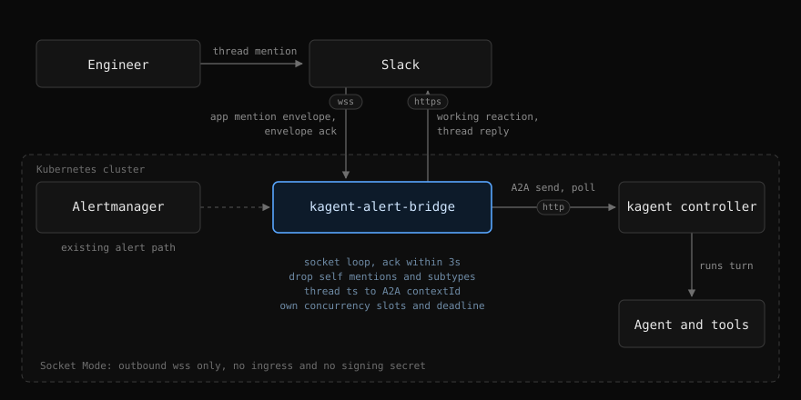

# Slack mention invocation

Status: implemented in 0.3.0

The implementation follows this document, with one addition. The thread reply
is not a single message posted at the end: a status message goes up as soon as
the mention is accepted, is rewritten in place every `CHAT_STATUS_INTERVAL`
with the elapsed time and the task state the controller reports, and ends as
the answer itself. It is one message per turn either way, so the thread pays
nothing for the live status, and a turn that runs for minutes never looks like
a bot that stopped answering. See [Live status](#live-status).

## Summary

Let an engineer talk to a kagent agent by mentioning the bot inside a Slack
thread, and let the conversation continue in that thread. The bridge opens a
Socket Mode WebSocket to Slack, receives `app_mention` events over it, forwards
the text to an agent over A2A, and posts the reply in the same thread. No
public endpoint and no Slack signing secret are involved.

Only thread replies invoke the agent. A mention posted at channel level is
ignored, which keeps the feature attached to a thread that already has context,
the alert thread above all, and keeps the bot out of channel level chatter.

Today the bridge is one directional. Alertmanager pushes a webhook, an agent
investigates, and the analysis lands in the alert thread. Nothing lets a human
ask a follow-up question, so every follow-up moves to a terminal. Mention
invocation closes that gap using the agent, tools, and Slack app that the
alert path already owns.

## Goals

- Answer an `app_mention` posted in a thread in an allowed channel by running a
  kagent agent and replying in that thread.
- Keep conversation context per Slack thread, so a follow-up mention continues
  the same agent session instead of starting from nothing.
- Require no inbound network path: Socket Mode only, as an outbound WebSocket
  from the pod.
- Keep the alert path untouched in behaviour, configuration, and failure modes.
- Let mention traffic and alert traffic be bounded independently, so a burst of
  questions cannot starve alert analysis of model concurrency.

## Non-goals

- Making the agent act on the cluster. The agent stays read only, enforced by
  the tools bound to it, not by the bridge.
- Answering a mention posted at channel level rather than in a thread.
- Slash commands, shortcuts, modals, home tabs, DMs, and file uploads.
- Replying to plain thread messages that do not mention the bot. Every turn
  requires a mention in v1. See [Open questions](#open-questions).
- Cross replica session sharing. v1 stays single replica, as the dedupe store
  already does.

## Background

### Current binary

Relevant properties of the current binary:

- `internal/bridge` serves exactly one route, `POST {WEBHOOK_PATH}`, plus the
  health endpoints. There is no inbound Slack path.
- `internal/slack` is a hand written Web API client over `net/http` with
  `chat.postMessage`, `conversations.list`, `conversations.history`, and the
  reactions calls. The module depends on Prometheus client libraries only.
- `internal/a2a` submits `message/send` and polls `tasks/get`. The response
  already carries `contextId` and it is already parsed into `a2a.Result`, but
  `Send` never sends one back, so every run gets a fresh session.
- `internal/bridge/store.go` is a mutex guarded map with a TTL, used for alert
  deduplication. The same shape fits both new stores below.

### Controller timeout ceiling

Constraint from kagent itself: the controller calls the agent through a2a-go,
whose `defaultRequestTimeout` is 3 minutes and is not configurable in the
v0.9.x line. A turn whose tool loop runs past that is reported as failed by the
controller even though the agent keeps working. Mention turns are usually short
enough, but the design treats it as a hard ceiling rather than something the
bridge can raise.

Upstream tracks this as a [feature
request](https://github.com/kagent-dev/kagent/issues/2112) against the SDK's
hardcoded timeout, fixed by a
[change](https://github.com/kagent-dev/kagent/pull/2113) that adds
`KAGENT_A2A_CLIENT_TIMEOUT`, exposed as the `controller.a2aClientTimeout` Helm
value and defaulting to 0, meaning no timeout. It landed on main after the
v0.9.x line, so the ceiling only lifts once the deployment moves to a release
carrying it. Until then `CHAT_TIMEOUT` above 3 minutes has no effect, and after
that the value becomes a real knob rather than a formality.

## Architecture



The alert path stays exactly where it is, and the same Slack client, A2A
client, and metrics registry serve both paths.

One turn is: the mention arrives as an envelope, the envelope is acknowledged,
the working reaction goes on the mentioned message, the agent runs over A2A
with the thread's `contextId` when it has one, and the reply is posted in the
thread before the reaction is removed.

Socket Mode adds a second ingress to the process, sitting next to the webhook
listener rather than replacing it. The lifecycle is:

1. `apps.connections.open` with the app level token returns a single use `wss`
   URL.
2. The bridge dials it and reads envelopes. `hello` confirms the session,
   `disconnect` asks for a reconnect, and `events_api` carries the event.
3. Every envelope is acknowledged with `{"envelope_id": "..."}` immediately,
   before any agent work starts. Slack redelivers an envelope that is not
   acknowledged within 3 seconds, so the acknowledgement must never wait on the
   agent.
4. The turn runs detached, exactly as `analyze` already runs detached from the
   webhook request.
5. On read error, `disconnect`, or a closed socket, the bridge reopens with
   exponential backoff and jitter. A failed `apps.connections.open` is retried,
   not fatal: the alert path must keep working when the WebSocket cannot be
   established.

### New package

`internal/socket` owns the connection and the envelope loop, and knows nothing
about agents. It exposes a handler interface that `internal/bridge` implements,
which keeps the routing, gating, and A2A logic in one place and leaves the
transport testable against a local WebSocket server.

The chat turn itself lives in `internal/bridge` as `handleMention`, next to
`analyze`, reusing the same Slack client, A2A client, metrics, and logger.

### WebSocket dependency

The module has no WebSocket code and no HTTP framework. Options considered:

- `github.com/slack-go/slack`: brings a full Slack SDK and its Socket Mode
  implementation, and duplicates the Web API client the bridge already owns.
- `github.com/coder/websocket`: a small RFC 6455 client with no transitive
  dependencies, used directly against the envelope JSON.
- Hand rolled framing: not worth the maintenance for ping, pong, close, and
  fragmentation.

Recommendation: `github.com/coder/websocket`. It keeps the "own the wire
format, borrow only the transport" shape the Slack client already has, and
keeps the image dependency surface close to what it is today.

Note that `SLACK_API_URL` only redirects Web API calls. A deployment that
routes egress through a proxy needs the WebSocket dial to honour the standard
proxy environment variables as well, which `net/http` transport handles when
the dialer is built from it.

## Event handling

### Drop rules

Only `app_mention` is subscribed. The handler drops an event when any of the
following holds, each with its own metric label so the reason is visible:

- `bot_id` is set, or the author is the bridge's own user id, which is resolved
  once at startup with `auth.test`. This is the loop guard: the bridge posts
  into the same channels it listens to.
- the event carries a `subtype` other than `thread_broadcast`, which covers
  edits, deletions, and joins.
- the channel is a direct message, which conversation IDs starting with `D`
  identify. No DM scope is requested and DM messages arrive as `message.im`
  rather than `app_mention`, so this should be unreachable. It is a guard
  against a later scope or subscription change opening DMs by omission, since
  an empty channel allow list means "every channel".
- the channel is not in the allow list, when one is configured. The asker gets
  an ephemeral hint, see below.
- the author is not in the user allow list, when one is configured.
- the event carries no `thread_ts`, which means the mention was posted at
  channel level rather than in a thread.
- the envelope id was already handled, which absorbs Slack redelivery of an
  envelope whose acknowledgement was lost.
- the text is empty once the leading mention is stripped.

`thread_broadcast` is exempted deliberately. A thread reply sent with "also
send to channel" is a real mention somebody just typed, and dropping it would
leave the asker looking at a bot that silently ignored them, with the reason
visible only in a counter. Whether Slack actually stamps that subtype on
`app_mention` rather than on `message` alone is verified in the first rollout
phase by logging the raw envelope, and the exemption is harmless either way.

### Where the reply lands

The reply goes to the `thread_ts` the event carried, so an answer never leaves
the thread it was asked in. A broadcast mention is answered in the thread only:
the bridge never broadcasts its own reply to the channel.

### Hints on a dropped mention

Two of those drops answer with an ephemeral hint rather than silence, because
both of them are rules a person has no way to distinguish from an outage:

- a mention at channel level gets the hint that the bot replies in threads only.
- a mention in a channel outside the allow list gets the hint that the bot does
  not answer in this channel.

`chat.postEphemeral` is visible to the asker alone and leaves nothing in channel
history, so the rule is discoverable without the channel paying for it, and the
same `chat:write` scope covers it.

The denied channel hint says only that this channel is not served. It never
names the channels that are, so it tells the asker how to stop being confused
without turning the bot into a directory of where it may be used.

Every other drop stays silent by design. A self mention, a duplicate envelope,
or an edit subtype has no reader waiting on an answer, and a DM would need a
hint nobody could have triggered.

Hints cost no agent run, so a burst of them spends Slack calls and nothing else.
`internal/slack` gains one call for both, `chat.postEphemeral`, and a rejected
ephemeral is logged rather than retried. Each hint has its own setting,
`CHAT_THREAD_HINT` and `CHAT_DENIED_HINT`, and an empty value restores the
silent drop for that case alone.

### Alert threads

Alert threads are ordinary threads. Mentioning the bot under an analysis
therefore continues in that thread, and the mention starts its own agent
session because the alert run and the chat turn do not share a context.

## Session context

### Thread to session mapping

A2A carries conversation state in `contextId`. The mapping is:

- key: `channel + thread_ts`
- value: the `contextId` returned by the previous turn, plus its last use time

The store is the existing TTL map generalised to hold a string value. A thread
idle for longer than `CHAT_SESSION_TTL` (default `2h`) falls out and the next
mention starts a fresh context, which is the same trade the dedupe store makes:
losing an entry costs one cold turn, not correctness.

`a2a.Client.Send` gains a request struct rather than another positional
argument:

```go
type Request struct {
    Agent     string
    Text      string
    ContextID string // empty starts a new session
}

func (c *Client) Send(ctx context.Context, req Request) (Result, error)
```

`message.contextId` is set when `ContextID` is non empty. The alert path passes
an empty one and keeps its current behaviour exactly. The returned `ContextID`
is written back to the store after every successful turn.

Restarts drop the map, so an in flight conversation loses its history and the
next mention starts clean. That is acceptable at one replica and is called out
in the operator documentation rather than hidden.

### Envelope deduplication

The second store holds envelope ids for a few minutes and answers one question:
has this envelope already been handled. Slack redelivers an envelope whose
acknowledgement did not arrive in time, and the acknowledgement can be lost
after the turn has already started. The TTL only has to outlive Slack's own
retry window, so it needs no configuration knob.

### Reply truncation

Replies reuse `SLACK_MAX_TEXT` and the existing truncation counter, under a
`chat` message kind, so an answer cut short is as visible as a truncated
analysis.

## Thread context

A question asked under an alert is unanswerable on its own: "analyse this event"
names an event the agent has never seen. The bridge therefore quotes the message
the thread hangs from, and gives the agent the identifiers to read the rest.

```
[Alert this question was asked under]
🚨 [FIRING] KubePodCrashLooping
*Severity:* critical

[Slack context]
channel_id: C0123456789
thread_ts: 1700000000.000100

[Question]
이 이벤트를 분석해줘
```

The split is deliberate, and it took three attempts to land on. Reading the
whole thread in the bridge was tried first: pagination, a rune budget, keeping
the head and the newest replies while eliding the middle, labelling speakers,
and a per-thread watermark so a follow-up only sent what was new. All of it
worked, and all of it was the bridge guessing how much of a conversation a
question needs. That guess belongs to the agent, which can page, search, and
stop when it has enough.

What does not belong to the agent is the alert itself. Discovering it would take
a tool call the agent may not make, and the failure mode is silent: an answer
that reads as if the question had no context, which is what the first version of
this feature actually produced. So the parent is pushed, and everything else is
pulled.

The parent is sent on every turn rather than only the first. It is a few hundred
characters, a session that already has it loses nothing by seeing it again, and
a session that lost it would answer about nothing. That removes the watermark,
the budget, and the incremental read the earlier design needed.

`conversations.replies` with `limit=1` returns the parent, so this costs one
Slack call on the history scope the alert path already holds. The quoted text is
capped at 2000 runes, which is not configurable because there is nothing an
operator would tune it to: an Alertmanager notification is a few hundred
characters, and anything past the cap is a template that got away.

Reading the rest needs a Slack MCP server bound to the agent, with read tools
only. `slack_get_thread_replies` and `slack_get_channel_history` answer
questions. `slack_post_message`, `slack_reply_to_thread`, and
`slack_add_reaction` would let an automatically triggered agent speak in the
channel as the app, and the bridge already owns everything the bot says.

## Live status

A turn can run for minutes, and a Slack thread offers no other sign that one is
underway. The working reaction marks the mention, but it says nothing about how
far along the run is, and it is easy to miss on a message somebody has scrolled
past.

So the turn owns exactly one thread message from beginning to end:

1. It is posted the moment the mention is accepted, before a slot is even held,
   which is what tells the asker the question was taken rather than dropped.
2. It is rewritten every `CHAT_STATUS_INTERVAL` with the agent, what it is
   doing, and how long it has been at it. The task state the controller
   reports picks the sentence rather than being printed: `submitted` and
   `working` are protocol tokens, not something a reader in Slack can act on,
   so only an unrecognised state is shown verbatim. The poll count the
   progress hook also carries is left out entirely, being the elapsed time
   divided by `KAGENT_POLL_INTERVAL`.
3. It is rewritten one last time with the answer, or with the reason there is
   none.

The alternative, posting a note per state change, costs the same Slack calls and
leaves a thread of stale progress lines behind, which is worse the longer the
turn runs.

`chat.update` is what makes this one message rather than several, and it needs
no scope beyond the `chat:write` the reply already uses. The cost is one Web API
call per interval per running turn, which is why the interval is configurable
and defaults to 10 seconds rather than to the poll interval.

Two constraints shape the implementation:

- The A2A poll loop reports state through `Request.OnProgress`, which runs on
  the polling goroutine. A Slack call there would stall the poll it is
  reporting on, so the hook only records the state and a ticker owns the write.
- A failed status post is not fatal. The turn still runs, and its answer is
  posted as a new message at the end rather than being lost with the status
  message that was meant to carry it.

The status text is Korean, matching the investigating note the alert path
already posts. Unlike the instructions it is not configurable: it is three
short lines the operator never needs to vary.

## Concurrency and timeouts

### Slots and deadline

Mention turns get their own semaphore, `MAX_CONCURRENT_CHATS` (default `2`),
and their own deadline, `CHAT_TIMEOUT` (default `180s`, the same number as the
controller's cap). Sharing the alert semaphore would let a question queue
behind an alert analysis, or worse, delay an alert analysis behind questions.

The default matches the controller's 3 minute cap rather than undercutting it,
which keeps one number in play instead of two. The consequence is worth knowing:
when a turn does run that long, the controller's expiry usually lands first,
which reports a failed task and leaves the agent running and spending tokens,
where the bridge's own expiry would have cancelled it with `tasks/cancel` and
posted a timeout note. Lowering `CHAT_TIMEOUT` below `180s` buys that cleaner
ending back. Raising it above `180s` buys nothing at all, since the cap ends
the run either way.

When no slot frees up before the deadline, the bridge posts a short note in the
thread instead of staying silent, mirroring how a queue timeout is reported on
the alert path.

### Shutdown

Shutdown drains chat turns alongside analyses. The drain timeout becomes
`max(KAGENT_TIMEOUT, CHAT_TIMEOUT) + drainMargin`, and
`terminationGracePeriodSeconds` in the chart must stay above it.

## Configuration

### Environment variables

New environment variables, all optional except the app token that enables the
feature:

| Variable | Default | Description |
|----------|---------|-------------|
| `SLACK_APP_TOKEN` | empty | App level token (`xapp-...`). Empty leaves Socket Mode off and the binary behaves exactly as it does today. |
| `CHAT_AGENT` | value of `KAGENT_AGENT` | Agent that answers mentions. |
| `CHAT_AGENT_MAP` | empty | `channel=agent` pairs, comma separated, routing a channel to a specialised agent. A channel the table does not carry falls back to `CHAT_AGENT`. |
| `CHAT_CHANNELS` | empty | Channel names or IDs allowed to invoke the bot. Empty allows every channel the bot is a member of. |
| `CHAT_ALLOWED_USERS` | empty | Slack member IDs allowed to invoke the bot. Empty allows everyone in the allowed channels. |
| `CHAT_INSTRUCTIONS` | built-in English text | Instructions appended to every mention prompt. Separate from `ANALYSIS_INSTRUCTIONS`, because a question has no alert sections to fill. |
| `CHAT_TIMEOUT` | `180s` | Deadline for one whole turn, including queueing. Same as the controller's 3 minute cap. Lower it to make the bridge's own expiry fire first and cancel the task. |
| `CHAT_SESSION_TTL` | `2h` | How long a thread keeps its `contextId` after its last turn. |
| `CHAT_STATUS_INTERVAL` | `10s` | How often the in-thread status message is rewritten while the agent works. One `chat.update` call per interval per running turn. |
| `CHAT_THREAD_HINT` | built-in text | Ephemeral hint sent when the bot is mentioned at channel level. Empty drops the mention silently. |
| `CHAT_DENIED_HINT` | built-in text | Ephemeral hint sent when the bot is mentioned in a channel outside `CHAT_CHANNELS`. Empty drops the mention silently. |
| `MAX_CONCURRENT_CHATS` | `2` | Maximum mention turns running at once. |

### Chart values

Chart values follow the existing grouping, as `slack.appToken` (or
`slack.existingSecretAppTokenKey` next to the bot token key) and a `chat:`
block that mirrors the `analysis:` block.

## Slack app

### Scopes and subscriptions

Exactly one new bot token scope is required. The rest of what has to change on
the Slack app is not an OAuth scope at all, which is the part worth stating
plainly:

| What | Where it lives | Purpose |
|------|----------------|---------|
| `app_mentions:read` | Bot token scope, new | Receiving the `app_mention` event. The only scope this feature adds. |
| `connections:write` | App level token (`xapp-...`), new, created under Basic Information | Opening the Socket Mode connection. It is not a bot token scope and does not appear in the OAuth scope list. |
| `app_mention` | Event Subscriptions, new | Subscription, not a permission. Socket Mode must be on, which also means the Events API request URL is unused. |

Everything else the feature needs is already granted for the alert path:

| Scope | Covers here |
|-------|-------------|
| `chat:write` | The thread reply and the ephemeral hint. `chat.postEphemeral` needs no scope of its own. |
| `reactions:write` | The `:eyes:` a mention carries while it is being answered. Already granted when the alert reactions are on. It is fixed rather than configurable, so unlike the alert reactions it cannot be turned off to drop the scope: the status message carries the state in words, and the emoji only marks a message somebody has scrolled past. |
| `channels:history`, `channels:read` | Not used by this path. A mention arrives with its text and `thread_ts` in the event payload, so no history read is involved. They stay for the alert parent lookup. |

`auth.test`, which resolves the bot's own user id for the loop guard, needs no
scope.

Private channels need `groups:history` and `groups:read`, exactly as the alert
path already does there, and the bot must be a member of every channel it
answers in.

Adding the scope means reinstalling the app. The existing bot token survives a
reinstall, so the alert path keeps working through it.

### Display name

The handle people type is the bot user's display name, not anything the binary
controls. Reaching a mention that reads `@kagent` therefore means renaming the
existing app rather than adding a second one: the app name under Basic
Information, and the bot display name under App Home, which is what the
autocomplete offers and what the handle has to be unique on across the
workspace.

Renaming is retroactive. Slack renders every message the app has already
posted, including past alert analyses, under the current name and icon, so the
alert thread history changes appearance the moment the rename lands. Nothing
else moves: tokens are not rotated, no reinstall is required for a rename, and
Alertmanager keeps posting alerts through its own incoming webhook with its own
identity.

Both tokens live in the same Secret so the deployment mounts one source.

## Observability

### Metrics

New metrics, keeping the existing prefix and label conventions:

| Metric | Type | Description |
|--------|------|-------------|
| `kagent_alert_bridge_socket_connected` | Gauge | 1 while a Socket Mode connection is established. |
| `kagent_alert_bridge_socket_connections_total{result}` | Counter | Connection attempts, by `ok`, `error`, or `disconnect_requested`. |
| `kagent_alert_bridge_chat_events_total{result}` | Counter | Mention events, by `accepted` or the drop reason (`bot`, `subtype`, `dm`, `channel_denied`, `user_denied`, `not_in_thread`, `duplicate`, `empty`). |
| `kagent_alert_bridge_chat_turns_total{agent,result}` | Counter | Agent turns, by `ok`, `error`, or `queue_timeout`. |
| `kagent_alert_bridge_chat_turn_duration_seconds` | Histogram | Wall clock duration of one turn. |
| `kagent_alert_bridge_chat_inflight` | Gauge | Turns currently executing. |
| `kagent_alert_bridge_chat_slots` | Gauge | Configured `MAX_CONCURRENT_CHATS`, so saturation reads as a ratio, matching `analysis_slots`. |
| `kagent_alert_bridge_chat_sessions` | Gauge | Threads currently holding a `contextId`. |

The existing `slack_messages_total` gains two message kinds, `chat` for a reply
and `hint` for the ephemeral, so both ride the counters and truncation series
the alert path already has.

### Health and logs

Readiness stays tied to the HTTP listener. A dropped WebSocket must not make
the pod unready, because that would restart a pod whose alert path is healthy.
The gauge plus an alert on `socket_connected == 0` covers it instead.

Logs carry `channel`, `thread_ts`, `user`, `agent`, and `context_id` on every
turn, matching the alert path's field naming.

## Failure modes

- Slack cannot be dialled: mentions go unanswered, alerts are unaffected, and
  the gauge reads 0. Backoff retries continue.
- Envelope acknowledged but the pod dies mid turn: the reply is lost and the
  reaction stays on the message. Slack does not redeliver an envelope it has
  already seen acknowledged, so nothing retries on its own and the asker has to
  mention again. Acknowledging first is still the right trade: the alternative
  is holding the acknowledgement for the whole agent run, which Slack answers
  by redelivering the same mention every 3 seconds.
- Agent fails or times out: the failure is posted in the thread, with the same
  wording style the alert path uses, so the asker is never left waiting on a
  reply that will not come.
- Slack rate limits the reply: the existing Web API retry and its metrics apply
  unchanged.

## Testing

- Envelope loop against a local WebSocket server: hello, event, ack, disconnect,
  reconnect, and redelivery.
- Event filtering table test for every drop reason, including the self mention
  loop guard and a `thread_broadcast` mention that must be accepted.
- A channel level mention and a mention in a denied channel each send their own
  ephemeral hint and start no agent run, and send nothing at all when that
  hint's setting is empty.
- Session store: reuse across turns, TTL expiry, and eviction.
- A2A: `contextId` present on a continued turn and absent on the first one,
  which also pins that the alert path did not change.
- Status message: one message per turn, rewritten while the agent works,
  carrying the reported task state, and ending as the answer. A status message
  that could not be posted still gets its answer posted as a new message.
- Manual: mention inside a thread in a test channel, follow up in the same
  thread, confirm the second turn sees the first one's context.

## Rollout

1. Rename the app and its bot display name so the mention handle is the one
   people will be told to use. Doing it first keeps a later rename from
   invalidating a handle already in circulation.
2. Ship the transport and event filtering with the agent call stubbed to a
   fixed reply, so connection stability can be observed without model spend.
   Raw envelopes are logged at debug level in this phase, which is what pins
   the real shape of a mention sent as a thread broadcast.
3. Enable the agent call in a test channel with `CHAT_CHANNELS` set to it.
4. Add session context, then widen the channel allow list.

Phases 2 onward are inert when `SLACK_APP_TOKEN` is unset, so the feature ships
dark and is enabled per deployment. Phase 1 is a Slack side change that stands
on its own and can land before any code does.

## Open questions

- Should an alert thread hand its investigation session to the mentions made
  under it? Storing the analysis run's `contextId` under the thread key would
  let the first question inherit what the agent already found, instead of
  starting cold in a thread full of context. The cost is an alert session
  staying alive for `CHAT_SESSION_TTL`, and a question that inherits an
  investigation it may have nothing to do with.
- Thread follow-ups without a mention would read more naturally, but need
  `message.channels` and a rule for which threads the bot considers its own.
  Deferred until mention invocation has been in use for a while.
- Multi replica operation needs the session map outside the process. Whether
  that is worth a Redis dependency, or whether a deterministic session id
  derived from `thread_ts` can be pushed to the kagent controller instead,
  needs a look at what the controller accepts as a caller supplied session id.
- Streaming partial output into the thread would shorten the perceived wait
  further than the status line does, but multiplies Slack calls per turn and
  interacts badly with truncation.

## Conclusion

A mention inside a thread becomes an agent turn in that same thread, and the
thread keeps its A2A `contextId` so follow-ups continue the same session. Socket Mode keeps the
connection outbound, so nothing about the cluster's ingress changes. Mention
traffic gets its own concurrency and deadline, and the whole feature stays
inert until `SLACK_APP_TOKEN` is set, which leaves the alert path exactly as it
is today.
