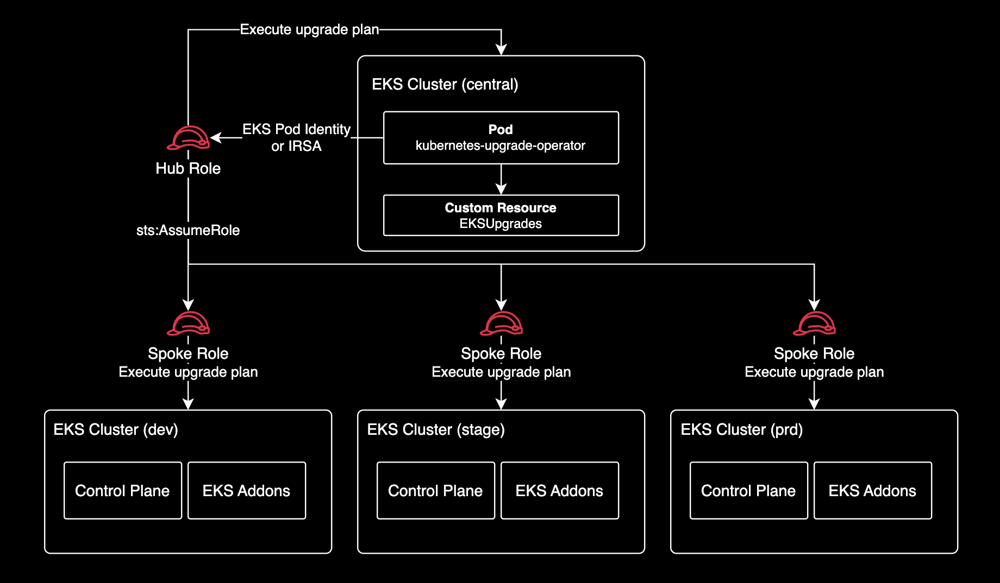

# kubernetes-upgrade-operator

[](https://www.rust-lang.org/)
[](https://github.com/younsl/o/pkgs/container/kuo)
[](https://github.com/younsl/o/pkgs/container/charts%2Fkuo)
[](https://github.com/younsl/o/blob/main/LICENSE)

Kubernetes Upgrade Operator for EKS clusters. Watches `EKSUpgrade` custom resources and performs declarative, sequential EKS cluster upgrades including control plane, add-ons, and managed node groups. Inspired by Rancher's [system-upgrade-controller](https://github.com/rancher/system-upgrade-controller).

## Features

- **Sequential control plane upgrades** — Automatically steps through 1 minor version at a time (e.g., 1.30 → 1.31 → 1.32)
- **Add-on version management** — Resolves and applies compatible add-on versions per upgrade step
- **Managed node group rolling updates** — Triggers rolling updates after control plane and add-on upgrades
- **Preflight validation** — EKS Cluster Insights, Deletion Protection, PDB drain deadlock checks before upgrade
- **Cross-account support** — Hub & Spoke model via STS AssumeRole
- **Crash recovery** — Persists AWS update IDs in CRD status for resuming interrupted operations
- **Dry-run mode** — Generate upgrade plan without executing
- **Sync mode** — Update only add-ons and node groups without control plane upgrade (when target version equals current)
- **Slack notifications** — Opt-in Slack Incoming Webhook alerts for Started, Completed, and Failed events with dry-run/live mode distinction

## Architecture

kubernetes-upgrade-operator is a Kubernetes operator that runs in a central (hub) EKS cluster and upgrades EKS clusters declaratively. It watches `EKSUpgrade` custom resources, assumes IAM roles to reach spoke-account clusters via STS AssumeRole, and executes sequential control plane, add-on, and managed node group upgrades. The same hub role can also upgrade the cluster it runs in directly.



## Upgrade Phase Flow

1. **Pending** — CR created, waiting for reconciliation
2. **Planning** — Resolve upgrade path, addon targets, nodegroup targets
3. **PreflightChecking** — EKS Insights, Deletion Protection, PDB drain deadlock checks
4. **UpgradingControlPlane** — Step through 1 minor version at a time
5. **UpgradingAddons** — Update add-ons to compatible versions
6. **UpgradingNodeGroups** — Trigger managed node group rolling updates
7. **Completed** — All upgrades finished successfully

> Any phase can transition to **Failed** on error. Mandatory preflight check failures also result in **Failed**.

### Dry-Run Mode

When `dryRun: true` is set, the operator executes planning and preflight validation but skips all infrastructure changes (control plane upgrade, add-on updates, node group rolling updates):

1. **Pending** — CR created, waiting for reconciliation
2. **Planning** — Resolve upgrade path, addon targets, nodegroup targets
3. **PreflightChecking** — EKS Insights, Deletion Protection, PDB drain deadlock checks
4. **Completed** (DryRunCompleted) — Plan generated, no infrastructure changes applied

> Mandatory preflight check failures result in **Failed** regardless of the dry-run flag. On success, the full upgrade plan (upgrade path, addon targets, nodegroup targets) is available in `status.phases` for review.

**Preflight checks:**

| Check | Category | Behavior |
|-------|----------|----------|
| EKS Cluster Insights | Mandatory | Fails if critical insights exist |
| [EKS Deletion Protection](https://docs.aws.amazon.com/eks/latest/userguide/delete-cluster.html) | Mandatory | Fails if deletion protection is disabled |
| PDB Drain Deadlock | Mandatory | Fails if any PDB has `disruptionsAllowed == 0` (skippable via `skipPdbCheck`) |

## Installation

Helm is the recommended installation method. See [charts/kuo](charts/kuo) for detailed configuration and values reference.

### EKSUpgrade CR Example

`EKSUpgrade` is a cluster-scoped custom resource that declares the desired upgrade state for an EKS cluster. The operator watches these resources and continuously reconciles the actual cluster state to match the spec through the Kubernetes [control loop](https://kubernetes.io/docs/concepts/architecture/controller/). This enables GitOps-driven upgrades where the upgrade intent is version-controlled and auditable, and interrupted upgrades are automatically resumed without manual intervention.

```yaml
apiVersion: kuo.io/v1alpha1
kind: EKSUpgrade
metadata:
  name: staging-upgrade
spec:
  clusterName: staging-cluster
  targetVersion: "1.34"
  region: ap-northeast-2
```

Cross-account upgrade with Slack notification:

```yaml
apiVersion: kuo.io/v1alpha1
kind: EKSUpgrade
metadata:
  name: production-upgrade
spec:
  clusterName: production-cluster
  targetVersion: "1.34"
  region: ap-northeast-2
  assumeRoleArn: arn:aws:iam::123456789012:role/kuo-spoke-role
  notification:
    onUpgrade: true
    onDryRun: false
```

### Spec Fields

| Field | Required | Default | Description |
|-------|----------|---------|-------------|
| `clusterName` | Yes | — | EKS cluster name |
| `targetVersion` | Yes | — | Target Kubernetes version (e.g., `"1.34"`) |
| `region` | Yes | — | AWS region |
| `assumeRoleArn` | No | — | IAM Role ARN for cross-account access |
| `addonVersions` | No | auto-resolve | Add-on version overrides (`addon-name: version`) |
| `skipPdbCheck` | No | `false` | Skip PDB drain deadlock check |
| `dryRun` | No | `false` | Plan only, do not execute |
| `timeouts.controlPlaneMinutes` | No | `30` | Control plane upgrade timeout |
| `timeouts.nodegroupMinutes` | No | `60` | Node group upgrade timeout |
| `notification.onUpgrade` | No | `false` | Send Slack notifications for actual upgrades (`dryRun: false`) |
| `notification.onDryRun` | No | `false` | Send Slack notifications for dry-run executions (`dryRun: true`) |

## Hub & Spoke IAM Permissions

### Hub Account (Central — where kubernetes-upgrade-operator runs)

The operator pod needs base credentials via **IRSA** or **EKS Pod Identity**.

<details>
<summary>Hub Policy — for same-account clusters</summary>

```json
{
  "Version": "2012-10-17",
  "Statement": [
    {
      "Sid": "EKSClusterOperations",
      "Effect": "Allow",
      "Action": [
        "eks:ListClusters",
        "eks:DescribeCluster",
        "eks:UpdateClusterVersion",
        "eks:DescribeUpdate",
        "eks:ListNodegroups"
      ],
      "Resource": "arn:aws:eks:*:111111111111:cluster/*"
    },
    {
      "Sid": "EKSInsights",
      "Effect": "Allow",
      "Action": [
        "eks:ListInsights",
        "eks:DescribeInsight"
      ],
      "Resource": "arn:aws:eks:*:111111111111:cluster/*"
    },
    {
      "Sid": "EKSAddonOperations",
      "Effect": "Allow",
      "Action": [
        "eks:ListAddons",
        "eks:DescribeAddon",
        "eks:DescribeAddonVersions",
        "eks:UpdateAddon"
      ],
      "Resource": "*"
    },
    {
      "Sid": "EKSNodegroupOperations",
      "Effect": "Allow",
      "Action": [
        "eks:DescribeNodegroup",
        "eks:UpdateNodegroupVersion"
      ],
      "Resource": "arn:aws:eks:*:111111111111:nodegroup/*/*/*"
    },
    {
      "Sid": "STSIdentity",
      "Effect": "Allow",
      "Action": [
        "sts:GetCallerIdentity",
        "sts:TagSession"
      ],
      "Resource": "*"
    }
  ]
}
```

</details>

<details>
<summary>Spoke Policy — for cross-account clusters</summary>

```json
{
  "Version": "2012-10-17",
  "Statement": [
    {
      "Sid": "AllowAssumeRoleToSpokeAccounts",
      "Effect": "Allow",
      "Action": [
        "sts:AssumeRole",
        "sts:TagSession"
      ],
      "Resource": "arn:aws:iam::*:role/kuo-spoke-role"
    }
  ]
}
```

</details>

> Both policies can be attached to the same hub role when managing both same-account and cross-account clusters.
>
> ⚠️ **Important:** `sts:TagSession` is required in both Hub Policy and Spoke Policy. EKS Pod Identity and IRSA attach session tags when issuing credentials. Without this permission, the hub role cannot obtain credentials and all API calls will fail with `AccessDenied`.

**Helm values for IRSA:**

```yaml
serviceAccount:
  annotations:
    eks.amazonaws.com/role-arn: arn:aws:iam::111111111111:role/kuo-hub-role
```

**[EKS Pod Identity](https://docs.aws.amazon.com/eks/latest/userguide/pod-id-how-it-works.html):**

EKS Pod Identity does not require any ServiceAccount annotations. Create a Pod Identity Association instead:

```bash
aws eks create-pod-identity-association \
  --cluster-name hub-cluster \
  --namespace kube-system \
  --service-account kuo \
  --role-arn arn:aws:iam::111111111111:role/kuo-hub-role
```

### Spoke Account (Target — EKS clusters to upgrade)

<details>
<summary>IAM Policy for Spoke Role</summary>

```json
{
  "Version": "2012-10-17",
  "Statement": [
    {
      "Sid": "EKSClusterOperations",
      "Effect": "Allow",
      "Action": [
        "eks:ListClusters",
        "eks:DescribeCluster",
        "eks:UpdateClusterVersion",
        "eks:DescribeUpdate",
        "eks:ListNodegroups"
      ],
      "Resource": "arn:aws:eks:*:222222222222:cluster/*"
    },
    {
      "Sid": "EKSInsights",
      "Effect": "Allow",
      "Action": [
        "eks:ListInsights",
        "eks:DescribeInsight"
      ],
      "Resource": "arn:aws:eks:*:222222222222:cluster/*"
    },
    {
      "Sid": "EKSAddonOperations",
      "Effect": "Allow",
      "Action": [
        "eks:ListAddons",
        "eks:DescribeAddon",
        "eks:DescribeAddonVersions",
        "eks:UpdateAddon"
      ],
      "Resource": "*"
    },
    {
      "Sid": "EKSNodegroupOperations",
      "Effect": "Allow",
      "Action": [
        "eks:DescribeNodegroup",
        "eks:UpdateNodegroupVersion"
      ],
      "Resource": "arn:aws:eks:*:222222222222:nodegroup/*/*/*"
    },
    {
      "Sid": "STSIdentity",
      "Effect": "Allow",
      "Action": "sts:GetCallerIdentity",
      "Resource": "*"
    }
  ]
}
```

</details>

<details>
<summary>Trust Policy for Spoke Role</summary>

```json
{
  "Version": "2012-10-17",
  "Statement": [
    {
      "Effect": "Allow",
      "Principal": {
        "AWS": "arn:aws:iam::111111111111:role/kuo-hub-role"
      },
      "Action": [
        "sts:AssumeRole",
        "sts:TagSession"
      ]
    }
  ]
}
```

</details>

**EKS Access Entry** (for K8s API access in spoke cluster):

The spoke role needs an EKS access entry to query PodDisruptionBudgets via the Kubernetes API during preflight checks.

```bash
aws eks create-access-entry \
  --cluster-name production-cluster \
  --principal-arn arn:aws:iam::222222222222:role/kuo-spoke-role \
  --type STANDARD

aws eks associate-access-policy \
  --cluster-name production-cluster \
  --principal-arn arn:aws:iam::222222222222:role/kuo-spoke-role \
  --policy-arn arn:aws:eks::aws:cluster-access-policy/AmazonEKSViewPolicy \
  --access-scope type=cluster
```

> Spoke cluster does **NOT** need EKS Pod Identity registration. The kubernetes-upgrade-operator pod only runs in the hub cluster and authenticates to spoke accounts via STS AssumeRole.

### Permission Summary

```
Hub Account (111111111111)           Spoke Account (222222222222)
┌──────────────────────────┐        ┌──────────────────────────┐
│ kuo-hub-role             │        │ kuo-spoke-role           │
│                          │        │                          │
│ Hub Policy:              │        │ Permissions:             │
│  · eks:* (same-account)  │        │  · eks:* (cluster ops)   │
│  · sts:GetCallerIdentity │        │  · sts:GetCallerIdentity │
│                          │        │                          │
│ Spoke Policy:            │        │ Trust policy:            │
│  · sts:AssumeRole ───────┼───────→│  · Hub role (AssumeRole) │
│                          │        │                          │
│ Credential source:       │        │ EKS Pod Identity: NO     │
│  · IRSA or               │        │                          │
│  · EKS Pod Identity      │        │ EKS Access Entry: YES    │
│                          │        │  · AmazonEKSViewPolicy   │
│ EKS Pod Identity: YES    │        │                          │
└──────────────────────────┘        └──────────────────────────┘
```

## Monitoring

| Endpoint | Port | Description |
|----------|------|-------------|
| `GET /healthz` | 8080 | Liveness probe (always 200) |
| `GET /readyz` | 8080 | Readiness probe (200 when controller is watching) |
| `GET /metrics` | 8081 | Prometheus metrics (OpenMetrics text) |

### Prometheus Metrics

| Metric | Type | Labels |
|--------|------|--------|
| `kuo_reconcile_total` | Counter | cluster_name, region, result |
| `kuo_reconcile_duration_seconds` | Histogram | cluster_name, region |
| `kuo_phase_duration_seconds` | Histogram | cluster_name, region, phase |
| `kuo_upgrade_phase_info` | Gauge | cluster_name, region, phase |
| `kuo_phase_transition_total` | Counter | cluster_name, region, phase |
| `kuo_upgrade_completed_total` | Counter | cluster_name, region |
| `kuo_upgrade_failed_total` | Counter | cluster_name, region |

For PromQL examples, alerting rules, and detailed label descriptions, see [docs/metrics.md](docs/metrics.md).

```bash
kubectl get eksupgrades
NAME                 CLUSTER              TARGET   PHASE             AUTH                AGE
staging-upgrade      staging-cluster      1.34     Completed         IdentityVerified    5m
production-upgrade   production-cluster   1.34     UpgradingAddons   AssumeRoleSuccess   2m
```

## Development

```bash
make build          # Debug build
make release        # Optimized release build
make test           # Run tests
make fmt            # Format code
make lint           # Run clippy
make install        # Install to ~/.cargo/bin/
```

## Constraints

- Control plane upgrades limited to 1 minor version at a time (EKS limitation)
- Managed Node Groups only (self-managed and Karpenter nodes are not supported)
- Cluster-scoped CRD (one EKSUpgrade per cluster, not namespaced)

## License

This project is licensed under the MIT License. See the [LICENSE](../../../LICENSE) file for details.
