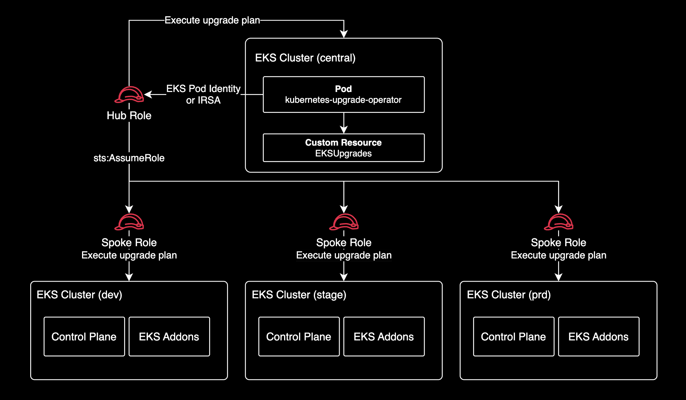
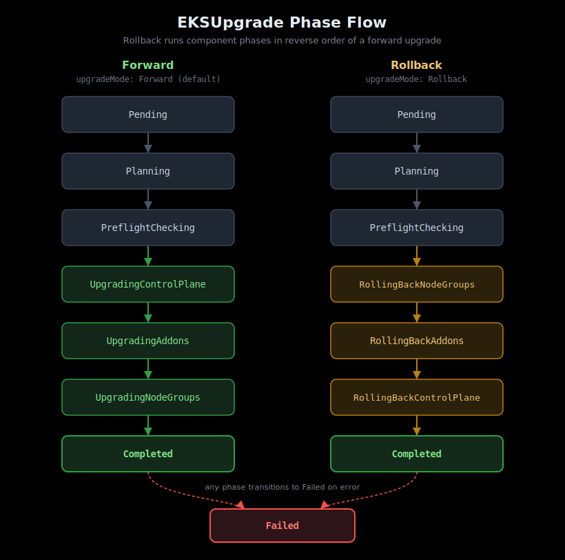

# kubernetes-upgrade-operator

[](https://www.rust-lang.org/)
[](https://github.com/younsl/o/pkgs/container/kuo)
[](https://github.com/younsl/o/pkgs/container/charts%2Fkuo)
[](https://github.com/younsl/o/blob/main/LICENSE)

Kubernetes Upgrade Operator for EKS clusters. Watches `EKSUpgrade` custom resources and performs declarative, sequential EKS cluster upgrades including control plane, add-ons, and managed node groups. Inspired by Rancher's [system-upgrade-controller](https://github.com/rancher/system-upgrade-controller).

## Features

- **Sequential control plane upgrades** — Automatically steps through 1 minor version at a time (e.g., 1.30 → 1.31 → 1.32)
- **Version rollback** — `upgradeMode: Rollback` reverts a cluster to the previous minor version (N-1) in reverse order (node groups → add-ons → control plane), matching AWS EKS rollback semantics
- **Add-on version management** — Resolves and applies compatible add-on versions per upgrade step
- **Managed node group rolling updates** — Triggers rolling updates after control plane and add-on upgrades
- **Preflight validation** — EKS Cluster Insights, Deletion Protection, PDB drain deadlock checks before upgrade
- **Cross-account support** — Hub & Spoke model via STS AssumeRole
- **Crash recovery** — Persists AWS update IDs in CRD status for resuming interrupted operations
- **Dry-run mode** — Generate upgrade plan without executing
- **Sync mode** — Update only add-ons and node groups without control plane upgrade (when target version equals current)
- **Slack notifications** — Opt-in Slack Incoming Webhook alerts for Started, Completed, and Failed events with dry-run/live mode distinction

## Architecture

kubernetes-upgrade-operator is a Kubernetes operator that runs in a central (hub) EKS cluster and upgrades EKS clusters declaratively. It watches `EKSUpgrade` custom resources, assumes IAM roles to reach spoke-account clusters via STS AssumeRole, and executes sequential control plane, add-on, and managed node group upgrades. The same hub role can also upgrade the cluster it runs in directly.



## Upgrade Phase Flow



kuo operates in one of two upgrade modes, selected by the required `spec.upgradeMode` field:

- **Forward** — Upgrades a cluster to a higher minor version. Runs control plane → add-ons → node groups, so worker nodes never run a version newer than the control plane.
- **Rollback** — Reverts a cluster to the previous minor version (N-1) within the [AWS 7-day rollback window](https://docs.aws.amazon.com/eks/latest/userguide/rollback-cluster.html). Runs the same phases in reverse order (node groups → add-ons → control plane). See [Rollback Mode](#rollback-mode).

The Forward flow proceeds through the following phases:

1. **Pending** — CR created, waiting for reconciliation
2. **Planning** — Resolve upgrade path, addon targets, nodegroup targets
3. **PreflightChecking** — EKS Insights, Deletion Protection, PDB drain deadlock checks
4. **UpgradingControlPlane** — Step through 1 minor version at a time
5. **UpgradingAddons** — Update add-ons to compatible versions
6. **UpgradingNodeGroups** — Trigger managed node group rolling updates
7. **Completed** — All upgrades finished successfully

> Any phase can transition to **Failed** on error. Mandatory preflight check failures also result in **Failed**.

### Dry-Run Mode

When `dryRun: true` is set, the operator executes planning and preflight validation but skips all infrastructure changes (control plane upgrade, add-on updates, node group rolling updates):

1. **Pending** — CR created, waiting for reconciliation
2. **Planning** — Resolve upgrade path, addon targets, nodegroup targets
3. **PreflightChecking** — EKS Insights, Deletion Protection, PDB drain deadlock checks
4. **Completed** (DryRunCompleted) — Plan generated, no infrastructure changes applied

> Mandatory preflight check failures result in **Failed** regardless of the dry-run flag. On success, the full upgrade plan (upgrade path, addon targets, nodegroup targets) is available in `status.phases` for review.

**Preflight checks:**

| Check | Category | Behavior |
|-------|----------|----------|
| EKS Cluster Insights | Mandatory | Fails if critical insights exist |
| [EKS Deletion Protection](https://docs.aws.amazon.com/eks/latest/userguide/delete-cluster.html) | Mandatory | Fails if deletion protection is disabled |
| PDB Drain Deadlock | Mandatory | Fails if any PDB has `disruptionsAllowed == 0` (skippable via `skipPdbCheck`) |

### Rollback Mode

Setting `upgradeMode: Rollback` reverts a cluster to the previous minor version, mirroring [AWS EKS version rollback](https://docs.aws.amazon.com/eks/latest/userguide/rollback-cluster.html). The phases run in the reverse order of a forward upgrade so worker nodes never run a version newer than the control plane:

1. **Pending** → **Planning** → **PreflightChecking** (insights queried under the `ROLLBACK_READINESS` category instead of `UPGRADE_READINESS`; Deletion Protection and PDB drain deadlock checks still apply)
2. **RollingBackNodeGroups** — Roll managed node groups back to N-1 first
3. **RollingBackAddons** — Downgrade add-ons: a version pinned in `addonVersions` wins; any unpinned add-on is auto-rolled-back to the default version compatible with the target minor, but only when that is a downgrade (raw EKS does not roll add-ons back automatically, so kuo fills this gap)
4. **RollingBackControlPlane** — Roll the control plane back to N-1 last (`UpdateClusterVersion`, reported by AWS as a `VersionRollback` update)
5. **Completed**

Constraints (enforced to match the EKS API):

- Single minor only: `targetVersion` must be exactly one minor below the current version (N to N-1). Multi-minor rollback requests are rejected in planning; roll back one minor at a time.
- AWS only permits rollback within 7 days of the upgrade, to a version the cluster was previously in-place upgraded from. kuo attempts the `UpdateClusterVersion` call and surfaces any AWS rejection as a `Failed` phase.
- Add-ons: pinned versions in `addonVersions` are applied as-is; unpinned add-ons auto-roll-back to the target minor's default compatible version when that is a downgrade, otherwise left untouched.
- Consecutive rollback rejected: once a rollback has completed, another rollback is blocked in planning (`Failed`) until a forward upgrade runs, matching EKS (which only permits rolling back a version the cluster was recently upgraded from).

A rollback can be triggered on the same `EKSUpgrade` resource that performed the upgrade: edit `upgradeMode` to `Rollback` and set `targetVersion` to N-1. The operator resets the status and re-runs from `Pending`.

```yaml
apiVersion: kuo.io/v1alpha1
kind: EKSUpgrade
metadata:
  name: staging-upgrade
spec:
  clusterName: staging-cluster
  upgradeMode: Rollback
  targetVersion: "1.33"   # current cluster is 1.34
  region: ap-northeast-2
  # Optionally downgrade specific add-ons alongside the control plane:
  # addonVersions:
  #   vpc-cni: v1.18.1-eksbuild.3
```

## Installation

Helm is the recommended installation method:

```bash
helm install kuo oci://ghcr.io/younsl/charts/kuo \
  --namespace kube-system
```

The operator requires hub/spoke IAM roles, IRSA or EKS Pod Identity credentials, and EKS access entries before it can upgrade clusters. See the [Installation Guide](docs/installation.md) for the full IAM prerequisites and setup steps, and [charts/kuo](charts/kuo) for the values reference.

### EKSUpgrade CR Example

`EKSUpgrade` is a cluster-scoped custom resource that declares the desired upgrade state for an EKS cluster. The operator watches these resources and continuously reconciles the actual cluster state to match the spec through the Kubernetes [control loop](https://kubernetes.io/docs/concepts/architecture/controller/). This enables GitOps-driven upgrades where the upgrade intent is version-controlled and auditable, and interrupted upgrades are automatically resumed without manual intervention.

```yaml
apiVersion: kuo.io/v1alpha1
kind: EKSUpgrade
metadata:
  name: staging-upgrade
spec:
  clusterName: staging-cluster
  targetVersion: "1.34"
  region: ap-northeast-2
  upgradeMode: Forward
```

Cross-account upgrade with Slack notification:

```yaml
apiVersion: kuo.io/v1alpha1
kind: EKSUpgrade
metadata:
  name: production-upgrade
spec:
  clusterName: production-cluster
  targetVersion: "1.34"
  region: ap-northeast-2
  upgradeMode: Forward
  assumeRoleArn: arn:aws:iam::123456789012:role/kuo-spoke-role
  notification:
    onUpgrade: true
    onDryRun: false
```

### Spec Fields

| Field | Required | Default | Description |
|-------|----------|---------|-------------|
| `clusterName` | Yes | — | EKS cluster name |
| `targetVersion` | Yes | — | Target Kubernetes version (e.g., `"1.34"`) |
| `region` | Yes | — | AWS region |
| `upgradeMode` | Yes | — | `Forward` to upgrade, `Rollback` to revert one minor version (N-1). Must be set explicitly |
| `assumeRoleArn` | No | — | IAM Role ARN for cross-account access |
| `addonVersions` | No | auto-resolve | Add-on version overrides (`addon-name: version`). On rollback, unpinned add-ons auto-roll-back to the target minor's default compatible version when that is a downgrade |
| `skipPdbCheck` | No | `false` | Skip PDB drain deadlock check |
| `dryRun` | No | `false` | Plan only, do not execute |
| `timeouts.controlPlaneMinutes` | No | `30` | Control plane upgrade timeout |
| `timeouts.nodegroupMinutes` | No | `60` | Node group upgrade timeout |
| `notification.onUpgrade` | No | `false` | Send Slack notifications for actual upgrades (`dryRun: false`) |
| `notification.onDryRun` | No | `false` | Send Slack notifications for dry-run executions (`dryRun: true`) |

## Monitoring

| Endpoint | Port | Description |
|----------|------|-------------|
| `GET /healthz` | 8080 | Liveness probe (always 200) |
| `GET /readyz` | 8080 | Readiness probe (200 when controller is watching) |
| `GET /metrics` | 8081 | Prometheus metrics (OpenMetrics text) |

### Prometheus Metrics

| Metric | Type | Labels |
|--------|------|--------|
| `kuo_build_info` | Info | version, revision, rust_version, arch |
| `kuo_reconcile_total` | Counter | cluster_name, region, result |
| `kuo_reconcile_duration_seconds` | Histogram | cluster_name, region |
| `kuo_phase_duration_seconds` | Histogram | cluster_name, region, phase |
| `kuo_upgrade_phase_info` | Gauge | cluster_name, region, phase |
| `kuo_phase_transition_total` | Counter | cluster_name, region, phase |
| `kuo_upgrade_completed_total` | Counter | cluster_name, region |
| `kuo_upgrade_failed_total` | Counter | cluster_name, region |

For PromQL examples, alerting rules, and detailed label descriptions, see [docs/metrics.md](docs/metrics.md).

```bash
kubectl get eksupgrades
NAME                 CLUSTER              TARGET   PHASE             PROGRESS   AUTH                AGE
staging-upgrade      staging-cluster      1.34     Completed         4/4        IdentityVerified    5m
production-upgrade   production-cluster   1.34     UpgradingAddons   2/5        AssumeRoleSuccess   2m
```

## Development

```bash
make build          # Debug build
make release        # Optimized release build
make test           # Run tests
make fmt            # Format code
make lint           # Run clippy
make install        # Install to ~/.cargo/bin/
```

## Constraints

- Control plane upgrades limited to [1 minor version at a time](https://docs.aws.amazon.com/eks/latest/userguide/update-cluster.html) (EKS limitation)
- [Rollback](https://docs.aws.amazon.com/eks/latest/userguide/rollback-cluster.html) limited to a single minor version (N to N-1) within the AWS 7-day window
- [Managed Node Groups](https://docs.aws.amazon.com/eks/latest/userguide/managed-node-groups.html) only ([self-managed](https://docs.aws.amazon.com/eks/latest/userguide/worker.html) and [Karpenter](https://karpenter.sh/) nodes are not supported)
- Cluster-scoped CRD (one EKSUpgrade per cluster, not namespaced)

## License

This project is licensed under the MIT License. See the [LICENSE](../../../LICENSE) file for details.
