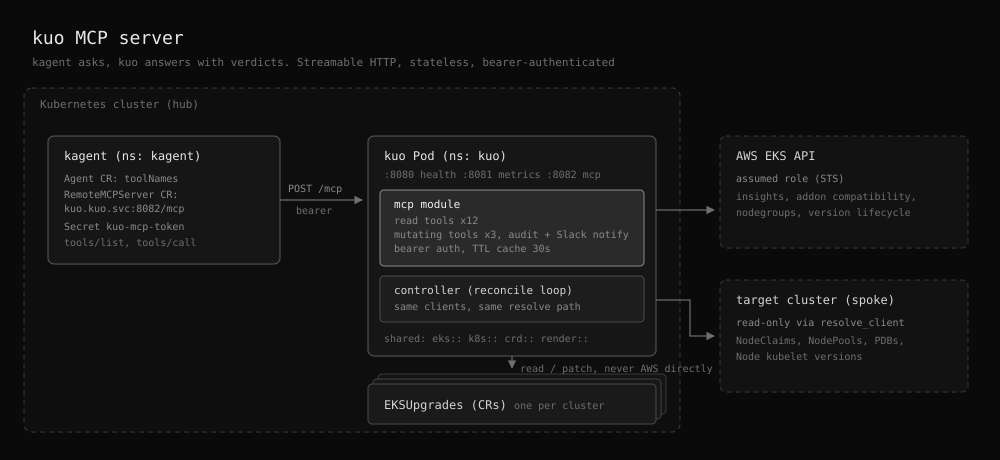

# Design: kagent MCP Server

## Status

Proposed.

## Background

kuo already owns every fact needed to answer "is this cluster safe to upgrade" and "why is this upgrade stuck": the phase state machine, the minor-version step arithmetic, the mandatory-versus-advisory split in preflight, the EKS insight readings, the add-on compatibility matrix, and the Karpenter AMI selector rules. None of that reaches an operator except as a dense `status` block on the `EKSUpgrade` custom resource plus a Slack message.

[kagent](https://kagent.dev) runs in the same cluster and already investigates alerts through [kagent-gateway](../../kagent-gateway/README.md). Pointed at a generic Kubernetes MCP server, a kagent agent can fetch the `EKSUpgrade` resource but cannot interpret it. `phase: UpgradingAddons` with `progress: 4/11` and a `PreflightPassed` condition carrying `advisoryFailures` is not self-describing, and the agent has no route at all to the AWS-side facts (insights, add-on compatible versions, node group health) because those are read with kuo's assumed role, not the agent's.

A dedicated MCP server inside kuo closes that gap: kuo publishes its own domain knowledge as tools, and the agent answers upgrade questions in Slack without a human decoding YAML.

## Goals

- Expose kuo's read paths as MCP tools over streamable HTTP, consumable by a kagent `RemoteMCPServer`.
- Return decision-shaped answers, not raw AWS API dumps. Each tool result carries a one-line verdict plus the structured evidence behind it.
- Resolve target-cluster and AWS clients exactly the way the reconcile path does, so the agent's view can never disagree with the controller's.
- All 15 tools are always available. Safety comes not from hiding tools but from what they touch: mutating tools are audited, Slack-notified, and expressed as a change to an `EKSUpgrade` resource rather than a direct AWS call.

## Non-Goals

- Replacing the generic Kubernetes MCP server. This server answers EKS-upgrade questions only, and an agent is expected to hold both.
- Prompt, model, or agent configuration. That stays on the kagent `Agent` custom resource.
- Cluster-agnostic tools. Every tool is scoped to an `EKSUpgrade` resource or to the cluster that resource names.
- MCP resources, prompts, and server-initiated progress notifications. Tools only.
- Driving an upgrade end to end from chat. The custom resource stays the source of truth and the human stays the author of a real upgrade.

## Placement

The server runs in the operator process, as a third HTTP listener beside health and metrics.

| Option | Verdict | Reason |
|--------|---------|--------|
| In the operator process (chosen) | Chosen | Reuses the live `kube::Client`, the assumed-role `AwsClients`, and the same `resolve_client` path the reconciler uses. No second IRSA identity, no second set of EKS access entries, no drift between what the agent reads and what the controller acted on. |
| Sidecar in the operator Pod | Rejected | Gains process isolation but has to rebuild AWS and target-cluster clients from scratch, so the identity and access-entry duplication cost lands anyway. |
| Separate component under `box/kubernetes/` | Rejected | Would duplicate `src/eks/`, `src/k8s/`, and the version arithmetic, or force those modules into a published crate. The MCP surface is a projection of kuo's own state, not a tool that does one separate thing. |

The MCP module depends only on the existing `eks`, `k8s`, `crd`, and `render` modules and never on `controller` or `phases`, so a later extraction into its own binary target stays mechanical.

## Architecture



The kagent agent Pod discovers the tool list through the `RemoteMCPServer` resource and calls `POST /mcp` on the kuo Service with the shared bearer token. Inside the kuo Pod the `mcp` module serves reads from the `EKSUpgrade` resources, the EKS API through the assumed role, and the target cluster through the same `resolve_client` path the reconciler uses. Mutating tools patch only the `EKSUpgrade` resource, so the controller stays the single actor against AWS.

Port assignment:

| Port | Purpose | Exposed by Service |
|------|---------|--------------------|
| 8080 | health probes | no |
| 8081 | Prometheus metrics | yes, existing |
| 8082 | MCP endpoint | yes, new, gated by `mcp.enabled` |

## Tool surface

One flat tool list. All 15 tools are registered unconditionally, so `tools/list` always returns the full surface. There is no mode switch: the deliberate constraint is not which tools exist but what they are allowed to touch, and that constraint is structural rather than configurable.

Every tool takes an optional `name` identifying the `EKSUpgrade` resource, which is cluster-scoped, so a name alone addresses it. When exactly one resource exists the name may be omitted. When several exist and it is omitted, the tool returns an error listing the candidate names (`{"error": "3 EKSUpgrades exist, specify name", "candidates": ["prod-a", ...]}`) so the agent re-calls with one on its next turn. Auto-picking the first match is forbidden, since the worst case is a `retry_upgrade` aimed at the wrong cluster. Tools that read AWS resolve the region and `assumeRoleArn` from that resource's spec.

### Read tools

| Tool | Extra arguments | Returns | Backed by |
|------|-----------------|---------|-----------|
| `list_upgrades` | none | one row per `EKSUpgrade`: cluster, region, mode, current and target version, phase, progress, age | `Api<EKSUpgrade>` list |
| `get_upgrade_status` | none | phase, progress, rendered upgrade path, run duration, per-phase summary, conditions, `lastTransition`, AWS caller identity (account, ARN) | `crd::status`, `status.identity`, `render::{upgrade_path,run_duration}` |
| `diagnose_upgrade` | none | the stuck-or-failed verdict: current phase, the failing component, the condition that flipped, the specific next action. For `Rollback` mode, rollback eligibility judged from `lastTransition` (a second consecutive rollback has no eligible target) | status plus the phase-specific reader for the current phase |
| `get_preflight_report` | none | each check with pass or fail, mandatory or advisory, reason. Explicit "blocks the upgrade" flag | `phases::preflight::checks`, `has_mandatory_failures` |
| `get_controlplane_state` | none | cluster version and status (`ACTIVE`, `UPDATING`), in-flight EKS update id and its stage, remaining minor steps toward the target | `eks::upgrade`, `eks::version::calculate_upgrade_path`, `status.phases.control_plane` |
| `get_cluster_insights` | `severity` filter | upgrade-blocking insights with resource references and remediation text | `eks::insights::{list_insights,describe_insight}` |
| `get_addon_plan` | none | per add-on: installed version, planned version, whether a compatible version exists for the target minor | `eks::addon::{list_addons,get_compatible_versions,plan_addon_upgrades}` |
| `get_nodegroup_state` | none | per managed node group: version, status, planned action, in-flight update id | `eks::nodegroup::{list_nodegroups,plan_nodegroup_upgrades}` |
| `get_karpenter_state` | none | per configured NodePool: NodeClaim count, stale-kubelet count, AMI selector verdict, replacement progress | `k8s::karpenter`, `k8s::node::is_stale_kubelet` |
| `get_pdb_risks` | none | PodDisruptionBudgets that would deadlock a drain, with the owning workload | `k8s::pdb::check_pdbs` |
| `get_version_lifecycle` | none | standard and extended support end dates for the current and target minor, days remaining | `status.lifecycle` |
| `explain_phase` | `phase` (required) | what the phase does, what it waits on, what makes it fail, what the operator can do about it | static text compiled from the phase modules |

`explain_phase` is deliberately static. It removes the most common class of agent hallucination, which is inventing plausible-sounding kuo semantics, and it costs nothing to serve.

### Mutating tools

Every mutating call writes the `EKSUpgrade` resource, never AWS directly, so the controller remains the only actor and every change is visible in `kubectl get eksupgrade`.

| Tool | Extra arguments | Effect | Guardrails |
|------|-----------------|--------|------------|
| `plan_upgrade` | `clusterName`, `targetVersion`, `region` | Creates or updates an `EKSUpgrade` with `dryRun: true` so the plan and preflight run without touching the cluster. Refuses when the existing resource has `dryRun: false` or a run in progress, since flipping a live upgrade back to dry-run mid-flight is not a plan, it is an interruption. `EKSUpgrade` is cluster-scoped, so creation involves no namespace choice; the resource is named after the cluster | only ever writes `dryRun: true`, never touches a live resource |
| `retry_upgrade` | none | Bumps a retry annotation on a `Failed` resource to force reconciliation | applies only to `Failed` resources, audit log |
| `promote_dry_run` | none | Flips `dryRun` from true to false on an existing resource | applies only to dry-run resources, audit log, Slack notification on every call (best-effort: a failed notification is logged at ERROR but never blocks the promotion, the WARN audit log is the primary record) |

Two rules hold for all of them: every accepted call emits a `WARN` audit log carrying tool name and arguments (a single shared token means the audit log cannot distinguish callers, an accepted limit of the one-audience design), and no tool ever creates a non-dry-run upgrade from scratch. There is no per-cluster allowlist: any cluster an `EKSUpgrade` names is in scope, and exposure is controlled at the kagent side through the agent's `toolNames`. The real safety property is structural: the worst a mutating tool can do is what a human could do with `kubectl edit eksupgrade`, and the controller's own validation and phase machine still stand between that edit and the cluster.

### Consistency and concurrency

A successful mutating call invalidates every cache entry for its cluster (the cache key is `(tool, cluster, args hash)`, so this is a prefix drop). Without it, an agent that promotes an upgrade and immediately re-reads would be served the pre-promotion state for up to the 30s TTL and reasonably conclude the promotion failed.

Two small mechanisms bound concurrent load. `AwsClients` are reused per cluster from a shared map instead of being rebuilt per call, so the STS `AssumeRole` round trip happens once per cluster, not once per tool call, with the SDK refreshing credentials itself. A global semaphore (initially hardcoded at 8 concurrent tool calls, promoted to configuration only if reality demands it) caps the fan-out an agent loop can generate. Excess calls queue, and kagent's own 30s request timeout provides the natural backpressure.

## Result shape

Each tool returns one text content block holding JSON:

```json
{
  "summary": "prod-cluster is blocked in PreflightChecking: 1 mandatory check failed",
  "verdict": "blocked",
  "cluster": "prod-cluster",
  "details": { "...": "tool specific" },
  "truncated": false
}
```

`summary` is what the model quotes back into Slack, `verdict` is one of `ok`, `warn`, `blocked`, `failed`, `unknown` so the agent can branch without parsing prose, and `details` carries the evidence. Lists are capped at 50 entries with `truncated: true` set when the cap bites, because an agent that pulls 400 NodeClaims into its context wastes the budget it needs for the answer.

The mandatory-versus-advisory distinction in preflight results is a boolean field per check, not prose. Misreading an advisory failure as a blocker is the most common wrong answer in this domain, and a field the agent can branch on removes it.

## Transport and session handling

Streamable HTTP in stateless mode: one `POST /mcp` per request, no session id, no SSE resumability. The operator is a single replica behind a Deployment, and a stateless server survives its own restart without leaving kagent holding a dead session. `GET /mcp` returns `405`, which is the legal answer for a server that offers no server-initiated stream.

kagent side, subject to the CRD version in the cluster:

```yaml
apiVersion: kagent.dev/v1alpha2
kind: RemoteMCPServer
metadata:
  name: kuo
  namespace: kagent
spec:
  protocol: STREAMABLE_HTTP
  url: http://kuo.kuo.svc.cluster.local:8082/mcp
  timeout: 30s
  headersFrom:
    - name: Authorization
      valueFrom:
        type: Secret
        valueRef: kuo-mcp-token
        key: authorization
```

The agent then selects tools by name, so a tool is not exposed to an existing agent until that agent's `toolNames` list includes it. That list is where an installation chooses its exposure: an agent given only read tool names can never call a mutating tool, even though the server registers all 15. Verify the `apiVersion` and the `headersFrom` shape against the installed kagent CRDs before shipping the chart template, since kagent's tool-server API is still moving.

## Authentication

A static bearer token compared in constant time, read from `MCP_TOKEN_FILE` and mounted from a Secret. Absent token means the listener refuses to start: with mutating tools always registered, an unauthenticated endpoint is not an acceptable degraded state. The endpoint is `ClusterIP` only. No NetworkPolicy ships with the chart: the token is the boundary, and a CNI-dependent policy that most clusters would leave disabled adds surface without adding a guarantee. A cluster that wants one can add it through `extraObjects`. This is deliberately the weakest acceptable scheme: the threat being addressed is an unrelated in-cluster workload stumbling onto the port, not a determined attacker who already holds a Pod in the kagent namespace. If the endpoint ever leaves the cluster, the MCP spec's OAuth resource-server profile replaces this.

For contrast, the OpenCost MCP server ships with no authentication at all, which is tolerable for read-only cost data. kuo cannot copy that precedent: `promote_dry_run` starts a real upgrade, so an open port would let any in-cluster workload promote one.

### Token generation and Secret setup

The token is an opaque random string, nothing more: no JWT, no expiry, no issuer. kuo does not validate it, it compares it, so the only requirement is unguessable entropy. There is no concept of a correct token, only a matching one. Structured tokens would buy nothing here: with a single caller and no permission tiers, there are no claims to verify.

Secrets are namespace-scoped, so the same token lands in two Secrets with different shapes: the kuo side holds the raw token that `MCP_TOKEN_FILE` mounts, the kagent side holds the full header value including the `Bearer ` prefix, because `headersFrom` injects it verbatim.

```bash
TOKEN=$(openssl rand -hex 32)

# kuo side: raw token, mounted as a file
kubectl -n kuo create secret generic kuo-mcp-token \
  --from-literal=token="${TOKEN}"

# kagent side: full header value for RemoteMCPServer headersFrom
kubectl -n kagent create secret generic kuo-mcp-token \
  --from-literal=authorization="Bearer ${TOKEN}"
```

The auth layer strips the `Bearer ` prefix from the incoming `Authorization` header and constant-time-compares the remainder against the mounted file. Rotation is updating both Secrets with a new value: the kubelet refreshes the mounted file within about a minute, and the handler reads the file per request (or on a short reload interval) so no Pod restart is needed. How quickly kagent picks up its side is kagent's to define. Between the two refreshes the sides can briefly disagree and calls fail with 401 until they converge. The agent surfaces that as a transient error, and the accepted answer is to rotate in a quiet window rather than build dual-token acceptance for a window measured in minutes.

The chart does not auto-generate the token. The usual `lookup`-plus-`randAlphaNum` pattern breaks under GitOps, where `helm template` renders without cluster access, `lookup` comes back empty, and every sync mints a new token that the kagent copy no longer matches. It would also solve only half the problem, since the chart cannot create the `Bearer `-prefixed copy in the kagent namespace. The chart therefore accepts exactly two inputs: `mcp.token` renders a Secret from the value (convenience, same pattern as `secret-slack.yaml`), and `mcp.existingSecret` references one created outside the chart, which is the recommended path.

### External Secrets

In production, store the token once and fan it out to both namespaces with External Secrets. One value in AWS Secrets Manager under the key `KUBERNETES_UPGRADE_OPERATOR_MCP_TOKEN`, two `ExternalSecret` resources shaping it per side:

```yaml
# kuo side: raw token under the key the chart mounts
apiVersion: external-secrets.io/v1
kind: ExternalSecret
metadata:
  name: kuo-mcp-token
  namespace: kuo
spec:
  secretStoreRef:
    name: aws-secrets-manager
    kind: ClusterSecretStore
  target:
    name: kuo-mcp-token
  data:
    - secretKey: token
      remoteRef:
        key: devops/kuo               # Secrets Manager secret name
        property: KUBERNETES_UPGRADE_OPERATOR_MCP_TOKEN
---
# kagent side: same value, templated into a full header
apiVersion: external-secrets.io/v1
kind: ExternalSecret
metadata:
  name: kuo-mcp-token
  namespace: kagent
spec:
  secretStoreRef:
    name: aws-secrets-manager
    kind: ClusterSecretStore
  target:
    name: kuo-mcp-token
    template:
      data:
        authorization: "Bearer {{ .token }}"
  data:
    - secretKey: token
      remoteRef:
        key: devops/kuo
        property: KUBERNETES_UPGRADE_OPERATOR_MCP_TOKEN
```

The kagent-side `target.template` is what adds the `Bearer ` prefix, so the stored value stays a bare token and neither consumer needs to know how the other formats it. Rotation becomes a single Secrets Manager update that External Secrets propagates to both namespaces within its `refreshInterval`. The Secrets Manager secret name (`devops/kuo` above) and the store name follow whatever convention the cluster already uses. The fixed contract is only the property key `KUBERNETES_UPGRADE_OPERATOR_MCP_TOKEN`.

## Configuration

| Env | Chart value | Default | Effect |
|-----|-------------|---------|--------|
| `MCP_ENABLED` | `mcp.enabled` | `false` | starts the listener |
| `MCP_PORT` | `mcp.port` | `8082` | listener port |
| `MCP_TOKEN_FILE` | `mcp.tokenSecret` | unset | bearer token path, required when `mcp.enabled` |
| `MCP_CACHE_TTL_SECONDS` | `mcp.cacheTtlSeconds` | `30` | AWS read cache window |

Every value is read once at process start, so toggling `mcp.enabled` is a `helm upgrade` that rolls the Pod, not a runtime switch. Disabled is the true default: the 8082 listener never binds, the Service does not expose the port, and the reconciler behaves exactly as it does today.

What the chart renders into the Pod spec with `mcp.enabled: true`, following the existing `slack.enabled` env pattern in `deployment.yaml`:

```yaml
spec:
  containers:
    - name: kuo
      ports:
        - name: mcp
          containerPort: 8082
      env:
        - name: MCP_ENABLED
          value: "true"
        - name: MCP_TOKEN_FILE
          value: /var/run/secrets/kuo-mcp/token
      volumeMounts:
        - name: mcp-token
          mountPath: /var/run/secrets/kuo-mcp
          readOnly: true
  volumes:
    - name: mcp-token
      secret:
        secretName: kuo-mcp-token
```

`MCP_PORT` and `MCP_CACHE_TTL_SECONDS` are omitted above because the defaults hold. The token arrives as a file mount rather than an env var so it never shows in `kubectl describe pod`, and the same Secret feeds the kagent side through `RemoteMCPServer.spec.headersFrom`.

The `RemoteMCPServer` resource is deliberately not part of this chart: it lives in the kagent namespace, references a kagent-side Secret, and depends on kagent's CRD versions, so the kagent chart owns it. kuo's chart ships only what runs in kuo's namespace.

## Observability

### Logging

MCP handlers emit through the same JSON tracing subscriber `init_tracing()` installs for the rest of the operator: one structured stdout stream, collected by whatever log pipeline already scrapes the Pod, nothing MCP-specific to configure. Reconciler and MCP lines interleave but separate cleanly on the `target` field (`kuo::mcp::*`).

Each call opens a tracing span carrying tool name and cluster, so an agent's reasoning path, which tools it called in what order to reach its answer, is reconstructable from the operator log alone.

```json
{"level":"INFO","target":"kuo::mcp::tools","tool":"get_preflight_report","cluster":"prod-cluster","duration_ms":142,"verdict":"blocked","message":"tool call completed"}
```

| Event | Level | Fields |
|-------|-------|--------|
| read tool call | INFO | tool, cluster, duration, verdict |
| accepted mutating call (audit) | WARN | tool, full arguments, source address |
| auth failure, allowlist denial | WARN | the gate that denied |
| tool internal error | ERROR | cause. AWS throttling excluded, it surfaces as an `unknown` verdict instead |

Mutating calls log at WARN deliberately: the audit trail survives even when a production filter runs above `info`. The bearer token is never logged, including on auth failures, where the received value is not recorded.

The MCP spec's own logging capability (server-pushed `notifications/message`) is not used. The server is stateless and declares tools only, so no server-initiated channel exists. Logs go to operator stdout, period.

### Metrics

Served on the existing 8081 registry alongside the reconciler metrics. Logs carry the per-call audit detail, metrics carry the aggregates.

| Metric | Type | Labels |
|--------|------|--------|
| `kuo_mcp_tool_calls_total` | counter | `tool`, `result` (`ok`, `error`, `denied`) |
| `kuo_mcp_tool_duration_seconds` | histogram | `tool` |
| `kuo_mcp_cache_lookups_total` | counter | `tool`, `outcome` (`hit`, `miss`) |

A rising `denied` rate flags a misconfigured agent or a caller without the token, a flat `hit` rate says the TTL cache is not absorbing the agent's retry pattern, and the duration histogram catches an AWS-backed tool degrading before the agent's own timeout (30s on the kagent side) starts firing.

## Failure semantics

`diagnose_upgrade` composes the other readers, so on a cold cache it can stack several AWS round trips against kagent's 30s request timeout. It therefore reads only the phase-specific path for the current phase rather than fanning out to every reader, and anything it cannot fetch in time degrades to `verdict: unknown` for that fragment instead of timing out the whole call.

A tool that fails returns an MCP tool error with a short actionable message and never panics, because a panic in the MCP listener would take the reconciler down with it under `panic = "abort"`. AWS throttling surfaces as `verdict: unknown` with the retry-after hint rather than as a hard error, which stops an agent from concluding a cluster is healthy when the read simply did not happen. A denied mutating call (wrong phase, already live) returns an error naming the gate that denied it, so the agent tells the human what to change instead of retrying.

## Implementation plan

Files, following the 2018 module layout:

```
src/mcp.rs              module root, Config::from_env
src/mcp/server.rs       axum router, rmcp service wiring, auth layer
src/mcp/auth.rs         constant-time bearer comparison
src/mcp/cache.rs        TTL cache keyed by (tool, cluster, args hash)
src/mcp/result.rs       ToolResult, Verdict, truncation helpers
src/mcp/metrics.rs      kuo_mcp_* metric families on the shared registry
src/mcp/tools.rs        tool registry and dispatch
src/mcp/tools/status.rs, insights.rs, addons.rs, nodes.rs, explain.rs, mutate.rs
```

New dependency: `rmcp` (the official MCP Rust SDK) at 3.1.4, MSRV 1.88, well under kuo's 1.97 toolchain. Verified facts that shaped this design:

- Features needed: `server`, `macros`, `transport-streamable-http-server`. The `#[tool]` / `#[tool_router]` macros generate the registry wiring.
- `StreamableHttpService` is a Tower service that mounts on the existing axum 0.8 router, so the 8082 listener is one more `Router` beside health and metrics.
- The server feature pulls `schemars` 1.x, which kuo already depends on (1.2) for the CRD, so tool input schemas derive from the same crate with no duplicate major version.
- Statelessness is the default for the current protocol revision: no `Mcp-Session-Id`, no standalone GET stream, exactly the session model this design chose. A `legacy_session_mode` toggle exists for clients speaking older protocol revisions, and whether kagent's client needs it is answered by implementation step 1.

The crate is post-3.0 with a semver migration guide, so the earlier pre-1.0 churn concern is gone. Pin the minor (`3.1`) rather than an exact patch, and keep `rmcp` types confined to `src/mcp/` anyway: the confinement costs nothing and keeps a future major bump mechanical.

Order of work:

1. `mcp::Config` and the listener behind `MCP_ENABLED`, serving `initialize` and an empty tool list. Proves the transport against a real kagent before any tool exists, and answers whether kagent's client needs `legacy_session_mode`.
2. `result.rs` and `cache.rs`, then the three status tools (`list_upgrades`, `get_upgrade_status`, `explain_phase`), which need no AWS access.
3. The AWS-backed read tools, one per commit, each reusing an existing `eks` or `k8s` function without adding new AWS calls.
4. `diagnose_upgrade`, last among the read tools, since it composes the others.
5. Auth, metrics, chart values, Service port, docs. The `RemoteMCPServer` registration is the kagent chart's to ship.
6. RBAC: the mutating tools need `create` and `update` on `eksupgrades` in `clusterrole.yaml`, verbs the reconcile path (which only reads the spec and patches status) never needed. Lands with the first mutating tool.
7. Mutating tools, with the audit log landing in the same commit as the first mutating tool.

## Testing

Unit tests live beside each tool module and drive the handler with constructed `EKSUpgrade` values and stub summaries, asserting the verdict and the truncation flag rather than the exact prose. A registration test asserts that `tools/list` contains exactly the 15 expected names. The router gets an integration test issuing a real `initialize` and `tools/call` over HTTP against a bound ephemeral port, mirroring the existing health-server test. AWS-backed paths are tested at the mapping layer, taking the already-typed `InsightsSummary`, `AddonInfo`, and `NodeGroupInfo` values as input, so no test needs AWS credentials. The 70% line-coverage floor applies to the new module before release.

## Risks

| Risk | Mitigation |
|------|------------|
| `rmcp` major-version API churn (3.x today) | minor-version pin, all crate types confined to `src/mcp/` |
| An agent retry loop hammering the EKS API | 30s TTL cache, and every tool maps to reads the reconciler already performs |
| Context blowout from large results | hard 50-entry caps with an explicit `truncated` flag |
| MCP listener destabilizing the reconciler | no shared mutable state beyond the clients, no panics in handlers, tools never write AWS |
| An agent misreading an advisory preflight failure as a blocker | the mandatory-versus-advisory distinction is a field in the result, not prose, and `explain_phase` states the rule |
| An agent misusing a mutating tool | mutating tools only patch `EKSUpgrade` resources the controller still validates, an agent is only given the tool names its `toolNames` lists, every accepted call is audit-logged and `promote_dry_run` notifies Slack |
