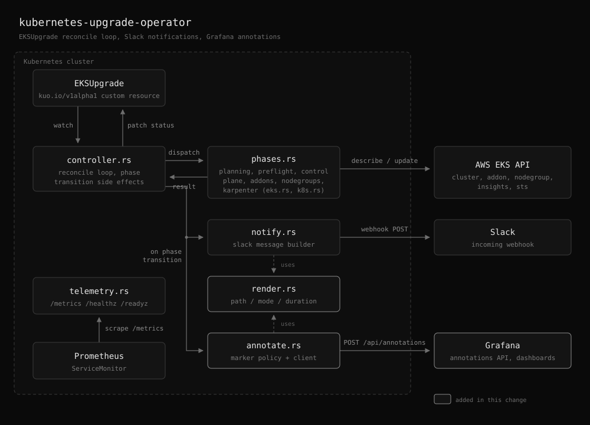

# Grafana annotations

## Overview

This document explains how kuo records the phases of an EKS upgrade as Grafana
annotations. It covers what is posted and when, how to make the markers appear
on a dashboard, and how to give the operator a token.

Read this if you are:

- A cluster operator who wants to see, on the dashboards you already watch,
  exactly when an upgrade entered each phase.
- Anyone wiring kuo into existing Grafana dashboards.

Basic familiarity with Grafana dashboards is enough. You do not need to read the
source.

## Background

kuo drives an `EKSUpgrade` through a fixed sequence of phases: Planning,
PreflightChecking, UpgradingControlPlane, UpgradingAddons, UpgradingNodeGroups,
and optionally UpgradingKarpenterNodePools. An upgrade takes tens of minutes, and
while it runs the cluster's own graphs move: nodes drain, pods reschedule,
latency shifts. Knowing which phase was running at a given minute is the
difference between "the control plane upgrade caused this" and "the node group
roll caused this".

Annotations are separate from the other two observability paths. The metrics
described in [metrics.md](metrics.md) give continuous series to chart, including
`kuo_upgrade_phase_info`. Slack notifications report the start, completion, and
failure of a run. Annotations are push-based vertical markers drawn directly on
your existing graphs, so the phase boundaries land right where the effect shows.

Markers are posted to the [Grafana](https://github.com/grafana/grafana) HTTP API
at [`POST /api/annotations`](https://grafana.com/docs/grafana/latest/developers/http_api/annotations/).
They are
global and tag-based: kuo does not target a specific dashboard. Any dashboard
that subscribes to the configured tags renders them. Annotating is off by default
and turns on only when you set the enable flag, a URL, and a token.

## Architecture



Annotating hangs off the same phase-transition hook that already drives the
metrics and the Slack notifications. `controller.rs` detects that the reconcile
just moved the resource to a new phase, and calls `annotate.rs`, which decides
whether the marker is worth posting and what it should say before handing it to
its Grafana client. `render.rs` holds the formatting the annotator shares with
`notify.rs`, so a dashboard marker and a Slack message describe the same upgrade
identically.

Because the hook is the transition itself rather than a timer, each phase
produces exactly one marker regardless of how many reconcile loops it spans, and
a restarted operator does not repost markers for phases already left behind.

## What kuo posts

### Each phase start (point annotation)

Every time an upgrade enters a new phase, kuo posts a point annotation at that
instant, which Grafana draws as a single vertical line. The text names the phase,
the cluster, the upgrade path, and whether the run is live or a dry run:

```
EKS upgrade phase UpgradingNodeGroups started on prod-cluster (1.34 → 1.35 → 1.36, Live Upgrade)
```

Exactly one marker is posted per phase, no matter how many reconcile loops that
phase takes to finish. Terminal phases (Completed, Failed) get no point marker,
because the region annotation below already covers where the run ended.

### The whole run (region annotation)

When the run reaches Completed or Failed, kuo posts a region annotation spanning
`status.startedAt` to `status.completedAt`, which Grafana draws as a shaded band.
Read together, the band is the upgrade window and the point markers inside it are
the phase boundaries.

```
EKS upgrade completed on prod-cluster (1.34 → 1.35 → 1.36, Live Upgrade) in 45m 30s
EKS upgrade failed during UpgradingControlPlane on prod-cluster (1.34 → 1.35, Live Upgrade) after 12m 3s: Control plane upgrade timed out
```

A failure names the phase that was executing when the run broke, not the `Failed`
state it ended in, plus the cause. A cause longer than 400 characters is
truncated; the full message stays in `status.message` and in Slack.

A rollback is described as a rollback rather than an upgrade, so
`upgradeMode: Rollback` reads correctly on the dashboard.

## Tags

Every annotation carries the configured base tags followed by per-annotation
tags. Tags are flat `key:value` strings, which is the convention dashboards
filter on. The cluster and region keys deliberately match the Prometheus metric
labels, so one dashboard variable can drive both the panels and the annotation
query.

| Tag | Role | Example |
|-----|------|---------|
| `event:eks-upgrade` | Base subscription tag. Dashboards filter on this. | `event:eks-upgrade` |
| `cluster_name:<name>` | Target cluster | `cluster_name:prod-cluster` |
| `region:<region>` | AWS region | `region:ap-northeast-2` |
| `resource:<name>` | Name of the `EKSUpgrade` resource | `resource:prod-upgrade` |
| `mode:<mode>` | `Forward` or `Rollback` | `mode:Forward` |
| `dry_run:<bool>` | Whether the run was a dry run | `dry_run:false` |
| `kind:<kind>` | `phase` for a phase marker, `upgrade` for the run region | `kind:phase` |
| `phase:<phase>` | Phase that started. Phase markers only. | `phase:UpgradingAddons` |
| `result:<outcome>` | `success` or `failure`. Run region only. | `result:success` |
| `failed_phase:<phase>` | Phase that was running when the run failed | `failed_phase:UpgradingNodeGroups` |

Base tags come from `GRAFANA_ANNOTATION_TAGS` (default `event:eks-upgrade`). Set
more than one as a comma-separated list, for example
`event:eks-upgrade,app:kuo`, when you also want a sender tag.

## Displaying annotations on a dashboard

Posting only stores the annotation in Grafana. A dashboard shows nothing until it
has an [annotation query](https://grafana.com/docs/grafana/latest/dashboards/build-dashboards/annotate-visualizations/)
subscribing to the tags. This is a one-time setup per dashboard.

1. Open the dashboard, then **Settings (gear icon) -> Annotations -> Add
   annotation query**.
2. Set **Data source** to `-- Grafana --`, the built-in source that reads stored
   annotations.
3. Set **Filter by** to `Tags` and add the tag `event:eks-upgrade`.
4. Save the dashboard.

Every upgrade now appears as markers on the dashboard's time-series panels.

### Filtering further

Tag filters combine with AND, so extra tags narrow what a dashboard shows:

- Add `cluster_name:prod-cluster` to show one cluster only.
- Add `kind:upgrade` to show the run bands without the phase lines, which is
  usually what you want on a busy dashboard.
- Add `result:failure` to show only failed runs.

A useful setup is two queries on the same dashboard: one on
`event:eks-upgrade,kind:upgrade` for the band and one on
`event:eks-upgrade,kind:phase` for the lines, so each can be toggled separately.

### Limiting to specific panels

By default an annotation query draws markers on every time-series panel. Use the
query's **Show in** panel filter to restrict it to chosen panels. That filters
display only; the data scope is still set by the tags.

Only time-aware visualizations (Time series, Graph, State timeline) render
annotation markers. Stat, Table, and Gauge panels do not.

## Authentication

kuo authenticates with a Grafana service account token sent as a `Bearer`
credential.

1. In Grafana, go to **Administration -> Users and access -> [Service
   accounts](https://grafana.com/docs/grafana/latest/administration/service-accounts/)**
   and create a service account with the **Editor** role. Editor is the minimum
   basic role that can create annotations (`annotations:create`); Viewer can only
   read them, and Admin grants more than is needed. On Enterprise or Cloud you
   can instead assign a custom
   [RBAC](https://grafana.com/docs/grafana/latest/administration/roles-and-permissions/access-control/)
   role granting `annotations:create`.
2. Create a token for that service account and copy it.
3. Provide it to kuo through the chart, as described below. The token is read
   from the environment only, never passed as an argument, and never logged.

## Startup reachability check

When annotating is enabled, kuo probes
[`GET /api/health`](https://grafana.com/docs/grafana/latest/developers/http_api/other/#health-api)
once at startup, before it begins reconciling, so a wrong URL or a blocked
network path is visible in the first seconds of the log rather than at the first
phase transition. The probe reads only, and is retried up to three times with a
two second pause.

The outcome is classified, because the three failure modes need different fixes:

| Outcome | Log | Meaning |
|---------|-----|---------|
| Reachable and healthy | `info`: preflight check succeeded, annotations are active | endpoint, HTTP status and latency recorded |
| Not reachable | `warn`: endpoint is not reachable from this Pod, plus `unreachable=true` and a network remedy | DNS did not resolve, the connection was refused, or TLS failed |
| Reachable but token refused | `warn`: Grafana rejected the API token, plus the `annotations:create` remedy | 401 or 403; not retried |
| Reachable but unhealthy | `warn`: preflight check failed | Grafana answered with some other error status |

A failed probe never stops the operator and never disables annotating. Markers
are still attempted at each phase, so an upgrade that starts while Grafana is
briefly down still records the phases it reaches afterwards.

### Logging

Every Grafana request kuo makes, at startup and per phase, logs both the HTTP
response code (`status`) and the round trip time (`latency_ms`), so the operator
log alone answers whether a phase was recorded and how long Grafana took. A
success also logs the marker, the annotation text, and the tags:

```
Grafana annotation posted  marker=UpgradingNodeGroups status=200 latency_ms=41 attempt=1 resource=prod-upgrade
Grafana annotation posted  marker=run status=200 latency_ms=38 attempt=1 resource=prod-upgrade
```

`marker` is the phase name for a phase marker and `run` for the region spanning a
finished run.

Failures log the same two fields at warning level, plus the error and, where the
cause is the token, the permission to grant. A `status` of `0` means no HTTP
response arrived at all, which is how a DNS failure, a refused connection, or a
timeout appears:

```
WARN  Grafana annotation timed out, retrying
      marker="UpgradingNodeGroups" status=0 latency_ms=3002 attempt=1 max_attempts=3
WARN  Grafana rejected the API token, annotation not recorded
      marker="UpgradingAddons" status=403 latency_ms=11 remedy="Grant the service account..."
```

### If the token is missing or refused

Annotating is auxiliary to performing the upgrade, so a token problem never stops
kuo from upgrading a cluster:

- **Missing token.** If `GRAFANA_ANNOTATION_ENABLED` is true but
  `GRAFANA_API_TOKEN` is empty, kuo logs a warning and starts with annotating
  disabled. It does not refuse to start.
- **Refused token.** If Grafana answers `401` or `403`, kuo logs a warning naming
  the permission to grant (`annotations:create`) and does not retry, since a
  rejected credential will keep being rejected. Upgrades continue unaffected.
- **Enabled and working.** When a token is configured, the startup log says so
  explicitly, listing the endpoint, the base tags, and the annotate-on policy, so
  you can confirm from the log alone that phases will be recorded.

A value that is present but malformed, such as an unrecognised
`GRAFANA_ANNOTATE_ON`, is a startup error rather than a silent default. Ignoring
that kind of typo would annotate the wrong runs.

## Delivery guarantees

Delivery is best-effort. A failed POST is logged and the reconcile continues. A
failed or slow Grafana never blocks an upgrade and never fails a reconcile.

Every request is bounded by a fixed 3 second timeout. The timeout is not
configurable: annotating runs on the reconcile path, so the only useful question
about a slow Grafana is how quickly to give up on it.

A request that times out is retried up to three times with a 500ms pause, since a
timeout says only that Grafana was slow at that instant. Nothing else is retried:
a refused token or any other error status would be refused again. With the 3
second timeout, a completely hung Grafana therefore delays a phase transition by
at most about ten seconds before the marker is abandoned.

The consequence is that a marker can be lost if Grafana stays unreachable. Treat annotations as a visual aid, not an audit log. The durable record
is the metrics in [metrics.md](metrics.md) and the `EKSUpgrade` status, both of
which survive a Grafana outage.

## Configuration

Annotating is controlled by environment variables, which the Helm chart sets from
`grafanaAnnotation` values.

| Environment variable | Helm value | Default | Meaning |
|----------------------|------------|---------|---------|
| `GRAFANA_ANNOTATION_ENABLED` | `grafanaAnnotation.enabled` | `false` | Enable annotating |
| `GRAFANA_URL` | `grafanaAnnotation.url` | `http://grafana.monitoring:3000` | Grafana base URL; kuo appends `/api/annotations` |
| `GRAFANA_API_TOKEN` | (token, see below) | (empty) | Grafana service account token |
| `GRAFANA_ANNOTATION_TAGS` | `grafanaAnnotation.tags` | `event:eks-upgrade` | Comma-separated base tags merged into every annotation |
| `GRAFANA_ANNOTATE_ON` | `grafanaAnnotation.annotateOn` | `all` | Which runs to annotate: `all`, `upgrade`, or `dryRun` |

Use `annotateOn: upgrade` to keep dry-run rehearsals off shared dashboards, or
`dryRun` to see only rehearsals while validating a new upgrade path.

### Providing the token

The token is sensitive, so it never goes in a ConfigMap. Choose one of:

- **Generated Secret**: set `grafanaAnnotation.apiToken`. The chart creates a
  Secret named `<release>-grafana-annotation` and injects it into
  `GRAFANA_API_TOKEN`. Convenient, but the token ends up in your values.
- **A Secret you manage (recommended for production)**: set
  `grafanaAnnotation.existingSecret` to its name and
  `grafanaAnnotation.existingSecretKey` to the key, default `token`. The chart
  references it without storing the token in values.

The reference carries `optional: true`, so a Secret that does not exist yet
cannot leave the Deployment stuck in `CreateContainerConfigError`. kuo starts,
warns that the token is missing, and runs with annotating disabled.

### Sourcing the token from AWS with External Secrets

To keep the token in AWS Secrets Manager or SSM Parameter Store, declare an
[`ExternalSecret`](https://external-secrets.io/latest/api/externalsecret/) under
`extraObjects`, managed by the [External Secrets
Operator](https://external-secrets.io), and point `existingSecret` at its
target.
The chart does not template an `ExternalSecret` itself: doing so would fix one
API version and one store shape, while `extraObjects` accommodates whichever your
platform uses.

```yaml
grafanaAnnotation:
  enabled: true
  url: http://grafana.monitoring:3000
  annotateOn: upgrade
  existingSecret: kuo-grafana-annotation
  existingSecretKey: token

extraObjects:
  # Pin to external-secrets.io/v1beta1 on operator releases predating the v1 API.
  - apiVersion: external-secrets.io/v1
    kind: ExternalSecret
    metadata:
      name: kuo-grafana-annotation
    spec:
      refreshInterval: 1h
      secretStoreRef:
        name: aws-secrets-manager
        kind: ClusterSecretStore
      target:
        name: kuo-grafana-annotation
        creationPolicy: Owner
      data:
        - secretKey: token
          remoteRef:
            key: platform/grafana
            property: annotation_token
```

Two ordering notes. First, the `ExternalSecret` and the Deployment are applied
together, so on a fresh install the Secret may not exist for the first few
seconds; the Pod starts anyway and logs the missing token. Second, kuo reads the
token once at startup, so after the first sync, and after any rotation that
changes the value, restart the Pod to pick it up:

```bash
kubectl rollout restart deployment/kuo -n kube-system
```

### Enabling through Helm

With a generated Secret:

```bash
helm install kuo oci://ghcr.io/younsl/charts/kuo \
  --namespace kube-system \
  --set grafanaAnnotation.enabled=true \
  --set grafanaAnnotation.url=http://grafana.monitoring:3000 \
  --set grafanaAnnotation.apiToken=<service-account-token>
```

The `monitoring` namespace and `grafana` service above match a
kube-prometheus-stack install. Adjust the host to your own Grafana Service. If
Grafana runs in a different namespace from kuo, use the fully qualified name,
for example `http://grafana.monitoring.svc.cluster.local:3000`.

## Conclusion

kuo marks each phase start with a point annotation and each finished run with a
region annotation spanning it, all tagged with `event:eks-upgrade` plus the
cluster, region, resource, mode, and phase. Add one tag-based annotation query to
a dashboard and every upgrade's phase boundaries appear on the graphs the upgrade
affected.

Keep two things in mind: annotations are global and tag-based rather than tied to
one dashboard, and delivery is best-effort. For a durable history, pair them with
the metrics in [metrics.md](metrics.md).
