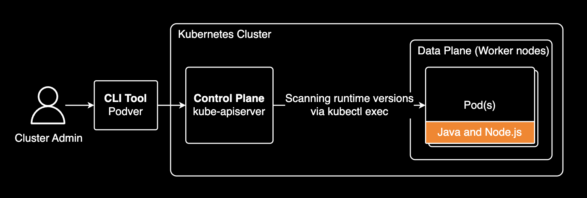

# podver - Pod Version Scanner

[](https://github.com/younsl/o/releases?q=podver)
[](https://www.rust-lang.org/)
[](https://opensource.org/licenses/MIT)

A Kubernetes CLI tool to scan and report Java and Node.js runtime versions across pods in your cluster.

This tool connects to your Kubernetes cluster via `kubectl` and executes `java -version` and `node --version` inside each pod to detect installed runtime versions. It processes multiple pods concurrently with real-time progress tracking, parses version outputs using regex patterns, and presents the results in a clean kubectl-style format. Perfect for auditing runtime versions across microservices, identifying outdated installations, or ensuring compliance with security policies.

## Features

- **Dual Runtime Detection** - Scan both Java and Node.js versions in a single pass
- **Version Filtering** - Filter pods by minimum Java/Node.js versions to find outdated installations
- **Real-time Progress Tracking** - Multi-level progress bars showing namespace and pod-level scanning progress
- **Concurrent Scanning** - Parallel processing across multiple namespaces with configurable concurrency
- **Namespace Statistics** - Per-namespace summary with total pods, runtime usage counts, and adoption ratios
- **CSV Export** - Export results to CSV for analysis in Excel or Google Sheets
- **DaemonSet Filtering** - Optionally skip DaemonSet pods
- **Async/Parallel Processing** - Built with Tokio for efficient resource utilization
- **Configurable Timeouts** - Adjust kubectl command timeouts for slow-responding pods
- **Graceful Shutdown** - Handles Ctrl+C for clean cancellation
- **Structured Logging** - Verbose mode with tracing for debugging

## Prerequisites

- Rust 1.91+ (for building from source)
- `kubectl` installed and configured
- Access to a Kubernetes cluster
- Pods with Java installed (`java -version` should work) or Node.js installed (`node --version` should work)

## Installation

### From Source

```bash
# Build release binary
cargo build --release

# Binary will be at target/release/podver
```

### Using Cargo

```bash
cargo install --path .
```

## Quick Start

### Basic Usage

Scan the default namespace:

```bash
podver --namespaces default
```

**Output:**
```
INDEX  NAMESPACE  POD                         JAVA_VERSION  NODE_VERSION
1      default    spring-boot-app-7d8f9c-xyz  17.0.8        Unknown
2      default    legacy-service-5b6c7-abc    1.8.0_372     Unknown
3      default    node-backend-4a3b2-def      Unknown       18.17.0

NAMESPACE  TOTAL PODS  JDK PODS  NODE PODS  JDK%   NODE%  TIME
default    45          2         1          4.4%   2.2%   0m 5s
```

### Scan Multiple Namespaces

```bash
podver --namespaces production,staging,development
```

**Output with Real-time Progress:**
```
 ✓ [████████████████████████████████████████] 3/3 namespaces | Scanning...

INDEX  NAMESPACE    POD                        JAVA_VERSION  NODE_VERSION
1      production   api-gateway-6f7d8-qwer     11.0.19       Unknown
2      production   payment-service-9c4b-zxcv  17.0.8        Unknown
3      production   node-api-5c3a-mnop         Unknown       20.5.1
4      staging      api-gateway-5e6c7-asdf     11.0.19       Unknown
5      development  test-app-3a2b1-hjkl        1.8.0_372     Unknown

NAMESPACE    TOTAL PODS  JDK PODS  NODE PODS  JDK%   NODE%  TIME
development  12          1         0          8.3%   0.0%   0m 8s
production   78          2         1          2.6%   1.3%   0m 8s
staging      34          1         0          2.9%   0.0%   0m 8s
```

### Export to CSV

```bash
podver --namespaces production --output results.csv
```

**CSV Output:**
```csv
INDEX,NAMESPACE,POD,JAVA_VERSION,NODE_VERSION
1,production,"api-gateway-6f7d8-qwer","11.0.19","Unknown"
2,production,"payment-service-9c4b-zxcv","17.0.8","Unknown"
3,production,"node-api-5c3a-mnop","Unknown","20.5.1"
4,staging,"legacy-app-abc","1.8.0_232","Unknown"

# Namespace Summary
NAMESPACE,TOTAL PODS,JDK PODS,NODE PODS,JDK%,NODE%,TIME
production,"78","2","1","2.6%","1.3%","0m 8s"
staging,"34","1","0","2.9%","0.0%","0m 8s"

# Overall Summary
# Total pods scanned: 112
# Pods using JDK: 3
# Pods using Node.js: 1
# Time taken: 0m 8s
```

### Verbose Mode

```bash
podver --verbose -n default
```

**Output:**
```
2025-10-18T04:15:32Z DEBUG Checking pods in namespace: default
2025-10-18T04:15:32Z DEBUG Scanning pod 1 of 5: app-deployment-abc123
2025-10-18T04:15:33Z DEBUG Scanning pod 2 of 5: worker-deployment-def456
...
INDEX  NAMESPACE  POD                    JAVA_VERSION  NODE_VERSION
1      default    app-deployment-abc123  11.0.16       Unknown
2      default    api-service-def456     17.0.2        Unknown

NAMESPACE  TOTAL PODS  JDK PODS  NODE PODS  JDK%    NODE%   TIME
default    5           2         0          40.0%   0.0%    0m 3s
```

## Usage Examples

### Filter Outdated Versions

Find pods running Java versions below 15:

```bash
podver --namespaces production --min-java-version 15
```

**Output:**
```
Applied filters:
  - Java version < 15

INDEX  NAMESPACE    POD                      JAVA_VERSION  NODE_VERSION
1      production   legacy-app-abc           1.8.0_232     Unknown
2      production   old-service-def          11.0.16       Unknown
3      production   another-legacy-ghi       1.8.0_342     Unknown

NAMESPACE    TOTAL PODS  JDK PODS  NODE PODS  JDK%   NODE%  TIME
production   78          3         0          3.8%   0.0%   0m 8s
```

Find pods running Node.js versions below 20.3.0:

```bash
podver --namespaces production --min-node-version 20.3.0
```

**Output:**
```
Applied filters:
  - Node.js version < 20.3.0

INDEX  NAMESPACE    POD                      JAVA_VERSION  NODE_VERSION
1      production   old-node-app-abc         Unknown       18.17.0
2      production   legacy-backend-def       Unknown       19.5.0

NAMESPACE    TOTAL PODS  JDK PODS  NODE PODS  JDK%   NODE%  TIME
production   78          0         2          0.0%   2.6%   0m 8s
```

Combine filters to find both outdated Java and Node.js:

```bash
podver -n production --min-java-version 15 --min-node-version 20.3.0 -o outdated.csv
```

### Include DaemonSet Pods

By default, DaemonSet pods are skipped. To include them:

```bash
podver --skip-daemonset=false
```

### Increase Concurrency

Process more pods in parallel:

```bash
podver --max-concurrent 50
```

### Custom Timeout

Increase timeout for slow-responding pods:

```bash
podver --timeout 60
```

### Complete Example

```bash
podver \
  --namespaces production,staging \
  --min-java-version 15 \
  --min-node-version 20.3.0 \
  --max-concurrent 30 \
  --timeout 45 \
  --skip-daemonset=false \
  --verbose \
  --output production-outdated-runtimes.csv
```

## Command Options

All available command-line options for `podver` (also viewable with `podver --help`):

| Option | Short | Type | Required | Default | Description |
|--------|-------|------|----------|---------|-------------|
| `--namespaces` | `-n` | String | **Yes** | - | Comma-separated list of namespaces to scan |
| `--max-concurrent` | `-c` | Integer | No | `20` | Maximum number of concurrent tasks |
| `--timeout` | `-t` | Integer | No | `30` | Timeout for kubectl commands (seconds) |
| `--skip-daemonset` | `-s` | Flag | No | `true` | Skip DaemonSet pods |
| `--verbose` | `-v` | Flag | No | `false` | Enable verbose logging |
| `--output` | `-o` | String | No | - | CSV filename to export results (e.g., `results.csv`) |
| `--min-java-version` | - | String | No | - | Minimum Java version threshold (e.g., `15`, `11.0.16`). Only show pods **below** this version |
| `--min-node-version` | - | String | No | - | Minimum Node.js version threshold (e.g., `20.3.0`, `18`). Only show pods **below** this version |
| `--help` | `-h` | Flag | No | - | Print help message |
| `--version` | `-V` | Flag | No | - | Print version information |

## Architecture



podver connects to your Kubernetes cluster via kubectl, executes version check commands inside each pod concurrently, and aggregates the results into a unified report. The tool leverages Tokio's async runtime to scan hundreds of pods efficiently with real-time progress tracking.

## How It Works

1. **Fetch pods** from specified namespaces using `kubectl get pods -o json`
2. **Filter** DaemonSet pods (if enabled)
3. **Display progress** with multi-level progress bars (namespace + per-pod)
4. **Execute concurrently** for each pod:
   - `kubectl exec -- java -version` to detect Java
   - `kubectl exec -- node --version` to detect Node.js
5. **Parse versions** from command outputs using regex patterns
6. **Apply filters** (if specified) - Only include pods below version thresholds
7. **Display** results in a kubectl-style formatted table
8. **Calculate statistics** - Per-namespace totals, runtime pod counts, and adoption ratios
9. **Export CSV** (optional) - Save results for further analysis

## Output Format

### Main Table
- **INDEX** - Sequential number for each runtime pod found
- **NAMESPACE** - Kubernetes namespace
- **POD** - Pod name
- **JAVA_VERSION** - Detected Java version (e.g., "11.0.19", "17.0.8", "1.8.0_292") or "Unknown"
- **NODE_VERSION** - Detected Node.js version (e.g., "18.17.0", "20.5.1") or "Unknown"

### Namespace Summary
- **NAMESPACE** - Kubernetes namespace (alphabetically sorted)
- **TOTAL PODS** - Total number of pods scanned in the namespace
- **JDK PODS** - Number of pods with Java detected (matching filter if specified)
- **NODE PODS** - Number of pods with Node.js detected (matching filter if specified)
- **JDK%** - Percentage of pods using Java (JDK PODS / TOTAL PODS × 100)
- **NODE%** - Percentage of pods using Node.js (NODE PODS / TOTAL PODS × 100)
- **TIME** - Total scan duration in minutes and seconds

## Troubleshooting

### "Unknown" Version

If a pod shows "Unknown" for Java or Node.js:
- Runtime (Java/Node.js) may not be installed in the pod
- Binary may be in a non-standard location (try: `which java` or `which node` in the pod)
- Timeout may be too short for pod to respond
- Pod may not be in Running state
- Container may not have shell access

Try increasing timeout or enabling verbose mode:

```bash
podver --timeout 60 --verbose
```

### Version Filtering

Version filtering uses semantic versioning comparison:
- **Java 8 build numbers** are supported: `1.8.0_232` < `1.8.0_292` < `1.8.0_342`
- **Comparison order**: major → minor → patch → build
- **Filter examples**:
  - `--min-java-version 15`: Shows Java 1.8, 11, 13, 14 (excludes 15, 17, 21)
  - `--min-java-version 1.8.0_300`: Shows `1.8.0_232`, `1.8.0_292` (excludes `1.8.0_342`, `11.x`, `17.x`)
  - `--min-node-version 20.3.0`: Shows 18.x, 19.x, 20.0.0-20.2.x (excludes 20.3.0+)

### No Progress Bars Visible

Progress bars are sent to stderr. If you're redirecting output:

```bash
podver -n production 2>/dev/null  # Hides progress bars
podver -n production > output.txt  # Progress bars still visible
```

### Slow Scanning

To improve performance:
- Increase concurrency: `--max-concurrent 50`
- Decrease timeout for faster failure: `--timeout 10`
- Skip DaemonSets: `--skip-daemonset` (default)

## License

MIT
