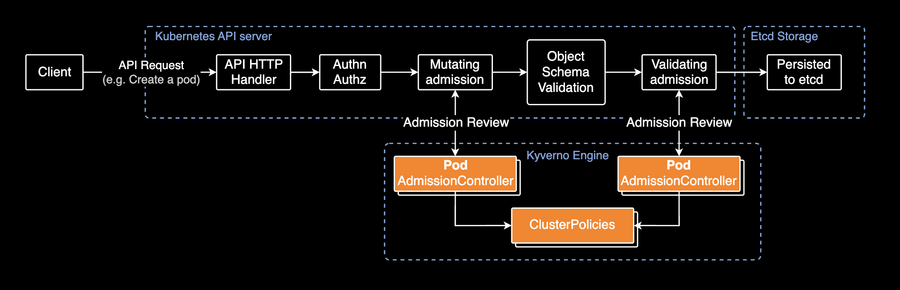

# kubernetes-policies

## Summary

Collection of Kyverno policies for Kubernetes cluster security and governance. These policies are tested and verified in production environments.

Overview of Kyverno and Kyverno policies:


## Directory Structure

This directory contains both Kubernetes native [CEL(Common Expression Language)](cel) based policy and Kyverno policy manifests.

Directory structure:

```bash
policies/
├── docs/        # Documentation and image assets
├── manifests/   # Policy manifest files
|  ├── cel/      # CEL(Common Expression Language) policies by Kubernetes native API
|  └── kyverno/  # Kyverno policies
└── README.md
```

`cel/` directory includes policies using Kubernetes' built-in ValidatingAdmissionPolicy and MutatingAdmissionPolicy, while the `kyverno/` directory contains custom resources controlled by Kyverno.

## Background

### What is Kyverno?

Kyverno is a policy engine designed for cloud native platform engineering teams. It enables security, automation, compliance, and governance using policy-as-code.

Kyverno Architecture for admission control:



### ⚠️ Important Note

With the introduction of native Kubernetes [ValidatingAdmissionPolicy](https://kubernetes.io/docs/reference/access-authn-authz/validating-admission-policy/) and [MutatingAdmissionPolicy](https://kubernetes.io/docs/reference/access-authn-authz/mutating-admission-policy/) based on the Common Expression Language (CEL), it is now possible to implement and enforce many admission control policies directly within Kubernetes. This native capability reduces the dependency on third-party policy engines like OPA Gatekeeper or Kyverno for common policy enforcement tasks. While external engines still offer advanced features, consider leveraging the built-in policies for simpler use cases to minimize external dependencies.

| Kubernetes Version | API Resource | Version | Remark |
| ------------------ | ------------ | ------- | ------ |
| 1.32               | ValidatingAdmissionPolicy | stable | Enabled by default |
| 1.32               | MutatingAdmissionPolicy | alpha | Disabled by default |

## Best Practices for Enterprise-grade Kubernetes

For enterprise-grade Kubernetes clusters using [Kyverno](https://github.com/kyverno/kyverno) as a policy engine, it is **highly recommended** to manage all policy custom resources using the official [kyverno-policies](https://github.com/kyverno/kyverno/tree/main/charts/kyverno-policies) helm chart provided by Kyverno. This approach ensures consistent deployment, versioning, and maintenance of security policies across your infrastructure.

Managing all resources through helm charts rather than directly applying YAML manifests with `kubectl` is a fundamental best practice for Kubernetes resource management. This practice provides significant advantages in versioning, rollback capabilities, templating, and maintaining configuration consistency across multiple clusters.

## References

For various sample policies, visit the [Kyverno Official Policies][kyverno-policies] page.

[kyverno-policies]: https://kyverno.io/policies
[cel]: https://kubernetes.io/docs/reference/using-api/cel/