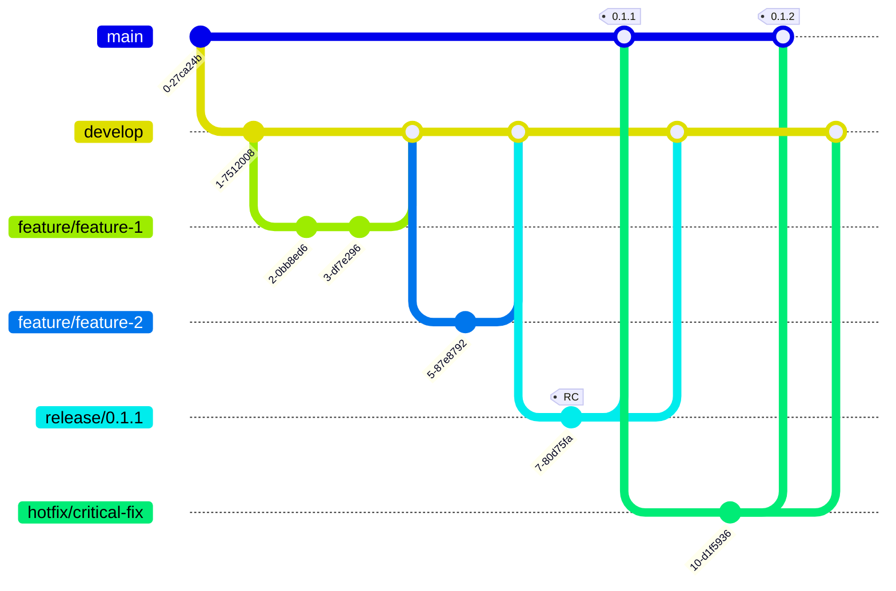

# Branching Strategy

This document outlines the Git branching strategy for the Promdrop project, based on Git Flow methodology.

## Branch Overview

### Core Principles

1. **develop** branch is created once from main and used for ongoing development
2. **release** branches are created from develop for each release preparation
3. **No fast-forward** merges (--no-ff) are used when merging to main to preserve release history
4. **Tags** are always created on main branch after merging release
5. **Back-merge** to develop is required after release to keep branches in sync

### Flow Visualization



### Branch Types

| Branch | Purpose | Naming Convention | Example |
|--------|---------|-------------------|---------|
| `main` | Production-ready code, tagged releases | `main` | - |
| `develop` | Integration branch for features | `develop` | - |
| `feature/*` | New features and enhancements | `feature/<description>` | `feature/add-json-export` |
| `release/*` | Release preparation | `release/<version>` | `release/0.1.1` |
| `hotfix/*` | Emergency fixes for production | `hotfix/<description>` | `hotfix/fix-parser-bug` |

## Release Process

### 1. Feature Development

```bash
# Create feature branch from develop
git checkout -b feature/new-feature develop

# Work on feature...
# Commit changes...

# Merge back to develop
git checkout develop
git merge --no-ff feature/new-feature
git branch -d feature/new-feature
```

### 2. Release Preparation

When ready for a new release (e.g., v0.1.1):

```bash
# Create release branch from develop
git checkout -b release/0.1.1 develop

# Update version in Makefile
# Update CHANGELOG.md
# Update README.md badges if needed
# Run final tests
make test
make build VERSION=0.1.1

# Commit release preparation changes
git commit -am "Prepare release 0.1.1"
```

### 3. Release Finalization

```bash
# Merge to main
git checkout main
git merge --no-ff release/0.1.1

# Create release tag on main branch
git tag -a 0.1.1 -m "Release version 0.1.1"

# Push main and tags
git push origin main --tags

# Back-merge to develop
git checkout develop
git merge --no-ff release/0.1.1

# Delete release branch
git branch -d release/0.1.1
```

### 4. Hotfix Process

For emergency fixes:

```bash
# Create hotfix from main
git checkout -b hotfix/critical-fix main

# Fix the issue...
# Update version (e.g., 0.1.2)
make test

# Merge to main
git checkout main
git merge --no-ff hotfix/critical-fix
git tag -a 0.1.2 -m "Hotfix version 0.1.2"

# Merge to develop
git checkout develop
git merge --no-ff hotfix/critical-fix

# Delete hotfix branch
git branch -d hotfix/critical-fix
```

## Release Checklist

Before creating a release:

- [ ] All tests pass (`make test`)
- [ ] Code is formatted (`make fmt`)
- [ ] Version updated in `Makefile`
- [ ] CHANGELOG.md updated with release notes
- [ ] README.md badges reflect correct version
- [ ] Build successful for all platforms (`make build-all`)
- [ ] Documentation updated if needed

## Tagging Convention

- **Format**: `<major>.<minor>.<patch>`
- **Examples**: `0.1.0`, `0.1.1`, `1.0.0`
- **Location**: Tags are ALWAYS created on the `main` branch
- **Annotation**: Use annotated tags with descriptive messages

```bash
# Create annotated tag
git tag -a 0.1.1 -m "Release version 0.1.1: Add metric grouping feature"

# Push tags
git push origin --tags
```

## GitHub Release Automation

When a tag is pushed to main:

1. GitHub Actions workflow triggers automatically
2. Multi-platform binaries are built
3. GitHub Release is created with:
   - Release notes from CHANGELOG.md
   - Binary artifacts for all platforms
   - Source code archives

4. Container image is built and pushed to ghcr.io

## Version Numbering

Following Semantic Versioning (SemVer):

- **MAJOR** (1.x.x): Incompatible API changes
- **MINOR** (x.1.x): New functionality, backwards compatible
- **PATCH** (x.x.1): Backwards compatible bug fixes

## Best Practices

1. **Never commit directly to main or develop**
   - Always use feature branches
   - Create pull requests for code review

2. **Keep branches up to date**
   ```bash
   git checkout feature/my-feature
   git merge develop  # Regularly sync with develop
   ```

3. **Use meaningful commit messages**
   - Follow conventional commits format
   - Example: `feat: add YAML export functionality`

4. **Delete merged branches**
   - Keep repository clean
   - Merged branches provide no value

5. **Test before merging**
   - Run `make test` before any merge
   - Ensure CI/CD passes

## Quick Reference

```bash
# Start new feature
git checkout -b feature/xyz develop

# Start release
git checkout -b release/0.1.1 develop

# Finish release (on main)
git checkout main
git merge --no-ff release/0.1.1
git tag -a 0.1.1 -m "Release 0.1.1"
git push origin main --tags

# Start hotfix
git checkout -b hotfix/fix main

# View all tags
git tag -l

# View remote branches
git branch -r
```