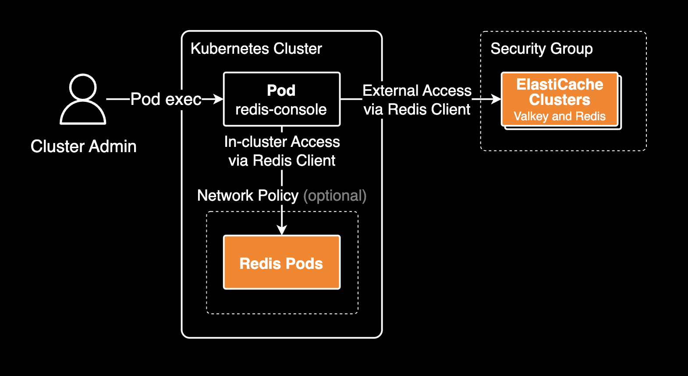

# Redis Console

[](https://github.com/younsl/o/pkgs/container/redis-console)
[](https://github.com/younsl/o/pkgs/container/charts%2Fredis-console)
[](https://www.rust-lang.org/)
[](https://github.com/younsl/o/blob/main/LICENSE)

<div align="left">
  
  
</div>

An interactive CLI administration tool for managing multiple Redis and AWS ElastiCache clusters from a single terminal session.

## Overview

Redis Console is designed for **DevOps Engineers and SREs** managing Redis and AWS ElastiCache clusters. It provides an **easy-to-use REPL** (Read-Eval-Print Loop) for connecting to and administering multiple Redis clusters across different environments (production, staging, development).

When deployed in Kubernetes, it acts as a **bastion server** for Redis operations. Use it for executing Redis commands, health checks, version inventory, and troubleshooting across multiple clusters via `kubectl exec`.

Built with Rust using [rustyline](https://github.com/kkawakam/rustyline), it offers a fast, efficient command-line interface similar to `redis-cli` but with multi-cluster support and Kubernetes deployment capabilities.

## Architecture



The diagram shows how redis-console operates in a Kubernetes environment:
- Cluster admins connect via `kubectl exec` to the redis-console pod
- The pod can access both in-cluster Redis pods and external ElastiCache clusters via Redis client
- **All Redis clusters must be manually configured** in the `config.yaml` file (see [Configuration](#configuration) section)
- [Network Policies](https://kubernetes.io/docs/concepts/services-networking/network-policies/) on Redis pods can optionally restrict ingress traffic from redis-console
- Security groups control external access to ElastiCache clusters

## Features

- **Interactive REPL**: redis-cli-style command-line interface
- **Multi-cluster Management**: Switch between multiple Redis clusters seamlessly
- **Health Monitoring**: Check connection status of all configured clusters
- **Colorized Output**: Enhanced readability with colored terminal output
- **Command History**: Navigate through command history with ↑/↓ keys
- **TLS Support**: Connect to Redis clusters with TLS encryption
- **Cluster Mode**: Support for Redis Cluster deployments
- **Built with Rust**: Fast, memory-efficient, and safe
- **Easy Configuration**: YAML-based cluster configuration
- **Kubernetes Ready**: Deploy via Helm chart with IRSA support for AWS ElastiCache

## Quick Start

### Local Installation

#### Prerequisites

- Rust 1.93+
- Redis server(s) to connect to

#### Build from Source

```bash
# Clone the repository
git clone https://github.com/younsl/o.git
cd o/box/kubernetes/redis-console

# Build
make build

# Or build optimized release
make release

# Run
make run
```

#### Install to System

```bash
make install
# Binary installed to ~/.cargo/bin/redis-console
```

## Configuration

### Configuration File Format

Create `~/.config/redis-console/config.yaml`:

```yaml
# Redis clusters
clusters:
  - alias: production          # Cluster alias (required)
    host: redis-prod.example.com
    port: 6379
    password: ""              # Optional: AUTH password
    tls: false                # Optional: Enable TLS
    cluster_mode: false       # Optional: Enable cluster mode
    description: "Production" # Optional: Description

  - alias: staging
    host: redis-staging.example.com
    port: 6379
    password: "my-password"
    tls: true
    cluster_mode: false

  - alias: local
    host: localhost
    port: 6379
    tls: false
    cluster_mode: false

# AWS region for ElastiCache (optional)
aws_region: ap-northeast-2
```

### Configuration File Locations

The application searches for configuration in the following order:

1. **Command-line argument**: `--config /path/to/config.yaml`
2. **Container default path**: `/etc/redis/clusters/config.yaml` (used in Kubernetes/Docker deployments)
3. **User config path**: `~/.config/redis-console/config.yaml` (local installations)

**Note for Container Deployments**: When running in Kubernetes or Docker, mount your configuration file to `/etc/redis/clusters/config.yaml` or use the Helm chart's `config.clusters` values to automatically generate the configuration.

## Usage

### Starting the Console

#### Local Usage

```bash
# Use default config location (~/.config/redis-console/config.yaml)
redis-console

# Specify custom config
redis-console --config /path/to/config.yaml
```

#### Container Usage

```bash
# Run with Docker using custom config
docker run --rm -it \
  -v $(pwd)/config.yaml:/etc/redis/clusters/config.yaml \
  ghcr.io/younsl/redis-console:latest

# Run with custom config path
docker run --rm -it \
  -v $(pwd)/my-config.yaml:/config/custom.yaml \
  ghcr.io/younsl/redis-console:latest \
  --config /config/custom.yaml
```

### Available Commands

After starting redis-console, the prompt changes to tty.redis-console> and you can use these commands in the REPL:

| Command | Aliases | Description |
|---------|---------|-------------|
| `help` | `h` | Show help message |
| `list` | `ls`, `l` | List all clusters with health status |
| `connect <id\|name>` | `c` | Connect to a cluster by ID or name |
| `info` | | Show Redis server info (when connected) |
| `quit` | `exit`, `q` | Disconnect (if connected) or exit |

### Example Session

Start the Redis Console (or run **redis-console** inside a Kubernetes pod):

```bash
$ redis-console

    ____           ___          ______                       __
   / __ \___  ____/ (_)____    / ____/___  ____  _________  / /__
  / /_/ / _ \/ __  / / ___/   / /   / __ \/ __ \/ ___/ __ \/ / _ \
 / _, _/  __/ /_/ / (__  )   / /___/ /_/ / / / (__  ) /_/ / /  __/
/_/ |_|\___/\__,_/_/____/    \____/\____/_/ /_/____/\____/_/\___/

Interactive CLI for managing multiple Redis clusters - v0.1.0

Available Commands:
  help, h  - Show this help message
  list, ls, l  - List all clusters with health status
  connect <id|name>, c  - Connect to a cluster by ID or name
  info  - Show Redis server info (when connected)
  quit, exit, q  - Disconnect (if connected) or exit

When connected, you can execute any Redis command directly:
  Example: GET mykey
  Example: SET mykey value
  Example: KEYS *
```

List all configured clusters with health status:

```bash
tty.redis-console> ls
Checking 3 clusters from ~/.config/redis-console/config.yaml

┌────┬────────────┬─────────────────────────────┬──────┬────────┬─────────┬────────────┬─────┬────────────┐
│ ID │ Alias      │ Host                        │ Port │ Engine │ Version │ Mode       │ TLS │ Status     │
├────┼────────────┼─────────────────────────────┼──────┼────────┼─────────┼────────────┼─────┼────────────┤
│ 0  │ production │ redis-prod.example.com      │ 6379 │ redis  │ 7.2.4   │ standalone │ No  │ Healthy    │
│ 1  │ staging    │ redis-staging.example.com   │ 6379 │ valkey │ 8.0.1   │ standalone │ Yes │ Healthy    │
│ 2  │ local      │ localhost                   │ 6379 │ redis  │ 7.2.4   │ standalone │ No  │ Healthy    │
└────┴────────────┴─────────────────────────────┴──────┴────────┴─────────┴────────────┴─────┴────────────┘
```

**Note**:
- Health checks are performed only when running the `ls` command (2-second timeout per cluster)
- Only clusters with "Healthy" status can be connected. Unhealthy clusters will fail to connect.
- The `connect` command attempts connection immediately without pre-checking health status

Connect to a cluster by ID or alias:

```bash
tty.redis-console> connect 2
Connecting to local...
Connected to local
```

Once connected to a cluster, execute Redis commands directly:

```bash
tty.redis-console [local]> SET mykey "Hello World"
OK

tty.redis-console [local]> GET mykey
"Hello World"

tty.redis-console [local]> KEYS *
1) "mykey"
```

Check Redis server information:

```bash
tty.redis-console [local]> info
Redis Server Info:
# Server
redis_version:7.2.4
redis_mode:standalone
os:Linux 6.6.26-linuxkit x86_64
...
```

Disconnect and exit:

```bash
tty.redis-console [local]> quit
Disconnected from local

tty.redis-console> quit
Goodbye!
```

## Building

### Standard Build Commands

```bash
# Development
make build          # Debug build
make run            # Build and run

# Code Quality
make fmt            # Format code
make lint           # Run clippy
make check          # Check without building
make deps           # Update dependencies

# Release
make release        # Optimized build
make install        # Install to system

# Container
make docker-build   # Build container image
make docker-push    # Push to registry
```

### Cross-Platform Build

```bash
make build-all      # Build for multiple platforms
```

Supported platforms and architectures:

| Build Type | Platform | Architecture | Support |
|------------|----------|--------------|---------|
| Binary | Linux | x86_64, ARM64 | ✅ |
| Binary | macOS | x86_64, ARM64 (Apple Silicon) | ✅ |
| Container (ghcr.io) | Linux | x86_64, ARM64 | ✅ |

## Implementation Details

### Project Structure

This project follows the standard Rust project structure:

```
redis-console/
├── src/
│   ├── main.rs           # CLI REPL and command handler
│   ├── config.rs         # Configuration management
│   ├── redis_client.rs   # Redis connection handler
│   └── tty.rs            # TTY output handler
├── charts/               # Helm chart (optional)
│   └── redis-console/
├── examples/             # Example configuration files
│   ├── config.yaml       # Example configuration
│   └── config.yaml.test  # Test configuration
├── Cargo.toml            # Rust dependencies
├── Dockerfile            # Multi-stage container build
└── Makefile              # Build commands
```

### Technology Stack

- **[rustyline](https://github.com/kkawakam/rustyline)**: Readline implementation for REPL
- **[colored](https://github.com/colored-rs/colored)**: Terminal color output
- **[tabled](https://github.com/zhiburt/tabled)**: Table formatting
- **[tokio](https://tokio.rs)**: Async runtime
- **[redis-rs](https://github.com/redis-rs/redis-rs)**: Redis client library
- **[clap](https://github.com/clap-rs/clap)**: Command-line argument parser

## Development

### Running Tests

```bash
cargo test --verbose
```

### Code Formatting

```bash
cargo fmt
```

### Linting

```bash
cargo clippy -- -D warnings
```

## Kubernetes Deployment

While Redis Console is designed as a CLI tool, you can also deploy it as a long-running pod in Kubernetes for operational purposes.

### Prerequisites

- Kubernetes cluster
- Helm 3.x
- AWS credentials for ElastiCache access (**Optional**)

### Installation with IRSA for AWS ElastiCache

```bash
helm install redis-console ./charts/redis-console \
  --namespace redis-console \
  --create-namespace \
  --set serviceAccount.annotations."eks\.amazonaws\.com/role-arn"=arn:aws:iam::123456789012:role/redis-console-role
```

### Connecting to the Console

```bash
# Get pod name
kubectl get pods -n redis-console

# Connect to the console
kubectl exec -it -n redis-console redis-console-xxxxxx -- redis-console
```

## Troubleshooting

### Connection Timeout

If you experience connection timeouts when running ls command (health checks) or connect command, check:
- Network connectivity and firewall rules
- Redis server configuration (`bind` directive)
- Redis TLS configuration if enabled
- [Network Policies](https://kubernetes.io/docs/concepts/services-networking/network-policies/) (for in-cluster Redis pods)

### Configuration Not Found

Ensure your configuration file exists at one of these locations:
- `/etc/redis/clusters/config.yaml` (container)
- `~/.config/redis-console/config.yaml` (local)

Or specify with `--config` flag.

### Build Errors

If you encounter build errors:
```bash
# Update dependencies
make deps

# Clean and rebuild
make clean
make build
```

## Roadmap

Core features are production-ready. Future enhancements focus on automation and advanced workflows.

**Completed:**
- [x] CLI REPL interface with command history
- [x] Multi-cluster management with alias support
- [x] Health check with Redis version and mode detection
- [x] Redis command execution
- [x] TLS support
- [x] Redis Cluster mode support
- [x] TTY detection for Kubernetes compatibility
- [x] Colorized output for better readability

**Planned:**
- [ ] AWS ElastiCache direct integration with cluster auto-discovery via AWS API
- [ ] Batch command execution from file
- [ ] Command aliases and shortcuts
- [ ] Export/import functionality
- [ ] Connection pooling for faster cluster switching without reconnection overhead

## Contributing

Pull requests are welcome at [github.com/younsl/o](https://github.com/younsl/o).

## License

MIT

## Maintainer

- [younsl](https://github.com/younsl)
