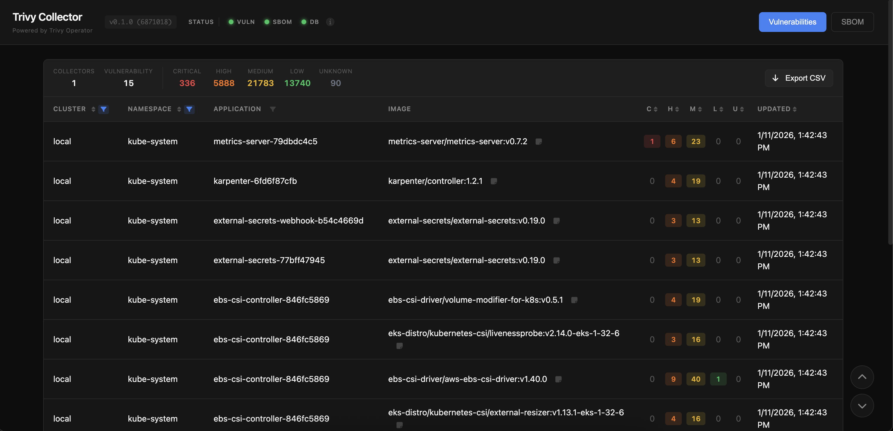
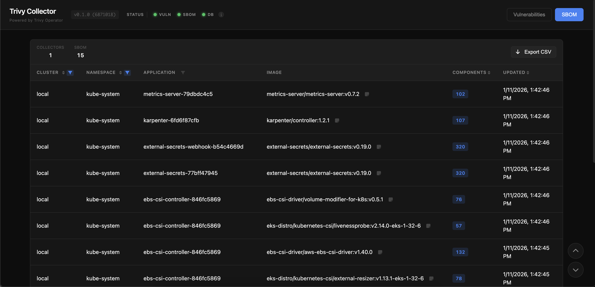
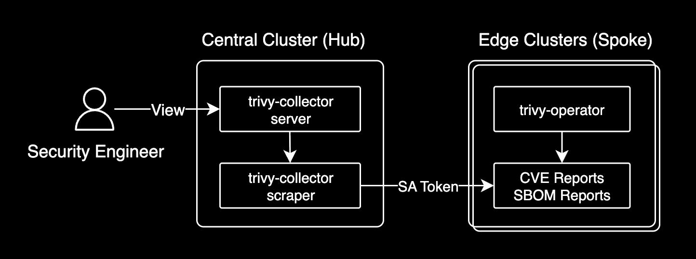

# trivy-collector

[](https://github.com/younsl/o/pkgs/container/trivy-collector)
[](https://github.com/younsl/o/pkgs/container/charts%2Ftrivy-collector)
[](https://www.rust-lang.org/)
[](https://github.com/younsl/o/blob/main/LICENSE)

Multi-cluster Trivy report collector and viewer - Rust-based Kubernetes application.

## Overview

This tool collects [Trivy Operator](https://github.com/aquasecurity/trivy-operator) reports (VulnerabilityReports, SbomReports) from multiple Kubernetes clusters and provides a centralized web UI for viewing and filtering security reports.

## Background

[Trivy Operator](https://github.com/aquasecurity/trivy-operator) is an excellent tool for scanning container vulnerabilities and generating SBOMs in Kubernetes. However, it only creates Custom Resources (VulnerabilityReports, SbomReports) within the cluster - **it doesn't provide any interface for Security Engineers to analyze this data**.

This creates real collaboration challenges:

- **Kubernetes Expertise Required**: Security Engineers must learn kubectl, understand CRDs, and parse YAML/JSON to review vulnerabilities
- **Scattered Data**: In multi-cluster environments, reports are distributed across clusters with no central view
- **No Filtering**: Finding critical vulnerabilities across hundreds of reports means manual grep/jq operations
- **No Historical View**: CRDs only show current state; there's no built-in way to track changes over time

```bash
# Without trivy-collector: Security Engineers need to run this
kubectl get vulnerabilityreports -A -o json | \
  jq '.items[] | select(.report.summary.criticalCount > 0) | {namespace: .metadata.namespace, name: .metadata.name, critical: .report.summary.criticalCount}'
```

**trivy-collector** bridges the gap between Platform Engineers and Security Engineers. Security teams can analyze vulnerability data through a familiar web interface - no Kubernetes knowledge or cluster access required. Just open the dashboard and start reviewing.





## Architecture



For detailed architecture documentation, see [Architecture](docs/architecture.md).

## Features

- **Multi-cluster support**: Collect reports from multiple Kubernetes clusters
- **Dual-mode architecture**: Runs as Collector (edge) or Server (central)
- **Web UI**: Built-in dashboard for viewing and filtering reports
- **SQLite storage**: Lightweight, persistent storage for reports
- **VulnerabilityReports**: Collect and view container vulnerability scans
- **SbomReports**: Collect and view Software Bill of Materials
- **Namespace filtering**: Watch specific namespaces or all namespaces
- **Health endpoints**: Kubernetes-ready health check endpoints
- **Keycloak OIDC authentication**: Two auth modes (`none`, `keycloak`) — optional SSO with [Keycloak](https://www.keycloak.org/) and self-issued API tokens for programmatic access
- **Structured logging**: JSON/pretty format with configurable levels
- **OpenAPI documentation**: Auto-generated API specification at `/api-docs/openapi.json`
- **Helm chart**: Easy deployment with customizable values

## Quick Start

### Server Deployment (Central cluster)

```bash
helm install trivy-collector ./charts/trivy-collector \
  --namespace trivy-system \
  --create-namespace \
  --set mode=server \
  --set server.persistence.enabled=true \
  --set server.ingress.enabled=true \
  --set server.ingress.hosts[0].host=trivy.example.com
```

### Collector Deployment (Edge clusters)

```bash
helm install trivy-collector ./charts/trivy-collector \
  --namespace trivy-system \
  --create-namespace \
  --set mode=collector \
  --set collector.serverUrl=http://trivy-server.central-cluster:3000 \
  --set collector.clusterName=edge-cluster-a
```

## Prerequisites

- Kubernetes cluster with [Trivy Operator](https://github.com/aquasecurity/trivy-operator) installed
- RBAC permissions to watch VulnerabilityReports and SbomReports CRDs

### Required RBAC Permissions

The collector requires the following RBAC permissions:

```yaml
apiVersion: rbac.authorization.k8s.io/v1
kind: ClusterRole
metadata:
  name: trivy-collector
rules:
  - apiGroups: ["aquasecurity.github.io"]
    resources: ["vulnerabilityreports", "sbomreports"]
    verbs: ["get", "list", "watch"]
```

## Documentation

- [Architecture](docs/architecture.md): System architecture and deployment modes
- [Authentication](docs/authentication.md): [Keycloak](https://www.keycloak.org/) OIDC setup, API token management, and security best practices
- [Configuration](docs/configuration.md): CLI options, environment variables, and API endpoints
- [Helm Chart](docs/helm-chart.md): Helm values reference and installation examples
- [Development](docs/development.md): Build commands, local testing, and release workflow
- [Troubleshooting](docs/troubleshooting.md): Common issues and solutions

## License

MIT

## Author

younsl
