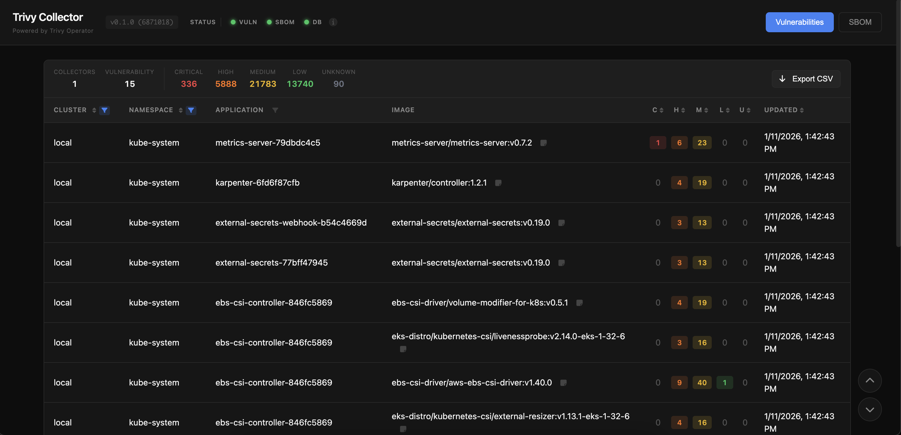
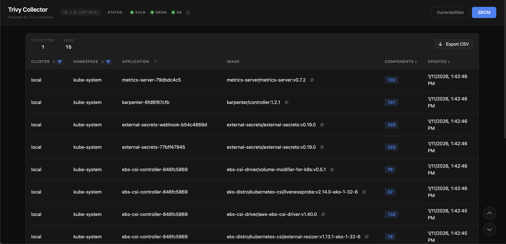

# trivy-collector

[](https://github.com/younsl/o/pkgs/container/trivy-collector)
[](https://github.com/younsl/o/pkgs/container/charts%2Ftrivy-collector)
[](https://www.rust-lang.org/)
[](https://github.com/younsl/o/blob/main/LICENSE)

Multi-cluster Trivy report collector and viewer - Rust-based Kubernetes application.

## Overview

This tool collects [Trivy Operator](https://github.com/aquasecurity/trivy-operator) reports (VulnerabilityReports, SbomReports) from multiple Kubernetes clusters and provides a centralized web UI for viewing and filtering security reports.

## Background

[Trivy Operator](https://github.com/aquasecurity/trivy-operator) is an excellent tool for scanning container vulnerabilities and generating SBOMs in Kubernetes. However, it only creates Custom Resources (VulnerabilityReports, SbomReports) within the cluster - **it doesn't provide any interface for Security Engineers to analyze this data**.

This creates real collaboration challenges:

- **Kubernetes Expertise Required**: Security Engineers must learn kubectl, understand CRDs, and parse YAML/JSON to review vulnerabilities
- **Scattered Data**: In multi-cluster environments, reports are distributed across clusters with no central view
- **No Filtering**: Finding critical vulnerabilities across hundreds of reports means manual grep/jq operations
- **No Historical View**: CRDs only show current state; there's no built-in way to track changes over time

```bash
# Without trivy-collector: Security Engineers need to run this
kubectl get vulnerabilityreports -A -o json | \
  jq '.items[] | select(.report.summary.criticalCount > 0) | {namespace: .metadata.namespace, name: .metadata.name, critical: .report.summary.criticalCount}'
```

**trivy-collector** bridges the gap between Platform Engineers and Security Engineers. Security teams can analyze vulnerability data through a familiar web interface - no Kubernetes knowledge or cluster access required. Just open the dashboard and start reviewing.





## Architecture

trivy-collector follows an **ArgoCD-style hub-pull model**. Nothing runs on
Edge clusters except a read-only `ServiceAccount` that the Hub uses to watch
Trivy CRDs remotely.

```
              ┌─ Central (Hub) cluster ────────────┐
              │                                    │
              │  trivy-collector-server  (UI/API)  │
              │  trivy-collector-scraper           │
              │    ├─ local Trivy watcher          │
              │    └─ Secret watcher ──┐           │
              │                        │ spawns    │
              │                        ▼           │
              │           per-cluster watchers     │
              └───────────┬──────────┬─────────────┘
                          │          │
                          ▼          ▼
              ┌─ Edge cluster A ─┐  ┌─ Edge cluster B ─┐
              │ Trivy Operator   │  │ Trivy Operator   │
              │ read-only SA     │  │ read-only SA     │
              │ (no collector    │  │ (no collector    │
              │  pod!)           │  │  pod!)           │
              └──────────────────┘  └──────────────────┘
```

Two pods on the central cluster follow single-responsibility:

| Pod | Mode | Role |
|---|---|---|
| `trivy-collector-server`  | `--mode=server`  | HTTP UI + API, reads the shared SQLite DB |
| `trivy-collector-scraper` | `--mode=scraper` | Secret watcher + per-cluster watchers + local watcher; writes to the shared DB |

Cluster registration uses the ArgoCD pattern: a Kubernetes `Secret` labelled
`trivy-collector.io/secret-type=cluster` in the Hub namespace holds the
Edge SA token + CA. The scraper watches for these Secrets and attaches a
read-only watcher to each registered cluster automatically.

For detailed architecture documentation, see [Architecture](docs/architecture.md).

## Features

- **Multi-cluster hub-pull**: One Helm install on the central cluster pulls reports from any number of Edge clusters
- **No Edge-side pod**: Edge clusters need only a read-only `ServiceAccount` (installed once via the UI wizard or `kubectl apply`)
- **Two-pod split** (SRP): `server` serves the UI, `scraper` owns all watchers
- **ArgoCD-compatible cluster Secrets**: managed via the Hub UI, kubectl, or GitOps
- **Web UI**: dashboard, vulnerability and SBOM browsers, cluster registration wizard, API audit log
- **SQLite storage**: lightweight shared PVC between server and scraper
- **VulnerabilityReports + SbomReports** collection from any registered cluster
- **Keycloak OIDC authentication**: `none` or `keycloak` auth modes, with self-issued API tokens for programmatic access
- **Structured logging**: JSON/pretty format with configurable levels
- **OpenAPI documentation**: auto-generated spec at `/api-docs/openapi.json` with built-in [Swagger UI](https://swagger.io/tools/swagger-ui/) at `/swagger-ui`
- **Prometheus ServiceMonitor**: independent scrape config per component
- **Helm chart**: one release, two Deployments, all scheduling/resources configurable per component

## Quick Start

### 1. Install on the central (Hub) cluster

```bash
helm install trivy-collector ./charts/trivy-collector \
  --namespace trivy-system \
  --create-namespace \
  --set server.persistence.enabled=true \
  --set server.ingress.enabled=true \
  --set server.ingress.hosts[0].host=trivy.example.com
```

This creates **two Deployments**:

- `trivy-collector-server`  (default `replicaCount: 1`, UI on port 3000)
- `trivy-collector-scraper` (always 1 replica, owns all watchers)

Both share a single PVC that holds the SQLite database.

### 2. Register an Edge cluster via the UI

Open `/admin/clusters` and use the two-step wizard:

**Step 1 — Bootstrap**: copy the generated YAML and apply it on the Edge
cluster with an admin kubeconfig. It installs:

- `ServiceAccount: trivy-collector-reader`
- `ClusterRole` with `get / list / watch` on `aquasecurity.github.io`
  `vulnerabilityreports` and `sbomreports` only (no write, no wildcards)
- `ClusterRoleBinding`
- `Secret` of type `kubernetes.io/service-account-token` that populates a
  long-lived SA token

**Step 2 — Register**: run the copy-paste bash block on the Edge cluster to
extract the SA token, CA, and API server URL, paste them into the form, and
click **Register cluster**. The scraper attaches within a few seconds and
the table flips to **Synced**.

No collector pod is deployed on the Edge cluster — only the four RBAC
resources above.

### 3. GitOps-based registration (optional)

Registration is a plain `Secret`, so it can be managed via Helm, ArgoCD
ApplicationSet, SealedSecrets, etc. without touching the UI:

```yaml
apiVersion: v1
kind: Secret
metadata:
  name: cluster-edge-a-<api-host>   # or any DNS-1123 name
  namespace: trivy-system
  labels:
    trivy-collector.io/secret-type: cluster
type: Opaque
stringData:
  name: edge-a
  server: https://<edge-api-server>:443
  config: |
    {
      "bearerToken": "<decoded-SA-token>",
      "tlsClientConfig": { "caData": "<base64-CA>" }
    }
  namespaces: "[]"      # empty = watch all
```

## Prerequisites

- **Central cluster**: Kubernetes cluster where the chart is installed.
  [Trivy Operator](https://github.com/aquasecurity/trivy-operator) is
  required only if you want to scrape the central cluster itself
  (`scraper.watchLocal: true`).
- **Edge clusters**: Trivy Operator installed. Network reachability from the
  central cluster to each Edge API server (the scraper pod initiates all
  connections).

### RBAC footprint

On each Edge cluster the registration installs a strictly read-only
`ClusterRole`:

```yaml
apiVersion: rbac.authorization.k8s.io/v1
kind: ClusterRole
metadata:
  name: trivy-collector-reader
rules:
  - apiGroups: ["aquasecurity.github.io"]
    resources: ["vulnerabilityreports", "sbomreports"]
    verbs: ["get", "list", "watch"]
```

On the central cluster the chart creates a namespaced `Role` for Secret
CRUD (scoped to the release namespace) and a ClusterRole for reading Trivy
CRDs on the central cluster itself. See [RBAC](docs/rbac.md).

## Documentation

- [Architecture](docs/architecture.md): Hub-pull model, scraper/server split, data flow, registration, RBAC, operational notes
- [Authentication](docs/authentication.md): [Keycloak](https://www.keycloak.org/) OIDC setup, API token management, and security best practices
- [Configuration](docs/configuration.md): CLI options, environment variables, and API endpoints
- [Helm Chart](docs/helm-chart.md): Helm values reference and installation examples
- [Development](docs/development.md): Build commands, local testing (`make dev-all`), and release workflow
- [Troubleshooting](docs/troubleshooting.md): Common issues and solutions

## License

MIT
