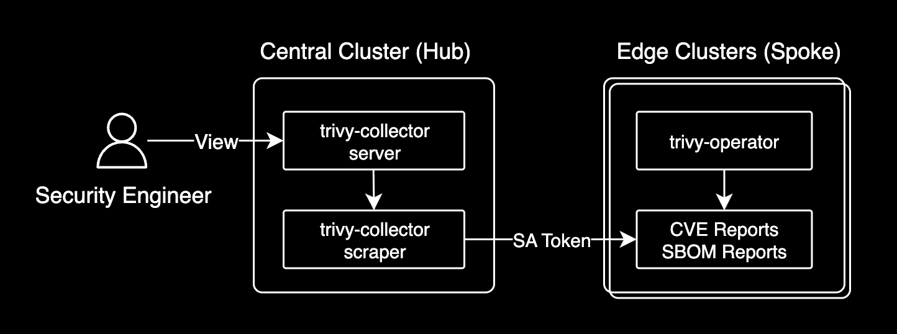

# Architecture

## Overview

trivy-collector uses an **ArgoCD-style hub-pull** architecture. All pods run on
the central (Hub) cluster; Edge clusters host only a small read-only
`ServiceAccount` that the Hub uses to watch Trivy Operator CRDs remotely.



```
              ┌─ Central (Hub) cluster ────────────────────────┐
              │                                                │
              │  trivy-collector-server   (--mode=server)      │
              │    └─ HTTP UI / API on :3000                   │
              │                                                │
              │  trivy-collector-scraper  (--mode=scraper)     │
              │    ├─ local Trivy watcher (Hub's own cluster)  │
              │    ├─ Secret watcher      (Hub namespace)      │
              │    │    └─ spawns per-cluster watchers         │
              │    └─ per-cluster watchers (one per Edge)      │
              │                                                │
              │  Shared PVC ─── SQLite DB (WAL mode)           │
              │    ↑ scraper writes                            │
              │    ↓ server reads                              │
              │                                                │
              └────────────┬──────────────────┬────────────────┘
                           │ kube-apiserver   │ kube-apiserver
                           ▼                  ▼
              ┌─ Edge cluster A ──┐  ┌─ Edge cluster B ──┐
              │ Trivy Operator    │  │ Trivy Operator    │
              │ SA (read-only)    │  │ SA (read-only)    │
              └───────────────────┘  └───────────────────┘
```

## Two pods, single responsibility

One Helm release creates two Deployments on the central cluster, distinguished
by the `--mode` CLI flag:

| Pod | Mode | Role |
|---|---|---|
| `trivy-collector-server` | `--mode=server` | HTTP UI + API. Reads the shared SQLite DB. No watchers. |
| `trivy-collector-scraper` | `--mode=scraper` | Runs all watchers. Writes to the shared SQLite DB. No HTTP UI (only `/healthz` and `/metrics`). |

The scraper is always a single replica (`strategy: Recreate`) to avoid split-
brain SQLite writers. The server can be scaled horizontally.

The scraper in turn runs three kinds of watchers:

1. **Local watcher** — watches Trivy CRDs on the Hub's own cluster via the pod's
   own in-cluster ServiceAccount (no Secret needed). Toggled with
   `scraper.watchLocal`.
2. **Secret watcher** — watches `Secret` resources in the Hub namespace
   labelled `trivy-collector.io/secret-type=cluster`. On `Apply` it spawns a
   per-cluster watcher; on `Delete` it stops one.
3. **Per-cluster watchers** — one per registered Edge cluster. Each one holds a
   `kube::Client` built from the Secret's `bearerToken` + `caData` and watches
   the Edge's Trivy CRDs directly.

## Cluster registration (ArgoCD pattern)

A registered cluster is a plain Kubernetes `Secret` in the Hub namespace:

```yaml
apiVersion: v1
kind: Secret
metadata:
  name: cluster-edge-a-<api-host>
  namespace: trivy-system
  labels:
    trivy-collector.io/secret-type: cluster
    app.kubernetes.io/managed-by: trivy-collector
type: Opaque
stringData:
  name: edge-a
  server: https://<edge-api-server>:443
  config: |
    {
      "bearerToken": "<SA-token>",
      "tlsClientConfig": { "caData": "<base64-CA>" }
    }
  namespaces: "[]"   # empty = watch all
```

The schema is compatible with ArgoCD's own cluster Secrets. Secrets can be
created via:

- The Hub UI's two-step wizard (`/admin/clusters`)
- `POST /api/v1/hub/clusters` REST call
- `kubectl apply` / Helm / ArgoCD ApplicationSet / SealedSecrets (GitOps)

Credential model:

| Identity | Lifetime | Purpose |
|---|---|---|
| Operator's admin kubeconfig | seconds (bootstrap only) | Applies the read-only SA/Role/Binding/Token Secret on the Edge cluster |
| Edge SA token (`trivy-collector-reader`) | long-lived | Stored in the Hub Secret and used by the scraper to watch Trivy CRDs |

Only the long-lived SA token lands in the Hub Secret. The operator's admin
credentials never leave the operator's workstation.

## Data flow

```
Edge Trivy Operator
  creates VulnerabilityReport / SbomReport CRD
        │
        ▼
scraper's per-cluster watcher
  receives watch event
  tags report with Secret's `name` field (e.g. "edge-a")
  writes row to SQLite (cluster, namespace, name, report JSON)
        │
        ▼
shared PVC (SQLite WAL)
        │
        ▼
server reads rows
  filters by cluster / namespace / severity
  renders Dashboard, Vulnerabilities, SBOM pages
```

Reports from the Hub's own cluster flow through the local watcher and are
tagged with `clusterName` (chart value).

## Single-pod vs two-pod rationale

Keeping watchers and the HTTP UI in separate processes makes several concerns
simpler:

- **Resource profile** — the scraper needs more memory (long-running watch
  streams, per-cluster kube clients, report JSON buffers) while the server is
  I/O light. Per-component `resources` blocks let the two be sized independently.
- **Scaling** — the server can run multiple replicas behind a Service for HA of
  the UI without risking duplicate DB writers.
- **Failure isolation** — a crash in a per-cluster watcher can't bring the UI
  down and vice versa.
- **Deployment auditability** — a single image with one of two CLI flags is
  easy to reason about (`--mode=server` vs `--mode=scraper`).

## Deletion semantics

Deleting a cluster via the UI or `DELETE /api/v1/hub/clusters/{name}` does
three things:

1. Deletes the Hub `Secret` → Secret watcher fires Delete → per-cluster watcher
   is cancelled
2. Deletes every row for that cluster from the `reports` table → it stops
   appearing in Dashboard / Vulnerabilities / SBOM views immediately
3. Leaves the Edge cluster's `trivy-collector-reader` RBAC intact (the operator
   can remove it manually later if desired)

## What is *not* deployed on Edge

- No `trivy-collector` pod
- No `Deployment`
- No HTTP server
- No Helm release

Only four Kubernetes resources, installed once:

1. `ServiceAccount: trivy-collector-reader`
2. `ClusterRole` — `get / list / watch` on `aquasecurity.github.io`
   `vulnerabilityreports` and `sbomreports` (no write, no wildcards)
3. `ClusterRoleBinding`
4. `Secret` of type `kubernetes.io/service-account-token` holding the long-
   lived token for the SA

All other logic lives on the central cluster.

## Registration flow

### Via UI (recommended)

`/admin/clusters` runs a two-step wizard:

1. **Bootstrap** — Copy the generated YAML (SA + ClusterRole +
   ClusterRoleBinding + token Secret) and `kubectl apply` on the Edge cluster
   with an admin kubeconfig. Then run the provided bash block to extract the
   SA token, CA, and API server URL.
2. **Register** — Paste the three extracted values into the form. Submitting
   calls `POST /api/v1/hub/clusters`, which creates the Hub Secret. The
   scraper attaches within seconds and the table flips to **Synced**.

### Via GitOps / kubectl

Apply the Hub Secret directly:

```yaml
apiVersion: v1
kind: Secret
metadata:
  name: cluster-edge-a-<api-host>
  namespace: trivy-system
  labels:
    trivy-collector.io/secret-type: cluster
type: Opaque
stringData:
  name: edge-a
  server: https://edge-api:443
  config: |
    {
      "bearerToken": "<SA-token>",
      "tlsClientConfig": { "caData": "<base64-CA>", "insecure": false }
    }
  namespaces: "[]"   # empty = watch all; or '["default","prod"]' to filter
```

The scraper's Secret watcher picks it up within one watch event (typically
<1 s).

## HTTP API

| Method | Path | Description |
|---|---|---|
| GET | `/api/v1/hub/clusters` | List registered clusters |
| POST | `/api/v1/hub/clusters` | Register or update a cluster |
| POST | `/api/v1/hub/clusters/validate` | Test credentials without saving |
| DELETE | `/api/v1/hub/clusters/{name}` | Unregister a cluster (purges its reports) |

All endpoints are protected by the standard auth/RBAC layer when
`AUTH_MODE=keycloak`.

## Configuration

Hub-pull is **always active** in scraper mode; there is no toggle. Cluster
Secrets are watched in the pod's own namespace (injected via Downward API
`fieldRef: metadata.namespace`); cross-namespace Secret watching is not
supported.

## Hub RBAC footprint

The chart creates three RBAC objects on the central cluster, bound to the
shared ServiceAccount:

| Object | Scope | Permissions |
|---|---|---|
| `ClusterRole` | cluster-wide | Read-only (`get / list / watch`) on `aquasecurity.github.io` `vulnerabilityreports` and `sbomreports` — used by the local watcher on the Hub's own cluster |
| `Role` | release namespace | `configmaps + secrets` `get / list / watch / create / update / patch / delete` — covers both alerts ConfigMap CRUD and cluster-registration Secret CRUD |
| `RoleBinding` | release namespace | Binds the above `Role` to the chart ServiceAccount |

The Role is deliberately namespaced to the release namespace to limit blast
radius if the Hub is ever compromised.

## Operational notes

- Add/remove a cluster takes effect within one Kubernetes watch event
  (typically <1 s).
- Each per-cluster watcher does an initial full list on start, then streams
  deltas. Initial sync latency scales with the number of reports on the Edge
  cluster.
- If an Edge cluster becomes unreachable, the watcher logs the error and keeps
  retrying. Other clusters are unaffected.
- SA tokens for Edge clusters are long-lived by default. For stricter
  rotation, rotate the Secret periodically — the scraper reconnects
  automatically when the Secret's `resourceVersion` changes.
- SQLite is kept in WAL mode on a shared PVC. The server reads, the scraper
  writes. For `ReadWriteOnce` storage classes both pods should be scheduled
  to the same node via `affinity`; for `ReadWriteMany` (e.g. EFS) they can
  spread freely.
