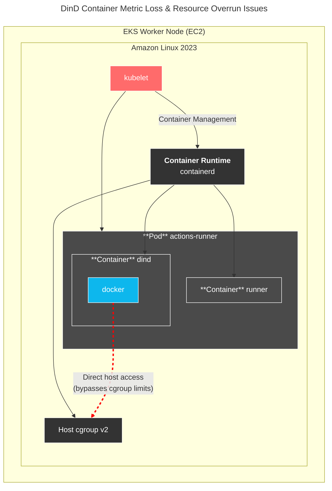
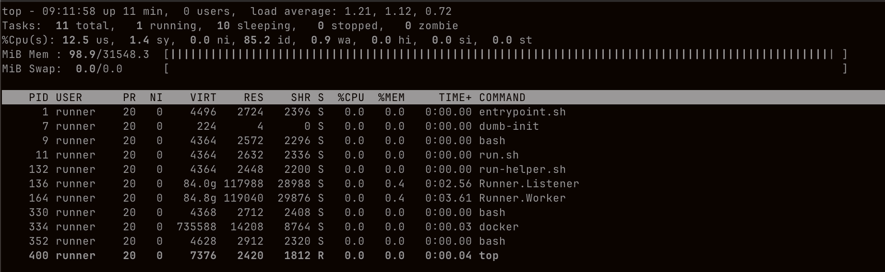

# dind cgroup issue

## 개요

Amazon Linux 2023 + cgroup v2 환경에서 dind 컨테이너 안에서 실행되는 컨테이너가 너무 많은 메모리를 사용하는 문제가 있었다. Pod limit을 초과하는 문제였다.



dind 안에서 구동되는 컨테이너 cgroup 확인:

```console
$ docker exec -it <CONTAINER_NAME_IN_DIND> cat /proc/self/cgroup
0::/
```

```console
$ docker exec -it <CONTAINER_NAME_IN_DIND> cat /sys/fs/cgroup/cgroup.controllers
cpuset cpu io memory hugetlb pids misc
```

cgroup v2가 해당 컨테이너의 CPU, Memory를 포함한 여러가지 리소스를 제어중입니다.

dind 컨테이너에서 실행되는 컨테이너가 Pod limit 16GB를 인식하지 못하고, 노드 전체 메모리 32GB를 자신의 메모리로 인식하여 메모리를 모두 사용하는 문제임.

dind에서 실행된 컨테이너가 노드 전체 메모리를 침범해서 사용중인 모습:



## 해결방법

docker 실행시 명시적 cgroup 설정

```bash
/usr/bin/docker run --name resource-limited --memory=62g --memory-reservation=61g
```

## 관련자료

- [Control Group v2](https://docs.kernel.org/admin-guide/cgroup-v2.html)
- [wrong container_memory_working_set_bytes for DinD container on cgroupv2 only nodes #119853](https://github.com/kubernetes/kubernetes/issues/119853#issuecomment-1938042934) : dind 컨테이너 메트릭 표기 문제
- [DinD cgroupv2 problem inside K8s #45378](https://github.com/moby/moby/issues/45378) : dind 컨테이너 리소스 문제
- [Allow us to set Docker's Memory Usage #540](https://github.com/game-ci/unity-builder/issues/540#issuecomment-2248602115) : dind 컨테이너 메모리 제한 문제
- [does the docker:dind-rootless have to run with --privileged? #291](https://github.com/docker-library/docker/issues/291)
