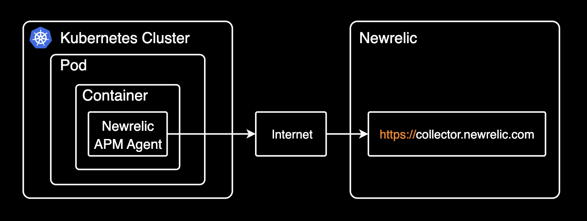
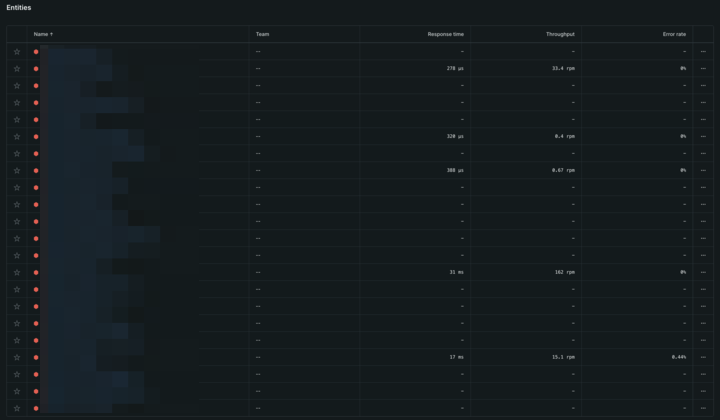
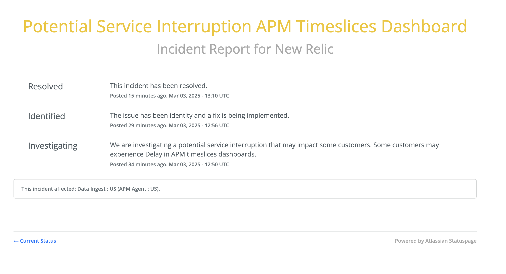

## 개요

뉴렐릭 APM 서비스의 메트릭 수집 서버(`collector.newrelic.com`)가 일시적으로 503 에러를 반환하면서 약 30분간 API 서버의 메트릭 수집이 중단된 장애 상황을 기록합니다. 평소 14~15K이던 Throughput이 400 미만으로 급감했으며, 뉴렐릭 서버 측 문제로 확인되어 별도 조치 없이 자동 복구되었습니다.



## 기록

어느날 갑자기 14~15K Throughput을 유지하던 API 서버의 Throughput이 400 미만으로 떨어졌다는 뉴렐릭 알람이 왔음.

앞단의 LB Request, Response Time, 4XX, 5XX Count 이상 없음

APM Agent 로그에서 503 에러 발견. `collector.newrelic.com` 서버가 응답이 없는 것으로 보임.

아래는 당시 Newrelic APM Agent 로그에서 발견한 에러 로그임.

```bash
2025-03-02T13:07:40,995+0000 [1 69] com.newrelic INFO: Using default collector host: collector.newrelic.com
2025-03-02T13:07:40,995+0000 [1 69] com.newrelic INFO: Using default metric ingest URI: https://metric-api.newrelic.com/metric/v1
2025-03-02T13:07:40,996+0000 [1 69] com.newrelic INFO: Using default event ingest URI: https://insights-collector.newrelic.com/v1/accounts/events
2025-03-02T13:07:40,997+0000 [1 69] com.newrelic INFO: Real user monitoring is enabled for application <REDACTED>. Auto instrumentation is enabled.
2025-03-02T18:19:33,491+0000 [1 69] com.newrelic WARN: Error sending error data to New Relic: com.newrelic.agent.transport.HttpError: collector.newrelic.com is temporarily unavailable (503)
2025-03-02T18:23:55,569+0000 [1 69] com.newrelic INFO: Successfully reconnected to the New Relic data service.
2025-03-03T00:07:34,736+0000 [1 69] com.newrelic WARN: Error sending error data to New Relic: com.newrelic.agent.transport.HttpError: collector.newrelic.com is temporarily unavailable (503)
```

```bash
curl -v https://collector.newrelic.com/jserrors/ping
```

헬스체크 엔드포인트인 `/status/mongrel` 엔드포인트는 `jserrors/ping` 엔드포인트로 대체되었음. 자세한 사항은 [New Relic Diagnostics CLI 2.30 릴리즈 노트](https://docs.newrelic.com/docs/release-notes/diagnostics-release-notes/diagnostics-cli-release-notes/diagnostics-cli-230/) 참고.

정상적인 응답인 경우, 아래와 같이 200 OK 응답을 반환해야 함.

```bash
* Request completely sent off
< HTTP/1.1 200
< Connection: keep-alive
< Content-Length: 0
< x-served-by: cache-icn1450030-ICN
< date: Tue, 04 Mar 2025 02:10:40 GMT
<
* Connection #0 to host collector.newrelic.com left intact
```

503 에러로 인해 모든 Newrelic APM Agent의 APM 메트릭 수집이 중단됨.



`collector.newrelic.com` 주소는 뉴렐릭의 [미국 리전의 APM 메트릭 수집 서버](https://docs.newrelic.com/kr/docs/new-relic-solutions/get-started/networks/#new-relic-endpoints) 엔드포인트임.

약 30분간 APM 메트릭이 정상적으로 수집되지 않았음. 별도 조치한 건 없이 시간 지난 후 정상화됨.

- [Newrelic 포럼 이슈](https://forum.newrelic.com/s/hubtopic/aAX8W0000008bxuWAA/java-collector-is-temporarily-unavailable-503): This magically solved late afternoon without any actions from my side. 라는 댓글이 있음. 이 케이스의 경우도 뉴렐릭 서버 측 문제로 확인되어 별도 조치 없이 자동 복구되었음.

[Incident History](https://status.newrelic.com/history)를 보니 뉴렐릭 서버에 문제가 있었음. Incident가 올라오는 데에는 시간이 조금 걸리는 듯 함.



## 더 나아가서

[Groundskeeper](https://github.com/newrelic/nr1-groundskeeper)를 사용하면 서비스 전반의 모든 APM 에이전트에 대한 프로그래밍 언어, 버전 등 전체 정보를 쉽게 수집하고 볼 수 있습니다.
