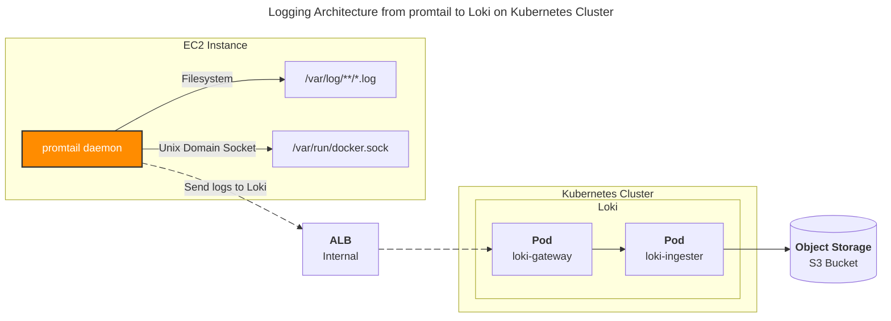

# promtail

## 개요

promtail 표준 설정파일

## 배경지식

### 시스템 아키텍처

제 사용사례의 경우, 로그 수집대상이 Kuberntes Worker Node가 아닌 Standalone EC2 Instance의 로그를 수집하기 위해 해당 설정파일을 작성했습니다.

> [!NOTE]
> Loki 시스템 아키텍처는 간결함을 위해 Distributor, Querier 등 일부 컴포넌트를 생략했습니다.



## 주의사항

Promtail은 2025년 2월 13일에 LTS(Long Term Support)로 지원이 종료되었습니다. 더 이상 사용을 권장하지 않으며 Grafana Alloy로 마이그레이션을 권장합니다. 자세한 사항은 [#3614](https://github.com/grafana/helm-charts/issues/3614) 이슈를 참고하세요.

## 설정파일

### `ec2-promtail.yaml`

```yaml
server:
  http_listen_port: 3100
  grpc_listen_port: 0
clients:
  - url: https://<LOKI_DOMAIN>/loki/api/v1/push
positions:
  filename: /opt/promtail/positions.yaml
  # Linux kernel 레벨에서 발생할 수 있는
  # Too many open files 이슈를 회피하기 위해 sync 간격을 30초로 완화
  sync_period: 30s # default: 10s

target_config:
  # Linux kernel 레벨에서 발생할 수 있는
  # Too many open files 이슈를 회피하기 위해 sync 간격을 30초로 완화
  sync_period: 30s # default: 10s

scrape_configs:
  # [1] EC2 Service Discovery를 사용한 로그 수집  
  - job_name: varlog
    ec2_sd_configs:
      - region: ap-northeast-2
        # EC2의 Instance profile ARN
        profile: arn:aws:iam::<ACCOUNT_ID>:instance-profile/<INSTANCE_PROFILE_NAME>
    relabel_configs:
      - source_labels: [__meta_ec2_tag_Name]
        target_label: name
        action: replace
      - source_labels: [__meta_ec2_instance_id]
        target_label: instance
        action: replace
      - source_labels: [__meta_ec2_instance_type]
        target_label: type
        action: replace
      - source_labels: [__meta_ec2_instance_state]
        target_label: state
        action: replace
      - action: replace
        replacement: /var/log/**.log
        target_label: __path__
  
  # [2] systemd의 journal 로그 수집
  - job_name: journal
    journal:
      json: false
      max_age: 12h
      path: /var/log/journal
      labels:
        job: systemd-journal
    relabel_configs:
      - source_labels: ['__journal__systemd_unit']
        target_label: 'unit'
      - source_labels: ['__journal__hostname']
        target_label: 'hostname'
      - source_labels: ['__journal_priority_keyword']
        target_label: 'severity'
        regex: '(.+)'
  
  # [3] docker container의 로그 수집
  - job_name: containers
    docker_sd_configs:
      - host: unix:///var/run/docker.sock
        refresh_interval: 10s
    relabel_configs:
      - source_labels: [__meta_docker_container_name]
        regex: '/(.*)'
        target_label: container_name
      - source_labels: [__meta_docker_container_id]
        target_label: container_id
      - source_labels: [__meta_docker_container_log_stream]
        target_label: container_logstream
      - source_labels: [__meta_docker_port_private]
        target_label: container_port
      - source_labels: [__meta_docker_network_ip]
        target_label: container_ip
    pipeline_stages:
      - docker: {}
      - json:
          expressions:
            level: level
      - labels:
          container_severity: level
```

- `<ACCOUNT_ID>`는 AWS 계정 ID입니다.
- `<INSTANCE_PROFILE_NAME>`은 EC2 Instance Profile 이름입니다.

&nbsp;

`docker_sd_configs`에서 사용 가능한 meta labels:

```bash
__meta_docker_container_id: the ID of the container
__meta_docker_container_name: the name of the container
__meta_docker_container_network_mode: the network mode of the container
__meta_docker_container_label_<labelname>: each label of the container
__meta_docker_container_log_stream: the log stream type stdout or stderr
__meta_docker_network_id: the ID of the network
__meta_docker_network_name: the name of the network
__meta_docker_network_ingress: whether the network is ingress
__meta_docker_network_internal: whether the network is internal
__meta_docker_network_label_<labelname>: each label of the network
__meta_docker_network_scope: the scope of the network
__meta_docker_network_ip: the IP of the container in this network
__meta_docker_port_private: the port on the container
__meta_docker_port_public: the external port if a port-mapping exists
__meta_docker_port_public_ip: the public IP if a port-mapping exists
```

자세한 Configuration 옵션은 [promtail 공식문서](https://grafana.com/docs/loki/latest/send-data/promtail/configuration/#docker_sd_configs)를 참고하세요.